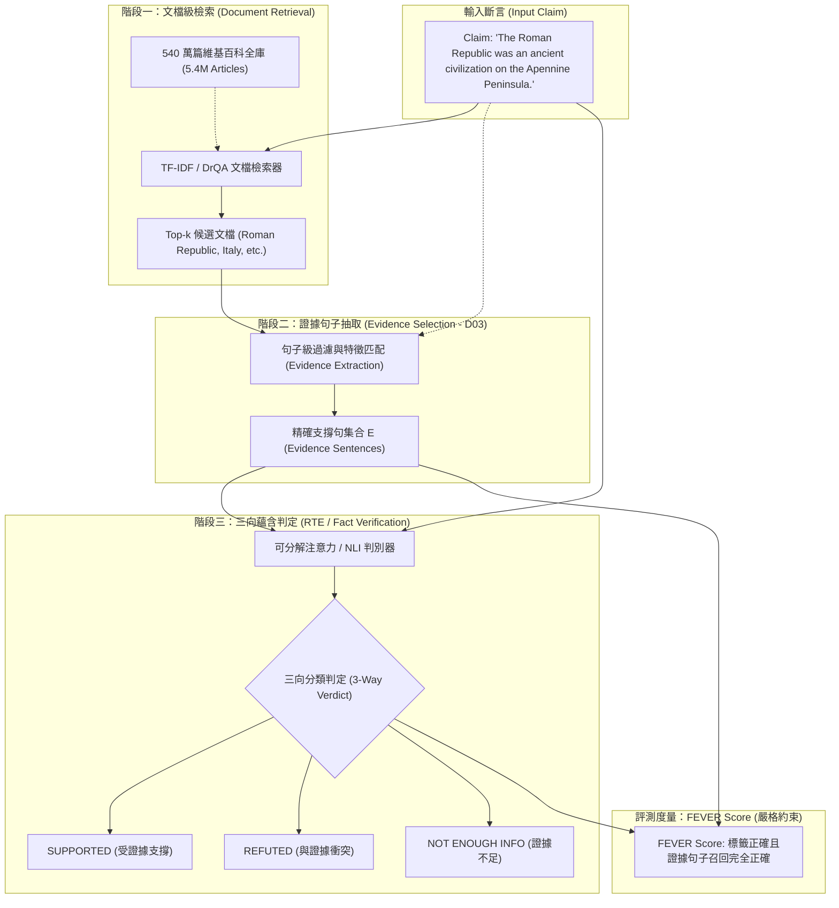

# FEVER: a Large-scale Dataset for Fact Extraction and VERification

> [!INFO] 論文元數據 (Metadata)
> - **Paper ID**：`Thorne2018_FEVER`
> - **作者**：James Thorne, Andreas Vlachos, Christos Christodoulopoulos, Arpit Mittal (University of Sheffield, Amazon Research Cambridge)
> - **預印本初次發布年份 (Preprint)**：2018 (arXiv:1803.05355)
> - **正式發表年份 / 會議或期刊 (Venue)**：NAACL-HLT 2018 (Pages 809–819)
> - **DOI**：10.18653/v1/N18-1074
> - **arXiv**：[1803.05355](https://arxiv.org/abs/1803.05355)
> - **開源資源**：[FEVER 官方網站與基準](https://fever.ai/)
> - **驗證狀態**：`verified` (基於原始論文 PDF 全文核實)
> - **本地 PDF 連結**：[[Papers/04 - Knowledge & Graph RAG/(NAACL 2018-06) FEVER - A Large-scale Dataset for Fact Extraction and VERification.pdf|開啟本地 PDF 檔案]]

---

## 一話摘要 (TL;DR)
**FEVER 構建了首個包含 185,445 條人造斷言（Claims）的大規模事實抽取與驗證基準，要求系統從 540 萬篇維基百科文檔中自主檢索精確句子級證據（Evidence Extraction）並判定 Supported / Refuted / NotEnoughInfo 三向真偽，確立了當代 RAG 與事實驗證系統「無證據支撐之判斷即無效」的核心評測協議。**

---

## 研究背景與問題定義 (Problem Statement)

隨著互聯網假新聞（Fake News）氾濫與大語言模型幻覺頻發，自動化事實驗證（Automated Fact Checking）成為自然語言處理的關鍵挑戰。然而早期研究存在顯著瓶頸：
1. **依賴現成孤立前提（Isolated NLI）**：傳統自然語言推斷（Natural Language Inference, NLI，如 SNLI、MultiNLI）直接提供成對的前提（Premise）與假設（Hypothesis），省去了從開放海量文字庫中尋找證據的過程，脫離真實應用。
2. **缺乏證據抽取監督（Lack of Evidence Extraction）**：許多問答與分類模型僅預測答案的對錯，卻不提供「具體根據哪一句話作此判斷」，導致輸出缺乏可溯源性與可解釋性。
3. **否定與反駁證據定位困難（Refuting Evidence Scarcity）**：在開放領域中，證實一個真實斷言通常只需定位單一正向陳述，但要反駁一個捏造斷言（例如「某火山不是火山島」），往往需要組合多個跨文檔語句，難度遠超傳統資訊檢索。

---

## 核心方法與技術架構 (Methodology & Architecture)

### 1. 斷言生成與多階段標註協議 (Section 3 & 4, Page 2-5)
FEVER 採用雙盲、兩階段的人工標註流水線：
1. **任務一：斷言生成（Claim Generation）**：
   - 標註者閱讀維基百科導言句子，提取單一事實並透過 6 種可控突變（字典替換、實體置換、添加修飾、否定泛化、重述）生成包含真實、虛假及無法查證的 Claim。
2. **任務二：證據定位與真偽判定（Evidence Selection & Labeling）**：
   - 另一批獨立標註者在不知道原始出處的情況下，僅藉助維基百科搜尋工具檢索證據句子，並將斷言標註為三類之一：
     - **SUPPORTED**：找到完全支撐該斷言的句子集合；
     - **REFUTED**：找到直接反駁、推翻該斷言的句子集合；
     - **NOT ENOUGH INFO (NEI)**：維基百科全庫無充分證據支持或反駁該斷言。
   - **複合證據要求（Composite Evidence）**：有 **12.15%** 的斷言必須依賴多個句子甚至跨文檔證據組合（Evidence Group）方能判斷（Section 2, Page 2）。

### 2. 三階段基準管線架構 (Section 5, Page 5-7)
FEVER 提出了標準的 Baseline 驗證流水線，分為三個依序模組：
1. **文件檢索（Document Retrieval）**：利用 DrQA TF-IDF 向量搭配 Bigram 雜湊比對，從 540 萬篇維基百科中召回 Top-k 相關文檔。
2. **句子選取（Sentence Selection / Evidence Extraction）**：利用 TF-IDF 與 Claim 進行餘弦相似度計算，抽取 Top-5 最相關句子作為證據候選。
3. **蘊含推理分類（Textual Entailment Classification）**：採用可分解注意力模型（Decomposable Attention, Parikh et al., 2016），輸入 (Claim, Extracted Evidence) 預測三分類標籤。

#### 圖中節點對照 (Node Reference Table)
| 節點代號 | 模組名稱 | 關鍵作用與運算機制 |
| :--- | :--- | :--- |
| `CLAIM` | 待驗證斷言 | 自然語言非結構化陳述（包含實體關係、屬性或時序） |
| `DRQA` | 文檔檢索器 | 基於非結構化全庫快速縮小搜索範圍至候選頁面 |
| `SENT_EXT` | 證據句子抽取器 | **D03 核心機制**：從篇章中抽取出最小、不可或缺的 Evidence Spans |
| `EV_SET` | 支撐證據集合 | 標註要求必須召回完整的 Evidence Group（多句傳遞） |
| `NLI` | 文本蘊含判別器 | 評估 Evidence 是否對 Claim 構成必然蘊含（Entailment）或矛盾 |
| `SCORE` | FEVER Score 評分 | 雙重檢驗指標：若標籤預測正確但證據未完全召回，一律計為 0 分 |

---

## 主要實驗結果與證據 (Empirical Results & Evidence)

### 1. 資料集規模與類別分佈 (Table 1, Page 6)
- 全庫總計包含 **185,445 條 Claims**，標準劃分如下：
  - **訓練集（Train）**：145,449 條（Supported: 80,035；Refuted: 29,775；NEI: 35,639）
  - **驗證集（Dev）**：19,998 條（Supported: 6,666；Refuted: 6,666；NEI: 6,666）
  - **測試集（Test）**：19,998 條（Supported: 6,666；Refuted: 6,666；NEI: 6,666）

### 2. 文檔與句子檢索召回率 (Table 2 & 3, Page 6-7)
- **文檔檢索（Table 2, Page 6）**：
  - Top-1 文檔召回率為 54.34%；
  - Top-5 文檔召回率為 **70.20%**；
  - 只有在檢索出包含完整證據的頁面時，系統才有機會判定正確。
- **神諭句子抽取（Oracle Evidence, Table 3, Page 7）**：
  - 若直接餵入人工標註的黃金證據句子（Gold Evidence），NLI 模型在驗證集上的標籤準確率達到 **64.08%**；
  - 說明端到端流水線的性能上限嚴重受到前端證據檢索抽取的制約。

### 3. 端到端流水線基準評測（Pipeline Performance, Table 4, Page 7）
在驗證集上對比完整流水線表現：
- **僅衡量標籤準確率（Label Accuracy，忽略證據）**：50.91%
- **FEVER Score（標籤正確且證據完全召回）**：僅 **31.87%**
- **測試集表現（Page 8）**：
  - 標籤準確率：50.91%
  - **FEVER Score**：**31.87%**（證據組精確率 10.74%，召回率 45.89%）
- **關鍵結論**：忽略證據召回會使準確率虛高近 20 個百分點；大量錯誤源於證據抽取不完整或召回無關噪聲句子導致 NLI 誤判。

### 4. 斷言可控突變類型與錯誤挑戰 (Section 3.1, Page 3)
標註者在生成反駁與無法驗證的 Claim 時，嚴格依據 6 種語言學突變類型：
1. **釋義重述（Paraphrase）**：改變句式但保留原意（檢驗語義等價性）；
2. **否定變換（Negation）**：插入否定詞反轉命題（檢驗否定詞感知）；
3. **實體替換（Entity Substitution）**：將主語或賓語替換為同類別實體（如將倫敦換為曼徹斯特）；
4. **細節泛化/特化（Generalization / Specialization）**：將特定年代或品種替換為上位詞或下位詞；
5. **關係突變（Relation Mutation）**：保留實體但改變兩者互動動作（如將「導演」變更為「主演」）；
6. **複合多跳斷言（Multi-hop Synthesis）**：結合兩個獨立頁面的事實生成單一複合 Claim（佔比 12.15%）。

---

## 優勢、限制及 Trade-offs (Strengths, Limitations & Trade-offs)

### 1. 技術優勢
- **首創「無證據則無效」的剛性評測標準**：徹底杜絕了模型透過利用詞彙偏置（Lexical Bias）「盲猜」標籤的漏洞。
- **引進 NOT ENOUGH INFO 拒答機制**：為現代 RAG 的「證據充分性判定（D06）」奠定了最原始的三向決策體系。
- **長程與多句證據依賴**：12% 的斷言要求跨句邏輯推理，貼近真實世界的複雜事實檢驗。

### 2. 限制與代價 (Limitations & Trade-offs)
- **斷言由維基導言合成改寫**：句型結構存在一定的人工模板痕跡，對真實用戶口語化、模糊化提問的覆蓋有限。
- **僅考慮維基百科封閉世界**：未涵蓋動態變化的網頁實時數據，限制了時效性演進事實的測試。

---

## 對本專案研究領域的實際意義 (Implications for Research Domains)

1. **對 D03 (Knowledge Extraction & Semantic Units) 的理論基石**：
   - FEVER 定義了「**Claim（斷言/事實命題）**」與「**Evidence Spans（支撐證據跨距）**」的嚴格對照關係。
   - 證明了知識抽取不能只抽實體三元組，還必須抽取可獨立查證的完整語意斷言（Claim），是 `FActScore` 與 `Dense X` 的前驅框架。
2. **對 D06 (Evidence Sufficiency) 與 D08 (Reconciliation) 的支撐**：
   - FEVER 的 `NEI (Not Enough Info)` 是 D06「證據不充分時應自適應擴檢或拒答」的核心評測來源；
   - 其 `REFUTED` 機制則直接對應 D08 偵測上下文衝突與事實反駁的基礎協議。
3. **對 Huang et al. 綜述的互補**：
   - Huang et al. 著眼於檢索增強生成的一般框架，FEVER 則為 D03 提供了「何為事實抽取、如何評估證據真實性」的黃金學術支點。

---

## 原始來源及相關筆記連結 (Sources & Related Notes)

- **本地文獻**：[[Papers/04 - Knowledge & Graph RAG/(NAACL 2018-06) FEVER - A Large-scale Dataset for Fact Extraction and VERification.pdf|開啟本地 PDF 檔案]]
- **相關理論專題**：
  - [[02 - 研究領域專題 (Research Domains)/Domain 03 - Knowledge Extraction & Information Preservation|D03 Knowledge Extraction & Consolidation]]
  - [[02 - 研究領域專題 (Research Domains)/Domain 06 - Evidence Sufficiency & Adaptive Retrieval|D06 Evidence Sufficiency & Adaptive Retrieval]]
  - [[02 - 研究領域專題 (Research Domains)/Domain 13 - RAG Evaluation & Failure Attribution|D13 RAG Evaluation & Failure Attribution]]
- **同系列相關論文**：
  - [[03 - 論文庫 (Literature Notes)/06 - Benchmarks & Evaluation/(EMNLP 2023-12) FActScore - Fine-grained Atomic Evaluation of Factual Precision in Long Form Text Generation|FActScore]] (原子事實解構與長文本事實驗證)
  - [[03 - 論文庫 (Literature Notes)/04 - Knowledge & Graph RAG/(EMNLP 2024-11) Dense X - Exploring the Limit of Proposition Retrieval for Open-Domain QA|Dense X]] (命題化檢索單元)
