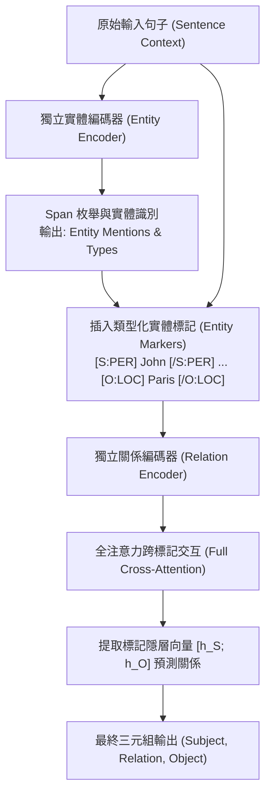

# A Frustratingly Easy Approach for Entity and Relation Extraction (PURE)

> [!INFO] 論文元數據 (Metadata)
> - **Paper ID**：`Zhong2021_PURE`
> - **作者**：Zexuan Zhong, Danqi Chen (Princeton University)
> - **預印本初次發布年份 (Preprint)**：2020 (arXiv:2010.12812)
> - **正式發表年份 / 會議或期刊 (Venue)**：2021 (NAACL 2021, Main Conference)
> - **DOI**：[10.18653/v1/2021.naacl-main.5](https://doi.org/10.18653/v1/2021.naacl-main.5)
> - **ACL Anthology**：[https://aclanthology.org/2021.naacl-main.5/](https://aclanthology.org/2021.naacl-main.5/)
> - **驗證狀態**：`verified` (已比對 NAACL 2021 官方全文與論文 PDF)
> - **本地 PDF 連結**：[[Papers/04 - Knowledge & Graph RAG/(NAACL 2021-06) A Frustratingly Easy Approach for Entity and Relation Extraction.pdf|開啟本地 PDF 檔案]]

---

## 一話摘要 (TL;DR)
PURE（Princeton Utility-based Relation Extraction）挑戰了學術界長期以來「聯合建模（Joint Modeling）必然優於流水線（Pipeline）」的定論，提出一種極度簡潔的分步流水線：以獨立預訓練編碼器分別處理實體識別與關係分類，並在關係模型中巧妙植入**實體標記（Entity Markers）**，在 ACE04、ACE05 與 SciERC 上全線超越所有複雜聯合模型（關係 F1 絕對提升 1.7%–2.8%）。

---

## 研究背景與問題定義 (Problem Statement)

### 1. 核心痛點與社群盲點
多年來，資訊抽取社群的主流共識認為：
- 「流水線模型（Pipeline Approaches）」存在無可救藥的單向誤差傳播（Error Propagation）；
- 只有「聯合模型（Joint Models）」（如多任務共享表徵或結構化圖解碼，如 DyGIE++、OneIE）才是最佳解。
然而作者敏銳地指出：**聯合模型強制在實體識別與關係抽取之間共享底層編碼器表示，實際上引發了任務間的目標競爭（Task Conflict / Negative Transfer）**。實體識別需要對局部邊界高度敏感的表徵，而關係抽取需要關注主客體之間的長程依賴與語境交互，強行共享單一表示反而限制了兩者的潛能。

### 2. 研究假設
若徹底解耦實體模型與關係模型，分別使用兩個獨立的預訓練 Transformer 編碼器；實體模型負責預測實體邊界與類型，關係模型則透過在原始句子中插入**類型化實體標記（Typed Entity Markers）**直接進行全注意力交互，流水線模型就能以驚人的簡潔性超越一切現存的複雜聯合模型。

---

## 核心方法與技術架構 (Methodology & Architecture)

### 1. 實體識別模型 (Entity Model)
- 將長度小於等於 $L$ 的文本片段枚舉並送入專門的實體編碼器 $\text{BERT}_{\text{ent}}$；
- 片段表徵由頭尾向量與長度嵌入拼接而成：$g(s_i) = [x_{\text{start}}, x_{\text{end}}, \phi(w)]$；
- 透過前饋網絡預測實體類型（未通過閾值者標記為 `None`）。

### 2. 關係抽取模型：實體標記法 (Relation Model with Entity Markers)
給定實體模型預測出的主體實體 $s_1$ 與客體實體 $s_2$：
- 不使用靜態 Pooling 向量，而是在原始句子中直接插入標記符（Entity Markers）：
  $$\tilde{x} = [\dots \text{ [S:PER] } \text{John} \text{ [/S:PER] } \dots \text{ [O:LOC] } \text{Paris} \text{ [/O:LOC] } \dots]$$
- 將帶標記的完整文本送入獨立的關係編碼器 $\text{BERT}_{\text{rel}}$；
- 提取開始標記 `[S:PER]` 與 `[O:LOC]` 對應的輸出隱層向量並拼接：
  $$h(s_1, s_2) = [\mathbf{h}_{\text{start}}(s_1); \mathbf{h}_{\text{start}}(s_2)]$$
- 傳入分類器預測關係類別。
- **優勢**：實體標記允許 Transformer 所有的自注意力層直接在主體、客體與上下文周圍計算精確的跨標記注意力，產生極為強大的上下文關係表徵。

### 3. 高效近似算法 (Speedup Approximation)
為避免對每對實體重複執行全量 Transformer 前向計算，PURE 提出單次前向共享 Text-Token 計算的近似解法，在 ACE05 上達成 **11.9 倍推論加速**，而 F1 僅微降 1.0–1.2%（Table 3, Page 7）。

### 系統架構流程圖 (Mermaid)

#### 圖中節點對照
- `Enc_Ent`: 專注於邊界識別的獨立實體編碼器
- `MarkerInsert`: 在文本中顯式標記主客體邊界與類型的插入模組
- `Enc_Rel`: 專注於雙向語意交互的獨立關係編碼器
- `AttnCross`: 允許標記與上下文在所有 Transformer 層充分互動
- `TripletOut`: 高精度結構化關係三元組

---

## 主要實驗結果與證據 (Empirical Results & Evidence)

### 1. 三大基準對比前人所有聯合模型 (Table 1, Page 6)
在 ACE04、ACE05 與 SciERC 上全面評估：

| 模型 | 編碼器骨幹 | ACE05 Ent | ACE05 Rel | ACE05 Rel+ (嚴格) | SciERC Ent | SciERC Rel |
| :--- | :--- | :---: | :---: | :---: | :---: | :---: |
| DyGIE (Luan et al., 2019) | LSTM+ELMo | 88.4 | 63.2 | - | 65.2 | 41.6 |
| **DyGIE++** (Wadden et al., 2019) | BERT-base / SciBERT | 88.6 | 63.4 | - | 67.5 | 48.4 |
| **OneIE** (Lin et al., 2020) | BERT-large | 88.8 | 67.5 | - | - | - |
| Wang & Lu (2020) (Table-Sequence) | ALBERT-xxlarge | 89.5 | 67.6 | 64.3 | - | - |
| **PURE (本文, Single-sentence)** | BERT-base | 88.7 | 66.7 | 63.9 | - | - |
| **PURE (本文, Single-sentence)** | ALBERT-xxlarge | 89.7 | 69.0 | 65.6 | - | - |
| **PURE (本文, Cross-sentence)** | BERT-base / SciBERT | 90.1 | 67.7 | 64.8 | 68.9 | **50.1** |
| **PURE (本文, Cross-sentence)** | **ALBERT-xxlarge** | **90.9** | **69.4** | **67.0** | - | - |

*(出處：Table 1, Page 6)*

- **震撼結論**：
  - 在完全相同的編碼器條件下，PURE 徹底擊敗了所有聯合抽取架構；
  - 在 SciERC 上，PURE (SciBERT) 關係 F1 達到 **50.1%**，歷史上首次突破 50% 大關；
  - 在 ACE05 上，PURE (ALBERT) 關係 F1 達到 **69.4%**，比先前的 SOTA 高出近 2 個百分點。

### 2. 關係模型表徵消融：Entity Markers 的威力 (Table 4, Page 8)
- 採用 Entity Markers 相比傳統片段池化（Span Pooling），關係 F1 提升了 **2.5–3.2 個百分點**；
- 加上類型前綴（Typed Markers, 如 `[S:PER]` vs `[S]`）比純無類型標記再提升 **1.0 個百分點**。

---

## 優勢、限制及 Trade-offs (Strengths, Limitations & Trade-offs)

### 1. 優勢 (Strengths)
1. **極度簡潔易實現（Frustratingly Easy）**：摒棄了複雜的圖神經網路傳播或束搜索全圖優化，代碼極易維護且穩定收斂。
2. **消解任務干擾**：雙編碼器架構讓實體模型專注於局部精確切分，讓關係模型專注於主客體間的全域交互。
3. **Entity Markers 具備通用性**：為預訓練語言模型處理結構化輸入提供了極為自然的文字提示模板。

### 2. 限制與代價 (Limitations & Trade-offs)
1. **儲存與參數開銷翻倍**：系統需要維護兩個獨立的預訓練模型（一個 Entity 模型、一個 Relation 模型），模型顯存佔用翻倍。
2. **全量實體對的前向計算開銷**：若一個句子中有 $M$ 個實體，全量關係模型需要執行 $O(M^2)$ 次帶標記句子的前向傳播（需仰賴近似算法減緩）。

---

## 對本專案研究領域的實際意義 (Implications for Research Domains)

1. **D02 (Segmentation & Contextualization) & Domain 12 (Typed Knowledge)**：
   PURE 給出了一個極具顛覆性的學術洞察：**強行追求單一模型統一解決所有問題往往會遭遇表示瓶頸；適度解耦並透過 Prompt/Marker 進行上下文交互，其效果反而遠勝複雜的端到端黑盒**。
2. **現代 LLM 中的 In-Context 實體關係標註**：
   PURE 的 Entity Markers 思想是現代大模型提示工程（Prompt-based IE）的直接鼻祖。在 RAG 知識庫構建中，若需使用判別式小模型快速標註海量高精三元組，PURE 依然是兼顧精度與穩定性的首選工程基石。

---

## 原始來源及相關筆記連結 (Sources & Related Notes)

- **本地 PDF 連結**：[[Papers/04 - Knowledge & Graph RAG/(NAACL 2021-06) A Frustratingly Easy Approach for Entity and Relation Extraction.pdf|開啟本地 PDF 檔案]]
- **前驅與對照筆記**：
  - [[03 - 論文庫 (Literature Notes)/04 - Knowledge & Graph RAG/(EMNLP 2019-11) Entity, Relation, and Event Extraction with Contextualized Span Representations|DyGIE++: Contextualized Span Representations]]
  - [[03 - 論文庫 (Literature Notes)/04 - Knowledge & Graph RAG/(ACL 2020-07) A Joint Neural Model for Information Extraction with Global Features|OneIE: Joint Neural Model with Global Features]]
- **所屬研究領域**：
  - [[02 - 研究領域專題 (Research Domains)/Canonical RAG Domains/Domain 02 - Segmentation & Contextualization|D02 Segmentation & Contextualization]]
  - [[02 - 研究領域專題 (Research Domains)/Canonical RAG Domains/Domain 03 - Knowledge Extraction & Information Preservation|D03 Knowledge Extraction & Information Preservation]]
