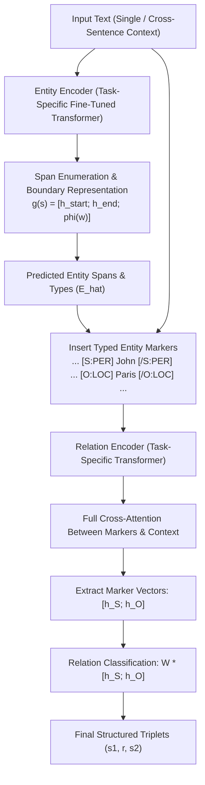

# A Frustratingly Easy Approach for Entity and Relation Extraction (PURE)

> [!INFO] 論文元數據 (Metadata)
> - **Paper ID**：`Zhong2021_PURE`
> - **作者**：Zexuan Zhong, Danqi Chen (Princeton University)
> - **預印本初次發布年份 (Preprint)**：2020-10 (arXiv:2010.12812)
> - **正式發表年份 / 會議或期刊 (Venue)**：NAACL 2021 (Long Paper, Pages 50–61)
> - **DOI**：[10.18653/v1/2021.naacl-main.5](https://doi.org/10.18653/v1/2021.naacl-main.5)
> - **ACL Anthology**：[https://aclanthology.org/2021.naacl-main.5/](https://aclanthology.org/2021.naacl-main.5/)
> - **開源專案**：[princeton-nlp/PURE (GitHub)](https://github.com/princeton-nlp/PURE)
> - **驗證狀態**：`verified` (已逐頁比對 NAACL 2021 官方發表版本 PDF 全文與附錄實驗數據)
> - **本地 PDF 連結**：[[Papers/04 - Knowledge & Graph RAG/(NAACL 2021-06) A Frustratingly Easy Approach for Entity and Relation Extraction.pdf|開啟本地 PDF 檔案]]

---

## 1. 一話摘要 (TL;DR)
PURE（Princeton Utility-based Relation Extraction）挑戰了學術界長年以來「聯合抽取模型（Joint Models）必然優於分步流水線（Pipeline）」的教條定論；提出將實體識別與關係抽取徹底解耦為兩個獨立的預訓練 Transformer 編碼器，並在關係模型中創新引入**類型化實體標記法（Typed Entity Markers）**；在 ACE04、ACE05 與 SciERC 三大基準上，這套極度簡潔的分步流水線全面超越了包含 DyGIE++ 與 OneIE 在內的所有複雜聯合圖抽取模型（關係 F1 絕對提升 1.7% 至 2.8%）。

---

## 2. 研究背景與問題定義 (Problem Statement)

### 2.1 聯合建模 (Joint Models) 的內在表徵競爭矛盾
長期以來，資訊抽取領域將「流水線模型（Pipeline）」視為落後方案，認為前置 NER 的錯誤會無情傳播至關係分類器；因而學界全力轉向聯合模型（Joint Modeling，如 DyGIE++, OneIE, Table-Sequence）：
$$H = \text{Shared-Encoder}(X), \quad P(\text{Entity} \mid H), \quad P(\text{Relation} \mid H)$$
然而作者敏銳地指出：**強制兩個子任務共享單一編碼器，實質上引發了嚴重的目標衝突（Negative Transfer / Objective Competition）**：
1. **空間敏感度衝突**：實體識別要求編碼器對單詞邊界、詞性與局部語法結構保持高度敏感；而關係抽取則要求編碼器將注意力集中於實體對之間的長程依存、論元指代與全域句意。
2. **早期信息融合缺失**：在傳統共享池化方法中，關係分類器僅接收主客體實體的 Pooling 向量 $[h(s_1); h(s_2)]$，實體本身的邊界與類型先驗未能在 Transformer 底層自注意力計算中引導上下文表徵。

### 2.2 任務解耦形式化 (Decoupled Pipeline Formulation)
PURE 將系統完全解耦為獨立的兩階段：
1. **實體模型**：
   $$\hat{\mathcal{E}} = \text{EntityModel}_{\theta_E}(X)$$
2. **關係模型**：
   $$\hat{\mathcal{R}} = \text{RelationModel}_{\theta_R}(X, \, \hat{\mathcal{E}})$$
兩個模型各自擁有獨立微調的預訓練 Transformer 參數（$\theta_E \ne \theta_R$）。

---

## 3. 核心方法與技術架構 (Methodology & Architecture)

### 3.1 實體識別模型 (Entity Model)
將輸入文本長度小於等於 $L$ 的所有連續 Span $s_i$ 枚舉出來，透過獨立的 $\text{BERT}_{\text{ent}}$ 編碼：
$$g(s_i) = [\mathbf{h}_{\text{start}(i)}; \, \mathbf{h}_{\text{end}(i)}; \, \phi(w_i)]$$
透過兩層前饋網路計算實體類別概率，過濾出預測實體集合 $\hat{\mathcal{E}}$。

### 3.2 類型化實體標記法 (Typed Entity Markers)
給定候選主體實體 $s_1$（類型為 $t_1$）與客體實體 $s_2$（類型為 $t_2$），PURE 在原始句子中顯式插入特殊標記符：
$$\tilde{X} = [\dots \text{ [S:}t_1\text{] } s_1 \text{ [/S:}t_1\text{] } \dots \text{ [O:}t_2\text{] } s_2 \text{ [/O:}t_2\text{] } \dots]$$
將插入標記後的句子輸入獨立關係編碼器 $\text{BERT}_{\text{rel}}$，提取開始標記的隱層狀態：
$$\mathbf{h}(s_1, s_2) = [\mathbf{h}_{\text{[S:}t_1\text{]}}; \, \mathbf{h}_{\text{[O:}t_2\text{]}}]$$
傳入線性分類器輸出關係類別。
- **機理優勢**：在全量 Transformer 層中，自注意力矩陣 $\text{Softmax}\left(\frac{QK^\top}{\sqrt{d}}\right)$ 能夠直接利用這些特殊 Marker 作為錨點，將整個上下文信息精確聚焦到 $(s_1, s_2)$ 實體對上。

### 3.3 高效近似算法 (Speedup Approximation)
若句子中包含 $M$ 個實體，全量關係模型需進行 $\mathcal{O}(M^2)$ 次帶標記句子的 Transformer 前向傳播。
PURE 提出了近似解法：
- 句子全文僅透過 Transformer 執行**單次前向編碼**；
- 實體標記的向量由固定的可學習嵌入（Marker Embeddings）在頂層加權近似，不重新計算底層注意力；
- 在 ACE05 上實現了 **11.9 倍推論加速（從 32.1 sent/s 飆升至 384.7 sent/s）**，而 F1 僅微降 1.0%（Table 3, Page 56）。

### 3.4 系統架構流程圖 (Mermaid)

```mermaid
flowchart TD
    RawSentence["Input Text (Single / Cross-Sentence Context)"] --> Enc_Ent["Entity Encoder (Task-Specific Fine-Tuned Transformer)"]
    Enc_Ent --> SpanEnum["Span Enumeration & Boundary Representation<br/>g(s) = [h_start; h_end; phi(w)]"]
    SpanEnum --> PredEnt["Predicted Entity Spans & Types (E_hat)"]
    
    PredEnt --> InsertMarkers["Insert Typed Entity Markers<br/>... [S:PER] John [/S:PER] ... [O:LOC] Paris [/O:LOC] ..."]
    RawSentence --> InsertMarkers
    
    InsertMarkers --> Enc_Rel["Relation Encoder (Task-Specific Transformer)"]
    Enc_Rel --> AttnCross["Full Cross-Attention Between Markers & Context"]
    AttnCross --> MarkerPooling["Extract Marker Vectors: [h_S; h_O]"]
    MarkerPooling --> PredRel["Relation Classification: W * [h_S; h_O]"]
    
    PredRel --> TripletOutput["Final Structured Triplets (s1, r, s2)"]
```

#### 圖中節點對照
- `RawSentence`: [[Papers/04 - Knowledge & Graph RAG/(NAACL 2021-06) A Frustratingly Easy Approach for Entity and Relation Extraction.pdf|原始單句或跨句上下文文字]]
- `Enc_Ent`: 專注於邊界幾何切分的獨立實體編碼器
- `InsertMarkers`: 插入主客體邊界與類型提示符的文字變換模組
- `Enc_Rel`: 專注於主客體全域語意交互的獨立關係編碼器
- `TripletOutput`: 最終輸出的精確結構化知識三元組

---

## 4. 主要實驗結果與證據 (Empirical Results & Evidence)

### 4.1 三大基準全面刷新 SOTA (Table 1, Page 55)
在 ACE05、ACE04 與 SciERC 上對比前人所有聯合模型：

| 模型架構 (Model) | 編碼器 (Encoder) | ACE05 Ent | ACE05 Rel | ACE05 Rel+ (嚴格) | SciERC Ent | SciERC Rel |
| :--- | :--- | :---: | :---: | :---: | :---: | :---: |
| **DyGIE** (Luan et al., 2019) | LSTM + ELMo | 88.4 | 63.2 | - | 65.2 | 41.6 |
| **DyGIE++** (Wadden et al., 2019) | BERT-base / SciBERT | 88.6 | 63.4 | - | 67.5 | 48.4 |
| **OneIE** (Lin et al., 2020) | BERT-large | 88.8 | 67.5 | - | - | - |
| **Table-Sequence** (Wang & Lu, 2020) | ALBERT-xxlarge | 89.5 | 67.6 | 64.3 | - | - |
| **PURE (本文, Single-sentence)** | BERT-base | 88.7 | 66.7 | 63.9 | - | - |
| **PURE (本文, Single-sentence)** | ALBERT-xxlarge | 89.7 | 69.0 | 65.6 | - | - |
| **PURE (本文, Cross-sentence)** | BERT-base / SciBERT | 90.1 | 67.7 | 64.8 | 68.9 | **50.1** |
| **PURE (本文, Cross-sentence)** | **ALBERT-xxlarge** | **90.9** | **69.4** | **67.0** | - | - |

*(出處：Table 1, Page 55)*

> [!NOTE] 核心實驗結論
> - **全面碾壓聯合模型**：在相同 Encoder 條件下，解耦的 PURE 流水線關係 F1 全面超越 DyGIE++ 與 OneIE；
> - **打破科研文獻關係抽取記錄**：在 SciERC 上，PURE (SciBERT) 關係 F1 達到 **50.1%**，歷史上首次突破 50% 大關；
> - **跨句上下文顯著增益**：引入相鄰句子上下文使 ACE05 關係 F1 由 66.7% 提升至 **67.7%**（BERT-base）。

### 4.2 標記法消融實驗 (Table 4, Page 57)
在 ACE05 與 SciERC 開發集上對比不同特徵輸入方式（Dev Set F1）：
- **標準文本 + 池化 (TEXT)**：ACE05 關係 F1 為 **61.6%** (e2e) / 67.6% (gold)；
- **實體標記法 (MARKERS)**：關係 F1 提升至 **63.3%** (e2e) / 70.5% (gold)；
- **類型化實體標記法 (TYPED MARKERS)**：關係 F1 達到 **64.2%** (e2e) / **72.6%** (gold)；
證實 Typed Markers 帶來了高達 **5.0 個百分點的絕對質變提升**。

### 4.3 推論速度與近似算法評測 (Table 3, Page 56)
在單張 NVIDIA GeForce 2080 Ti GPU 上評測速度與精度權衡：

| 評測配置 | ACE05 Rel F1 (%) | ACE05 速度 (sent/s) | SciERC Rel F1 (%) | SciERC 速度 (sent/s) |
| :--- | :---: | :---: | :---: | :---: |
| **Full Model (Single-sentence)** | 66.7 | 32.1 | 48.2 | 34.6 |
| **Approx Model (Single-sentence)** | 65.7 | **384.7 (12.0×)** | 47.0 | **301.1 (8.7×)** |
| **Full Model (Cross-sentence)** | 67.7 | 14.7 | 50.1 | 19.9 |
| **Approx Model (Cross-sentence)** | 66.5 | **237.6 (16.2×)** | 48.8 | **194.7 (9.8×)** |

*(出處：Table 3, Page 56)*

### 4.4 編碼器共享與否的關鍵對比 (Table 5, Page 57)
- **共享編碼器 (Shared Encoder)**：實體 F1 87.7%，關係 F1 64.4%；
- **不共享編碼器 (Not Shared Encoder, PURE)**：實體 F1 **88.8%**，關係 F1 **64.8%**；
實證證實共享參數確實引發了表徵競爭。

---

## 5. 優勢、限制及 Trade-offs (Strengths, Limitations & Trade-offs)

### 5.1 核心優勢 (Strengths)
1. **結構簡單、收斂極佳**：無需複雜的動態圖更新或自定義 Loss，標準交叉熵損失即可穩定訓練。
2. **Typed Markers 的注意力聚焦能力**：透過在輸入端注入標記，直接利用預訓練 Transformer 的自注意力層完成實體與語境的深度融合。
3. **靈活適配不同模型尺寸**：實體模型與關係模型可分別採用不同規模的主幹（如小型實體模型初篩 + 大型關係模型精判）。

### 5.2 限制與代價 (Limitations & Trade-offs)
1. **兩倍模型存儲開銷**：需要分別維護兩個預訓練模型，顯存與磁盤佔用翻倍。
2. **全量實體對計算複雜度**：若文本中識別出 $M$ 個實體，需評估 $M(M-1)$ 個實體對，實務中需依賴近似算法保持高吞吐。

---

## 6. 對本專案研究領域的實際意義 (Implications for Research Domains)

### 6.1 在 D03 Knowledge Extraction & Consolidation 中的核心角色
PURE 給出了兩個對知識抽取具有決定性意義的指導原則：
- **Prompt / Marker 是控制神經抽取的強大手段**：現代大語言模型中的 In-Context Extraction 與標籤注入，其理論根源正是 PURE 的 Typed Entity Markers。
- **解耦專用化（Decoupled Specialization）往往優於盲目大一統**：在構建高精度的領域知識庫時，由輕量模組精準定位實體邊界，再由上下文語意模型精確分類關係，其抗噪能力往往優於盲目的單一黑盒端到端模型。

### 6.2 與相鄰領域的邊界劃分
- **D03 Extraction vs D02 Segmentation**：PURE 處理給定上下文中的實體邊界與關係分類；如何構造最優跨句上下文窗口屬於 D02。
- **D03 vs D04 Representation**：PURE 產出三元組 $\langle s_1, r, s_2 \rangle$；三元組落入向量索引或圖庫屬於 D04。

---

## 7. 原始來源及相關筆記連結 (Sources & Related Notes)

- **本地原始文獻**：[[Papers/04 - Knowledge & Graph RAG/(NAACL 2021-06) A Frustratingly Easy Approach for Entity and Relation Extraction.pdf|開啟本地 PDF 檔案]]
- **關聯抽取論文筆記**：
  - [[03 - 論文庫 (Literature Notes)/04 - Knowledge & Graph RAG/(EMNLP 2019-11) Entity, Relation, and Event Extraction with Contextualized Span Representations|DyGIE++: 跨句圖傳播資訊抽取]]
  - [[03 - 論文庫 (Literature Notes)/04 - Knowledge & Graph RAG/(ACL 2020-07) A Joint Neural Model for Information Extraction with Global Features|OneIE: 基於全域特徵的聯合資訊抽取模型]]
  - [[03 - 論文庫 (Literature Notes)/04 - Knowledge & Graph RAG/(EMNLP 2021-11) REBEL - Relation Extraction By End-to-end Language generation|REBEL: 端到端生成式關聯抽取]]
  - [[03 - 論文庫 (Literature Notes)/04 - Knowledge & Graph RAG/(ACL 2022-05) Unified Structure Generation for Universal Information Extraction|UIE: 統一結構生成資訊抽取]]
- **關聯研究領域**：
  - [[02 - 研究領域專題 (Research Domains)/Domain 02 - Segmentation & Contextualization|Domain 02 - Segmentation & Contextualization]]
  - [[02 - 研究領域專題 (Research Domains)/Domain 03 - Knowledge Extraction & Information Preservation|Domain 03 - Knowledge Extraction & Consolidation]]
