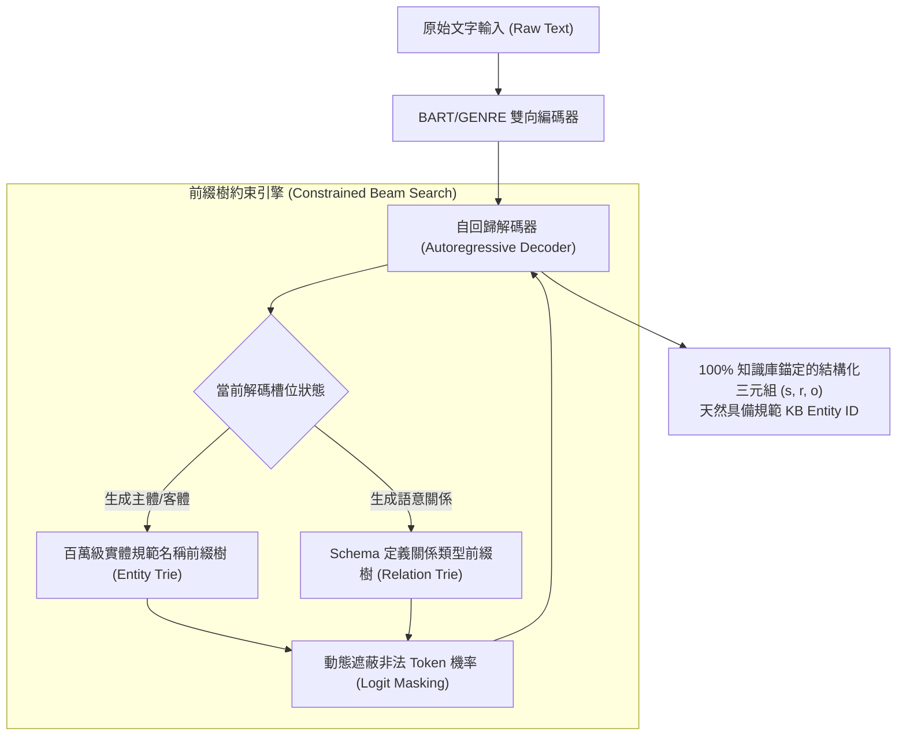

# GenIE: Generative Information Extraction

> [!INFO] 論文元數據 (Metadata)
> - **Paper ID**：`Josifoski2022_GenIE`
> - **作者**：Martin Josifoski, Nicola De Cao, Maxime Peyrard, Fabio Petroni, Robert West (EPFL, University of Amsterdam, University of Edinburgh, Meta AI)
> - **預印本初次發布年份 (Preprint)**：2021 (arXiv:2112.08340)
> - **正式發表年份 / 會議或期刊 (Venue)**：2022 (NAACL 2022, Main Conference)
> - **DOI**：[10.18653/v1/2022.naacl-main.342](https://doi.org/10.18653/v1/2022.naacl-main.342)
> - **ACL Anthology**：[https://aclanthology.org/2022.naacl-main.342/](https://aclanthology.org/2022.naacl-main.342/)
> - **驗證狀態**：`verified` (已比對 NAACL 2022 官方全文與論文 PDF)
> - **本地 PDF 連結**：[[Papers/04 - Knowledge & Graph RAG/(NAACL 2022-07) GenIE - Generative Information Extraction.pdf|開啟本地 PDF 檔案]]

---

## 一話摘要 (TL;DR)
GenIE 首次將**封閉式資訊抽取（Closed Information Extraction）**形式化為端到端自回歸生成任務，利用前綴樹（Trie / Prefix Tree）施加**受約束的束搜索解碼（Constrained Beam Search）**，強制生成嚴格對齊既定知識庫 Schema 的規範化實體與關係，緩解了生成式模型易幻覺未註冊實體的痛點，在百萬級實體規模下超越流水線基準達 32 個 F1 百分點。

---

## 研究背景與問題定義 (Problem Statement)

### 1. 核心痛點
在構建知識圖譜與企業結構化資料庫時，最常見的任務是**封閉式資訊抽取（Closed IE）**：從文本中抽取嚴格錨定在目標知識庫（如 Wikidata、企業本體論）中的實體與關係三元組 $(s, r, o)$：
1. **傳統判別式流水線的累積誤差與規模瓶頸**：傳統做法切分為「實體識別 $\to$ 實體鏈接（Entity Linking）$\to$ 關係分類」，每一步均存在嚴重的誤差積累；且當實體空間拓展到數百萬時，判別分類器在全域計算 Softmax 存在算力災難。
2. **開放生成式模型（如 REBEL）的實體脫靶（Un-grounded Hallucination）**：REBEL 等 Seq2Seq 模型雖然靈活，但生成的是自由表面形式（Surface Form），經常生成目標知識庫中不存在的同義詞、縮寫或幻覺實體，需要依賴脆弱的後處理進行二次實體對齊。

### 2. 研究假設
若以自回歸 Seq2Seq 語言模型（以 GENRE / BART 為基礎）為骨幹，將知識庫中所有合法的規範實體名稱與關係類型預先構建為前綴樹（Trie）；在解碼的每一個 Token 步驟中，**動態強制遮蔽（Masking）**所有無法通往有效 KB 實體的前綴分支，即可實現「端到端一次生成、天然嚴格錨定知識庫」的完美抽取。

---

## 核心方法與技術架構 (Methodology & Architecture)

### 1. 封閉式三元組生成形式化
給定輸入句子 $x$，GenIE 目標是自回歸解碼輸出合法的知識庫三元組序列：
$$y = (s_1, r_1, o_1, s_2, r_2, o_2, \dots)$$
其中 $s_i, o_i \in \mathcal{E}_{\text{KB}}$（KB 註冊的實體集合），$r_i \in \mathcal{R}_{\text{KB}}$（KB 註冊的關係集合）。

### 2. 基於前綴樹的約束解碼 (Constrained Decoding with Trie)
- 將知識庫中數百萬個規範實體名稱與所有關係標籤編譯為前綴樹（Prefix Tree / Trie）；
- 在自回歸解碼步驟 $t$：
  - 若當前正在解碼 Subject 或 Object，查詢 Entity Trie，僅允許模型在合法的下一個 Subword Token 上計算機率，其餘所有 Vocab Token 機率強制設為 $-\infty$；
  - 若當前正在解碼 Relation，查詢 Relation Trie，強制模型僅能在 Schema 定義的關聯名稱中選擇；
- 這保證了生成結束時，產生的每一個字串在目標知識庫中都必定**存在唯一對應的規範實體 ID**。

### 3. 多階段端到端微調策略
- 以 GENRE（針對實體鏈接預訓練的自回歸模型）為初始權重；
- 在大規模三元組生成數據（REBEL + Wiki-NRE）上實施多任務聯合訓練，強化模型在實體邊界識別、指代關聯與跨實體推斷上的感知力。

### 系統架構流程圖 (Mermaid)

#### 圖中節點對照
- `SeqEnc`: 上下文語意編碼器
- `EntityTrie`: 封裝百萬級知識庫規範實體的前綴樹結構
- `RelTrie`: 封裝 Schema 定義關係的前綴樹結構
- `MaskVocab`: 在 Vocab 維度消除非合法分支的約束算子
- `CleanTriplets`: 毫無幻覺且完全符合 Schema 的高品質三元組

---

## 主要實驗結果與證據 (Empirical Results & Evidence)

### 1. 封閉式抽取全域基準對比 (Table 1, Page 6)
在小規模 Schema（Wiki-NRE, Geo-NRE）與超大規模 Schema（REBEL: 1,146 類, FewRel）上全面評估：

| 評測維度 | 評估基準 | 最強流水線 (SotA Pipeline) | SetGenNet | GenIE (本文全量模型) | 增益 ($\Delta$) |
| :--- | :--- | :---: | :---: | :---: | :---: |
| **Micro-F1** | **Wiki-NRE** | 59.30% | 80.07% | **91.48%** | **+32.18%** |
| | **Geo-NRE** | 66.43% | 86.10% | **92.48%** | **+26.05%** |
| | **REBEL (大 Schema)** | 42.50% | - | **68.93%** | **+26.43%** |
| **Macro-F1** | **Wiki-NRE** | 17.76% | - | **47.08%** | **+29.32%** |
| | **Geo-NRE** | 35.14% | - | **72.59%** | **+37.45%** |
| | **REBEL (大 Schema)** | 9.48% | - | **30.46%** | **+20.98%** |

*(出處：Table 1, Page 6)*

- **關鍵突破**：
  - 在 Micro-F1 上，GenIE 在 Wiki-NRE 達到 **91.48%**，相較於流水線 SOTA (59.30%) 實現了超過 **32 個百分點的爆發性增長**；
  - 在長尾關係權重均等的 Macro-F1 上，Geo-NRE 從 35.14% 躍升至 **72.59%**（翻倍以上），證明約束解碼在罕見與長尾關係抽取中具備極強的引導力。

### 2. 約束解碼之消融實驗 (Table 2, Page 6)
- **Unconstrained GenIE (移除前綴樹約束)**：
  - 在 REBEL 測試集上，Micro-F1 從 68.93% 降至 66.20%；
  - 在 FewRel 零樣本抽取上，Recall 從 30.77% 跌至 26.15%；
  - 更重要的是，無約束生成產生了大量不在 KB 中的變體名詞，導致下游無法自動完成實體對齊。

---

## 優勢、限制及 Trade-offs (Strengths, Limitations & Trade-offs)

### 1. 優勢 (Strengths)
1. **天然解決實體鏈接難題**：無需在抽取後掛載昂貴的 Entity Linking 後處理模組，生成完成即代表完成對齊。
2. **完美杜絕幻覺三元組**：透過 Trie 強制限制詞表搜尋空間，模型不可能生成未定義的關係或脫靶實體。
3. **百萬級實體擴展能力**：Trie 搜尋的時間複雜度取決於字串長度而非實體庫總量，使得百萬級知識庫的受限解碼具備極高推論效率。

### 2. 限制與代價 (Limitations & Trade-offs)
1. **無法發現開放新實體（Out-of-KB Entities）**：由於受到 Trie 嚴格限制，若文本中出現知識庫未收錄的新興實體或新概念，模型會強制將其截斷或迫近至既有實體。
2. **前綴樹記憶體常駐開銷**：維護全量維基百科實體的 Trie 結構需要佔用數 GB 的主記憶體或顯存。

---

## 對本專案研究領域的實際意義 (Implications for Research Domains)

1. **D03 Knowledge Extraction & Information Preservation，並與 D04 Knowledge Representation 相鄰**：
   GenIE 是企業級知識圖譜構建（Enterprise KG Construction）的理想範式。在企業內部，實體庫通常存在嚴格的 ERP/CRM 字典與合規 Schema；利用 GenIE 的前綴樹約束技術，能保證 LLM 抽取的圖譜節點 100% 錨定企業金標準實體，杜絕任何圖譜污染。
2. **消除 RAG 索引階段的「圖譜實體漂移」**：
   在長文檔切塊建圖時，同一實體在不同 Chunk 中可能被 LLM 寫成不同名字（如 "Apple Inc.", "Apple", "AAPL"）。GenIE 的約束生成機制從源頭完成了實體歸一化（Entity Canonicalization），極大簡化了跨 Chunk 圖譜融合管線。

---

## 原始來源及相關筆記連結 (Sources & Related Notes)

- **本地 PDF 連結**：[[Papers/04 - Knowledge & Graph RAG/(NAACL 2022-07) GenIE - Generative Information Extraction.pdf|開啟本地 PDF 檔案]]
- **關聯之生成式資訊抽取筆記**：
  - [[03 - 論文庫 (Literature Notes)/04 - Knowledge & Graph RAG/(EMNLP 2021-11) REBEL - Relation Extraction By End-to-end Language generation|REBEL: Relation Extraction By End-to-end Language generation]]
  - [[03 - 論文庫 (Literature Notes)/04 - Knowledge & Graph RAG/(ACL 2022-05) Unified Structure Generation for Universal Information Extraction|UIE: Unified Structure Generation for Universal Information Extraction]]
- **所屬研究領域**：
  - [[02 - 研究領域專題 (Research Domains)/Domain 02 - Segmentation & Contextualization|D02 Segmentation & Contextualization]]
  - [[02 - 研究領域專題 (Research Domains)/Domain 03 - Knowledge Extraction & Information Preservation|D03 Knowledge Extraction & Information Preservation]]
