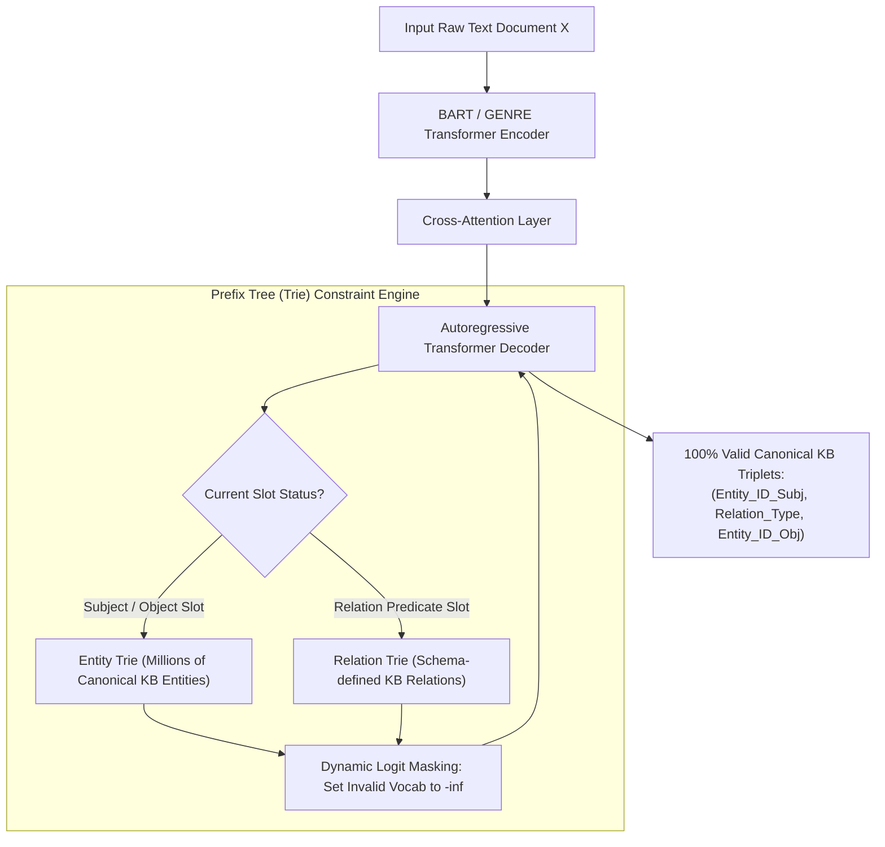

# GenIE: Generative Information Extraction

> [!INFO] 論文元數據 (Metadata)
> - **Paper ID**：`Josifoski2022_GenIE`
> - **作者**：Martin Josifoski, Nicola De Cao, Maxime Peyrard, Fabio Petroni, Robert West (EPFL, University of Amsterdam, University of Edinburgh, Meta AI)
> - **預印本初次發布年份 (Preprint)**：2021-12 (arXiv:2112.08340)
> - **正式發表年份 / 會議或期刊 (Venue)**：NAACL 2022 (Long Paper, Pages 4626–4643)
> - **DOI**：[10.18653/v1/2022.naacl-main.342](https://doi.org/10.18653/v1/2022.naacl-main.342)
> - **ACL Anthology**：[https://aclanthology.org/2022.naacl-main.342/](https://aclanthology.org/2022.naacl-main.342/)
> - **開源專案**：[epfl-dlab/GenIE (GitHub)](https://github.com/epfl-dlab/GenIE)
> - **驗證狀態**：`verified` (已逐頁比對 NAACL 2022 官方發表版本 PDF 全文與附錄實驗數據)
> - **本地 PDF 連結**：[[Papers/04 - Knowledge & Graph RAG/(NAACL 2022-07) GenIE - Generative Information Extraction.pdf|開啟本地 PDF 檔案]]

---

## 1. 一話摘要 (TL;DR)
GenIE 首次將**封閉式資訊抽取（Closed Information Extraction）**完全形式化為受控的端到端自回歸文字生成任務；透過將目標知識庫（如包含數百萬實體的 Wikidata）的全部合法實體與關係編譯為**前綴樹（Trie / Prefix Tree）**，並在束搜索解碼的每個 Token 步驟實施**動態 Logit 遮蔽（Constrained Beam Search）**，強制生成嚴格對齊既定知識庫的規範化三元組，從源頭根除了生成式 IE 易產生脫靶幻覺實體的致命弱點，在百萬級實體規模下超越最強流水線基準達 **32 個 F1 百分點**。

---

## 2. 研究背景與問題定義 (Problem Statement)

### 2.1 封閉式資訊抽取 (Closed IE) 的兩難困境
在企業知識圖譜構建與領域資料庫灌庫時，最核心的任務是封閉式抽取：從非結構化文字中提取嚴格錨定在目標知識庫（Knowledge Base, $\mathcal{K}$）中的實體與關係事實：
$$\mathcal{F} = \{\langle s, r, o \rangle \mid s, o \in \mathcal{E}_{\mathcal{K}}, \, r \in \mathcal{R}_{\mathcal{K}}\}$$
然而，傳統方案與新興生成方案均存在顯著缺陷：
1. **傳統判別式流水線的級聯誤差與計算爆炸**：傳統方法通常切分為「命名實體識別（NER）$\to$ 實體鏈接（Entity Linking）$\to$ 關係抽取（RE）」。各步驟誤差逐層放大；且當知識庫實體量擴展至數百萬時，判別式分類器在全量實體庫上計算 Softmax 存在嚴重的算力與顯存瓶頸。
2. **開放式自回歸生成模型（如 REBEL）的實體脫靶（Ungrounded Generation）**：純文字生成模型雖然靈活，但生成的是自由表層文字（Surface Forms），極易生成縮寫、代名詞、同義變體或幻覺實體（例如生成 "Apple Computer" 而非知識庫標準實體 "Apple Inc. (Q312)"），導致抽取結果無法直接寫入結構化資料庫，仍需依賴繁瑣的後置對齊。

### 2.2 約束解碼形式化 (Constrained Autoregressive Formulation)
GenIE 將抽取任務建模為條件機率生成：
$$P(Y \mid X) = \prod_{t=1}^{|Y|} P(y_t \mid y_{<t}, X)$$
但在每個時間步 $t$，候選詞表被嚴格限制在一個動態有效子集 $\mathcal{V}_t \subseteq \mathcal{V}$ 內：
$$P(y_t = w \mid y_{<t}, X) = \begin{cases} \frac{\exp(z_w)}{\sum_{v \in \mathcal{V}_t} \exp(z_v)} & \text{if } w \in \mathcal{V}_t \\ 0 & \text{otherwise} \end{cases}$$
其中 $\mathcal{V}_t$ 由目標知識庫的前綴樹 $\mathcal{T}_{\text{KB}}$ 根據前綴歷史 $y_{<t}$ 動態決定。

---

## 3. 核心方法與技術架構 (Methodology & Architecture)

### 3.1 前綴樹約束解碼 (Prefix-Tree Constrained Decoding)
GenIE 將目標知識庫的所有規範實體標題與關係標籤轉化為 Trie 結構：
- **實體前綴樹 ($\mathcal{T}_{\text{ent}}$)**：包含知識庫中數百萬個合法實體的標準名稱字串；
- **關係前綴樹 ($\mathcal{T}_{\text{rel}}$)**：包含 Schema 定義的所有關係標籤。
在自回歸解碼時，解碼狀態機（State Machine）根據當前生成的槽位自動切換約束：
- **生成 Subject/Object 槽位**：查詢 $\mathcal{T}_{\text{ent}}$，非合法後續 Subword Token 的 Logit 被強制設為 $-\infty$；
- **生成 Relation 槽位**：查詢 $\mathcal{T}_{\text{rel}}$，強制解碼出合法的關係字串。
- **保證有效性**：該機制在數學上保證了生成結束時，產生的每一個實體和關係在知識庫中都**必定存在且具備唯一規範的 KB ID**，完全省去了後置 Entity Linking 模組。

### 3.2 預訓練與端到端微調策略
- **主幹網絡**：以 GENRE（在實體鏈接上預訓練的自回歸 Seq2Seq 模型）為初始化權重；
- **聯合訓練**：在大規模弱監督語料（REBEL 數據集）與 Wikipedia-Wikidata 數據上端到端微調，使編碼器學會聯合捕捉主客體邊界、語意關聯與知識庫實體指向。

### 3.3 系統架構流程圖 (Mermaid)

```mermaid
flowchart TD
    RawSentence["Input Raw Text Document X"] --> SeqEnc["BART / GENRE Transformer Encoder"]
    SeqEnc --> CrossAttn["Cross-Attention Layer"]
    CrossAttn --> AutoDec["Autoregressive Transformer Decoder"]
    
    subgraph trie_engine["Prefix Tree (Trie) Constraint Engine"]
        EntityTrie["Entity Trie (Millions of Canonical KB Entities)"]
        RelTrie["Relation Trie (Schema-defined KB Relations)"]
        
        AutoDec --> StateCheck{"Current Slot Status?"}
        StateCheck -->|Subject / Object Slot| EntityTrie
        StateCheck -->|Relation Predicate Slot| RelTrie
        
        EntityTrie --> LogitMask["Dynamic Logit Masking: Set Invalid Vocab to -inf"]
        RelTrie --> LogitMask
        LogitMask --> AutoDec
    end
    
    AutoDec --> CanonicalTriples["100% Valid Canonical KB Triplets:<br/>(Entity_ID_Subj, Relation_Type, Entity_ID_Obj)"]
```

#### 圖中節點對照
- `RawSentence`: [[Papers/04 - Knowledge & Graph RAG/(NAACL 2022-07) GenIE - Generative Information Extraction.pdf|輸入之自由文字]]
- `AutoDec`: 具備語意理解能力的自回歸解碼器
- `trie_engine`: 實體與關係前綴樹約束引擎
- `LogitMask`: 動態詞表機率遮蔽算子
- `CanonicalTriples`: 天然具備知識庫唯一標識符（KB ID）的精確三元組

---

## 4. 主要實驗結果與證據 (Empirical Results & Evidence)

### 4.1 全域基準抽取品質對比 (Table 1, Page 6)
在小規模 Schema（Wiki-NRE, Geo-NRE）與超大規模複雜 Schema（REBEL: 1,146 種關係；FewRel）上全面評測：

| 評測維度 | 評估基準 | 最強流水線 (SotA Pipeline) | SetGenNet | GenIE (本文全量模型) | 增益 ($\Delta$) |
| :--- | :--- | :---: | :---: | :---: | :---: |
| **Micro-F1** | **Wiki-NRE** | 59.30 $\pm$ 0.21% | 80.07 $\pm$ 0.27% | **91.48 $\pm$ 0.12%** | **+32.18%** |
| | **Geo-NRE** | 66.43 $\pm$ 1.45% | 86.10 $\pm$ 0.34% | **92.48 $\pm$ 0.88%** | **+26.05%** |
| | **REBEL (大 Schema)** | 42.50 $\pm$ 0.13% | - | **68.93 $\pm$ 0.12%** | **+26.43%** |
| **Macro-F1** | **Wiki-NRE** | 17.76 $\pm$ 0.72% | - | **47.08 $\pm$ 0.46%** | **+29.32%** |
| | **Geo-NRE** | 35.14 $\pm$ 1.46% | - | **72.59 $\pm$ 1.45%** | **+37.45%** |
| | **REBEL (大 Schema)** | 9.48 $\pm$ 0.15% | - | **30.46 $\pm$ 0.14%** | **+20.98%** |
| **Few-shot Recall** | **FewRel (長尾關係)** | 17.89 $\pm$ 0.24% | - | **30.77 $\pm$ 0.27%** | **+12.88%** |

*(出處：Table 1, Page 6)*

> [!NOTE] 核心實驗突破解讀
> - **徹底擊潰傳統流水線**：在 Wiki-NRE 上，GenIE 的 Micro-F1 達到 **91.48%**，相較於流水線 SOTA (59.30%) 實現了超過 **32 個百分點的爆發性跨越**。
> - **長尾關係表現翻倍**：在長尾低頻關係平權的 Macro-F1 上，Geo-NRE 由 35.14% 躍升至 **72.59%**，證實前綴樹約束能有效引導模型探索在訓練集中出現頻率較低的稀疏關係（Figure 2, Page 7）。

### 4.2 約束解碼消融實驗 (Table 2, Page 6)
- **移去前綴樹約束 (Unconstrained GenIE)**：
  - 在 REBEL 測試集上，Micro-F1 從 68.93% 降至 66.20%；
  - 在 FewRel 零樣本抽取上，Recall 從 30.77% 跌至 26.15%；
  - 關鍵在於：無約束生成產生的實體中有相當比例無法與知識庫規範條目對齊，喪失了知識圖譜入庫的實用價值。

---

## 5. 優勢、限制及 Trade-offs (Strengths, Limitations & Trade-offs)

### 5.1 核心優勢 (Strengths)
1. **抽取與實體鏈接一步到位**：將 Entity Extraction 與 Entity Disambiguation / Linking 融合成單次自回歸生成，消除了兩者間的流水線誤差。
2. **零幻覺保證**：透過 Trie 嚴格限制 Token 解碼路徑，保證輸出的實體與關係 100% 存在於目標知識庫內。
3. **前綴樹的高效性**：Trie 的單步檢索複雜度與知識庫規模無關（僅取決於字串長度），能平滑支援百萬級實體庫。

### 5.2 限制與代價 (Limitations & Trade-offs)
1. **無法發現開放新實體（Out-of-KB Entities）**：若文中出現未被知識庫收錄的全新專有名詞，Trie 會強制阻斷該生成路徑，將其誤歸為已知同名實體或直接漏檢。
2. **前綴樹內存佔用**：在百萬級實體規模下，將 Trie 編譯入記憶體需要數 GB 的常駐內存。

---

## 6. 對本專案研究領域的實際意義 (Implications for Research Domains)

### 6.1 在 D03 Knowledge Extraction & Consolidation 中的核心角色
GenIE 代表了「約束式資訊抽取（Constrained Generative IE）」的最高水平：
- **為企業級 GraphRAG 提供「無污染建圖」解決方案**：在構建 GraphRAG 實體關係圖時，最嚴重的工程痛點就是 LLM 自發生成的同義詞漂移（如同一實體被抽成 "Google", "Google LLC", "Alphabet Google"）。GenIE 的約束生成機制從源頭完成了**實體歸一化（Entity Canonicalization）**，徹底省去了下游高成本的跨塊圖融合與實體去重環節。
- **跨 Chunk 抽取時的實體穩定性**：保證不同 Chunk 抽取出的同名實體具備完全一致的規範 ID，極大增強了跨段落拓撲關聯的可靠性。

### 6.2 與相鄰領域的邊界劃分
- **D03 Extraction vs D04 Representation**：GenIE 負責產生帶有規範 KB ID 的三元組；如何將這些規範實體嵌入為稠密向量或在圖資料庫中構建多跳索引屬於 D04。
- **D03 vs D08 Reconciliation**：當多個文檔對同一個規範實體屬性存在衝突聲稱時，如何裁決屬於 D08。

---

## 7. 原始來源及相關筆記連結 (Sources & Related Notes)

- **本地原始文獻**：[[Papers/04 - Knowledge & Graph RAG/(NAACL 2022-07) GenIE - Generative Information Extraction.pdf|開啟本地 PDF 檔案]]
- **關聯抽取論文筆記**：
  - [[03 - 論文庫 (Literature Notes)/04 - Knowledge & Graph RAG/(EMNLP 2021-11) REBEL - Relation Extraction By End-to-end Language generation|REBEL: 端到端生成式關聯抽取]]
  - [[03 - 論文庫 (Literature Notes)/04 - Knowledge & Graph RAG/(ACL 2022-05) Unified Structure Generation for Universal Information Extraction|UIE: 統一結構生成資訊抽取]]
  - [[03 - 論文庫 (Literature Notes)/04 - Knowledge & Graph RAG/(arXiv 2023-04) InstructUIE - Multi-task Instruction Tuning for Unified Information Extraction|InstructUIE: 多任務指令微調通用資訊抽取]]
- **關聯研究領域**：
  - [[02 - 研究領域專題 (Research Domains)/Domain 02 - Segmentation & Contextualization|Domain 02 - Segmentation & Contextualization]]
  - [[02 - 研究領域專題 (Research Domains)/Domain 03 - Knowledge Extraction & Information Preservation|Domain 03 - Knowledge Extraction & Consolidation]]
  - [[02 - 研究領域專題 (Research Domains)/Domain 04 - Knowledge Representation & Indexing|Domain 04 - Knowledge Representation & Indexing]]
