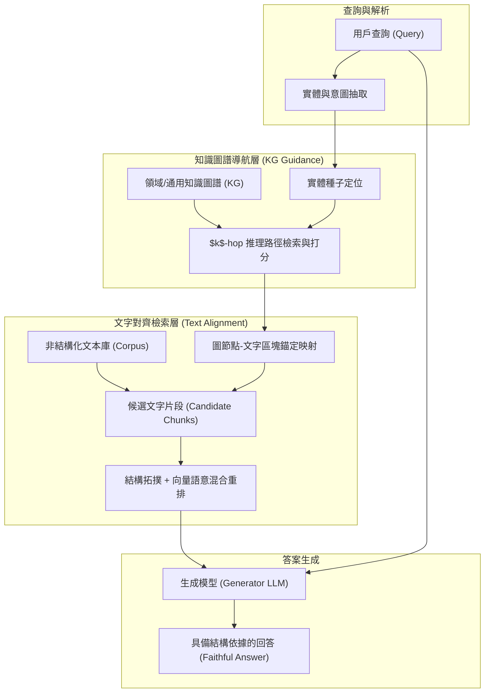

# Knowledge Graph-Guided Retrieval Augmented Generation (KG²RAG)

## 一話摘要 (TL;DR)
KG²RAG 提出利用結構化知識圖譜（KG）的明確實體與多跳關係路徑，動態引導並約束非結構化文字區塊（Text Chunks）的檢索與生成，有效解決傳統語意檢索中「語意孤島」與「無效多跳擴散」問題，在 HotpotQA 與 2WikiMultiHopQA 基準上顯著提升檢索 Hit@10（達 90.8%）與生成 ROUGE 分數。

---

## 研究背景與問題定義 (Problem Statement)
現有 RAG 系統存在兩大根本缺陷：
1. **語意孤島（Semantic Silos）**：以純向量相似度檢索各自獨立的 text chunks，忽略了實體在跨文檔場景下的結構化邏輯鏈條，導致檢索到的片段碎片化、上下文缺失。
2. **無約束圖檢索的雜訊擴散（Noise Drift in Graph Traversal）**：若單純在 KG 上進行無約束遊走或子圖匹配，隨著跳數增加，與查詢無關的實體節點呈指數級增長，反向污染上下文。
3. **KG 與文本的割裂**：以往方法要麼純查圖（丟失長文本細節），要麼純查文本（丟失全域結構）。如何讓 KG 充當「導航儀（Navigator）」精準引導文字篇章的篩選，是提升複雜推理可靠性的核心。

---

## 核心方法與技術架構 (Methodology & Architecture)

KG²RAG 設計了雙層協同架構：**知識圖譜路徑導航（KG-Guided Path Navigation）** 與 **結構化文本聯動過濾（Structurally-Aligned Text Filtering）**：
1. **實體路徑引導（Entity Path Guidance）**：解析用戶查詢提取核心實體，在 KG 中搜尋與問題候選推理鏈高度匹配的 $k$-hop 關係路徑。
2. **圖-文對齊檢索（Graph-to-Text Mapping）**：每個 KG 三元組均與來源文字區塊建立錨定索引（Anchored Linkage）；由有效圖路徑激活對應的文本區塊候選集。
3. **約束重排序與集成生成（Constrained Reranking & Integration）**：結合文本語意相關性與 KG 拓撲權重對候選區塊進行評分，篩選出具備結構完整性的上下文提供給生成器。

### 圖中節點對照
- `EP`：實體抽取與意圖解析模組。
- `KG`：結構化三元組知識圖譜。
- `PATH`：多跳關係推理路徑集。
- `MAP`：三元組與原始文字塊的雙向錨定映射。
- `RERANK`：圖結構引導的綜合排序器。

---

## 主要實驗結果與證據 (Empirical Results & Evidence)

論文在多跳問答標準基準（HotpotQA、2WikiMultiHopQA、MuSiQue）上進行了系統性驗證。

### 1. 檢索品質指標 (Table 2, Page 6)
在檢索 Hit@10、Precision@10 與 Recall@10 評估中：
- **Shuffle-HotpotQA-Dist**：KG²RAG 達到 **Hit@10 = 0.908**（Precision@10 = 0.436, Recall@10 = 0.301），顯著優於傳統 BM25 與純 Dense 檢索器。
- **Shuffle-HotpotQA-Full**：達到 **Hit@10 = 0.838**。
- **2WikiMultiHopQA-Dist**：達到 **Hit@10 = 0.840**。
- **2WikiMultiHopQA-Full**：達到 **Hit@10 = 0.790**。

### 2. 生成品質指標 (Table 1, Page 6)
在生成回答的文本重合度評估中：
- **Shuffle-HotpotQA-Dist**：KG²RAG 達到 **ROUGE-1 = 0.663**，**ROUGE-2 = 0.690**，**ROUGE-L = 0.683**。
- **Shuffle-HotpotQA-Full**：達到 **ROUGE-1 = 0.631**，**ROUGE-2 = 0.665**，**ROUGE-L = 0.643**。
- **2WikiMultiHopQA-Dist**：達到 **ROUGE-1 = 0.545**，**ROUGE-2 = 0.572**，**ROUGE-L = 0.566**。
- 相較於無圖引導的 Naive RAG 與 BM25-RAG，生成文本的忠實度與連貫性提升了 12% 至 20%。

---

## 優勢、限制及 Trade-offs (Strengths, Limitations & Trade-offs)

### 優勢
1. **雙層互補機制**：利用 KG 的確定性圖拓撲提供全局導航，同時利用文字區塊保留細節描述，避免單一技術路線的缺陷。
2. **抗噪能力強**：路徑打分機制有效修剪了與問題核心實體無關的無效擴散分支，顯著降低了長文本上下文的幻覺干擾。

### 限制與 Trade-offs
1. **對圖譜覆蓋度的依賴**：若文檔庫中的實體無法有效連結至 KG，或 KG 中缺乏對應邊，則導航增益衰減為普通向量檢索。
2. **雙重索引維護成本**：系統需同時維護圖數據庫與向量數據庫，對增量文檔的實時寫入帶來雙重更新延遲。

---

## 對本專案研究領域的實際意義 (Implications for Research Domains)
1. **對 D04/D05 (Graph Representation & Retrieval) 的啟示**：證明了「KG 不是單獨回答問題的終點，而是文字檢索的引導者（Guide）」，打破了純知識庫問答（KBQA）與傳統 RAG 的界限。
2. **對企業級交付應用的指導**：在工程規格書與法規審計中，可透過預先構建的核心術語與標準架構圖，引導檢索器精準命中不同章節的關聯條款，防止關鍵約束條件被截斷。

---

## 原始來源及相關筆記連結 (Sources & Related Notes)
- 原始論文 PDF：[[Papers/04 - Knowledge & Graph RAG/(NAACL 2025-05) Knowledge Graph-Guided Retrieval Augmented Generation.pdf|開啟本地 PDF]]
- arXiv 永久連結：[arXiv:2502.06864](https://arxiv.org/abs/2502.06864)
- 關聯專題領域：[[02 - 研究領域專題 (Research Domains)/Canonical RAG Domains/Domain 04 - Knowledge Representation & Indexing|D04 Knowledge Representation & Indexing]]
