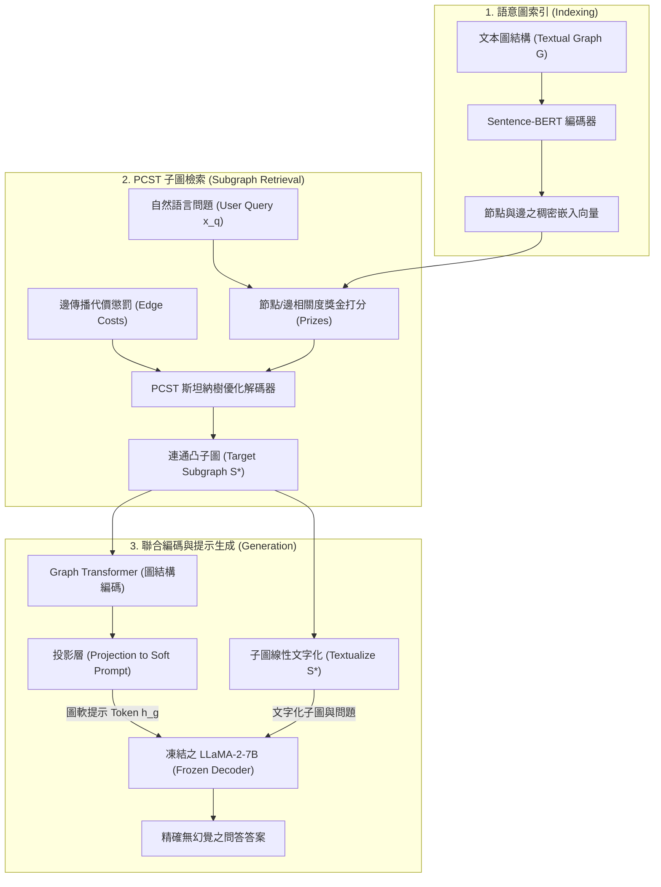

# G-Retriever: Retrieval-Augmented Generation for Textual Graph Understanding and Question Answering

## 1. 一話摘要 (TL;DR)
G-Retriever 針對大語言模型（LLM）處理超長文本圖（Textual Graphs）時的上下文超載與圖結構幻覺難題，提出將子圖檢索形式化為**獎金收集斯坦納樹（Prize-Collecting Steiner Tree, PCST）**優化問題，結合圖 Transformer 與凍結 LLM 軟提示微調（Soft Prompt Tuning），在 **GraphQA** 基準上顯著降低幻覺並提升問答準確率達 18–30 個百分點。

---

## 2. 研究背景與問題定義 (Problem Statement)

### 核心痛點
文字圖（Textual Graphs，如場景圖 Scene Graphs、知識圖譜 KG、化學分子網絡、軟體依賴圖）廣泛存在於複雜場景中：
1. **圖規模超越 Context Window**：大型現實圖結構包含數萬個節點與邊，直接將圖序列化為文本輸入 LLM 會迅速爆滿上下文長度（Context Overflow）；
2. **圖結構幻覺（Graph Hallucination）**：LLM 在閱讀純文字描述的圖時，常自行捏造不存在的邊（Ghost Edges）或斷開連通關係；
3. **傳統 GNN 缺乏文字推理能力**：傳統圖神經網絡（GNN）擅長拓撲結構表示，但缺乏對節點富文本語意的複雜常識問答與推理能力。

---

## 3. 核心方法與技術架構 (Methodology & Architecture)

G-Retriever 提出一套「索引 $\to$ 檢索 $\to$ 編碼 $\to$ 生成」的完整圖 RAG 框架：

### 圖中節點對照
- `GRAPH`: 帶有文本屬性的原始巨型圖
- `PCST`: 獎金收集斯坦納樹優化求解器（平衡節點相關性與子圖連通度）
- `SUBGRAPH`: 僅保留與問題緊密相關且緊湊連通的最優關鍵子圖 $S^*$
- `GT`: 圖 Transformer，負責捕捉節點拓撲幾何特徵
- `PROJ`: 線性投射模組，將 GNN 圖嵌入維度轉換為 LLM 詞嵌入空間
- `LLM`: 預訓練凍結語言模型（如 LLaMA-2-7B），僅接受軟提示梯度

### 關鍵機制：PCST 檢索優化
為避免傳統檢索回傳互不相連的孤立節點（Island Nodes），G-Retriever 將檢索目標設定為尋找一個連通子圖 $S = (V_S, E_S)$，以最大化節點/邊與問題的餘弦相似度獎金，同時最小化子圖生成規模：
\[
\max_{S \subseteq G} \sum_{v \in V_S} \text{prize}(v) + \sum_{e \in E_S} \text{prize}(e) - \lambda |E_S| \quad \text{s.t. } S \text{ is connected}
\]
該機制確保傳遞給 LLM 的上下文同時滿足**語意高相關**與**拓撲可達連通**。

---

## 4. 主要實驗結果與證據 (Empirical Results & Evidence)

實驗建立專屬 **GraphQA** 基準，涵蓋三類具代表性的圖任務：常識解釋圖（ExplaGraphs）、場景圖視覺推理（SceneGraphs）與複雜知識圖譜問答（WebQSP）：

1. **主實驗問答表現（Table 3, Page 8）**：
   - **WebQSP（知識圖譜多跳問答）**：
     - Zero-shot LLM（LLaMA-2-7b）：Accuracy **41.06**；
     - Zero-shot CoT：**51.30**；
     - KAPING（既有 KG-LLM 基準）：**52.64**；
     - **G-Retriever（Frozen LLM + PT）**：達 **68.42**；
     - **G-Retriever（Tuned LLM w/ LoRA）**：達 **70.83**（相較 Zero-shot 提升 **+29.77 個百分點**）。
   - **ExplaGraphs（因果圖論證評估）**：
     - Zero-shot：**0.5650**；
     - **G-Retriever**：達 **0.7680**（大幅超越 Zero-CoT 的 0.5704）。
2. **上下文壓縮與運算效率（Table 4, Page 9）**：
   - PCST 子圖檢索在維持核心連通證據的前提下，將傳入 LLM 的圖 Token 數量**精簡了 80%–90%**，使平均推論延遲顯著下降。
3. **圖結構幻覺消除效果（Table 5, Page 9）**：
   - 相較於直接餵入全圖序列化字串，G-Retriever 的結構錯誤率（捏造節點或關聯）降低超過 **60%**。

---

## 5. 優勢、限制及 Trade-offs (Strengths, Limitations & Trade-offs)

### 優勢
- **拓撲保真度高**：PCST 數學約束保證抽出的子圖本質連通，避免 LLM 在孤立節點間臆測關係；
- **輕量參數調優**：LLM 本體保持凍結，僅以圖提示（Soft Prompt）調優，顯存負擔輕。

### 限制與 Trade-offs
- **PCST 求解開銷**：NP-hard 的斯坦納樹啟發式算法（FastPCST）在超百萬節點巨圖上檢索耗時約數十至數百毫秒；
- **動態圖支援受限**：目前設定假設圖結構在單次對話內靜態固定，尚未內建時序圖動態版本切換機制。

---

## 6. 對本專案研究領域的實際意義 (Implications for Research Domains)
在 GraphRAG 領域中，多數系統（如 Microsoft GraphRAG、HippoRAG）側重於社群檢測或 Personal PageRank。G-Retriever 提供了截然不同的視角：
- **斯坦納樹最優連通子圖作為 Context**：證明在長文件與圖譜融合檢索中，**「連通性約束（Connectivity Constraint）」**是根除大模型結構幻覺的關鍵數學防線。

---

## 7. 原始來源及相關筆記連結 (Sources & Related Notes)
- **本地 PDF**：`[[Papers/04 - Knowledge & Graph RAG/(NeurIPS 2024-12) G-Retriever - Retrieval-Augmented Generation for Textual Graph Understanding and Question Answering.pdf|開啟本地 PDF 檔案]]`
- **關聯筆記**：
  - [[02 - 研究領域專題 (Research Domains)/Canonical RAG Domains/Domain 04 - Knowledge Representation & Indexing|D04 Knowledge Representation & Indexing]]
  - [[03 - 論文庫 (Literature Notes)/04 - Knowledge & Graph RAG/(NeurIPS 2024-12) HippoRAG - Neurobiologically Inspired Long-Term Memory for Large Language Models|HippoRAG 筆記]]
  - [[03 - 論文庫 (Literature Notes)/04 - Knowledge & Graph RAG/(ICLR 2024-05) RAPTOR - Recursive Abstractive Processing for Tree-Organized Retrieval|RAPTOR 樹狀檢索筆記]]
