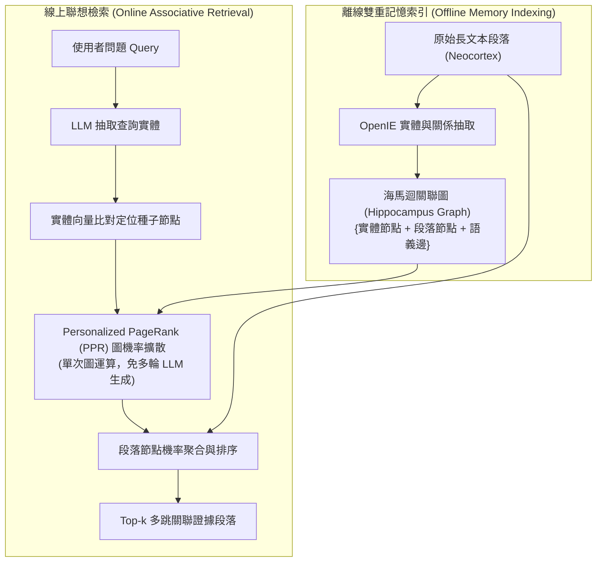

# HippoRAG: Neurobiologically Inspired Long-Term Memory for Large Language Models

> [!INFO] 論文元數據 (Metadata)
> - **Paper ID**：`Gutierrez2024_HippoRAG`
> - **作者**：Bernal Jiménez Gutiérrez, Yiheng Shu, Yu Gu, Michihiro Yasunaga, Yu Su
> - **預印本初次發布年份 (Preprint)**：2024
> - **正式發表年份 / 會議或期刊 (Venue)**：2024 (NeurIPS 2024)
> - **DOI**：無
> - **arXiv**：[2405.14831](https://arxiv.org/abs/2405.14831)
> - **驗證狀態**：`verified` (已比對原始文獻與 PDF 全文)
> - **本地 PDF 連結**：[[Papers/04 - Knowledge & Graph RAG/(NeurIPS 2024-12) HippoRAG - Neurobiologically Inspired Long-Term Memory for Large Language Models.pdf|開啟本地 PDF 檔案]]
---

## 一話摘要 (TL;DR)
**模擬人類大腦海馬迴與新皮質聯想記憶機制，利用知識圖譜結合 Personalized PageRank 實現快速聯想多跳檢索。**

---

## 研究背景與問題定義 (Problem Statement)
多跳複雜推理在傳統 RAG 中需要多次迭代呼叫 LLM，耗時且容易累積誤差；而全圖社群檢測成本又過於巨大。

---

## 核心方法與技術架構 (Methodology & Architecture)
HippoRAG 受到認知神經科學海馬迴索引理論（Hippocampal Indexing Theory）啟發，設計了分離式雙重記憶系統：
1. **雙重記憶架構**：
   - **大腦新皮質（Neocortex）**：儲存未經修改的原始文本段落（Passages），保證語意的原始保真度與完整上下文；
   - **海馬迴（Hippocampus）**：透過 OpenIE（開源實體與關係抽取）構建關聯知識圖譜，節點包含名詞短語實體與對應的段落節點，邊代表實體共現或抽取出的語意關係。
2. **單步個人化佩奇排名檢索（PPR-based Associative Retrieval）**：
   - 查詢實體辨識：從使用者問題中提取關鍵命名實體；
   - 語義匹配種子節點：利用密集檢索器（如 Contriever）將問題實體連接至海馬迴圖中最相近的知識節點，並賦予初始機率權重（Personalized Vector）；
   - 圖拓撲擴散（PPR）：在知識圖譜上執行快速矩陣運算之 Personalized PageRank 隨機遊走擴散，模擬神經突觸聯想；
   - 段落排序：將擴散後的節點權重聚合回關聯的段落節點，直接產出多跳關聯的 Top-$k$ 候選段落。

---

## 主要實驗結果與證據 (Empirical Results & Evidence)
> [!NOTE] 關鍵實證數據與評估條件
> **出處與評估條件**：Table 1 & Figure 4 (Page 6-7): 在 2WikiMultiHopQA、HotpotQA 與 MuSiQue 等多跳基準測試中，HippoRAG 在檢索 Recall@2 與下游回答準確率上匹敵甚至超越多輪迭代檢索架構（IRCoT）。在原論文所採用的具體實驗硬體與 API 評估環境下，由於以圖上單次矩陣 PPR 運算取代了反覆呼叫 LLM 進行思維鏈推理，HippoRAG 達成了約 6–13 倍的檢索加速與 10–20 倍的檢索階段成本節省；該數據依賴於特定 baseline 與資料集條件，不應無邊界泛化為所有情境下的固定加速比。

---

## 優勢、限制及 Trade-offs (Strengths, Limitations & Trade-offs)
- **優勢**：無需多輪 LLM 互動即可實現多跳遠程知識關聯，大幅降低多跳問答的線上推論延遲與 API 費用。
- **限制**：高度依賴前端 OpenIE 抽取的品質；若關鍵實體未被辨識，圖擴散路徑將中斷；對無明確命名實體之純抽象邏輯推理問題效果較受限。

---

## 在長文件處理任務中的角色與啟發 (Implications for Long-Doc Processing)
為非參數化外部記憶（Non-parametric Memory）與知識圖譜拓撲演算法在先進 RAG 中的深度結合樹立了標竿。

---

## 原始來源及相關筆記連結 (Sources & Related Notes)
- **所屬研究領域**：
  - [[02 - 研究領域專題 (Research Domains)/Canonical RAG Domains/Domain 04 - Knowledge Representation & Indexing|D04 Knowledge Representation & Indexing]]
  - [[02 - 研究領域專題 (Research Domains)/Canonical RAG Domains/Domain 11 - Memory-Augmented RAG|D11 Memory-Augmented RAG]]
- **回主目錄**：[[00 - 導覽與心智圖 (Navigation & MOC)/Home (主目錄與知識庫導覽)|主目錄與知識庫導覽]]
- **全景心智圖**：[[00 - 導覽與心智圖 (Navigation & MOC)/LLM 超長文件處理心智圖 (MOC)|超長文件處理研究方向心智圖]]
