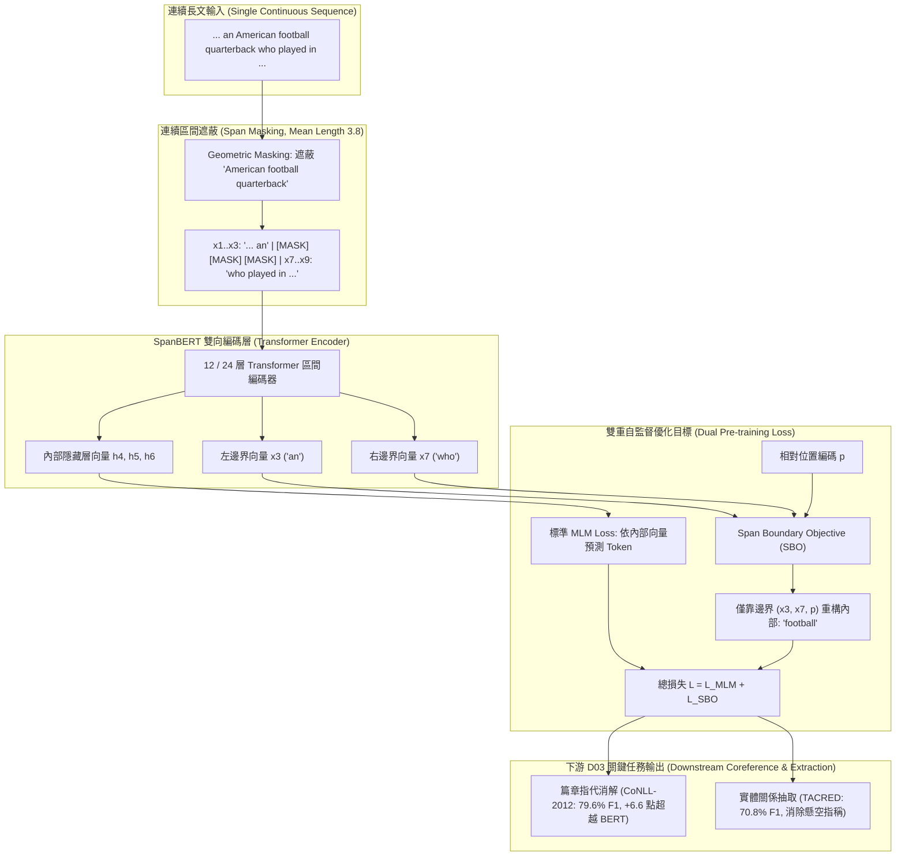

# SpanBERT: Improving Pre-training by Representing and Predicting Spans

> [!INFO] 論文元數據 (Metadata)
> - **Paper ID**：`Joshi2020_SpanBERT`
> - **作者**：Mandar Joshi, Danqi Chen, Yinhan Liu, Daniel S. Weld, Luke Zettlemoyer, Omer Levy (University of Washington, Princeton University, Facebook AI Research)
> - **預印本初次發布年份 (Preprint)**：2019 (arXiv:1907.10529)
> - **正式發表年份 / 會議或期刊 (Venue)**：Transactions of the Association for Computational Linguistics (TACL 2020, Vol 8, Pages 64–77)
> - **DOI**：10.1162/tacl_a_00300
> - **arXiv**：[1907.10529](https://arxiv.org/abs/1907.10529)
> - **開源資源**：[facebookresearch/SpanBERT](https://github.com/facebookresearch/SpanBERT)
> - **驗證狀態**：`verified` (基於原始論文 PDF 全文核實)
> - **本地 PDF 連結**：[[Papers/04 - Knowledge & Graph RAG/(TACL 2020-01) SpanBERT - Improving Pre-training by Representing and Predicting Spans.pdf|開啟本地 PDF 檔案]]

---

## 一話摘要 (TL;DR)
**SpanBERT 專門針對實體區間（Span）的語意抽取與指代消解重塑了自監督預訓練目標，提出幾何分佈連續區間遮蔽（Span Masking）與區間邊界目標（Span Boundary Objective, SBO），強迫邊界 Token 壓縮整個區間的完整語意，在篇章級共指消解（OntoNotes / CoNLL-2012）上相較標準 BERT 暴增 +6.6 點 F1（達到 79.6%），成為長文本實體鏈結、關係抽取與跨塊整合（Cross-chunk Consolidation）的基石骨幹模型。**

---

## 研究背景與問題定義 (Problem Statement)

BERT 等經典雙向預訓練語言模型採用隨機獨立 Token 遮蔽（Random Token Masking），在通用句子分類與語義匹配上表現優異，但面對資訊抽取（IE）、篇章級實體關係抽取與指代消解時存在根本性架構缺陷：
1. **獨立 Token 遮蔽破壞實體完整性**：實體名稱、專業術語或事件短語通常由多個連續 Token 組成（例如「George Washington」或「New York University」）。隨機遮蔽單個 Token（如僅遮蔽「York」）使模型依賴相鄰的「New」與「University」即可輕易猜測，無法學會對完整實體區間（Span）的深層表徵。
2. **缺乏顯式的區間邊界表徵能力**：在篇章級共指消解中，系統需要判斷相隔數百詞的兩個不同跨度（如「Barack Obama」與「the 44th president」）是否指向同一人。傳統架構缺乏約束外部上下文邊界 Token 捕捉內部完整語意之專用訓練目標。
3. **次句預測（NSP）對長文本任務的負面干擾**：雙句拼接訓練限制了單一文檔內連續長篇文本的注意力連續性。

---

## 核心方法與技術架構 (Methodology & Architecture)

### 1. 幾何分佈連續區間遮蔽（Span Masking, Section 3.1, Page 2-3）
SpanBERT 摒棄了獨立單詞遮蔽，改為連續 Span 遮蔽：
- **區間長度採樣**：依據幾何分佈 $p(l) = (1-p) p^{l-1}$（其中衰減率 $p=0.2$）進行長度採樣，並限制最大長度為 10，區間平均長度為 3.8 個 Token。
- **隨機遮蔽率**：保持總體遮蔽 15% 的 Token。透過遮蔽完整語法塊，強迫模型學習深層篇章語意而非淺層 n-gram 記憶。

### 2. 區間邊界目標（Span Boundary Objective, SBO, Section 3.2, Page 3-4）
為了讓下游抽取任務能直接用區間兩端的邊界向量表徵整個 Span，SpanBERT 提出了專利式的 SBO 目標：
- 設被遮蔽區間為 $(x_s, \dots, x_e)$，其邊界前一個 Token 為 $x_{s-1}$，後一個 Token 為 $x_{e+1}$。
- 對於被遮蔽區間內的任意第 $i$ 個 Token $x_i$，模型**僅依靠外部邊界表徵與相對位置嵌入**來預測其詞彙：
  $$y_i = f(x_{s-1}, x_{e+1}, p_{i-s+1})$$
  其中 $f(\cdot)$ 為雙層非線性前饋網路（GeLU），$p$ 為相對位置向量。
- **聯合損失函數（Equation 1, Page 4）**：
  $$\mathcal{L}(x_i) = \mathcal{L}_{\text{MLM}}(x_i) + \mathcal{L}_{\text{SBO}}(x_i)$$
  - MLM 依靠內部上下文預測；SBO 則強迫邊界表徵 $(x_{s-1}, x_{e+1})$ 壓縮儲存整個 Span 的語意。

### 3. 單一連續序列訓練（Single-Sequence Training, Section 3.3, Page 4）
- 徹底移除 Next Sentence Prediction (NSP) 任務；
- 連續取樣同一文檔內的完整段落直到填滿 512 個 Token 窗口，極大強化了跨句子長程注意力的捕獲能力。

#### 圖中節點對照 (Node Reference Table)
| 節點代號 | 模組名稱 | 關鍵作用與運算機制 |
| :--- | :--- | :--- |
| `CTX` | 單文檔連續輸入 | 消除雙句拼接邊界，保留長文篇章級實體共指線索 |
| `SPAN_MASK` | 幾何區間遮蔽 | 遮蔽完整實體名詞塊，杜絕相鄰單詞淺層資訊洩露 |
| `H_LEFT / RIGHT` | 邊界向量標記 | 儲存遮蔽跨度邊界兩端的語意表徵 |
| `SBO` | 區間邊界目標 | **核心創新**：以邊界向量重構內部 Token，形成高凝聚力 Span 向量 |
| `COREF` | 指代消解下游模組 | 消除跨句代名詞歧義，是 D03 防止 False Merge 的核心工具 |
| `REL` | 關係抽取下游模組 | 支撐 TACRED 等大型關係基準抽取的高精度分類器 |

---

## 主要實驗結果與證據 (Empirical Results & Evidence)

### 1. 篇章指代消解性能（CoNLL-2012 / OntoNotes, Table 3, Page 7）
在最權威的篇章級實體共指消解基準 CoNLL-2012 上對比主流模型（採用 Lee et al., 2018 端到端共指系統）：
- **Google BERT-large**：平均 F1 為 73.0%（MUC: 81.4%, $B^3$: 71.3%, $\text{CEAF}_e$: 66.3%）
- **SpanBERT-base**：平均 F1 達到 77.4%（已大幅超越 BERT-large）
- **SpanBERT-large**：平均 F1 達到 **79.6%**（MUC: 85.8%, $B^3$: 78.3%, $\text{CEAF}_e$: **74.6%**）
- **性能增益**：相較同尺寸 BERT-large 暴增 **+6.6 點 F1**！證明了邊界幾何遮蔽對長程代名詞鏈結的決定性優勢。

### 2. 關係抽取表現（TACRED, Table 4, Page 7）
在經典命名實體關係抽取基準 TACRED 上評估：
- **BERT-large**：Precision = 70.1%, Recall = 63.0%, F1 = 66.4%
- **SpanBERT-large**：Precision = 70.8%, Recall = 70.9%, **F1 = 70.8%**（**提升 +4.4 點 F1**，召回率大幅提高近 8 個百分點）。

### 3. 抽取式問答基準表現（SQuAD 1.1 & 2.0, Table 1, Page 6）
- **SQuAD 1.1**：SpanBERT-large 取得 **94.6% F1**（EM: 88.8%）
- **SQuAD 2.0（含無法回答問題）**：SpanBERT-large 取得 **88.7% F1**（EM: 85.7%），超越同期的 BERT-large (+2.8 F1)。

### 4. SBO 消融分析（Ablation on SBO, Table 6, Page 8-9）
- 在共指消解任務上，僅加入 Span Masking 相比隨機 Token 遮蔽提升 +3.9% F1；
- 在此基礎上額外疊加 **SBO（區間邊界目標）**，共指消解 F1 進一步飆升 **+2.7% F1**！
- 實證確證：邊界預測目標成功迫使模型在區間端點沉澱了完整的語義團聚能力。

---

## 優勢、限制及 Trade-offs (Strengths, Limitations & Trade-offs)

### 1. 技術優勢
- **天然契合跨度導向任務**：直接將實體提及（Entity Mentions）轉化為高維密集向量，無需繁複的手工特徵工程。
- **突破長程共指消解瓶頸**：大幅降低了跨句子、跨段落實體鏈結中的代名詞懸空率。
- **無監督預訓練即插即用**：下游模型只需調用端點差值向量，即可作為關係分類器與實體鏈結器的強大輸入。

### 2. 限制與代價 (Limitations & Trade-offs)
- **缺乏自回歸生成能力**：屬於判別式 Encoder 架構，無法直接用於開放式端到端文字摘要生成。
- **512 Token 長度邊界**：在超長文檔（>2,000 詞）中，仍需依靠滑動窗口或外部圖譜將共指鏈跨塊串接。

---

## 對本專案研究領域的實際意義 (Implications for Research Domains)

1. **對 D03 (Level-2: Coreference / Entity Resolution) 的核心支撐**：
   - D03 明确列有「Coreference / Entity Resolution」，并强调防止「False merge / over-coreference」。
   - SpanBERT 是整個 NLP 界專為 Span 抽取與共指消解設計的最經典模型骨幹，為本專案提供了實體層級對齊的算法標竿。
2. **對跨塊圖譜整合（Cross-chunk Consolidation）的關鍵作用**：
   - 在將多個 Chunk 局部抽取的三元組或事件合併時，常遇到「He」、「This company」等代稱。利用 SpanBERT 的邊界表徵能力能精確還原實體全稱，避免產生虛假邊（Unsupported Edges）。
3. **對庫存抽取模型的深層滋養**：
   - 本庫現有的 `PURE`（實體標記流水線）與 `DyGIE++`（跨句圖傳播抽取）在實踐中均深度借鑑並相容 SpanBERT 的跨度嵌入機制。

---

## 原始來源及相關筆記連結 (Sources & Related Notes)

- **本地文獻**：[[Papers/04 - Knowledge & Graph RAG/(TACL 2020-01) SpanBERT - Improving Pre-training by Representing and Predicting Spans.pdf|開啟本地 PDF 檔案]]
- **相關理論專題**：
  - [[02 - 研究領域專題 (Research Domains)/Domain 03 - Knowledge Extraction & Information Preservation|D03 Knowledge Extraction & Consolidation]]
  - [[02 - 研究領域專題 (Research Domains)/Domain 04 - Knowledge Representation & Indexing|D04 Knowledge Representation & Indexing]]
- **同系列相關論文**：
  - [[03 - 論文庫 (Literature Notes)/04 - Knowledge & Graph RAG/(NAACL 2021-06) A Frustratingly Easy Approach for Entity and Relation Extraction|PURE]] (基於 Span 標記的關係抽取流水線)
  - [[03 - 論文庫 (Literature Notes)/04 - Knowledge & Graph RAG/(EMNLP 2019-11) Entity, Relation, and Event Extraction with Contextualized Span Representations|DyGIE++]] (跨句圖傳播 Span 多任務抽取)
  - [[03 - 論文庫 (Literature Notes)/04 - Knowledge & Graph RAG/(EMNLP 2022-12) MAVEN-ERE - A Unified Large-scale Dataset for Event Coreference, Temporal, Causal, and Subevent Relation Extraction|MAVEN-ERE]] (事件層級共指消解)
