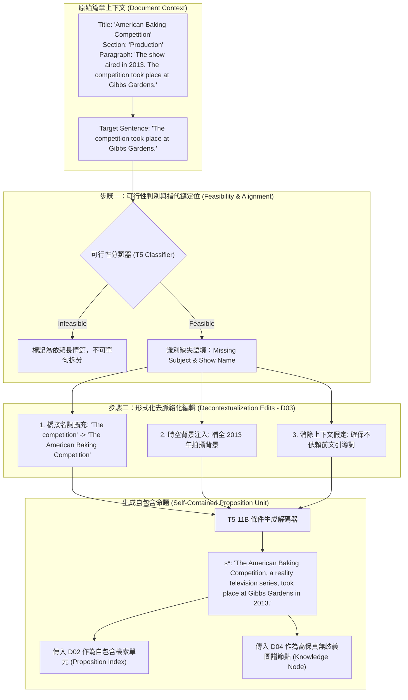

# Decontextualization: Making Sentences Stand-Alone

> [!INFO] 論文元數據 (Metadata)
> - **Paper ID**：`Choi2021_Decontextualization`
> - **作者**：Eunsol Choi, Jennimaria Palomaki, Matthew Lamm, Tom Kwiatkowski, Dipanjan Das, Michael Collins (Google Research, UT Austin)
> - **預印本初次發布年份 (Preprint)**：2021 (arXiv:2102.05169)
> - **正式發表年份 / 會議或期刊 (Venue)**：Transactions of the Association for Computational Linguistics (TACL 2021, Vol 9, Pages 447–461)
> - **DOI**：10.1162/tacl_a_00377
> - **arXiv**：[2102.05169](https://arxiv.org/abs/2102.05169)
> - **驗證狀態**：`verified` (基於原始論文 PDF 全文核實)
> - **本地 PDF 連結**：[[Papers/04 - Knowledge & Graph RAG/(TACL 2021-06) Decontextualization - Making Sentences Stand-Alone.pdf|開啟本地 PDF 檔案]]

---

## 一話摘要 (TL;DR)
**Decontextualization 正式提出並形式化了「句子去脈絡化改寫」任務，定義在不引入外部世界先驗的前提下，將篇章內高度依賴上下文的句子改寫為語意獨立自足（Stand-Alone）的最小命題單元，透過代名詞消解、橋接名詞擴充與時空前題補全，為 `Dense X` 命題抽取器（Propositionizer）與現代 RAG 語意資訊保全奠定了直接的理論與評測基石。**

---

## 研究背景與問題定義 (Problem Statement)

在開放問答、對話系統與文本摘要中，系統經常需要從長篇文件中抽取單一句子作為答案或檢索單元。然而直接截取自然句存在本質缺陷：
1. **懸空指稱與代詞遺失（Dangling Coreference）**：自然語言句子高度依賴前文，包含大量「他」、「此時」、「該事件」等代名詞。脫離段落後，單句語義立即瓦解。
2. **語意前設與條件剝離（Presupposition & Scope Loss）**：句子的真實性往往依賴未明說的時空限制（例如「決賽在倫敦舉行」若脫離上文，無法得知是哪一年的哪項賽事）。
3. **無中生有之幻覺風險（Hallucination in Rewriting）**：若讓模型隨意改寫句子，很容易注入訓練數據中的外部常識，而非原作者在該文檔中的原意。
4. **核心形式化問題**：如何精確定義一種改寫函數，使得改寫後的單句在脫離文檔後依然完全自足（Stand-alone），且在原篇章語境下真值嚴格等價（Truth-conditional Equivalence）？

---

## 核心方法與技術架構 (Methodology & Architecture)

### 1. 去脈絡化改寫的形式化公理 (Definition 1, Page 2)
給定文檔 $D$ 與其中某句 $s \in D$，改寫後的句子 $s^*$ 被定義為 $s$ 的合法去脈絡化（Valid Decontextualization），必須同時滿足三項嚴格約束：
- **語意自足可解讀（Stand-Alone & Interpretable）**：讀者在**完全未閱讀** $D$ 的其餘內容時，依然能精確無歧義地理解 $s^*$ 的語意。
- **真值嚴格等價（Truth-value Preservation）**：在 $D$ 所界定的世界模型與語境下，$s^*$ 的真值與 $s$ 完全一致。
- **資訊無偏私引入（No External Information Injection）**：$s^*$ 不得引入除文檔 $D$ 原文之外的任何新事實或外部常識假設。

### 2. 四大可行性範疇與改寫編輯分類 (Section 3 & 4, Page 3-5)
標註者對篇章中的句子進行審查，並劃分為四種狀態：
1. **FEASIBLE（可去脈絡化）**：佔比最大（約 60%），需要進行針對性編輯。
2. **NO EDIT NEEDED（天然自足）**：句子本身已包含完整主語與時空主謂結構，無需修改。
3. **INFEASIBLE（不可去脈絡化）**：小說敘事、長情節發展、高度口語對話等，脫離全文過長情節後無法壓縮在單句中自足。
4. **PARTIALLY FEASIBLE（部分可行）**。

#### 五大核心編輯操作（Edit Typology, Table 1, Page 4）：
- **代名詞替換（Pronoun Replacement）**：將「he / it」替換為文檔前文已定義的全稱實體（佔比最高，**58%**）。
- **橋接名詞短語擴充（Bridging Noun Phrases）**：將「the competition」擴充為「the American Baking Competition reality series」（佔 **25%**）。
- **時空背景與修飾補全（Background / Temporal Qualifiers）**：補上標題中的所屬年代、地點或作品名稱（佔 **12%**）。
- **從屬子句與前設消除（Clause Modification & Presupposition Elimination）**：移除引導性轉折副詞或修剪懸空前置條件（佔 **5%**）。

### 3. 基於序列到序列架構的自動化改寫模型 (Section 5, Page 6-8)
提出兩階段神經去脈絡化模型：
- **階段一：可行性分類器（Feasibility Classifier）**：判定輸入句子屬於 FEASIBLE 還是 INFEASIBLE。
- **階段二：文字改寫生成器（T5 Decontextualizer）**：輸入拼接 `[Title] [Section] [Paragraph] [Target Sentence]`，端到端生成自足單句 $s^*$。

#### 圖中節點對照 (Node Reference Table)
| 節點代號 | 模組名稱 | 關鍵作用與運算機制 |
| :--- | :--- | :--- |
| `DOC` | 原始文檔與段落 | 提供標題、章節名與前文實體共指鏈的宏觀語境 |
| `S` | 依賴上下文的原句 | 存在懸空代詞或橋接名詞的原始自然語言句子 |
| `CLF` | 可行性判別器 | 區分是否可進行單句自足改寫，防止破壞敘事語意 |
| `E1` ~ `E3` | 結構化編輯運算元 | 實現代詞替換、橋接名詞還原與時空背景補全 |
| `GEN` | 神經改寫解碼器 | 基於 T5-11B 的條件文本生成器 |
| `S_STAR` | 去脈絡化自足命題 | 脫離原文仍真值等價的自足單元（Proposition） |

---

## 主要實驗結果與證據 (Empirical Results & Evidence)

### 1. 資料集規模與標註協議 (Section 4 & Table 3, Page 6)
- 基於維基百科多領域段落構建，涵蓋人物、歷史事件、地理、影視娛樂等多樣篇章。
- 總計人工標註 **6,500 個句子**（Train: 4,000；Dev: 1,000；Test: 1,500）。
- 標註者間一致性 Fleiss' $\kappa = 0.51$，超過 60% 的句子成功完成了自足改寫。

### 2. 編輯操作分佈統計 (Table 1, Page 4)
- **代名詞消解替換（Pronoun Replacement）**：58% 的改寫涉及代名詞替換。
- **名詞短語擴充（Bridging Noun Phrases）**：25% 的改寫需要補充被省略的限定詞或專有名詞全稱。
- **背景與時空補充（Background Information）**：12% 的改寫需要從標題或前文吸取年份與地域修飾。

### 3. 自動化改寫模型表現 (Table 4 & 5, Page 8)
在測試集上對比不同容量的 T5 模型改寫品質（Table 5, Page 8）：
- **T5-Base**：
  - 長度平均增加 8 個詞；
  - 正確改寫率（Correct Decontextualization Accuracy）：**40%**；
  - 易發生過度保守、過度預測 INFEASIBLE。
- **T5-11B (旗艦模型)**：
  - 長度平均增加 13 個詞；
  - 文本流暢度達到 85% 以上；
  - 正確改寫率躍升至 **61%**；
  - 人工盲測偏好評估（Table 6, Page 8）：T5-11B 的改寫結果在 43% 的情況下與人類專家標註打平或更優。

### 4. 問答場景下游用戶偏好實驗 (Section 6, Page 9-10)
作者針對 150 個真實信息尋求問題進行了三組人工用戶對比實驗：
- **去脈絡化單句 vs 原始未改寫單句**：用戶以顯著優勢偏好去脈絡化句子，理由是原始句子缺少主語（代名詞脫落），導致無法獨立作為答案；
- **去脈絡化單句 vs 原始長段落**：用戶偏好自包含單句，因為它大幅縮減了閱讀時間，去除了長段落中與查詢無關的周邊雜訊；
- **結論**：去脈絡化單句在資訊密度與語意自足性之間達到了完美平衡，成為下游問答與 RAG Context 構造的最佳載體。

---

## 優勢、限制及 Trade-offs (Strengths, Limitations & Trade-offs)

### 1. 技術優勢
- **確立了語意單元獨立性的形式化標準**：首次為「什麼是自足單元」提出了語言學與真值條件定義。
- **直接消除代名詞與限定詞脫落**：使提取出來的知識單元在跨段落、跨文檔檢索時免疫懸空代詞歧義。
- **嚴格杜絕模型外生幻覺**：標註協議與模型損失嚴格約束「只能使用源篇章中的資訊」，防止引入預訓練虛假事實。

### 2. 限制與代價 (Limitations & Trade-offs)
- **單句長度膨脹（Token Expansion）**：改寫後句子長度平均增加 20%~40%，略微增加了下游向量化與 Context 消耗。
- **長程論證脈絡無法壓縮於單句**：約 20% 的句子因劇情因果鏈過長被歸為 INFEASIBLE，必須退回到更高層級的段落表示。

---

## 對本專案研究領域的實際意義 (Implications for Research Domains)

1. **`Dense X` Propositionizer 的直接理論源泉**：
   - `Dense X`（EMNLP 2024）在其核心論文第 3 頁明確指出：其命題第三公理（Contextualized and Self-Contained）即是**完全繼承自 Choi et al. (2021) 的 Decontextualization 定義**。
   - 沒有 Decontextualization，就沒有現代自包含 Proposition 的概念。
2. **對 D03 (Knowledge Extraction & Information Preservation) 的核心價值**：
   - D03 的核心難點在於「局部抽取導致的語意失真」。去脈絡化提供了一種強大的**端到端語意保全預處理範式**，在進入向量庫或知識圖譜前先行完成主語全稱還原與條件補全。
3. **對 RAG 問答直接反饋的提升**：
   - 論文的 User Study（Section 6, Page 9-10）證明，在開放領域問答中，向用戶直接呈現 Decontextualized Sentence 的滿意度與可信度顯著超越截取原始自然句或長段落。

---

## 原始來源及相關筆記連結 (Sources & Related Notes)

- **本地文獻**：[[Papers/04 - Knowledge & Graph RAG/(TACL 2021-06) Decontextualization - Making Sentences Stand-Alone.pdf|開啟本地 PDF 檔案]]
- **相關理論專題**：
  - [[02 - 研究領域專題 (Research Domains)/Domain 03 - Knowledge Extraction & Information Preservation|D03 Knowledge Extraction & Consolidation]]
  - [[02 - 研究領域專題 (Research Domains)/Domain 02 - Segmentation & Contextualization|D02 Segmentation & Contextualization]]
- **同系列相關論文**：
  - [[03 - 論文庫 (Literature Notes)/04 - Knowledge & Graph RAG/(EMNLP 2024-11) Dense X - Exploring the Limit of Proposition Retrieval for Open-Domain QA|Dense X]] (命題化檢索單元與 Propositionizer，繼承本工作核心思想)
  - [[03 - 論文庫 (Literature Notes)/06 - Benchmarks & Evaluation/(EMNLP 2023-12) FActScore - Fine-grained Atomic Evaluation of Factual Precision in Long Form Text Generation|FActScore]] (原子事實分解與指代還原)
