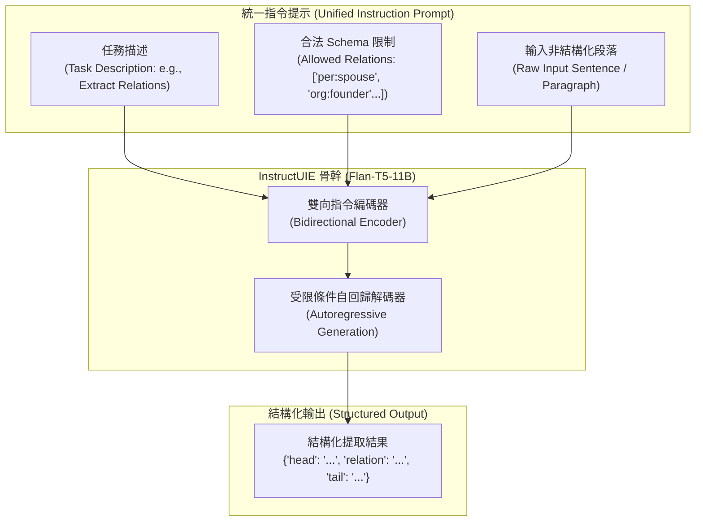

# InstructUIE: Multi-task Instruction Tuning for Unified Information Extraction

## 一話摘要 (TL;DR)
復旦大學與字節跳動提出的 **InstructUIE** 構建了涵蓋 32 個經典 IE 資料集的統一指令微調基準 **IE INSTRUCTIONS**，基於 Flan-T5 進行端到端多任務指令微調，在 20 個 NER 資料集（平均 F1 達 85.19%）、8 個關係抽取資料集（平均 Strict F1 達 67.98%）及事件抽取任務上全面超越先前架構導向的 UIE 與 USM，並在零樣本跨領域抽取中超越 ChatGPT 逾 16 個百分點。

---

## 研究背景與問題定義 (Problem Statement)

1. **傳統專用 IE 模型（Task-specific Architectures）的孤島效應**：
   - 命名實體辨識（NER）、關係抽取（RE）與事件抽取（EE）在傳統自然語言處理中各自由專用模型與特定標籤體系主導；先前 UIE 嘗試以 Structural Schema Instructor（SSI）統一結構生成，但對特定標註依賴較深，架構較為僵硬。
2. **通訊模型與通用大語言模型（如 ChatGPT）在 IE 任務上的結構性弱點**：
   - 通用自回歸 LLM 在閱讀自然語言指令時表現出色，但在面對高精確度資訊抽取時，常出現幻覺實體、標註偏移（Span Offset Mismatch）、無法嚴格遵守封閉 Schema 等嚴重缺陷。
3. **研究核心假設**：
   - 透過多任務自然語言指令（Instruction Tuning）將實體、關係與事件抽取標準化為「輸入文本 + 自然語言指令 $\to$ 結構化 JSON / 字串」，能利用跨任務正向遷移顯著提升模型的域內與零樣本抽取表現。

---

## 核心方法與技術架構 (Methodology & Architecture)

InstructUIE 的核心在於高品質指令資料集建構與端到端生成式微調：

### 1. IE INSTRUCTIONS 基準構建
- 整合 32 個公開 IE 資料集（跨新聞、生醫、社群、百科等異質語料）；
- 將三大任務族（NER, RE, EE）轉化為標準化指令模板，每個樣本包含三要素：
  1. **Task Description（任務描述）**：定義當前抽取目標（如辨識人名、地名或因果關係）；
  2. **Schema Options（可選標籤池）**：顯式列出允許抽取的合法類別列表；
  3. **Input Text & Output Format（文本與結構化輸出）**：要求模型以鍵值對或自然三元組格式輸出。

### 圖中節點對照
- `TASK`, `SCHEMA`, `TEXT`：統一輸入提示的關鍵模組，嚴格限制模型輸出空間。
- `ENC`, `DEC`：Flan-T5 序列到序列架構。
- `JSON_OUT`：無幻覺的端到端抽取實體/關係對象。

---

## 主要實驗結果與證據 (Empirical Results & Evidence)

論文使用 Flan-T5-11B 進行訓練，並與 BERT-base、UIE (Lu et al., 2022) 以及 USM (Lou et al., 2023) 進行全方位對比（第 4–7 頁）：

1. **命名實體辨識（NER, Table 1, Page 4）**：
   - 在 20 個 NER 資料集評估中：
   - BERT-base 平均 Entity F1 為 **80.09%**；
   - **InstructUIE 平均 Entity F1 達到 85.19%**（在 17 個資料集上顯著勝過 BERT-base，CoNLL03 達到 92.94%）。
2. **關係抽取（RE, Table 2, Page 5）**：
   - 在 8 個 RE 資料集上評估 Relation Strict F1：
   - **InstructUIE 平均 Strict F1 達到 67.98%**；
   - 在 CoNLL04 上達到 75.32%，全面領先專門微調的 UIE 與 USM。
3. **事件抽取（EE, Table 3, Page 5）**：
   - 在事件觸發詞辨識（Event Trigger F1）上：InstructUIE 平均達到 **71.69%**；
   - 在事件論元抽取（Event Argument F1）上：InstructUIE 平均達到 **66.46%**；
   - 在 ACE05 上，論元 F1 比先前最強基線 UIE 提升逾 15 個百分點。
4. **零樣本跨領域泛化（Zero-Shot IE, Table 4, 5, 6, Page 6–7）**：
   - 在 7 個未見過之 NER 資料集上（Table 4）：InstructUIE 平均 Micro-F1 為 **49.30%**，顯著高於 USM（44.09%）；
   - 在相同未見過資料集上與通用 LLM 評測（Table 6）：ChatGPT（gpt-3.5-turbo）平均零樣本 F1 僅為 **32.79%**，InstructUIE **高出 16.5 個百分點**。

---

## 優勢、限制及 Trade-offs (Strengths, Limitations & Trade-offs)

### 優勢
1. **多任務正向遷移**：在一個模型中統一 NER、RE 與 EE，無需為每個子任務維護專屬分類頭。
2. **零樣本 Schema 適應力強**：只需在 Prompt 中更換 Schema 標籤名稱，模型即可快速適應全新領域。
3. **完全開源**：模型權重（11B 與 base 版本）及 IE INSTRUCTIONS 資料集全數開放。

### 限制與 Trade-offs
1. **長文本推理成本**：基於 Flan-T5 架構，輸入超過 1024 Tokens 時計算開銷急劇增加，處理跨段落篇章級抽取（Document-level IE）時需要切塊。
2. **字串幻覺邊界**：雖然遠比純 ChatGPT 穩定，但在少數長尾罕見類別下，自回歸解碼偶爾會生成與原始輸入略有出入的拼寫字符。

---

## 對本專案研究領域的實際意義 (Implications for Research Domains)

1. **對 D03 Knowledge Extraction & Information Preservation 的支撐**：
   - InstructUIE 證明了通用指令微調在抽取任務中的威力；本專案提議的 F/R/D/A/P/C/T 七類操作語意標籤，可直接採用其指令模板結構進行 Zero-shot 或 Few-shot 冷啟動抽取。
2. **對 D02（Segmentation & Contextualization）的支撐**：
   - 提供了一種不依賴大型專有 API（如 GPT-4）的高效私有化知識抽取方案。

---

## 原始來源及相關筆記連結 (Sources & Related Notes)

- **本地 PDF**：`[[Papers/04 - Knowledge & Graph RAG/(arXiv 2023-04) InstructUIE - Multi-task Instruction Tuning for Unified Information Extraction.pdf|開啟本地 PDF 檔案]]`
- **官方開源庫**：[GitHub BeyonderXX/InstructUIE](https://github.com/BeyonderXX/InstructUIE) · [arXiv:2304.08085](https://arxiv.org/abs/2304.08085)
- **關聯領域筆記**：
  - [[02 - 研究領域專題 (Research Domains)/Domain 03 - Knowledge Extraction & Information Preservation|D03 Knowledge Extraction & Information Preservation]]
  - [[02 - 研究領域專題 (Research Domains)/Domain 02 - Segmentation & Contextualization|D02 Segmentation & Contextualization]]
- **同類/相關論文筆記**：
  - [[03 - 論文庫 (Literature Notes)/04 - Knowledge & Graph RAG/(ACL 2022-05) Unified Structure Generation for Universal Information Extraction|(ACL 2022-05) UIE]]
  - [[03 - 論文庫 (Literature Notes)/04 - Knowledge & Graph RAG/(EMNLP 2020-11) OpenIE6 - Iterative Grid Labeling and Coordination Analysis for Open Information Extraction|(EMNLP 2020-11) OpenIE6]]
  - [[03 - 論文庫 (Literature Notes)/04 - Knowledge & Graph RAG/(NAACL 2022-07) GenIE - Generative Information Extraction|(NAACL 2022-07) GenIE]]
