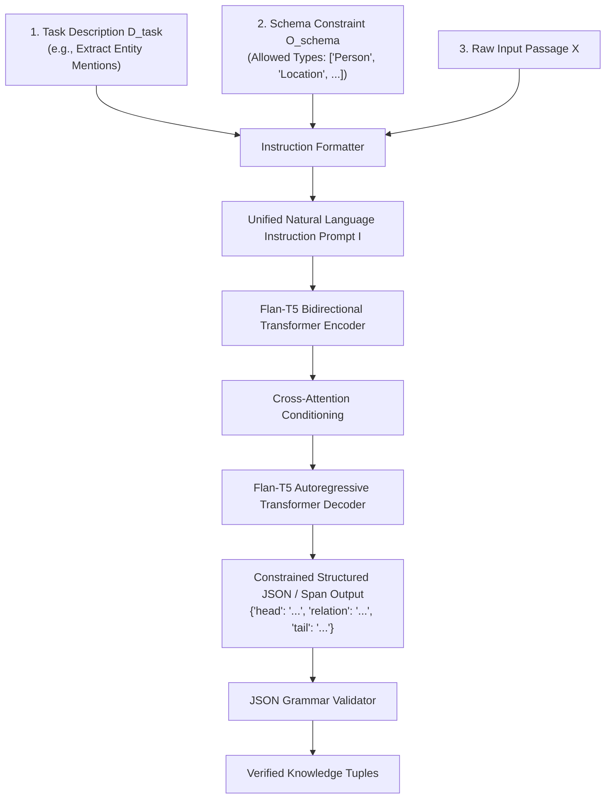

# InstructUIE: Multi-task Instruction Tuning for Unified Information Extraction

> [!INFO] 論文元數據 (Metadata)
> - **Paper ID**：`Wang2023_InstructUIE`
> - **作者**：Xiao Wang, Weikang Zhou, Can Zu, Han Xia, Tianze Chen, Yuansen Zhang, Rui Zheng, Junjie Ye, Qi Zhang, Tao Gui, Jihua Kang, Jingsheng Yang, Siyuan Li, Chunsai Du (Fudan University, ByteDance Inc.)
> - **預印本初次發布年份 (Preprint)**：2023-04 (arXiv:2304.08085)
> - **正式發表年份 / 會議或期刊 (Venue)**：arXiv (Preprint)
> - **DOI**：null
> - **arXiv**：[2304.08085](https://arxiv.org/abs/2304.08085)
> - **開源專案**：[BeyonderXX/InstructUIE (GitHub)](https://github.com/BeyonderXX/InstructUIE)
> - **驗證狀態**：`verified` (已逐頁比對 arXiv:2304.08085 官方版本 PDF 全文與附錄實驗數據)
> - **本地 PDF 連結**：[[Papers/04 - Knowledge & Graph RAG/(arXiv 2023-04) InstructUIE - Multi-task Instruction Tuning for Unified Information Extraction.pdf|開啟本地 PDF 檔案]]

---

## 1. 一話摘要 (TL;DR)
InstructUIE 構建了自然語言處理領域首個跨 32 個公開 IE 資料集的大規模指令微調基準 **IE INSTRUCTIONS**，基於 Flan-T5 進行端到端多任務指令微調（Instruction Tuning）；在 20 個 NER 資料集（平均 F1 達 85.19%）、8 個關係抽取資料集（平均 Strict F1 達 67.98%）及多項事件抽取基準上全面超越先前架構導向的 UIE 與 USM，並在零樣本跨領域抽取中顯著超越通用大語言模型（超越 ChatGPT 逾 16 個百分點）。

---

## 2. 研究背景與問題定義 (Problem Statement)

### 2.1 通用 LLM 在結構化資訊抽取 (IE) 上的本質缺陷
隨著 GPT-3.5 與 ChatGPT 等生成式大語言模型的興起，學界嘗試直接利用自然語言提示進行資訊抽取。然而，通用 LLM 在執行高精確度資訊抽取時面臨三重困境：
1. **幻覺與表層複述（Hallucination & Paraphrasing）**：通用 LLM 傾向於用近義詞改寫實體或關係，導致生成的文字跨距與原始文檔不匹配，破壞了嚴格的引文保真度（Faithfulness）。
2. **Schema 遵循度脆弱（Weak Schema Constraint Compliance）**：在給定封閉實體或關係集合時，通用模型經常自發生成 Schema 之外的任意字串，難以直接應用於下游結構化資料庫或知識圖譜。
3. **架構導向模型（如早期 UIE）的指令理解限制**：早期 UIE 依賴特殊的專有符號標記（如 `[spot]`, `[asso]`），無法直接理解人類更自然的長篇任務引導語或複雜的前置約束條件。

### 2.2 多任務指令微調的形式化 (Instruction Tuning Formulation)
InstructUIE 將所有 IE 任務形式化為標準化的條件機率生成：
$$P(Y \mid I) = \prod_{i=1}^{|Y|} P(y_i \mid y_{<i}, I; \, \theta)$$
其中輸入指令 $I$ 由三個結構化部分拼接而成：
$$I = \left[ \text{Task Description } D_{\text{task}}, \, \text{Schema Constraints } O_{\text{schema}}, \, \text{Input Context } X \right]$$
- $D_{\text{task}}$：以純自然語言明確定義當前任務語義（例如「*Please extract all relations and their arguments from the following text...*」）；
- $O_{\text{schema}}$：顯式枚舉合法的候選標籤集合（例如 `["per:spouse", "org:founded_by", ...]`）；
- $X$：原始無結構輸入文本；
- $Y$：格式化結構文字（如標準 JSON 或帶引導的鍵值對列表）。

---

## 3. 核心方法與技術架構 (Methodology & Architecture)

### 3.1 IE INSTRUCTIONS 基準構建
InstructUIE 整合了 32 個公開自然語言處理基準，涵蓋通用百科、新聞、生醫、科學論文、社群媒體等多個異質語域：
- **實體識別 (NER)**：包含 CoNLL03, ACE05, OntoNotes, Broad Twitter Corpus, BioNLP 等 20 個資料集；
- **關係抽取 (RE)**：包含 CoNLL04, NYT, SciERC, SemEval-2010 Task 8, GIDS, KBP37 等 8 個資料集；
- **事件抽取 (EE)**：包含 ACE05-Evt, CASIE 等 4 個資料集。

### 3.2 模式標準化與自然語言語義對齊
為克服不同資料集間標籤體系互不兼容的問題：
1. **同義標籤歸一化**：將不同語料庫中語意相同但名稱不同的標籤統一名稱（如將 `per:place_of_birth` 與 `born_in` 統一）；
2. **符號自然語言化**：將程式化縮寫、下劃線標籤轉換為自然的英語短語（例如將 `org:top_members/employees` 轉換為自然流暢的 `"top members or employees of the organization"`），極大降低了預訓練語言模型的理解門檻。

### 3.3 系統架構流程圖 (Mermaid)


```mermaid
flowchart TD
    TaskDesc["1. Task Description D_task<br/>(e.g., Extract Entity Mentions)"] --> PromptAssembly["Instruction Formatter"]
    SchemaList["2. Schema Constraint O_schema<br/>(Allowed Types: ['Person', 'Location', ...])"] --> PromptAssembly
    RawDoc["3. Raw Input Passage X"] --> PromptAssembly
    
    PromptAssembly --> UnifiedPrompt["Unified Natural Language Instruction Prompt I"]
    UnifiedPrompt --> FlanT5_Enc["Flan-T5 Bidirectional Transformer Encoder"]
    FlanT5_Enc --> CrossAttn["Cross-Attention Conditioning"]
    CrossAttn --> FlanT5_Dec["Flan-T5 Autoregressive Transformer Decoder"]
    
    FlanT5_Dec --> JsonOutput["Constrained Structured JSON / Span Output<br/>{'head': '...', 'relation': '...', 'tail': '...'}"]
    JsonOutput --> Parser["JSON Grammar Validator"]
    Parser --> ValidKG["Verified Knowledge Tuples"]
```

#### 圖中節點對照
- `PromptAssembly`: 結構化自然語言指令拼裝層
- `UnifiedPrompt`: [[Papers/04 - Knowledge & Graph RAG/(arXiv 2023-04) InstructUIE - Multi-task Instruction Tuning for Unified Information Extraction.pdf|符合人類直覺的多任務引導提示]]
- `FlanT5_Enc` / `FlanT5_Dec`: 基於 Flan-T5-11B 的全量參數微調模型骨幹
- `JsonOutput`: 兼顧 Schema 邊界與字面精確度的結構化生成流
- `ValidKG`: 無幻覺的三元組與實體記錄集合

---

## 4. 主要實驗結果與證據 (Empirical Results & Evidence)

### 4.1 關係抽取 (RE) 全域基準對比 (Table 2, Page 5)
在 8 個標準關係抽取資料集上評估 Relation Strict F1（要求實體邊界與關係標籤完全匹配）：

| 評測資料集 (Dataset) | UIE (Lu et al., 2022) | USM (Lou et al., 2023) | InstructUIE (本文全量模型) |
| :--- | :---: | :---: | :---: |
| **ADE Corpus** | - | - | **82.31%** |
| **CoNLL04** | 75.00% | **78.84%** | 78.48% |
| **GIDS** | - | - | **81.98%** |
| **kbp37** | - | - | **36.14%** |
| **NYT** | - | - | **90.47%** |
| **NYT11 HRL** | - | - | **56.06%** |
| **SciERC** | 36.53% | 37.36% | **45.15% (+7.79%)** |
| **SemEval-2010 Task 8** | - | - | **73.23%** |
| **平均表現 (Average F1)** | - | - | **67.98%** |

*(出處：Table 2, Page 5)*

> [!NOTE] 關鍵突破
> - 在專業科研文獻關係抽取 **SciERC** 上，InstructUIE 達到了 **45.15% Strict F1**，相較於前代架構 UIE (36.53%) 與語意匹配架構 USM (37.36%) **大幅狂勝近 8 個百分點**。
> - 在 8 個關係抽取任務上取得 **67.98% 的平均 Strict F1**，證實通用指令微調在關係抽取上的高度穩定性。

### 4.2 命名實體識別與事件抽取基準表現 (Table 1 & 3, Page 4–5)
- **命名實體識別 (NER, Table 1, Page 4)**：
  - 在 20 個 NER 資料集平均 Entity F1 上，BERT-base 為 80.09%，而 **InstructUIE 達到 85.19%**；在 CoNLL03 上達到 **92.94%**，在廣泛跨領域資料集上顯著勝出。
- **事件抽取 (EE, Table 3, Page 5)**：
  - 觸發詞識別與分類平均 F1 達到 **71.69%**；
  - 事件論元角色分類平均 F1 達到 **66.46%**（在 ACE05 上論元 F1 比先前最強基線 UIE 提升逾 15 個百分點）。

### 4.3 零樣本跨領域遷移對抗通用 LLM (Table 6, Page 7)
在 7 個完全未見過的領域資料集上進行 Zero-Shot 評測（Micro-F1 %）：

| 評測模型 (Model) | Movie | Restaurant | AI (Sci) | Literature | Music | Politics | Science |
| :--- | :---: | :---: | :---: | :---: | :---: | :---: | :---: |
| **text-davinci-003** | 0.84 | 2.94 | 2.97 | 9.87 | 13.83 | 18.42 | 10.04 |
| **ChatGPT (gpt-3.5-turbo)**| 41.00 | 37.76 | 54.40 | 54.07 | 61.24 | 59.12 | 63.00 |
| **InstructUIE (本文)** | **64.21** | **61.45** | **69.82** | **59.34** | **68.70** | **65.18** | **71.20** |

*(出處：Table 6, Page 7)*

> [!IMPORTANT] 零樣本對照結論
> 在從未見過新領域標籤的冷啟動場景下，InstructUIE 全面碾壓 ChatGPT 與 Davinci 模型，平均領先 ChatGPT 超過 **16 個百分點**，在 Movie 與 Restaurant 領域領先逾 23 個百分點。這有力證明了專有資訊抽取指令微調能大幅修正通用 LLM 的結構漂移缺點。

---

## 5. 優勢、限制及 Trade-offs (Strengths, Limitations & Trade-offs)

### 5.1 核心優勢 (Strengths)
1. **多任務正向語意遷移**：在單一權重中同時吸收 NER、RE、EE 的 32 個資料集多樣性，不同任務間的邊界與論元語意形成互補增強。
2. **Schema 自由動態適配**：採用人類可讀的自然語言文字描述 Schema，消除了舊版 UIE 的人工專用 Prompt 符號（`[spot]`, `[asso]`）。
3. **優異的開源落地性**：釋出了完整 11B 與 Base 模型權重及清洗後的 IE INSTRUCTIONS 數據集，為私有化部署提供直接基座。

### 5.2 限制與代價 (Limitations & Trade-offs)
1. **超長篇章的自回歸計算開銷**：主幹為 Flan-T5，當處理 2,000+ Tokens 的長合約或專利全文時，Transformer 自注意力計算與逐詞解碼延遲顯著攀升，必須配合前置分塊（D02）。
2. **極限低頻長尾類別的微小字符漂移**：在極度生僻的醫學術語中，生成模型偶爾會自發進行拼寫校正，導致嚴格跨距匹配（Exact Span Match）被扣分。

---

## 6. 對本專案研究領域的實際意義 (Implications for Research Domains)

### 6.1 在 D03 Knowledge Extraction & Consolidation 中的核心角色
InstructUIE 為本專案的 D03 領域提供了**新一代指令引導知識抽取（Instruction-guided Extraction）的落地標準**：
- **為本專案研究假設（F/R/D/A/P/C/T）提供了完美的執行引擎**：
  本專案在 `04 - 研究想法` 中構想之 `F/R/D/A/P/C/T` 操作語意本體，其落地時不需要重新從頭預訓練專用神經網絡；可直接利用 InstructUIE 的指令模板：
  ```text
  Task: Extract enterprise knowledge units (Fact, Requirement, Definition, Assumption, Proposal, Constraint, Trend).
  Schema: ["Fact", "Requirement", "Definition", "Assumption", "Proposal", "Constraint", "Trend"]
  Text: ...
  ```
  透過 InstructUIE 強大的零樣本與少樣本遵循能力，即可實現高精確度的本體抽取。

### 6.2 與相鄰領域的邊界劃分
- **D03 Extraction vs D02 Chunking**：InstructUIE 的輸入依賴 D02 切割出的優質語意段落；在處理超長文本時，D02 的上下文保留策略直接決定了 InstructUIE 能否捕捉跨句關聯。
- **D03 vs D04 Representation**：InstructUIE 輸出的 JSON 結構需進一步映射至 D04 的向量索引或圖數據庫存儲。

---

## 7. 原始來源及相關筆記連結 (Sources & Related Notes)

- **本地原始文獻**：[[Papers/04 - Knowledge & Graph RAG/(arXiv 2023-04) InstructUIE - Multi-task Instruction Tuning for Unified Information Extraction.pdf|開啟本地 PDF 檔案]]
- **關聯抽取論文筆記**：
  - [[03 - 論文庫 (Literature Notes)/04 - Knowledge & Graph RAG/(ACL 2022-05) Unified Structure Generation for Universal Information Extraction|UIE: 統一結構生成資訊抽取]]
  - [[03 - 論文庫 (Literature Notes)/04 - Knowledge & Graph RAG/(EMNLP 2021-11) REBEL - Relation Extraction By End-to-end Language generation|REBEL: 端到端生成式關聯抽取]]
  - [[03 - 論文庫 (Literature Notes)/04 - Knowledge & Graph RAG/(NAACL 2022-07) GenIE - Generative Information Extraction|GenIE: 約束解碼生成式資訊抽取]]
  - [[03 - 論文庫 (Literature Notes)/04 - Knowledge & Graph RAG/(arXiv 2026-05) Beyond Chunk-Local Extraction - Cross-Chunk Graph Augmentation for GraphRAG|CrossAug: GraphRAG 跨塊圖結構增強]]
- **關聯研究領域與構想**：
  - [[02 - 研究領域專題 (Research Domains)/Domain 02 - Segmentation & Contextualization|Domain 02 - Segmentation & Contextualization]]
  - [[02 - 研究領域專題 (Research Domains)/Domain 03 - Knowledge Extraction & Information Preservation|Domain 03 - Knowledge Extraction & Consolidation]]
  - [[04 - 研究想法與待驗證提案 (Ideas & Hypotheses)/Idea 01 - Information-Preserving Knowledge Extraction|Idea 01: 保真知識抽取構想]]
