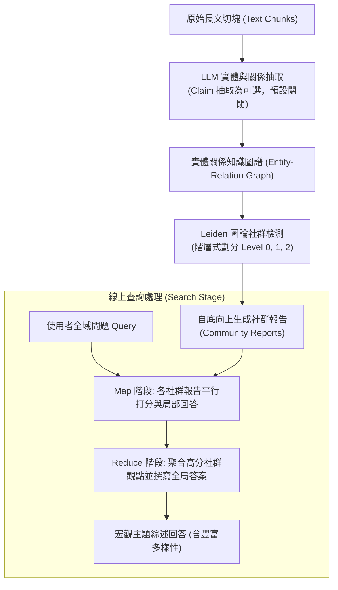

# From Local to Global: A Graph RAG Approach to Query-Focused Summarization

> [!INFO] 論文元數據 (Metadata)
> - **Paper ID**：`Edge2024_GraphRAG`
> - **作者**：Darren Edge, Ha Trinh, Newman Cheng, Joshua Bradley, Alex Chao, Apurva Mody, Steven Truitt, Jonathan Larson
> - **預印本初次發布年份 (Preprint)**：2024
> - **正式發表年份 / 會議或期刊 (Venue)**：2024 (Microsoft Research / arXiv)
> - **DOI**：無
> - **arXiv**：[2404.16130](https://arxiv.org/abs/2404.16130)
> - **驗證狀態**：`verified` (已比對原始文獻與 PDF 全文)
> - **本地 PDF 連結**：[[Papers/04 - Knowledge & Graph RAG/(arXiv 2024-04) From Local to Global - A Graph RAG Approach to Query-Focused Summarization.pdf|開啟本地 PDF 檔案]]
---

## 一話摘要 (TL;DR)
**微軟提出的 GraphRAG 框架，透過實體抽取、圖社群檢測（Leiden）與分層摘要，解決整體性宏觀問題（Global Sensemaking）。**

---

## 研究背景與問題定義 (Problem Statement)
標準 Vector RAG 面臨『局部事實檢索強，全域宏觀理解弱』的致命缺陷。對於『整份文件集討論的核心主題是什麼？』等全域性問題，Top-K 向量檢索完全失效。

---

## 核心方法與技術架構 (Methodology & Architecture)
Microsoft GraphRAG 專注於解決全域性宏觀問答（Query-Focused Summarization, QFS），核心架構包含四階段離線建圖與雙重在線搜尋：
1. **實體與關係抽取（Source Documents to Graph）**：
   - 將長文本切塊（Text Chunks）；
   - 呼叫 LLM 多輪抽取實體（Entities，含名稱、類型、描述）與關係（Relationships，含來源、目標、描述、強度權重）；
   - **Claim / Covariate Extraction 為官方實作中之可選功能（預設關閉）**，非所有標準索引流水線之必要步驟。
2. **圖社群劃分（Hierarchical Community Detection）**：
   - 構建實體-關係知識圖譜；
   - 採用圖論之 **Leiden 演算法** 將圖劃分為多層次階層社群（Level 0 宏觀到 Level 2/3 微觀細部）。
3. **社群報告抽象摘要（Community Summaries）**：
   - 自底向上由 LLM 為各層級的每一個社群撰寫結構化摘要報告（Community Reports），包含核心結論、關鍵實體、衝突觀點與事實引用。
4. **搜尋檢索模式（Search Modes）**：
   - **Global Search（Map-Reduce）**：將全域巨觀問題平行廣播至選定層級的所有社群摘要（Map），由 LLM 評估重要性打分並生成中間回應，最後彙整提煉出全域答案（Reduce）；
   - **Local Search**：以查詢中的實體為起點，抽取相鄰子圖、關聯實體、關係及原始 Text Chunks，適用於微觀實體推理；
   - **DRIFT Search**：結合全局社群摘要與局部圖路徑遍歷，由粗到細進行自適應擴展。

---

## 主要實驗結果與證據 (Empirical Results & Evidence)
> [!NOTE] 關鍵實證數據與評估條件
> **出處與評估條件**：Table 1 (Page 7): 在百萬字 Podcast 與新聞全域問題中，GraphRAG 社群摘要在全局理解完備度 (Comprehensiveness) 與多樣性 (Diversity) 上以 70%+ 的勝率壓倒傳統 Vector RAG；但在具體微觀事實定位與精確數字問答中，GraphRAG 的優勢相對較小，且單純使用 Global Search 可能引入高階抽象帶來的細節遺失。

---

## 優勢、限制及 Trade-offs (Strengths, Limitations & Trade-offs)
- **優勢**：全局主題理解、宏觀趨勢感知與跨實體網絡歸納能力顯著優於傳統點查詢向量檢索。
- **限制**：建索引階段需發起大量 LLM API 呼叫，索引建置成本與 Token 消耗通常為傳統向量嵌入的數十倍至百倍；知識庫即時增量更新困難（社群劃分與報告需重新聚類重寫）。

---

## 在長文件處理任務中的角色與啟發 (Implications for Long-Doc Processing)
2024 年長文知識庫領域最具震撼力的突破之一，確立了『圖社群階層摘要處理 Global Sensemaking』的工業範式；實務上應與階層摘要、長上下文直接閱讀及其他圖 RAG 進行同預算公平對比。

---

## 原始來源及相關筆記連結 (Sources & Related Notes)
- **所屬研究領域**：
  - [[02 - 研究領域專題 (Research Domains)/Domain 05 - Graph RAG 與結構化知識 (Microsoft GraphRAG, HippoRAG)|Domain 05 - Graph RAG 與結構化知識 (Microsoft GraphRAG, HippoRAG)]]
  - [[02 - 研究領域專題 (Research Domains)/Domain 07 - 分層推理與樹狀檢索 (RAPTOR, Hierarchical QA)|Domain 07 - 分層推理與樹狀檢索 (RAPTOR, Hierarchical QA)]]
- **回主目錄**：[[00 - 導覽與心智圖 (Navigation & MOC)/Home (主目錄與知識庫導覽)|主目錄與知識庫導覽]]
- **全景心智圖**：[[00 - 導覽與心智圖 (Navigation & MOC)/LLM 超長文件處理心智圖 (MOC)|超長文件處理研究方向心智圖]]
