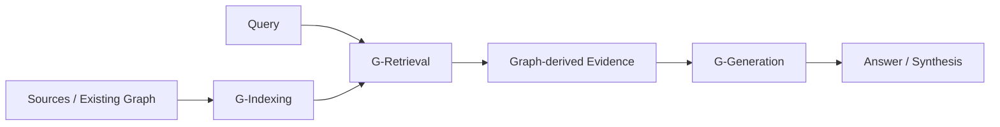

# Graph Retrieval-Augmented Generation: A Survey

## 一話摘要

這篇 survey 用 **G-Indexing → G-Retrieval → G-Generation** 組織 GraphRAG。它是 taxonomy / literature map，不是一個單一 GraphRAG algorithm，也不是 controlled meta-analysis。

## Survey Taxonomy

### G-Indexing
如何建構或接入 graph knowledge、選擇 graph representation / indexing。

### G-Retrieval
如何根據 query 從 graph 找 evidence；包含 node、path、subgraph 等不同 retrieval granularity / strategies。

### G-Generation
如何把 graph-derived evidence 提供給 generator，例如 verbalization / linearization、graph-aware context integration 等。

## Benchmark / Evaluation Coverage

Survey 的 Table 1 主要整理不同 papers 使用的 tasks、benchmarks、methods、metrics，例如：

- QA / KBQA / commonsense QA
- entity linking / relation extraction
- fact verification
- link prediction
- dialogue / recommendation
- Accuracy / EM / Recall / F1 / MRR / Hits@K / NDCG 等

> [!IMPORTANT]
> 它不是「相同 benchmark + 相同 retriever + 相同 generator」的 apples-to-apples meta-analysis。因此 survey 本身不能支持「GraphRAG 一般提升 15–30% recall」「hallucination 降低 >20%」「勝率 >70%」這種統一效果量。數字必須回到各 primary paper 的特定設定引用。

## 這篇 Survey 可以支持什麼

- GraphRAG 已形成可辨識研究方向。
- G-Indexing / G-Retrieval / G-Generation 是合理分析軸。
- GraphRAG 橫跨 representation、retrieval、generation，而不是一個單點取代 vector RAG 的方法。

不能直接支持：
- 所有 GraphRAG 都優於 vector RAG；
- 固定比例的 hallucination reduction；
- 統一 latency / cost 優勢；
- 所有系統都採 Leiden、PPR、GNN 或 graph DB + vector DB 的同一 pipeline。

## 對本 repo taxonomy 的意義

這篇 survey 反而支持「GraphRAG 用 Paradigm Tag，而不是額外 top-level Domain」：

- D03：text → graph knowledge
- D04：graph representation / indexing
- D05：graph-guided retrieval
- D09：graph-enhanced generation

## Open Problems

典型問題包括：
- graph construction / extraction quality
- graph noise / error propagation
- scalability
- retrieval granularity
- heterogeneous / multimodal graphs
- fragmented evaluation

## Sources

- ACM TOIS 44(2), Article 35 (2026): https://doi.org/10.1145/3777378
- arXiv: https://arxiv.org/abs/2408.08921
- [[Papers/04 - Knowledge & Graph RAG/(arXiv 2024-08) Graph Retrieval-Augmented Generation - A Survey.pdf|Local PDF]]
- [[02 - 研究領域專題 (Research Domains)/Domain 04 - Knowledge Representation & Indexing|D04]]
