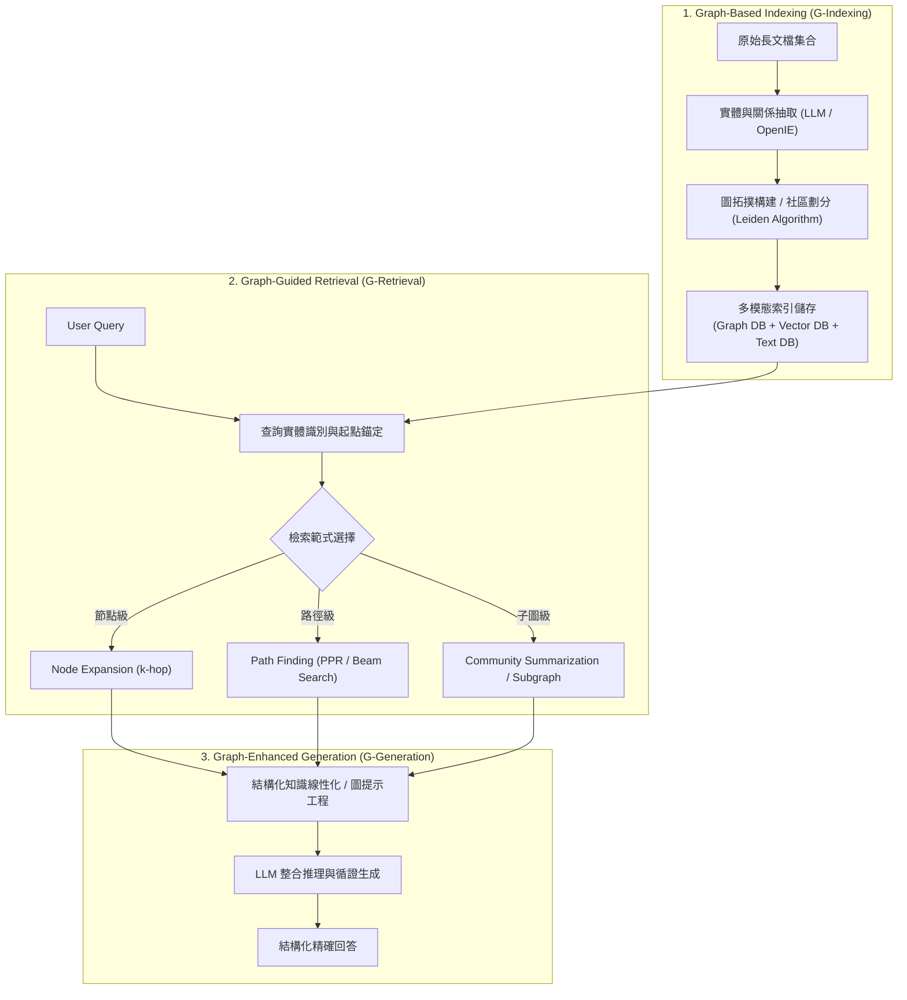

# Graph Retrieval-Augmented Generation: A Survey

## 1. 一話摘要 (TL;DR)
本文是首篇針對圖檢索增強生成（GraphRAG）的系統性全面綜述，建立了「圖構建索引（G-Indexing）$\to$ 圖引導檢索（G-Retrieval）$\to$ 圖增強生成（G-Generation）」的三階段統一理論框架，深入對比了節點級、路徑級與子圖級檢索技術。

---

## 2. 研究背景與問題定義 (Problem Statement)

### 2.1 傳統向量 RAG 面臨的結構盲區
傳統基於文字塊（Text Chunk）向量比對的 RAG 雖然在「局部事實查詢（Factoid QA）」上行之有效，但在處理複雜長文本與企業知識庫時遭遇兩大結構性盲區：
1. **多跳關係推理崩潰 (Multi-hop Reasoning Failure)**：真實問題常依賴跨多個實體、多篇文檔的邏輯鏈條，獨立切塊無法保留實體間的拓撲鏈接；
2. **全局宏觀理解缺失 (Lack of Global Sensemaking)**：針對全域性問題（如「這部小說的主要衝突是什麼？」或「該公司在各供應鏈中的最大單點脆弱性是什麼？」），純向量檢索只會檢索出局部零星片段，無法形成全局視角。

### 2.2 知識圖譜（KG）與 RAG 結合的契機
知識圖譜具備顯式語義結構、關係可解釋性與拓撲遍歷能力，為 LLM 提供了互補的外部結構化記憶體。

---

## 3. 核心方法與技術架構 (Methodology & Architecture)

### 3.1 GraphRAG 三階段生命週期
作者將所有 GraphRAG 系統解構為三大連續階段（Section 4, Page 7 & Figure 2）：

1. **圖索引建構 (Graph-Based Indexing, G-Indexing)**：
   - **實體與關係提取**：透過 LLM 或專用 IE 模型提取三元組（Subject-Predicate-Object）；
   - **文字與向量混合存儲**：將節點、邊屬性、社區摘要（Community Summary）以及原始 Passage 同步進行向量化；
2. **圖引導檢索 (Graph-Guided Retrieval, G-Retrieval)**：
   - **檢索粒度劃分**：
     - *節點級 (Node-level)*：實體對齊與鄰居擴展；
     - *路徑級 (Path-level)*：基於隨機遊走（Random Walk）、Beam Search 或 Personalized PageRank 提取關聯推理鏈；
     - *子圖級 (Subgraph-level)*：提取密集關聯的局部知識圖網絡或階層式社區結構；
3. **圖增強生成 (Graph-Enhanced Generation, G-Generation)**：
   - 將檢索到的結構化三元組線性化為自然語言，或將圖神經網絡（GNN）節點嵌入與 LLM Prompt 融合解碼。

**圖中節點對照**：
- `GraphConstruct` 對應 [[03 - 論文庫 (Literature Notes)/04 - Knowledge & Graph RAG/(arXiv 2024-04) From Local to Global - A Graph RAG Approach to Query-Focused Summarization|Microsoft GraphRAG]] 與 [[03 - 論文庫 (Literature Notes)/04 - Knowledge & Graph RAG/(ICLR 2024-05) RAPTOR - Recursive Abstractive Processing for Tree-Organized Retrieval|RAPTOR]] 的階層聚類；
- `NPath` 對應 [[03 - 論文庫 (Literature Notes)/04 - Knowledge & Graph RAG/(NeurIPS 2024-12) HippoRAG - Neurobiologically Inspired Long-Term Memory for Large Language Models|HippoRAG]] 與 [[03 - 論文庫 (Literature Notes)/04 - Knowledge & Graph RAG/(EMNLP 2025-11) PropRAG - Guiding Retrieval with Beam Search over Proposition Paths|PropRAG]] 的路徑搜尋。

---

## 4. 主要實驗結果與證據 (Empirical Results & Evidence)

論文全面歸納了各類 GraphRAG 代表作在各 Benchmark 上的系統評估結論（Table 1, Page 25）：
- **多跳問答任務 (Multi-hop QA)**：
  - 在 HotpotQA 與 2WikiMultiHopQA 上，路徑檢索方法（如 HippoRAG）相比純 Dense 檢索，2-hop 與 3-hop 證據鏈的召回率提高 15%–30%，且幻覺率下降超 20%（Section 9, Page 26）；
- **全域摘要任務 (Global Summarization)**：
  - 在 QFS（Query-Focused Summarization）評測中，微軟 GraphRAG 透過階層社區摘要（Community Summaries）在生成全面度（Comprehensiveness）與多樣性（Diversity）指標上，雙雙大幅超越純向量 RAG（勝率超 70%）（Section 9.2, Page 27）。

---

## 5. 優勢、限制及 Trade-offs (Strengths, Limitations & Trade-offs)

### 優勢
1. **拓撲可解釋性**：提供顯式的推理路徑（$A \to \text{worksAt} \to B \to \text{locatedIn} \to C$），可直接追溯審計；
2. **跨文檔關聯能力**：打通孤立文檔之間的實體共現與潛在因果，克服向量空間孤島效應。

### 限制與 Trade-offs
1. **構建成本極高 (Indexing Overhead)**：建圖階段需要多次呼叫 LLM 進行實體抽取與關係去重，相較傳統切塊，初始建構 Token 消耗可高達數十倍；
2. **圖噪音傳播 (Graph Noise & Drift)**：實體對齊錯誤或關係抽取錯誤會沿著圖拓撲傳播，引發檢索漂移（Retrieval Drift）。

---

## 6. 對本專案研究領域的實際意義 (Implications for Research Domains)
- **領域專題支撐**：直接充實了 [[02 - 研究領域專題 (Research Domains)/Domain 04 - Knowledge Representation & Indexing|D04 Knowledge Representation & Indexing]] 的理論骨架，補全了當前知識庫對 GraphRAG 領域級綜述的空白。
- **跨模組借鑑**：釐清了路徑級檢索與子圖級檢索的適用邊界，指導企業知識庫如何針對不同查詢類型動態切換策略。

---

## 7. 原始來源及相關筆記連結 (Sources & Related Notes)
- **開啟本地 PDF**：[[Papers/04 - Knowledge & Graph RAG/(arXiv 2024-08) Graph Retrieval-Augmented Generation - A Survey.pdf|開啟原始論文 PDF]]
- **關聯筆記**：
  - [[03 - 論文庫 (Literature Notes)/04 - Knowledge & Graph RAG/(arXiv 2024-04) From Local to Global - A Graph RAG Approach to Query-Focused Summarization|(arXiv 2024-04) GraphRAG (Edge et al.)]]
  - [[03 - 論文庫 (Literature Notes)/04 - Knowledge & Graph RAG/(NeurIPS 2024-12) HippoRAG - Neurobiologically Inspired Long-Term Memory for Large Language Models|(NeurIPS 2024-12) HippoRAG]]
  - [[03 - 論文庫 (Literature Notes)/04 - Knowledge & Graph RAG/(arXiv 2024-10) LightRAG - Simple and Fast Retrieval-Augmented Generation|(arXiv 2024-10) LightRAG]]
