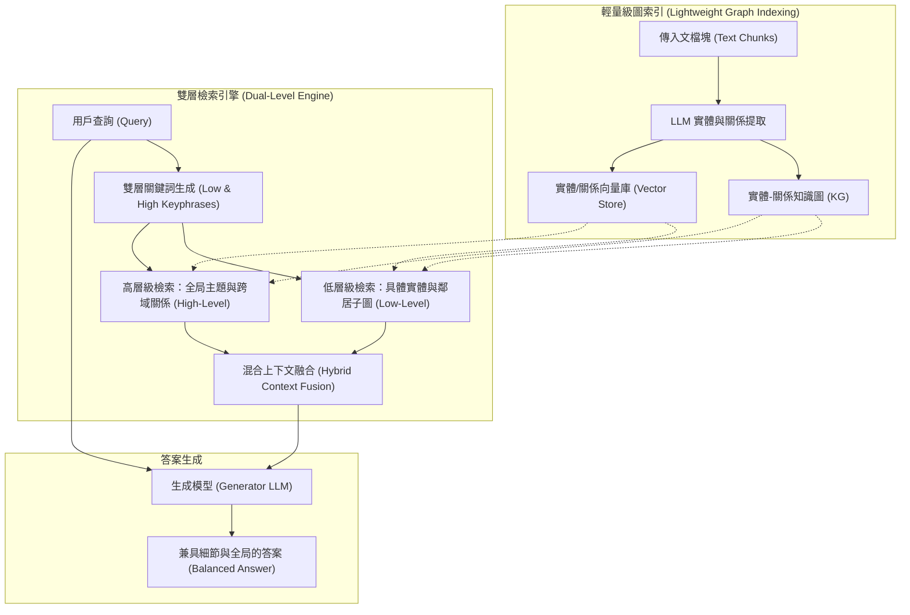

# LightRAG: Simple and Fast Retrieval-Augmented Generation

## 一話摘要 (TL;DR)
LightRAG 針對微軟 GraphRAG 索引構建成本高昂（依賴全域社群層級摘要）與查詢 Token 消耗巨大的痛點，提出了基於實體與關係圖的「雙層檢索範式（Dual-Level Retrieval: Low-level 細節 + High-level 主題）」，在保留結構化關聯優勢的同時，將查詢 Token 開銷從 610,000 降至 100 以內（低於 1%），並原生支援輕量級增量知識寫入。

---

## 研究背景與問題定義 (Problem Statement)
現有 RAG 架構在處理全域摘要與跨篇章推理時存在兩極分化：
1. **扁平式 Naive RAG 的語意碎片化**：單純以 Chunk 向量檢索缺乏全局概念關係，無法回答「請總結整個語料庫的核心主題與爭議點」等宏觀問題。
2. **微軟 GraphRAG 的計算成本天文數字**：
   - 離線構建時需執行 Leidun 社群聚類，並針對各級社群生成數千份 Community Summary，消耗海量 API Tokens；
   - 查詢時採用 Map-Reduce 掃描所有社群摘要，單次查詢消耗高達 600,000+ tokens；
   - **完全無法高效進行增量更新**：新增一篇文檔需要重新計算全域社群聚類並重寫摘要。

---

## 核心方法與技術架構 (Methodology & Architecture)

LightRAG 設計了**基於圖的雙層檢索與無損增量更新機制**：
1. **輕量級圖結構索引構建（Lightweight Graph Indexing）**：
   - 從文本區塊中提取實體節點與關係邊（含關係文字描述）；
   - 為實體與關係分別計算語意向量並建立向量索引，同時記錄原始文本指針，摒棄昂貴的全域社群層次聚合。
2. **雙層檢索範式（Dual-Level Retrieval Paradigm）**：
   - **低層級檢索（Low-Level Retrieval）**：聚焦於特定實體及其一階鄰居節點與精確關聯，捕獲具體事實細節；
   - **高層級檢索（High-Level Retrieval）**：聚焦於宏觀關係邊與全局主題概念，匯聚跨文檔的高階概念連結；
   - **混合檢索模式（Hybrid Mode）**：根據查詢關鍵字動態平衡 Low-Level 與 High-Level 上下文，一次性完成結構化召回。
3. **無損增量動態更新（Incremental Graph Adaptation）**：
   - 新文本傳入時，抽取的新節點直接插入圖拓撲，已有節點則增量合併關係描述，無需全局重新聚類。

### 圖中節點對照
- `GRAPH`：儲存實體與關係邊的輕量級拓撲結構。
- `VDB`：儲存實體及關係文字描述的稠密向量庫。
- `LOW`：檢索特定名詞、具體事實的局部細節。
- `HIGH`：檢索概念脈絡、宏觀架構的上位關聯。
- `HYBRID`：融合兩層結構化證據的 Prompt 裝配模組。

---

## 主要實驗結果與證據 (Empirical Results & Evidence)

論文在 Agriculture、Computer Science (CS)、Legal、Mixed 四大專業領域語料庫上進行了對比評估，評判模型採用 GPT-4o-mini，維度包含 Comprehensiveness（全面性）、Diversity（多樣性）、Empowerment（賦能度）與 Overall（綜合勝率）。

### 1. 面向 GraphRAG 與傳統 RAG 的勝率對比 (Table 1, Page 7)
- **相較於 Naive RAG**：
  - Legal 資料集綜合勝率達 **84.8% vs 15.2%**（Diversity 勝率高達 86.4%）；
  - Agriculture 綜合勝率達 **67.6% vs 32.4%**。
- **相較於微軟 GraphRAG**：
  - 在保持全面性相当的前提下，LightRAG 在多樣性（Diversity）上取得壓倒性優勢：Agriculture 上 Diversity 勝率達 **77.2% vs 22.8%**，Legal 上達 **73.6% vs 26.4%**；
  - CS 資料集整體勝率為 **52.0% vs 48.0%**，Legal 資料集整體勝率為 **52.8% vs 47.2%**。

### 2. 計算成本與 Token 開銷對比 (Section 4.5 & Figure 2, Page 8–9)
- **檢索 Token 開銷（Tokens per Query）**：
  - 微軟 GraphRAG 全域搜尋需要檢索 610 個社群報告，單次查詢消耗 **610,000 tokens**；
  - LightRAG 僅需檢索高相關實體與邊，單次查詢消耗 **< 100 tokens**，節省超過 **99.98%** 的檢索 Token。
- **增量更新開銷（Incremental Update Overhead）**：
  - 微軟 GraphRAG 需重構社群並重新生成 1,399 個社群報告，消耗 $1,399 \times 2 \times 5,000$ tokens；
  - LightRAG 僅需執行單次新區塊抽取與節點合併，成本降低數百倍。

---

## 優勢、限制及 Trade-offs (Strengths, Limitations & Trade-offs)

### 優勢
1. **極致的推論成本效益**：將 GraphRAG 從「實驗室玩具」轉化為工業界可負擔的架構，單次查詢成本幾乎等同於傳統 Naive RAG。
2. **優雅的增量動態更新**：原生支援即時圖結構寫入與節點關係累加，完全擺脫全域聚類重算。
3. **雙層多樣性兼顧**：同時涵蓋微觀具體事實與宏觀主題架構，生成答案的層次感更為豐富。

### 限制與 Trade-offs
1. **社群層級抽象能力略弱於微軟 GraphRAG**：在極度依賴層級式摘要（Hierarchical Summarization）的超宏觀問題上，微軟 GraphRAG 的預編譯社群報告仍具備更強的主題概括凝練度。
2. **實體消歧精度依賴向量閾值**：增量合併實體節點時，若閾值設定過寬可能造成不同實體誤合流，過窄則導致同義實體冗餘。

---

## 對本專案研究領域的實際意義 (Implications for Research Domains)
1. **對 D04/D05 (Graph Representation & Retrieval) 的架構選型意義**：明確指出工業實踐中應優先考慮「雙層檢索（Low/High）」與「輕量增量圖」，而非盲目套用全域社群聚類的重型架構。
2. **對企業長文本知識庫落地的指引**：在合約、法規與技術手冊等動態增長場景中，LightRAG 提供了一種低成本兼具結構化關聯的標準實踐樣式。

---

## 原始來源及相關筆記連結 (Sources & Related Notes)
- 原始論文 PDF：[[Papers/04 - Knowledge & Graph RAG/(arXiv 2024-10) LightRAG - Simple and Fast Retrieval-Augmented Generation.pdf|開啟本地 PDF]]
- arXiv 永久連結：[arXiv:2410.05779](https://arxiv.org/abs/2410.05779)
- 關聯前驅筆記：[[03 - 論文庫 (Literature Notes)/04 - Knowledge & Graph RAG/(arXiv 2024-04) From Local to Global - A Graph RAG Approach to Query-Focused Summarization|Microsoft GraphRAG]]
- 關聯專題領域：[[02 - 研究領域專題 (Research Domains)/Canonical RAG Domains/Domain 04 - Knowledge Representation & Indexing|D04 Knowledge Representation & Indexing]]
