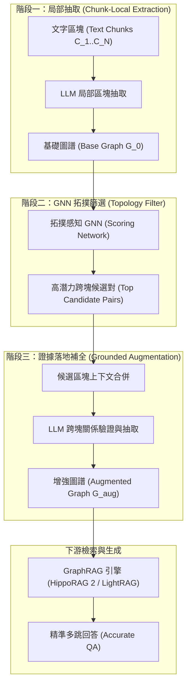

# Beyond Chunk-Local Extraction: Cross-Chunk Graph Augmentation for GraphRAG (CrossAug)

## 一話摘要 (TL;DR)
CrossAug 揭示了既有 GraphRAG 框架普遍依賴「單塊內部抽取（Chunk-Local Extraction）」所導致的跨段落關係系統性缺失，提出利用自監督圖神經網路（GNN）拓撲預測篩選潛在關係候選區塊，並透過 LLM 實體證據補全（Evidence-Grounded Completion）離線增強圖結構，在 HippoRAG 2 與 LightRAG 上全面提升多跳與長文問答表現（HippoRAG 2 在 MuSiQue 上 F1 提升至 41.28%）。

---

## 研究背景與問題定義 (Problem Statement)
現有 GraphRAG（包括 Microsoft GraphRAG、HippoRAG、LightRAG 等）的索引構建存在關鍵瓶頸：
1. **單塊局部抽取的盲區（Chunk-Local Limitation）**：實體與關係抽取僅在個別文字區塊（如 300–600 tokens）內部獨立執行。若實體 A 位於 Chunk 1，而其實體 B 的關係證據位於 Chunk 2，該關係在圖譜中將系統性缺失。
2. **窮舉配對的組合爆炸（Combinatorial Explosion）**：若讓 LLM 窮舉分析所有區塊配對 $(C_i, C_j)$，其計算複雜度達 $O(N^2)$，在百萬字長文庫中成本完全不可行。
3. **多跳檢索斷鏈**：由於缺乏跨塊邊的橋接，多跳檢索演算法（如 PPR、Beam Search）在圖上遭遇語意斷層，無法遊走至關鍵目標段落。

---

## 核心方法與技術架構 (Methodology & Architecture)

CrossAug 提出了一種**拓撲感知的兩階段離線圖增強框架（GNN-Guided Cross-Chunk Augmentation）**：
1. **基礎局部圖構建（Initial Chunk-Local Graph）**：在各區塊內部抽取實體與局部三元組，構成基礎圖 $G_0$。
2. **拓撲引導的 GNN 缺失預測（Topology-Aware GNN Filter）**：
   - 透過自監督「圖破壞-重構（Self-Supervised Graph Corruption）」訓練輕量級 GNN；
   - GNN 評估全局子圖拓撲結構，給出任意兩節點間存在跨塊潛在邊的高置信度分數，將搜尋空間從 $O(N^2)$ 大幅壓縮為極小候選集。
3. **有證據支撐的 LLM 補全（Evidence-Grounded LLM Completion）**：
   - 僅將 GNN 篩選出的高分候選實體對及其來源文字塊提交給 LLM；
   - LLM 驗證並抽取跨區塊關係邊，補齊 $G_0$ 成為增強圖 $G_{aug}$。

### 圖中節點對照
- `LOCAL_EXT`：單個 Chunk 內的局部關係抽取模組。
- `BASE_G`：缺乏跨塊連結的孤島式基礎圖。
- `GNN`：輕量級拓撲神經網絡，負責邊預測與剪枝。
- `AUG_G`：注入跨段落關係邊的稠密知識圖。

---

## 主要實驗結果與證據 (Empirical Results & Evidence)

論文在 MuSiQue、2WikiMultiHopQA、HotpotQA 與 LiteraryQA 四大多跳與長文問答基準上，對比了 Base 與 CROSSAUG 在不同 GraphRAG 框架下的端到端表現。

### 主實驗結果 (Table 2, Page 7)
- **HippoRAG 2 增強效果**：
  - **MuSiQue**：Base EM 27.90 / F1 39.95 $\rightarrow$ **CROSSAUG EM 29.30 / F1 41.28**（F1 提升 **+1.33%**）。
  - **2WikiMultiHopQA**：Base EM 51.20 / F1 57.53 $\rightarrow$ **CROSSAUG EM 51.90 / F1 58.15**（F1 提升 **+0.62%**）。
  - **HotpotQA**：Base EM 53.80 / F1 68.03 $\rightarrow$ **CROSSAUG EM 54.10 / F1 68.44**。
  - **LiteraryQA (長文小說基準)**：Base EM 17.59 / F1 32.72 $\rightarrow$ **CROSSAUG EM 18.40 / F1 33.81**（F1 提升 **+1.09%**）。
- **LightRAG 增強效果**：
  - **MuSiQue**：Base EM 20.50 / F1 28.09 $\rightarrow$ **CROSSAUG EM 21.40 / F1 29.24**（F1 提升 **+1.15%**）。
  - **2WikiMultiHopQA**：Base EM 28.40 / F1 36.93 $\rightarrow$ **CROSSAUG EM 29.30 / F1 37.34**。
  - **LiteraryQA**：Base EM 11.26 / F1 26.24 $\rightarrow$ **CROSSAUG EM 11.63 / F1 26.82**。

---

## 優勢、限制及 Trade-offs (Strengths, Limitations & Trade-offs)

### 優勢
1. **即插即用的通用增強器**：CrossAug 作為離線索引增強模組，可無縫相容 LightRAG、HippoRAG 2、GFM-RAG 等任意下游 GraphRAG 架構。
2. **突破 $O(N^2)$ 計算牆**：利用 GNN 拓撲過濾將昂貴的 LLM 呼叫次數壓縮了數個數量級，使得跨塊知識整合在工業級海量語料上具備工程可行性。

### 限制與 Trade-offs
1. **離線增強訓練流程**：引入了 GNN 自監督訓練環節，增加了索引建立管線的複雜度。
2. **增量寫入延遲**：新文本寫入時需重新評估潛在跨塊邊，對純流式實時索引不夠敏捷。

---

## 對本專案研究領域的實際意義 (Implications for Research Domains)
1. **對 Domain 05 (Graph RAG) 的核心啟示**：明確指出當前所有主流 GraphRAG 的共性短板是「Chunk 邊界割裂」，為構建全局知識網絡提供了切實可行的解決路徑。
2. **對 Domain 13 (Cross-chunk Consolidation) 的支撐**：證明了跨段落實體對齊與關係重構是提升長文本可審計性與多跳精確度的關鍵樞紐。

---

## 原始來源及相關筆記連結 (Sources & Related Notes)
- 原始論文 PDF：[[Papers/04 - Knowledge & Graph RAG/(arXiv 2026-05) Beyond Chunk-Local Extraction - Cross-Chunk Graph Augmentation for GraphRAG.pdf|開啟本地 PDF]]
- arXiv 永久連結：[arXiv:2605.28004](https://arxiv.org/abs/2605.28004)
- 關聯專題領域：[[02 - 研究領域專題 (Research Domains)/Domain 05 - Graph RAG 與結構化知識 (Microsoft GraphRAG, HippoRAG)|Domain 05 - Graph RAG]]、[[02 - 研究領域專題 (Research Domains)/Domain 13 - Information Preservation & Cross-chunk Consolidation|Domain 13 - Cross-chunk Consolidation]]
