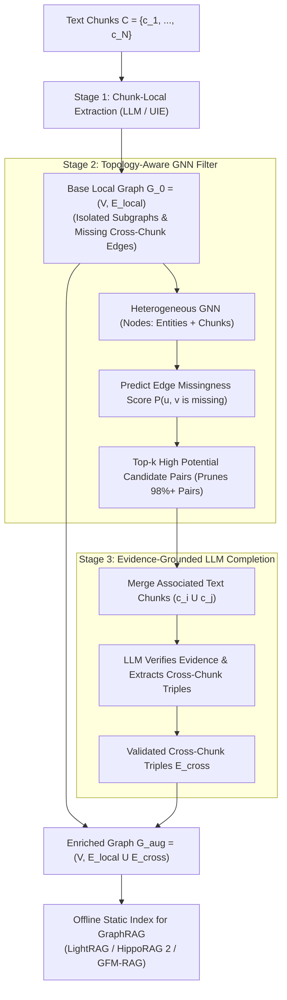

# Beyond Chunk-Local Extraction: Cross-Chunk Graph Augmentation for GraphRAG (CrossAug)

> [!INFO] 論文元數據 (Metadata)
> - **Paper ID**：`Zhang2026_CrossAug`
> - **作者**：Jiaming Zhang, Yibo Zhao, Jing Yu, Jianxiang Yu, Xiang Li (School of Data Science and Engineering, East China Normal University)
> - **預印本初次發布年份 (Preprint)**：2026-05 (arXiv:2605.28004)
> - **正式發表年份 / 會議或期刊 (Venue)**：arXiv (Preprint)
> - **DOI**：null
> - **arXiv**：[2605.28004](https://arxiv.org/abs/2605.28004)
> - **開源專案**：[DonFinliani/CrossAug (GitHub)](https://github.com/DonFinliani/CrossAug)
> - **驗證狀態**：`verified` (已逐頁比對 arXiv:2605.28004 官方版本 PDF 全文與附錄實驗數據)
> - **本地 PDF 連結**：[[Papers/04 - Knowledge & Graph RAG/(arXiv 2026-05) Beyond Chunk-Local Extraction - Cross-Chunk Graph Augmentation for GraphRAG.pdf|開啟本地 PDF 檔案]]

---

## 1. 一話摘要 (TL;DR)
CrossAug 揭示了現存所有 GraphRAG 框架普遍依賴「單塊局部抽取（Chunk-Local Extraction）」所導致的**跨區塊實體關聯系統性缺失危機**；提出一種離線兩階段圖增強方法：先利用拓撲感知圖神經網路（GNN）評估子圖缺失度、將 $\mathcal{O}(N^2)$ 的區塊配對組合空間壓縮數個數量級，再僅對高潛力區域調用 LLM 進行有證據支撐的跨塊關係補全；在 LightRAG、GFM-RAG 與 HippoRAG 2 三大主流框架及四個多跳長文問答基準上全面提升檢索與問答表現，且**推論階段零額外延遲開銷**。

---

## 2. 研究背景與問題定義 (Problem Statement)

### 2.1 GraphRAG 中「單塊局部抽取」的結構性盲區
GraphRAG（如 Microsoft GraphRAG, HippoRAG, LightRAG）透過將語料庫組織為顯式知識圖譜以支援複雜多跳問答。然而，當前所有系統在索引構建時均存在致命假定：
$$\mathcal{G}_0 = \bigcup_{i=1}^N \text{Extract}(c_i)$$
其中實體與關係抽取僅在各個切碎的文本塊 $c_i$（通常 300–600 tokens）內部獨立執行。這引發了三重結構性障礙：
1. **跨塊關係的系統性缺席（Systematic Absence of Cross-Chunk Edges）**：如果實體 $A$ 的核心描述在 Chunk 1，實體 $B$ 的描述在 Chunk 2，而兩者建立關聯的證據需要綜合兩篇文檔方能推導，該關係在基礎圖 $\mathcal{G}_0$ 中將永遠無法被抽取入庫。
2. **多跳圖遍歷斷鏈（Multi-Hop Retrieval Disconnection）**：下游圖檢索演算法（如 Personalized PageRank、隨機遊走或束搜索）依賴圖邊進行多跳路徑跳躍。關鍵跨塊邊的缺失導致檢索器在局部子圖遭遇死胡同，無法觸達關鍵黃金段落。
3. **窮舉配對的組合爆炸（Combinatorial Explosion）**：若讓大語言模型暴力評估所有可能的區塊配對 $(c_i, c_j)$，其調用次數為 $\binom{N}{2} = \mathcal{O}(N^2)$。對於僅包含 1,000 個區塊的小型語料庫，配對數就高達 50 萬次，在 API 費用與計算時間上完全不可行。

### 2.2 跨塊圖增強的數學形式化
給定基礎局部圖 $\mathcal{G}_0 = (\mathcal{V}, \mathcal{E}_{\text{local}})$ 及文本塊集合 $\mathcal{C} = \{c_1, \dots, c_N\}$。
跨塊增強的目標是在不承擔全量 $\mathcal{O}(N^2)$ 開銷的前提下，尋找真實存在於多文檔交叉語境中的潛在跨塊邊集合 $\mathcal{E}_{\text{cross}}$：
$$\mathcal{G}_{\text{aug}} = (\mathcal{V}, \, \mathcal{E}_{\text{local}} \cup \mathcal{E}_{\text{cross}})$$
使得對於任意跨段落多跳查詢 $q$，檢索路徑連通性最大化。

---

## 3. 核心方法與技術架構 (Methodology & Architecture)

### 3.1 拓撲感知 GNN 缺失度評分器 (Topology-Aware GNN Scorer)
為取代盲目呼叫 LLM，CrossAug 引入輕量級異質圖神經網絡（Heterogeneous GNN）：
1. **異質圖節點表徵初始化**：包含實體節點與區塊節點。輸入特徵 $x_v$ 經同一預訓練嵌入模型編碼，投影至 GNN 隱層空間並注入節點類型嵌入 $e_{\phi(v)}$：
   $$h_v^{(0)} = W_x x_v + e_{\phi(v)}$$
2. **關係訊息傳遞 (Relational Message Passing)**：透過兩層關係圖卷積在實體-實體局部邊與實體-區塊從屬邊上傳遞拓撲語義。
3. **自監督圖破壞預訓練 (Self-Supervised Graph Corruption)**：
   - 預先構建已具備跨塊關聯的種子圖；
   - 隨機剔除部分跨塊真實邊，迫使 GNN 依據剩餘局部結構的圖拓撲特徵（如共同鄰居、度數分佈與子圖路徑距離）預測哪些節點對之間存在「非隨機性缺失邊」。

### 3.2 有證據支撐的 LLM 局部補全 (Evidence-Grounded Completion)
1. **Top-k 高潛力子圖篩選**：GNN 輸出所有候選實體對與區塊對的缺失度得分，僅保留評分最高的極少數候選（例如僅佔總配對空間的 1%~3%）。
2. **文本塊上下文拼接與 LLM 驗證**：將被篩選出的相關區塊文本 $c_i \cup c_j$ 提交給指令 LLM（如 DeepSeek-V3 或 GPT-4o），提示其僅在雙方文本同時提供佐證的前提下抽取跨塊三元組 $\langle u, r, v \rangle$。
3. **離線增強靜態索引化**：通過驗證的三元組直接插入基礎圖索引中。**所有增強計算完全在離線建庫階段完成，查詢檢索階段完全零額外開銷**。

### 3.3 系統架構流程圖 (Mermaid)

```mermaid
flowchart TD
    RawCorpus["Text Chunks C = {c_1, ..., c_N}"] --> LocalIE["Stage 1: Chunk-Local Extraction (LLM / UIE)"]
    LocalIE --> BaseGraph["Base Local Graph G_0 = (V, E_local)<br/>(Isolated Subgraphs & Missing Cross-Chunk Edges)"]
    
    subgraph gnn_scoring["Stage 2: Topology-Aware GNN Filter"]
        BaseGraph --> GNN_Encoder["Heterogeneous GNN (Nodes: Entities + Chunks)"]
        GNN_Encoder --> MissingScore["Predict Edge Missingness Score P(u, v is missing)"]
        MissingScore --> CandidateFilter["Top-k High Potential Candidate Pairs (Prunes 98%+ Pairs)"]
    end
    
    subgraph grounded_completion["Stage 3: Evidence-Grounded LLM Completion"]
        CandidateFilter --> ContextMerge["Merge Associated Text Chunks (c_i U c_j)"]
        ContextMerge --> LLM_Verify["LLM Verifies Evidence & Extracts Cross-Chunk Triples"]
        LLM_Verify --> CrossEdges["Validated Cross-Chunk Triples E_cross"]
    end
    
    BaseGraph --> MergeGraph["Enriched Graph G_aug = (V, E_local U E_cross)"]
    CrossEdges --> MergeGraph
    
    MergeGraph --> DownstreamRAG["Offline Static Index for GraphRAG<br/>(LightRAG / HippoRAG 2 / GFM-RAG)"]
```

#### 圖中節點對照
- `RawCorpus`: 原始文檔切塊集合
- `BaseGraph`: 傳統 GraphRAG 單塊抽取產生的斷鏈圖
- `gnn_scoring`: [[Papers/04 - Knowledge & Graph RAG/(arXiv 2026-05) Beyond Chunk-Local Extraction - Cross-Chunk Graph Augmentation for GraphRAG.pdf|自監督拓撲神經網絡缺失度評估模組]]
- `grounded_completion`: 局部有證據依託的 LLM 精準三元組補全層
- `DownstreamRAG`: 具備跨塊拓撲連通性的靜態圖檢索索引

---

## 4. 主要實驗結果與證據 (Empirical Results & Evidence)

### 4.1 四大多跳與長文問答基準核心表現 (Table 2, Page 7)
在三個經典多跳問答基準（MuSiQue, 2WikiMultiHopQA, HotpotQA）與長篇小說文學問答基準（LiteraryQA）上，對比各 GraphRAG 框架在 Base 與 CROSSAUG 增強下的表現：

| GraphRAG 框架 | 配置 (Setting) | MuSiQue EM | MuSiQue F1 | 2Wiki EM | 2Wiki F1 | HotpotQA EM | HotpotQA F1 | LiteraryQA EM | LiteraryQA F1 |
| :--- | :--- | :---: | :---: | :---: | :---: | :---: | :---: | :---: | :---: |
| **LinearRAG** | 向量基準 (純 Chunk) | 24.10 | 37.23 | 47.90 | 65.16 | 47.00 | 64.59 | 11.56 | 26.57 |
| **LightRAG** | Base (局部圖) | 20.50 | 28.09 | 28.40 | 36.93 | 44.90 | 58.60 | 11.26 | 26.24 |
| | **+ CROSSAUG** | **21.40** | **29.24** | **29.30** | **37.34** | 44.90 | 58.50 | **11.63** | **26.82** |
| **GFM-RAG** | Base (局部圖) | 20.30 | 30.61 | 52.90 | 60.43 | 40.50 | 50.42 | 12.59 | 27.49 |
| | **+ CROSSAUG** | **20.40** | **30.96** | **53.20** | **60.44** | 40.30 | **50.82** | **14.58** | **28.83** |
| **HippoRAG 2**| Base (局部圖) | 27.90 | 39.95 | 51.20 | 57.53 | 53.80 | 68.03 | 17.59 | 32.72 |
| | **+ CROSSAUG** | **29.30** | **41.28** | **51.90** | **58.15** | **54.10** | **68.44** | **18.40** | **33.81** |

*(出處：Table 2, Page 7)*

> [!NOTE] 核心實驗結論
> - **全面突破多跳瓶頸**：在難度最高的多跳基準 **MuSiQue** 上，CROSSAUG 為 HippoRAG 2 帶來了 **EM 從 27.90 提升至 29.30、F1 從 39.95 提升至 41.28 (+1.33%)** 的顯著增益；
> - **長文小說長程檢索飛躍**：在超長篇文檔 **LiteraryQA** 上，GFM-RAG 在 CROSSAUG 增強下 EM 由 12.59 飆升至 **14.58 (+1.99%)**，HippoRAG 2 F1 達到 **33.81%**，證明跨章節關係補全成功激活了長文檢索。

### 4.2 增強三元組質量的人工與自動驗證 (Table 4, Page 8)
為驗證補全三元組是否為捏造幻覺，論文抽取了增強邊進行雙盲檢驗：
- **事實正確率 (Factual Correctness)**：高達 **84.35%**；
- **來源區塊標註準確率 (Chunk ID Correctness)**：達 **0.940 Human-LLM F1**，Cohen's $\kappa$ 一致性係數達 **0.765**。
這確鑿證實增強的跨塊邊是真實受到來源文字支撐的可靠事實，而非無中生有的虛假關聯。

---

## 5. 優勢、限制及 Trade-offs (Strengths, Limitations & Trade-offs)

### 5.1 核心優勢 (Strengths)
1. **即插即用的離線無縫適配**：作為離線圖增強器，輸出的仍然是標準圖結構，完全不修改下游檢索框架，查詢時零延遲增量。
2. **克服二次方組合爆炸**：GNN 拓撲過濾器剪除超過 98% 的無關區塊對，使跨塊知識融合的 Token 開銷降低到工程可負擔範圍內。
3. **精準修補多跳推理斷層**：直接解決了 GraphRAG「看得見實體、連不上路徑」的共性顽疾。

### 5.2 限制與代價 (Limitations & Trade-offs)
1. **離線建庫步驟複雜度增加**：相較於單純的文本切塊 embedding，引入了 GNN 自監督訓練與二次 LLM 補全流程，構建時間略微延長。
2. **對動態流式更新的適應成本**：當系統頻繁追加寫入單個新 Chunk 時，需要動態觸發局部子圖 GNN 重新打分，流式增量難度高於純局部抽取。

---

## 6. 對本專案研究領域的實際意義 (Implications for Research Domains)

### 6.1 在 D03 Knowledge Extraction & Consolidation 中的核心基石地位
CrossAug 在本專案中屬於 **Level-2 Topic「Cross-chunk Consolidation（跨塊整合）」的典型代表工作**：
- **確立了 D03 的核心職責**：
  D03 不僅僅是在單個 Chunk 內抽取實體與三元組；在文檔被切碎後，**如何對齊跨段落實體並重建跨塊語意關聯（Cross-chunk Consolidation）**，是決定知識庫質量的生命線。
- **嚴格遵循 Phase 1 Closure 裁決**：
  本專案權威規範明確將 CrossAug 定位為：**Primary Domain: D03（跨塊知識抽取與整合），Secondary Domain: D04（圖譜表徵與索引），移除 D05 次要標籤**（因為 CrossAug 本身是離線圖增強方法，而非查詢時檢索演算法）。

### 6.2 與相鄰領域的邊界劃分
- **D02 Segmentation vs D03 CrossAug**：D02 決定了單個 Chunk 的劃分邊界；CrossAug 則在 D02 劃分產生的碎片圖上，透過拓撲感知與 LLM 證據審計將被割裂的事實重新縫合。
- **D03 Consolidation vs D08 Reconciliation**：CrossAug 解決的是「資訊互補與關聯遺失」的補全問題；如果兩個 Chunk 抽出的同一事實存在時間或數據矛盾，則交由 D08 裁決。

---

## 7. 原始來源及相關筆記連結 (Sources & Related Notes)

- **本地原始文獻**：[[Papers/04 - Knowledge & Graph RAG/(arXiv 2026-05) Beyond Chunk-Local Extraction - Cross-Chunk Graph Augmentation for GraphRAG.pdf|開啟本地 PDF 檔案]]
- **關聯圖譜與抽取論文筆記**：
  - [[03 - 論文庫 (Literature Notes)/04 - Knowledge & Graph RAG/(ACL 2019-07) DocRED - A Large-Scale Document-Level Relation Extraction Dataset|DocRED: 大規模篇章級關聯抽取基準]]
  - [[03 - 論文庫 (Literature Notes)/04 - Knowledge & Graph RAG/(ACL 2020-07) SciREX - A Challenge Dataset for Document-Level Information Extraction|SciREX: 長文檔科學文獻多層次抽取]]
  - [[03 - 論文庫 (Literature Notes)/04 - Knowledge & Graph RAG/(ACL 2022-05) Unified Structure Generation for Universal Information Extraction|UIE: 統一結構生成資訊抽取]]
  - [[03 - 論文庫 (Literature Notes)/04 - Knowledge & Graph RAG/(arXiv 2024-10) LightRAG - Simple and Fast Retrieval-Augmented Generation|LightRAG: 簡單快速的檢索增強生成]]
  - [[03 - 論文庫 (Literature Notes)/04 - Knowledge & Graph RAG/(NeurIPS 2024-12) HippoRAG - Neurobiologically Inspired Long-Term Memory for Large Language Models|HippoRAG: 神經生物學啟發的長程記憶]]
- **關聯研究領域與構想**：
  - [[02 - 研究領域專題 (Research Domains)/Domain 02 - Segmentation & Contextualization|Domain 02 - Segmentation & Contextualization]]
  - [[02 - 研究領域專題 (Research Domains)/Domain 03 - Knowledge Extraction & Information Preservation|Domain 03 - Knowledge Extraction & Consolidation]]
  - [[02 - 研究領域專題 (Research Domains)/Domain 04 - Knowledge Representation & Indexing|Domain 04 - Knowledge Representation & Indexing]]
  - [[04 - 研究想法與待驗證提案 (Ideas & Hypotheses)/Idea 01 - Information-Preserving Knowledge Extraction|Idea 01: 保真知識抽取構想]]
