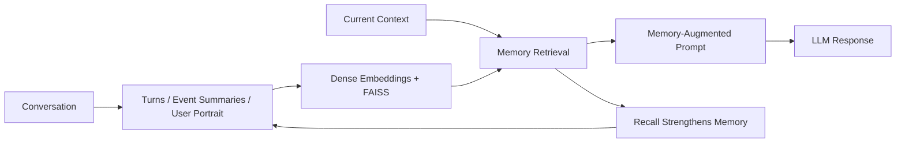

# MemoryBank: Enhancing Large Language Models with Long-Term Memory

## 一話摘要

MemoryBank 為長期對話 LLM 加入 persistent memory storage、dense retrieval 與 Ebbinghaus-inspired memory updating。它保存逐輪對話、每日 / 全域事件摘要與 user portrait，並讓被再次召回的 memory 更不容易被遺忘。

## 核心方法

1. **Memory Storage**
   - 保存 timestamped conversation turns；
   - 將 daily conversations 摘要成 daily events，再形成 global event summary；
   - 維護 daily / global user personality summaries。

2. **Memory Retrieval**
   - conversation turn / event summary 視為 memory piece；
   - 使用 dual-tower dense encoder；
   - 以 FAISS 建索引並做相似度檢索；
   - SiliconFriend 實作使用 LangChain；英文使用 MiniLM、中文使用 Text2vec。

3. **Memory Updating**
   - 簡化 Ebbinghaus forgetting curve：
     R = exp(-t / S)
   - memory strength S 首次出現設為 1；
   - memory 被 recall 時，S 增加 1，並把 t reset 為 0，使其更不易被忘記。

> [!NOTE]
> 原論文不是 BM25 + dense hybrid retrieval，也沒有提出先前筆記所畫的 active-memory threshold pruning pipeline。

## 主要實驗結果與證據

量化評估使用 10 天 simulated dialogue history、15 個 virtual users、194 個 memory probing questions，由人工標註 Retrieval Accuracy、Correctness、Coherence 與 Ranking（Table 2）。

| Language | SiliconFriend backbone | Retrieval Acc. | Correctness | Coherence | Ranking |
|---|---|---:|---:|---:|---:|
| English | ChatGLM | 0.809 | 0.438 | 0.680 | 0.498 |
| English | BELLE | 0.814 | 0.479 | 0.582 | 0.517 |
| English | ChatGPT | 0.763 | 0.716 | 0.912 | 0.818 |
| Chinese | ChatGLM | 0.840 | 0.418 | 0.428 | 0.510 |
| Chinese | BELLE | 0.856 | 0.603 | 0.562 | 0.565 |
| Chinese | ChatGPT | 0.711 | 0.655 | 0.675 | 0.758 |

**重要限制**：Table 2 比較的是三個都使用 MemoryBank 的 SiliconFriend variants，不是 MemoryBank vs no-memory 的 controlled ablation。因此不能從這張表推導「MemoryBank 提升 X%」的因果效果。

論文另有 qualitative examples 展示 psychological companionship、memory recall 與 personality-aware interaction；這些是案例證據，不應改寫成未報告的百分比。

## Trade-offs

- 優勢：把 persistent storage、retrieval、summarization、forgetting / reinforcement 組成完整 memory lifecycle。
- 成本：需持續做 event/personality summarization、embedding 與 memory update。
- forgetting model 很粗糙：作者明確稱其為 exploratory simplification。
- 實驗邊界：量化表主要比較不同 backbone，不足以單獨估計 MemoryBank module 的 causal gain。

## Taxonomy Boundary

- **D11 primary**：memory write → retrieve → update / forget。
- **D12 secondary**：若 controller 自主決定何時 write / recall / update，會與 agentic control 相交。
- **不是 D10**：管理的是 interaction-derived memory，不是 external canonical corpus 的 index maintenance。

## Sources

- AAAI 2024: https://doi.org/10.1609/aaai.v38i17.29946
- arXiv: https://arxiv.org/abs/2305.10250
- [[Papers/05 - Memory & Agents/(AAAI 2024-03) MemoryBank - Enhancing Large Language Models with Long-Term Memory.pdf|Local PDF]]
- [[02 - 研究領域專題 (Research Domains)/Domain 11 - Memory-Augmented RAG|D11 Memory-Augmented RAG]]
