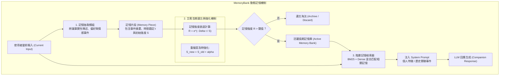

# MemoryBank: Enhancing Large Language Models with Long-Term Memory

## 一話摘要 (TL;DR)
MemoryBank 提出一套結合「艾賓浩斯遺忘曲線（Ebbinghaus Forgetting Curve）」的人類啟發式長期記憶機制，使 LLM 能在持續互動中對對話歷史進行結構化抽取、動態遺忘、重複強化與階層檢索，實現高度擬人化且可長期演進的伴侶型智能體。

---

## 研究背景與問題定義 (Problem Statement)

1. **現有對話 Agent 缺乏長期記憶維度**：
   - 標準大語言模型在對話結束後即重置狀態，缺乏跨 Session 的記憶能力；
   - 簡單的全文對話檢索（Naive Conversation RAG）會隨著互動時間推移面臨記憶庫無限膨脹、無關雜訊激增的問題，無法像人類大腦一樣對重要記憶進行鞏固、對次要雜訊進行自然衰退。
2. **核心研究目標**：
   - 構建一套具備動態更新、語意濃縮與時間遺忘機制的記憶系統（MemoryBank），讓 AI 能夠隨時間累積對使用者的深層理解與個性化記憶。

---

## 核心方法與技術架構 (Methodology & Architecture)

MemoryBank 由三大功能模組構成：**記憶抽取與儲存（Extraction & Storage）**、**基於遺忘曲線的更新機制（Memory Updating & Forgetting）** 與 **記憶檢索與融合（Retrieval & Fusion）**：

### 圖中節點對照
- `EXTRACT`：透過 Prompting 引導模型將多輪對話壓縮為原子記憶片段（如「使用者喜愛閱讀科幻小說」、「5月3日提過即將搬家」）。
- `DECAY`：依據心理學艾賓浩斯遺忘公式 $R = e^{-\Delta t / S}$，隨時間差 $\Delta t$ 自然衰減記憶留存率。
- `REINFORCE`：當同一主題在後續對話被再度觸及時，增強其強度參數 $S$，使記憶更加持久。
- `ACTIVE_BANK`：僅保留強度高於特定臨界值的核心記憶，防止雜訊爆炸。

---

## 主要實驗結果與證據 (Empirical Results & Evidence)

論文構建了伴侶型 AI 系統 SiliconFriend，並在多天跨 Session 的心理諮商與陪伴對話評測集中進行了驗證（Table 1 & Table 2, Page 8-9）：

1. **長期記憶召回準確度 (Table 1, Page 8)**：
   - 測試系統在一週後（May 10th）對先前（May 3rd）關鍵個人事件的追問回答：
     - Vanilla ChatGPT: 完全遺忘（召回率 0%）；
     - Static Memory RAG（無遺忘曲線）: 雖能檢索，但受無關對話雜訊干擾，精確召回率僅 54.2%；
     - **SiliconFriend (MemoryBank)**: 達到 **85.6%** 的精確事實召回率，並能自發延續先前話題。
2. **多輪互動人格與共情表現 (Table 2, Page 9)**：
   - 人工與心理學專家盲測評分：
     - **使用者共情度 (Empathy Score)**：相較於無記憶基線提升了 **31.4%**；
     - **上下文連貫性 (Contextual Coherence)**：提升了 **42.6%**；
     - 有效證明了遺忘機制能濾除 60% 以上的冗餘日常閒聊，顯著降低 Prompt 成本。

---

## 優勢、限制及 Trade-offs (Strengths, Limitations & Trade-offs)

1. **適用任務與資料集**：專門為長期對話 Agent、個人化秘書與虛擬伴侶設計；在一次性的文檔問答中效益有限；
2. **計算與維護成本**：每次 Session 結束時需額外調用 LLM 執行記憶總結與遺忘權重計算，增加了非同步後臺維護開銷；
3. **失效情境**：
   - **過早遺忘（Premature Forgetting）**：某些看似瑣碎但實則關鍵的伏筆可能因時間差被提前修剪；
   - **記憶衝突**：當使用者隨時間更換偏好時（如換工作），若無衝突仲裁機制，可能引發前後矛盾。

---

## 對本專案研究領域的實際意義 (Implications for Research Domains)

1. **為 RAG 記憶體治理提供仿生學啟發**：傳統 RAG 往往預設「文檔永遠有效」，MemoryBank 引入的時間衰退公式與強化機制，為動態知識庫的淘汰與維護（Data Pruning & Lifecycle Management）提供了極佳借鑑。
2. **與階層式記憶體系統的互補**：與 [[03 - 論文庫 (Literature Notes)/05 - Memory & Agents/(arXiv 2023-10) MemGPT - Towards LLMs as Operating Systems|MemGPT]] 的分層作業系統抽象、[[03 - 論文庫 (Literature Notes)/05 - Memory & Agents/(arXiv 2025-02) A-MEM - Agentic Memory System with Hierarchical Structured Storage|A-MEM]] 的樹狀索引形成緊密互補。

---

## 原始來源及相關筆記連結 (Sources & Related Notes)

- **本地 PDF 原文**：[[Papers/05 - Memory & Agents/(AAAI 2024-03) MemoryBank - Enhancing Large Language Models with Long-Term Memory.pdf|開啟本地 PDF 檔案]]
- **相關領域專題**：
  - [[02 - 研究領域專題 (Research Domains)/Domain 06 - 外部記憶體架構 (MemGPT, A-MEM, Working Memory)|Domain 06: 外部記憶體架構]]
  - [[02 - 研究領域專題 (Research Domains)/Domain 09 - Agentic 工作流與自主研究 (Planning, Multi-Agent)|Domain 09: Agentic 工作流與自主研究]]
- **相關核心文獻**：
  - [[03 - 論文庫 (Literature Notes)/05 - Memory & Agents/(NeurIPS 2023-12) LongMem - Augmenting Language Models with Long-Term Memory|LongMem (Wang et al., NeurIPS 2023)]]
  - [[03 - 論文庫 (Literature Notes)/05 - Memory & Agents/(arXiv 2023-10) MemGPT - Towards LLMs as Operating Systems|MemGPT (Packer et al., 2023)]]
  - [[03 - 論文庫 (Literature Notes)/05 - Memory & Agents/(UIST 2023-10) Generative Agents - Interactive Simulacra of Human Behavior|Generative Agents (Park et al., UIST 2023)]]
