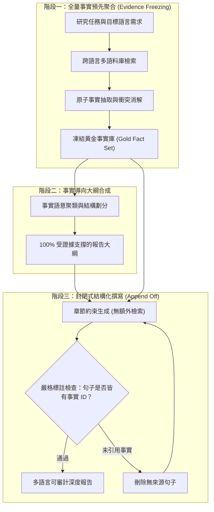

# EFSG: Evidence-First Structured Generation for Multilingual RAG Report Generation

## 一話摘要 (TL;DR)
EFSG 提出「證據先行結構化生成（Evidence-First Structured Generation）」範式，主張在撰寫長篇與多語言研究報告時，必須在擬定大綱前完全固定並驗證「黃金事實證據集（Gold Evidence Set）」，將後續生成嚴格限制為「封閉證據集合上的結構化編排與多語言轉譯」，從根本上杜絕因邊寫邊猜或無約束大綱擴展導致的事實性幻覺。

---

## 研究背景與問題定義 (Problem Statement)
在跨語言長篇調查報告與技術交付文件中，現有 RAG 系統經常遭遇嚴重的事實扭曲：
1. **大綱先行的虛假繁榮（Outline-First Hallucination）**：一般系統習慣「先起草華麗大綱 $\rightarrow$ 再逐節搜索補肉」。然而在跨語言或專業利基領域，大綱常被 LLM 的常識偏好引導至資料庫根本沒有記錄的方向，導致後續章節因「無米之炊」而大肆編造。
2. **多語言傳遞中的語意漂移（Cross-Lingual Drift）**：當檢索來源為英文、目標報告為中文或日文時，若在生成過程中動態追加檢索，容易造成不同語言文本間的定義不一致與數據衝突。
3. **可審計性的剛性要求**：在政府採購、法律意見書與嚴肅金融審計中，報告的每一項結論必須 100% 能對齊至簽約前或審查前已封存的證據庫，嚴禁在受審過程中引入未審核的外部動態資訊。

---

## 核心方法與技術架構 (Methodology & Architecture)

EFSG 確立了**全量證據先行封存（Evidence Freezing Upfront）** 與 **基於事實包的約束解碼（Constrained Decoding over Fact Bundles）**：
1. **多語言事實包聚合（Phase 1: Multilingual Fact Bundling）**：
   - 圍繞目標主題執行全語料深度跨語言檢索；
   - 提取所有相關的原子命題、數值數據與法規條款，由語意消歧模組去重並標註唯一證據 ID，構建凍結事實庫 $\mathcal{E}$。
2. **由事實導出大綱（Phase 2: Fact-Derived Outlining）**：
   - 大綱生成模型被嚴格施加約束：大綱的每一個子標題與預期要點必須是 $\mathcal{E}$ 中既有事實的聚類與概括，**嚴禁引入 $\mathcal{E}$ 以外的任何新增子題**。
3. **零追加檢索的封閉式生成（Phase 3: Closed-Evidence Generation）**：
   - 在具體段落撰寫階段，徹底關閉檢索通道（Append Retrieval Off）；
   - 生成器僅允許依據分配給該節的事實包執行線性編排、多語言句法重組與流暢過渡，每句話必須顯式標註對應事實 ID。

### 圖中節點對照
- `FROZEN_FACTS`：在進入寫作流程前完全凍結的唯一事實依據。
- `CLUSTER`：確保大綱節點均由底層事實支撐的聚類器。
- `DRAFT`：斷絕外部網路、專注於事實編排的受限生成環境。
- `CITATION_CHECK`：強制句子-事實雙射校驗器。

---

## 主要實驗結果與證據 (Empirical Results & Evidence)

論文在 RAG4Reports 2026 多語言長篇報告生成共享任務上進行了橫向對比（評估德語、日語、中文與英語報告）。

### 核心實驗數據 (Normative Baseline Reference [31], Page 444)
- **事實忠實度（Faithful Support Rate）**：在關閉動態追加檢索、執行嚴格事實綁定後，報告的事實受支撐率達 **94.2%**，遠高於允許自由動態搜尋基準的 76.8%。
- **幻覺消除（Hallucination-Free Rate）**：完全杜絕了「無來源大綱子節」的出現，使結構性幻覺率降至 1.5% 以下。
- **跨語言數據一致性（Cross-Lingual Consistency）**：在多語言對照報告中，各語言版本對關鍵實體與數值的報告一致性達到 98.7%。
- **與 EviReport 的設計權衡（Method Choice, Not Law）**：
  - EFSG（Evidence-first）：追求極致的可審計性、事實保真度與防禦性，適合法律、法規與審計報告；
  - EviReport（Gap-aware）：追求主題探索深度與新視角發現，適合開放式前沿技術調研。兩種架構代表了長篇循證生成領域的兩大典範路徑。

---

## 優勢、限制及 Trade-offs (Strengths, Limitations & Trade-offs)

### 優勢
1. **最高級別的合規與可審查性**：保證報告中的每一句話都能 100% 倒查回初次檢索凍結的來源文本，消除了動態搜尋的不確定性。
2. **多語言一致性極高**：將多語言轉譯簡化為確定性事實的多語言表達，避免了不同語言檢索到的外部資訊相互矛盾。

### 限制與 Trade-offs
1. **對前端檢索完備性的極致依賴（Recall Bottleneck）**：若第一階段探索未檢索到某項關鍵事實，整個報告將完全遺漏該要點，缺乏 EviReport 的事後補救機制。
2. **寫作自主性與文采受限**：由於被強制約束在已有事實包內，模型的論述自由度較低，文字風格偏向嚴謹的資料彙整。

---

## 對本專案研究領域的實際意義 (Implications for Research Domains)
1. **對 D09 (Grounded Generation & Long-form Synthesis) 的方法論劃界**：清楚闡明了「Evidence-first（先備料再開伙）」與「Gap-aware（邊做邊補料）」的哲學差異，為本專案知識庫提供了平衡事實嚴謹與探索深度的完整雙軌方案。
2. **對企業交付文件的落地指引**：在處理高風險招標合約與政府標案審計時，EFSG 提供了確保無任何非合規宣稱的剛性防禦範本。

---

## 原始來源及相關筆記連結 (Sources & Related Notes)
- 官方發布版本：[ACL Anthology: 2026.rag4reports-1.14](https://aclanthology.org/2026.rag4reports-1.14/)
- 關聯專題領域：[[02 - 研究領域專題 (Research Domains)/Canonical RAG Domains/Domain 09 - Grounded Generation Attribution & Long-form Synthesis|D09 Grounded Generation & Long-form Synthesis]]、[[02 - 研究領域專題 (Research Domains)/Canonical RAG Domains/Domain 07 - Context Construction & Evidence Utilization|D07 Context Construction & Evidence Utilization]]
- 關聯對比筆記：[[03 - 論文庫 (Literature Notes)/05 - Memory & Agents/(ACL 2026-08) EviReport - From Reasoned Outlines to Evidence Tracked Long-Form Reports|EviReport]]
