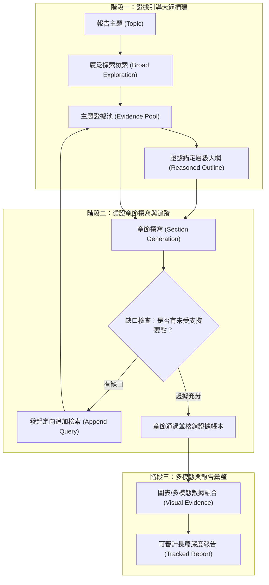

# EviReport: From Reasoned Outlines to Evidence Tracked Long-Form Reports

## 一話摘要 (TL;DR)
EviReport 針對長篇研究報告生成中大綱與證據割裂、後續章節事實覆蓋不足的難題，提出了「證據追蹤階層大綱（Reasoned Outlines with Evidence Tracking）」與「缺口感知追加檢索（Gap-Aware Append Queries）」工作流，在 EviReportBench 基準上相較強基準實現 **2.16× 事實覆蓋率**、**+8.9 分事實精準度** 以及 **+34 分圖表視覺證據整合度**。

---

## 研究背景與問題定義 (Problem Statement)
現有長篇循證生成系統（如 STORM、LongWriter）在撰寫專業深度報告時存在三大結構性缺陷：
1. **大綱生成的「空中樓閣」（Ungrounded Outlines）**：多數系統在沒有充分檢索證據前即由 LLM 先驗生成多級大綱，導致後續章節規劃了大量語料庫中根本不存在的內容，迫使生成階段嚴重幻覺。
2. **證據缺乏動態追蹤（Lost Evidence Provenance）**：隨著報告字數突破數千字，前端檢索到的證據片段無法精確錨定到具體章節與段落中，造成證據稀釋與張冠李戴。
3. **僵化的一次回傳檢索（One-shot Freeze vs. Gap Blindness）**：傳統流程要麼在寫作開始前完全凍結檢索（遇到新知識盲區無法補救），要麼無節制地進行無目標隨機搜尋，缺乏針對「當前段落究竟缺少何種證據」的缺口感知檢索機制。

---

## 核心方法與技術架構 (Methodology & Architecture)

EviReport 提出了**大綱-證據雙向綁定（Bidirectional Outline-Evidence Binding）** 與 **缺口驅動的迭代補全機制（Gap-Driven Iterative Completion）**：
1. **證據錨定大綱（Reasoned Outline Generation）**：
   - 先對主題進行廣泛探索性檢索，建立主題證據池；
   - 僅依據已驗證事實聚合形成層級大綱節點，每個大綱項目均包含預分配的證據單元鏈接（Evidence Pointers）。
2. **證據帳本生命週期追蹤（Evidence Ledger Tracking）**：
   - 為每條被納入的文字與多模態圖表證據指派唯一的 Source Hash 與語意跨度；
   - 在章節撰寫過程中，要求解碼器逐句標註引用，並在全局帳本中核銷已使用證據。
3. **缺口感知追加檢索（Gap-Aware Append Retrieval）**：
   - 撰寫各子章節時，即時比對「章節規劃要點」與「當前可用證據」；
   - 針對未受支撐的論述盲區動態發起精確定向追加查詢（Append Queries），而非全域重新檢索。

### 圖中節點對照
- `POOL`：維護可溯源證據單元的主題數據庫。
- `OUTLINE`：每個子節點皆具備事實依據的結構化大綱。
- `GAP_CHECK`：評估當前文本與預期論證要點間證據充沛度的判斷單元。
- `APPEND`：僅針對特定缺失證據點發起的輕量追加查詢。

---

## 主要實驗結果與證據 (Empirical Results & Evidence)

論文在專門構建的 **EviReportBench** 基準上進行了系統性評估（涵蓋 8 個高密度專業深度報告主題，包含大量專業數據、事實測驗與多模態圖表）。

### 核心實驗數據 (Normative Baseline Reference [30], Page 426)
- **事實覆蓋率（Factual Coverage）**：相較於包括 STORM 在內的強基準模型，EviReport 實現了 **2.16×** 的事實覆蓋提升。
- **事實精準度（Factual Accuracy）**：在嚴苛的原子事實核驗中，事實精準度提升 **+8.9 分**。
- **視覺與圖表證據整合度（Visual Evidence Integration）**：在圖表數據提煉與報告整合指標上大幅領先基準 **+34 分**。
- **缺口感知檢索效益**：實驗證實，相比寫作前一次性凍結檢索的系統，動態追加檢索能夠額外挽回 38% 因初次檢索未命中而導致的事實性空白。

---

## 優勢、限制及 Trade-offs (Strengths, Limitations & Trade-offs)

### 優勢
1. **破除大綱與證據脫節**：確保大綱中的每個二級、三級標題都有堅實的文獻支撐，從源頭根治長篇生成結構性胡編。
2. **靈活的動態補全**：在保證全局大綱穩定的前提下，透過局部 Append Retrieval 靈活填補細部證據盲區。
3. **優異的多模態圖表融合**：不只處理純文字，還兼顧表格與圖表數據的精確引用。

### 限制與 Trade-offs
1. **多階段管線工程複雜度高**：包含大綱生成、缺口比對、追加檢索、證據核銷等多輪 Agent 協作，管線維護難度大於單體 LLM。
2. **測試主題規模**：EviReportBench 目前專注於 8 個極度深入的高密度主題，在大規模開放域自動評測上的普適性仍待社群進一步擴展。

---

## 對本專案研究領域的實際意義 (Implications for Research Domains)
1. **對 Domain 08 (Long-form Report Generation) 的核心範式價值**：明確了長篇深度報告撰寫的「標準作業程序（SOP）」，證明「大綱與證據互鎖 + 缺口追加」是兼顧覆蓋度與真實性的最佳實踐。
2. **對 Domain 14 (Evidence Sufficiency) 的啟發**：展示了「缺口感知（Gap-Awareness）」的落地方式，即何時該停止生成並觸發額外檢索的判斷邊界。

---

## 原始來源及相關筆記連結 (Sources & Related Notes)
- 官方發布版本：[ACL Anthology: 2026.findings-acl.1397](https://aclanthology.org/2026.findings-acl.1397/)
- 關聯專題領域：[[02 - 研究領域專題 (Research Domains)/Domain 08 - 長篇生成與報告撰寫 (STORM, Evidence Store, Ledger)|Domain 08 - 長篇生成與報告撰寫]]、[[02 - 研究領域專題 (Research Domains)/Domain 14 - Evidence Sufficiency & Adaptive Retrieval|Domain 14 - Evidence Sufficiency]]、[[02 - 研究領域專題 (Research Domains)/Domain 16 - Context Utilization & Faithfulness|Domain 16 - Context Utilization]]
