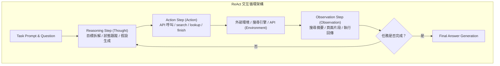

# ReAct: Synergizing Reasoning and Acting in Language Models

## 一話摘要 (TL;DR)
ReAct 透過交錯生成「自由格式思考痕跡（Thought）」與「環境交互操作（Action/Observation）」，打破傳統 Chain-of-Thought 的封閉虛構問題與單純 Act 缺乏動態規劃的限制，確立了現代 LLM Agent 與交互式檢索（Agentic RAG）的經典範式。

---

## 研究背景與問題定義 (Problem Statement)

1. **現有方法的兩極化瓶頸**：
   - **Reasoning-only（如 Chain-of-Thought, CoT）**：僅依賴 LLM 的靜態內部權重生成思維鏈。在知識密集型或即時任務中，缺乏與外在環境的接觸，極易出現事實幻覺（Fact hallucination）與錯誤累積（Error propagation）。
   - **Action-only（如 WebGPT, 經典強化學習 Agent）**：雖能調用搜尋引擎或環境 API，但無法維持動態的工作記憶、抽象目標分解或軌跡規劃，在多步驟決策中容易陷入盲目搜尋與死循環。
2. **核心研究假設**：
   - 將「內部推理（Reasoning）」與「外部行動（Acting）」交錯結合（Synergizing），使 Reasoning 成為指導 Action 的高階規劃器，Action 獲取的外部 Observation 則成為校準與修正 Reasoning 的事實依據。

---

## 核心方法與技術架構 (Methodology & Architecture)

ReAct 將 Agent 的上下文擴充為交錯的三元組序列：`Thought -> Action -> Observation`：

### 圖中節點對照
- `THOUGHT`：內部抽象推理，不改變環境狀態，用於規劃下一步或總結觀察。
- `ACTION`：具體操作指令，包含具體 API 參數（如 `search[Apple Inc.]` 或 `lookup[CEO]`）。
- `OBS`：外部系統回傳之客觀事實，注入為下一輪 Thought 的 Prompt 上下文。

---

## 主要實驗結果與證據 (Empirical Results & Evidence)

論文在問答、事實查核及具身決策三大代表性基準上進行了評估（基於 `text-davinci-002`）：

1. **知識密集問答與事實查核 (Table 1, Page 6)**：
   - **HotpotQA (Multi-hop QA)**：
     - Standard Act: 25.7% EM。
     - Chain-of-Thought (CoT): 33.8% EM（但經人工分析，幻覺率高達 56%）。
     - **ReAct**: 27.4% EM（幻覺顯著降低，主要受限於檢索失敗）。
     - **ReAct $\to$ CoT (組合策略)**：達到 **35.1% EM**，顯著超越純 CoT 與純 Act。
   - **FEVER (Fact Verification)**：
     - Standard CoT: 56.3% Acc。
     - Standard Act: 58.9% Acc。
     - **ReAct**: **60.9% Acc**，超越純推理與純行動基線。
2. **具身交互決策 (ALFWorld, Table 2, Page 7)**：
   - Act-only 成功率僅 45%（缺乏高階目標分解與狀態維持）。
   - CoT 成功率為 0%（完全無法將思維鏈映射到環境 Action 空間）。
   - **ReAct 成功率躍升至 71%**，相較 Act-only 提升了 26 個百分點。

---

## 優勢、限制及 Trade-offs (Strengths, Limitations & Trade-offs)

1. **適用任務與資料集**：極度適合需要外部事實校準的多跳問答（HotpotQA）與長序列工具呼叫任務（ALFWorld/WebShop）；但在簡單常識推理上不如純 CoT 輕量。
2. **模型規模及上下文長度**：強烈依賴足夠強的指令遵循與幾何少樣本上下文學習能力（如 GPT-3.5/GPT-4 級別）；小型開源模型易出現輸出格式崩潰。
3. **推論成本與延遲**：每一輪 `Thought -> Action -> Observation` 均需要發起一次模型推論與外部 I/O 呼叫，相較於 Single-turn RAG，API 呼叫次數與 Token 消耗呈倍數增加。
4. **失效情境**：
   - **搜尋循環死鎖**：若搜尋引擎回傳無關資訊，Thought 可能重複生成相同 Action；
   - **檢索依賴脆弱性**：檢索 Recall 低直接封頂了 Agent 的最終準確率上限。

---

## 對本專案研究領域的實際意義 (Implications for Research Domains)

1. **奠定 Agentic RAG 的理論基礎**：ReAct 證明了檢索不應只是單次的前置注入，而應作為模型可控呼叫的一種環境 Action 工具。
2. **與後續框架的承先啟後**：
   - ReAct 提供了基礎的交錯執行範式；
   - 後續被 [[03 - 論文庫 (Literature Notes)/05 - Memory & Agents/(NeurIPS 2023-12) Reflexion - Language Agents with Verbal Reinforcement Learning|Reflexion]] 擴充了失敗自省與長期語言記憶；
   - 被 [[03 - 論文庫 (Literature Notes)/05 - Memory & Agents/(NAACL 2024-06) Assisting in Writing Wikipedia-like Articles From Scratch with Large Language Models|STORM]] 擴充至多視角長篇報告研究。

---

## 原始來源及相關筆記連結 (Sources & Related Notes)

- **本地 PDF 原文**：[[Papers/05 - Memory & Agents/(ICLR 2023-05) ReAct - Synergizing Reasoning and Acting in Language Models.pdf|開啟本地 PDF 檔案]]
- **相關領域專題**：
  - [[02 - 研究領域專題 (Research Domains)/Canonical RAG Domains/Domain 12 - Agentic RAG & Orchestration|D12 Agentic RAG & Orchestration]]
  - [[02 - 研究領域專題 (Research Domains)/Canonical RAG Domains/Domain 05 - Query Understanding & Retrieval|D05 Query Understanding & Retrieval]]
- **相關核心文獻**：
  - [[03 - 論文庫 (Literature Notes)/05 - Memory & Agents/(NeurIPS 2023-12) Reflexion - Language Agents with Verbal Reinforcement Learning|Reflexion (Shinn et al., NeurIPS 2023)]]
  - [[03 - 論文庫 (Literature Notes)/05 - Memory & Agents/(NeurIPS 2023-12) Toolformer - Language Models Can Teach Themselves to Use Tools|Toolformer (Schick et al., NeurIPS 2023)]]
  - [[03 - 論文庫 (Literature Notes)/06 - Benchmarks & Evaluation/(ICLR 2024-05) AgentBench - Evaluating LLMs as Agents|AgentBench (Liu et al., ICLR 2024)]]
