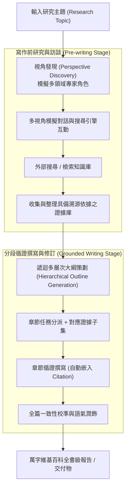

# Assisting in Writing Wikipedia-like Articles From Scratch with Large Language Models

> [!INFO] 論文元數據 (Metadata)
> - **Paper ID**：`Shao2024_STORM`
> - **作者**：Yijia Shao, Yucheng Jiang, Theodore A. Kanell, Peter Xu, Omar Khattab, Monica S. Lam
> - **預印本初次發布年份 (Preprint)**：2024
> - **正式發表年份 / 會議或期刊 (Venue)**：2024 (NAACL 2024)
> - **DOI**：無
> - **arXiv**：[2402.14207](https://arxiv.org/abs/2402.14207)
> - **驗證狀態**：`verified` (已比對原始文獻與 PDF 全文)
> - **本地 PDF 連結**：[[Papers/05 - Memory & Agents/(NAACL 2024-06) Assisting in Writing Wikipedia-like Articles From Scratch with Large Language Models.pdf|開啟本地 PDF 檔案]]
---

## 一話摘要 (TL;DR)
**史丹佛提出 STORM 系統，透過多視角訪談、大綱策劃與證據追溯，自動化撰寫萬字高結構維基百科全書級報告。**

---

## 研究背景與問題定義 (Problem Statement)
直接要求 LLM 生成長篇文件會導致結構散亂、嚴重重複、內容空洞缺乏深度，且難以進行準確的引文來源歸屬。

---

## 核心方法與技術架構 (Methodology & Architecture)
STORM（Synthesis of Topic Outlines through Repeated Multiperspective Questioning）將長篇維基百科/報告撰寫解構為三階段 Agentic 循證流程：
1. **寫作前研究與視角訪談（Pre-writing via Multiperspective Research）**：
   - 視角發現（Perspective Discovery）：從目標主題出發，模擬相關領域專家角色（如經濟學家、歷史學家、工程師）；
   - 多輪訪談對話（Simulated Conversations）：專家 Agent 透過搜尋引擎提出深層查詢，蒐集多視角客觀證據與統計數據；
2. **大綱構建與策劃（Hierarchical Outline Generation）**：
   - 彙整訪談所得證據，由大綱 Agent 遞迴擬定結構嚴密的多級章節大綱（Hierarchical Outline）；
3. **分段循證撰寫與潤飾（Grounded Article Writing & Polishing）**：
   - 依據大綱將寫作任務分派給撰寫器，每一章節僅綁定該章節所需的專屬 Evidence Set；
   - 嚴格嵌入精確引文標記（In-text Citations）；
   - 後置一致性編輯器（Post-editing Pass）：通讀全篇消除章節間語調不一致與術語重複。

---

## 主要實驗結果與證據 (Empirical Results & Evidence)
> [!NOTE] 關鍵實證數據與評估條件
> **出處與評估條件**：Table 1 & Figure 3 (Page 6-7): 作者建立了由近期真實維基百科頁面構建的評測基準 **FreshWiki**；在雙盲專家與維基百科資深編輯人工評測中，STORM 在長文條理性、資訊深度與引文準確率（Citation Recall）上，以 72% 的勝率被評為顯著優於常規 RAG 與未引導長文生成系統。

---

## 優勢、限制及 Trade-offs (Strengths, Limitations & Trade-offs)
- **優勢**：能夠自動化生成結構嚴密、多視角覆蓋、萬字以上的深度綜合長文，解決了單次生成結構空洞與內容重複的問題。
- **限制**：整體撰寫需要多次外部檢索與多 Agent 複雜互動，產生長達數分鐘至數十分鐘的生成延遲；對專業垂直工程領域的嚴格規範條款覆蓋率仍缺乏確定性代數約束（需額外引入 Evidence Governance 機制）。

---

## 在長文件處理任務中的角色與啟發 (Implications for Long-Doc Processing)
確立了『多視角研究 $\rightarrow$ 層次大綱規劃 $\rightarrow$ 循證分段撰寫 $\rightarrow$ 全域一致性審閱』的標準長篇生成工程範式。

---

## 原始來源及相關筆記連結 (Sources & Related Notes)
- **所屬研究領域**：
  - [[02 - 研究領域專題 (Research Domains)/Domain 08 - 長篇生成與報告撰寫 (STORM, Evidence Store, Ledger)|Domain 08 - 長篇生成與報告撰寫 (STORM, Evidence Store, Ledger)]]
  - [[02 - 研究領域專題 (Research Domains)/Domain 09 - Agentic 工作流與自主研究 (Planning, Multi-Agent)|Domain 09 - Agentic 工作流與自主研究 (Planning, Multi-Agent)]]
- **回主目錄**：[[00 - 導覽與心智圖 (Navigation & MOC)/Home (主目錄與知識庫導覽)|主目錄與知識庫導覽]]
- **全景心智圖**：[[00 - 導覽與心智圖 (Navigation & MOC)/LLM 超長文件處理心智圖 (MOC)|超長文件處理研究方向心智圖]]
