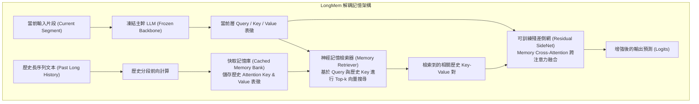

# Augmenting Language Models with Long-Term Memory (LongMem)

## 一話摘要 (TL;DR)
LongMem 提出一種「凍結主幹模型 + 可訓練殘差 SideNet」的解耦式長程記憶架構，透過神經記憶檢索器將歷史段落的 Key-Value 嵌入快取至長效記憶庫，在完全不遺忘預訓練能力的前提下，賦予 LLM 跨越數萬至上百萬 Token 的記憶增強理解能力。

---

## 研究背景與問題定義 (Problem Statement)

1. **現有長文本記憶擴展的致命矛盾**：
   - 傳統自注意力機制面臨 $O(N^2)$ 的記憶體與計算複雜度瓶頸，無法無限制容納極長歷史；
   - 循環網路（RNN/Recurrent Transformers）雖具備固定記憶體開銷，但存在記憶衰退與梯度消失問題，無法精確檢索早期特定細節；
   - 若直接重新訓練或微調具有外部記憶結構的 Transformer，往往會破壞模型既有的通用語言理解能力（災難性遺忘，Catastrophic Forgetting）。
2. **核心研究目標**：
   - 設計一種能與任何預訓練好的凍結 LLM（Frozen LLM）即插即用（Plug-and-play）整合的長期記憶機制，以極低微調成本實現無限長度記憶快取。

---

## 核心方法與技術架構 (Methodology & Architecture)

LongMem 包含三大核心組件：**凍結的主幹 LLM**、**快取記憶庫（Cached Memory Bank）** 與 **殘差側網（Residual SideNet）**：

### 圖中節點對照
- `FROZEN_LLM`：保持權重完全不變，保證基礎常識與指令跟隨能力不受干擾。
- `MEM_BANK`：以 Token 區塊為單位快取各中間層的 KV 向量，支援向量資料庫索引（如 FAISS）。
- `SIDENET`：輕量級參數量（僅佔主幹模型 10–20%），專門學習如何將檢索到的歷史記憶特徵與當前上下文以殘差形式相加。

---

## 主要實驗結果與證據 (Empirical Results & Evidence)

論文在超長文字建模（PG-22, ArXivSplits）與小說章節辨識基準（ChapterBreak）上進行了廣泛評測：

1. **長文本困惑度評估 (PG-22 & ArXiv, Table 2, Page 7-8)**：
   - 在 Project Gutenberg 長篇書籍基準（PG-22，平均長度 65k Tokens）上：
     - Frozen GPT-2 baseline: 困惑度 18.28；
     - **LongMem**: 困惑度顯著降低至 **14.36**（困惑度降幅達 3.92 點）；
     - 對比 Memorizing Transformer（PPL 15.12），LongMem 展現出更強的長期歷史利用率。
2. **小說章節後續辨識 (ChapterBreak Benchmark, Table 2, Page 8)**：
   - 評估模型在閱讀了前幾萬字後，辨識下一個正確章節後續片段的能力：
     - Baseline Transformer: 準確率 46.2%；
     - Memorizing Transformer: 準確率 58.4%；
     - **LongMem**: 取得 **65.7%** 的最高準確率，證明其神經記憶檢索模組能夠精準定位數萬 Token 之前的伏筆與人物線索。

---

## 優勢、限制及 Trade-offs (Strengths, Limitations & Trade-offs)

1. **適用任務與資料集**：對長篇小說連貫性生成、跨章節問答及超長日誌分析有顯著優勢；
2. **記憶體與推論開銷**：
   - 優點：主幹模型完全凍結，訓練只需反向傳播 SideNet，訓練成本極低；
   - 缺點：推論時需要維護龐大的 Key-Value 嵌入快取，硬碟或記憶體儲存需求隨歷史呈線性增長。
3. **與原生 Long-context 的權衡**：
   - 相較於全量注意力（Full Attention 128k），LongMem 透過 Top-k 檢索大幅壓縮了 FLOPs，但犧牲了局部連續語法結構的全局注意力連接。

---

## 對本專案研究領域的實際意義 (Implications for Research Domains)

1. **解耦架構的典範價值**：LongMem 的「Frozen Backbone + Trainable SideNet」為現代 RAG 與記憶體系統提供了一條免微調大模型的極佳途徑。
2. **串聯 KV Cache 壓縮與檢索**：揭示了 KV Cache 不僅是推論加速的副產物，更可以被直接轉化為持久化的非參數檢索庫，與 [[03 - 論文庫 (Literature Notes)/04 - Knowledge & Graph RAG/(ICML 2025-07) From RAG to Memory - Non-Parametric Continual Learning for Large Language Models|HippoRAG 2]] 的非參數連續學習理念高度共鳴。

---

## 原始來源及相關筆記連結 (Sources & Related Notes)

- **本地 PDF 原文**：[[Papers/05 - Memory & Agents/(NeurIPS 2023-12) LongMem - Augmenting Language Models with Long-Term Memory.pdf|開啟本地 PDF 檔案]]
- **相關領域專題**：
  - [[02 - 研究領域專題 (Research Domains)/Canonical RAG Domains/Domain 11 - Memory-Augmented RAG|D11 Memory-Augmented RAG]]
  - [[00 - 導覽與心智圖 (Navigation & MOC)/RAG Adjacent Interfaces|A01 Long Context & Sequence Architecture]]
- **相關核心文獻**：
  - [[03 - 論文庫 (Literature Notes)/05 - Memory & Agents/(arXiv 2023-10) MemGPT - Towards LLMs as Operating Systems|MemGPT (Packer et al., 2023)]]
  - [[03 - 論文庫 (Literature Notes)/05 - Memory & Agents/(AAAI 2024-03) MemoryBank - Enhancing Large Language Models with Long-Term Memory|MemoryBank (Zhong et al., AAAI 2024)]]
  - [[03 - 論文庫 (Literature Notes)/04 - Knowledge & Graph RAG/(ICML 2025-07) From RAG to Memory - Non-Parametric Continual Learning for Large Language Models|HippoRAG 2 (Gutiérrez et al., ICML 2025)]]
