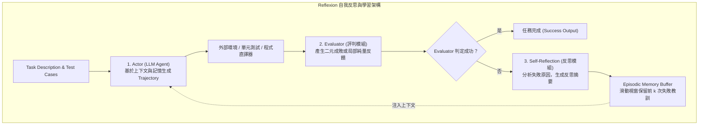

# Reflexion: Language Agents with Verbal Reinforcement Learning

## 一話摘要 (TL;DR)
Reflexion 提出一種無需微調模型權重的「語言強化學習（Verbal RL）」架構，將環境回傳的純量/二元反饋轉換為具體的語言自省摘要（Self-Reflection），儲存在短期與情境工作記憶中，實現多輪嘗試下的自我錯誤校正與效能躍升。

---

## 研究背景與問題定義 (Problem Statement)

1. **現有 Agent 反覆試錯的結構性困境**：
   - 傳統強化學習（RL）需要更新龐大的數值權重（Policy gradient / Q-learning），對數十億或數百億參數的 LLM 而言推論與訓練成本極端昂貴；
   - 既有 LLM Agent（如 ReAct）雖然具備執行動作的能力，但在遇到失敗或錯誤時，無法從先前的失敗軌跡中總結抽象的「事後檢討（Post-mortem analysis）」，容易在連續幾輪交互中重蹈覆轍。
2. **核心研究假設**：
   - 語言反饋（Verbal feedback）相較於單純的純量獎勵（Scalar reward $\pm 1$），包含了更豐富的語意診斷資訊。透過維護一個情境記憶緩衝區（Episodic memory buffer）並讓 Agent 針對錯誤產生「反思自我提示（Self-reflection prompt）」，即可在上下文層面實現類似 RL 的 policy improvement。

---

## 核心方法與技術架構 (Methodology & Architecture)

Reflexion 系統由三大核心模組構成：**Actor（執行者）**、**Evaluator（評估者）** 與 **Self-Reflection（自我反思者）**：

### 圖中節點對照
- `ACTOR`：負責採取行動或編寫程式碼的生成模型（如 GPT-4 / CodeLlama）。
- `EVAL`：判斷當前軌跡成敗的環境信號（如編譯錯誤、單元測試 Assert Error 或 QA 評估器）。
- `REFLECT`：特殊 Prompting 模型，輸入「歷史軌跡 + 失敗信號」，輸出下一輪不應再犯的具體警示。
- `MEMORY`：維護有限長度之反思字串佇列，在下一次 Trial 開始時拼接入 Actor 的 Prompt。

---

## 主要實驗結果與證據 (Empirical Results & Evidence)

論文在程式碼生成（HumanEval, MBPP）、具身決策（ALFWorld）以及多跳推理（HotpotQA）上進行了全方位驗證：

1. **程式碼生成基準 (Table 1, Page 7)**：
   - 在 **HumanEval (Python)** 基準上（以 GPT-4 為基座）：
     - Zero-shot Baseline: 67.0% pass@1。
     - **Reflexion (經過自我反思試錯)**：顯著躍升至 **91.0% pass@1**（絕對提升 +24.0 個百分點）。
   - 在 **HumanEval (Rust)** 上：
     - Zero-shot Baseline: 48.0% pass@1。
     - **Reflexion**: 躍升至 **71.0% pass@1**（絕對提升 +23.0 個百分點）。
   - 在 **MBPP (Python)** 上：
     - Zero-shot Baseline: 68.0% pass@1。
     - **Reflexion**: 提升至 **82.0% pass@1**。
2. **具身決策與多跳問答 (Table 2, Page 8)**：
   - **ALFWorld**：
     - ReAct baseline 成功率為 73%；
     - **Reflexion 成功率高達 97%**（在 134 個未見任務中，成功修復了絕大多數因無效操作導致的死局）。
   - **HotpotQA**：
     - 初始準確率 34.0%，透過 Reflexion 檢索反思後提升至 **54.0%**。

---

## 優勢、限制及 Trade-offs (Strengths, Limitations & Trade-offs)

1. **適用任務與資料集**：對具備「明確客觀反饋信號」（如單元測試、編譯器訊息、可判別的正反規則）的任務效果極其顯著；若評估者自身存在高噪聲，反思可能產生誤導。
2. **模型規模及上下文長度**：需要模型具備批判性推理能力（Critical self-assessment）。若使用 7B 等級小型開源模型，容易產生「無效自責」或「空洞反思」。
3. **推論成本與延遲**：多輪 Trial 與反思使得單一任務的 Token 消耗增加 3–5 倍，總體推論時間顯著延長。
4. **失效情境**：
   - **幻覺反思（Hallucinatory Reflection）**：模型對失敗原因歸咎錯誤（如把邏輯錯誤歸咎於變數命名），導致下一次嘗試往錯誤方向調整；
   - **上下文溢出**：若記憶緩衝區未設定淘汰策略（Sliding window），歷史反思將迅速擠爆 Context Window。

---

## 對本專案研究領域的實際意義 (Implications for Research Domains)

1. **外部記憶體與 Agentic 工作流的關鍵演進**：Reflexion 證明了記憶體不應只儲存歷史 Raw Data，更應儲存結構化的高階經驗反省（Episodic verbal insights）。
2. **為長文本與複雜 RAG 治理提供自癒機制**：在長篇報告生成中，可借鑑 Reflexion 理念：當驗證器（Critic）發現某一章節證據不足或存在幻覺時，不需全篇重寫，而是生成局部的自省指示，觸發二次針對性檢索與重寫。

---

## 原始來源及相關筆記連結 (Sources & Related Notes)

- **本地 PDF 原文**：[[Papers/05 - Memory & Agents/(NeurIPS 2023-12) Reflexion - Language Agents with Verbal Reinforcement Learning.pdf|開啟本地 PDF 檔案]]
- **相關領域專題**：
  - [[02 - 研究領域專題 (Research Domains)/Domain 12 - Agentic RAG & Orchestration|D12 Agentic RAG & Orchestration]]
  - [[02 - 研究領域專題 (Research Domains)/Domain 11 - Memory-Augmented RAG|D11 Memory-Augmented RAG]]
- **相關核心文獻**：
  - [[03 - 論文庫 (Literature Notes)/05 - Memory & Agents/(ICLR 2023-05) ReAct - Synergizing Reasoning and Acting in Language Models|ReAct (Yao et al., ICLR 2023)]]
  - [[03 - 論文庫 (Literature Notes)/05 - Memory & Agents/(arXiv 2023-10) MemGPT - Towards LLMs as Operating Systems|MemGPT (Packer et al., 2023)]]
  - [[03 - 論文庫 (Literature Notes)/05 - Memory & Agents/(NeurIPS 2025-12) A-MEM - Agentic Memory for LLM Agents|A-MEM (Xu et al., NeurIPS 2025)]]
