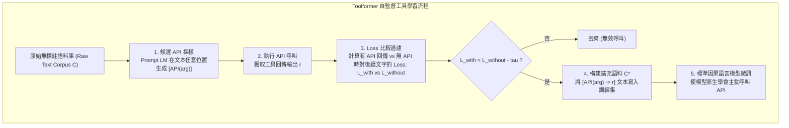

# Toolformer: Language Models Can Teach Themselves to Use Tools

## 一話摘要 (TL;DR)
Toolformer 提出一種自監督學習方法，讓語言模型透過自採樣候選 API 調用、執行驗證並僅保留「能顯著降低後續 Token 預測 Loss」的調用實例，使 6.7B 規模的 GPT-J 能夠自主學會使用計算機、維基百科檢索、問答系統及日曆，在數理與事實性任務上擊敗 175B 的 GPT-3。

---

## 研究背景與問題定義 (Problem Statement)

1. **大語言模型的基礎功能矛盾**：
   - 儘管超大型語言模型展現出強大的小樣本少樣本泛化能力，但在某些非常基礎的功能上表現極差，例如精確算術運算、查驗即時事實或時間計算；
   - 傳統方案依賴人工大量標註包含特定工具調用指令的對話資料，或依賴極長 Prompt 進行 Few-shot 演示，擴展性受限且泛化能力脆弱。
2. **核心研究目標**：
   - 模型是否能夠在完全無需人工標註 API 標籤的情況下，「自學（Teach themselves）」何時調用何種工具、傳遞何種參數，並將工具回傳結果無縫整合進自身的文字生成流中？

---

## 核心方法與技術架構 (Methodology & Architecture)

Toolformer 的核心機制是**基於語言模型 Loss 降幅的自監督過濾流水線（Self-Supervised Loss-Driven Filtering）**：

### 圖中節點對照
- `SAMPLE`：透過幾條 In-context examples，啟發 LM 在普通文字中插入 `<API>tool_name(input)</API>`。
- `EXEC`：實際調用 Calculator、Wikipedia Search、QA、Machine Translation 或 Calendar API。
- `LOSS_CALC`：比較 $L_i(c_i \to r_i)$ 與 $\min(L_i(c_i \to \epsilon), L_i(\epsilon))$，只有當 API 結果顯著降低 Token cross-entropy loss 時才保留。
- `FINETUNE`：在過濾後的資料集上進行標準語言模型自回歸訓練。推論時遇到 `<API>` 即暫停生成並調用工具。

---

## 主要實驗結果與證據 (Empirical Results & Evidence)

實驗以 6.7B 參數的 GPT-J 為基礎模型，在未額外增加模型參數的情況下評估各類下游任務：

1. **事實性檢索任務 (LAMA Subsets, Table 3, Page 6)**：
   - **SQuAD subset**: Baseline GPT-J 為 17.8；**Toolformer 躍升至 33.8**（超越 OPT-66B 的 21.6 與 GPT-3 175B 的 26.8）。
   - **Google-RE**: Baseline GPT-J 為 4.9；**Toolformer 達到 11.5**（GPT-3 175B 為 7.0）。
   - **T-REx**: Baseline GPT-J 為 31.9；**Toolformer 達到 53.5**（GPT-3 175B 為 39.8）。
   - 分析表明，模型在 98.1% 的情況下自主決定調用問答工具。
2. **數學推理基準 (Table 4, Page 6)**：
   - **ASDiv**: GPT-J baseline 7.5 $\to$ **Toolformer 40.4**（GPT-3 175B 僅 14.0）。
   - **SVAMP**: GPT-J baseline 5.2 $\to$ **Toolformer 29.4**（GPT-3 175B 僅 10.0）。
   - **MAWPS**: GPT-J baseline 9.9 $\to$ **Toolformer 44.0**（GPT-3 175B 僅 19.8）。
   - 模型在 97.9% 的數理題目中自發調用計算機（Calculator）API。
3. **開放領域問答 (Table 5, Page 7)**：
   - 在 WebQuestions (WebQS)、Natural Questions (NQ) 與 TriviaQA 上，Toolformer 分別取得 26.3、17.7 與 48.8 分，顯著超越同尺寸 GPT-J baseline（18.5、12.8、43.9），在 99.3% 的測試案例中自發使用 Wikipedia 檢索。

---

## 優勢、限制及 Trade-offs (Strengths, Limitations & Trade-offs)

1. **適用任務與資料集**：對算術（Calculator）、時效查驗（Calendar/Search）及常識事實查詢極度有效；但在需要多輪複雜規劃的長流程任務中，無法取代高階 Agent。
2. **模型規模及上下文長度**：在 6.7B 規模下即可成功訓練，顯著降低了小模型對大模型特定能力的依賴；但訓練資料篩選依賴大量 API 呼叫前置計算。
3. **推論延遲**：推論時若頻繁觸發 API 調用，串行 I/O 等待時間將成為服務延遲瓶頸。
4. **失效情境**：
   - **無法交互調整（Single-turn API call only）**：若搜尋引擎第一次回傳結果不佳，Toolformer 無法像 ReAct 一樣重新改寫 Query 或進行第二輪檢索；
   - **工具不可組合**：難以原生支援巢狀工具呼叫（例如用計算機算出的數字作為搜尋關鍵字）。

---

## 對本專案研究領域的實際意義 (Implications for Research Domains)

1. **RAG 模組化與自適應檢索的底層依據**：Toolformer 證明了「檢索行為」可以被自然地建模為語言模型的一個特殊 Token 觸發器，這為後續的 Adaptive RAG、Self-RAG 等條件檢索技術奠定了關鍵範式。
2. **啟發知識庫的工具治理架構**：在長篇報告與知識管理中，模型應區分哪些內容依賴內部長文本注意力、哪些應委派給外部 API（如代碼執行器或精確計算器）。

---

## 原始來源及相關筆記連結 (Sources & Related Notes)

- **本地 PDF 原文**：[[Papers/05 - Memory & Agents/(NeurIPS 2023-12) Toolformer - Language Models Can Teach Themselves to Use Tools.pdf|開啟本地 PDF 檔案]]
- **相關領域專題**：
  - [[02 - 研究領域專題 (Research Domains)/Domain 12 - Agentic RAG & Orchestration|D12 Agentic RAG & Orchestration]]
  - [[02 - 研究領域專題 (Research Domains)/Domain 05 - Query Understanding & Retrieval|D05 Query Understanding & Retrieval]]
- **相關核心文獻**：
  - [[03 - 論文庫 (Literature Notes)/05 - Memory & Agents/(ICLR 2023-05) ReAct - Synergizing Reasoning and Acting in Language Models|ReAct (Yao et al., ICLR 2023)]]
  - [[03 - 論文庫 (Literature Notes)/03 - RAG & Retrieval/(ICLR 2024-05) Self-RAG - Learning to Retrieve, Generate, and Critique through Self-Reflection|Self-RAG (Asai et al., ICLR 2024)]]
  - [[03 - 論文庫 (Literature Notes)/03 - RAG & Retrieval/(NAACL 2024-06) Adaptive-RAG - Learning to Adapt Retrieval-Augmented Large Language Models through Question Complexity|Adaptive-RAG (Jeong et al., NAACL 2024)]]
