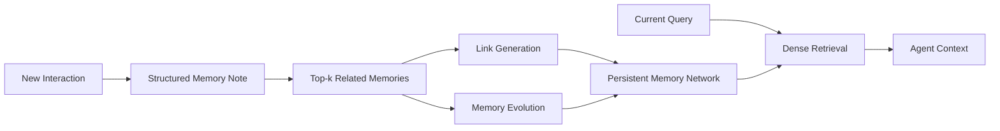

# A-Mem: Agentic Memory for LLM Agents

## 一話摘要 (TL;DR)
A-MEM 以 Zettelkasten 式原子筆記為靈感，讓 LLM agent 在寫入新記憶時自動建立結構化屬性與跨記憶連結，並可因新經驗更新既有記憶的 context / keywords / tags；核心貢獻是 **dynamic memory organization、link generation 與 memory evolution**，不是預先固定的「episodic / semantic / procedural 階層記憶」。

## 研究背景與問題定義 (Problem Statement)
既有 agent memory 多能儲存與檢索歷史，但通常依賴預先定義的資料結構、寫入點與固定 workflow。A-MEM 問的是：能否讓 memory organization 本身隨新經驗自動形成與演化，而不是只把對話片段塞進向量庫。

## 核心方法與技術架構 (Methodology & Architecture)

1. **Note Construction**：每筆 memory 形成含 content、contextual description、keywords、tags、timestamp 與 embedding 的 note。
2. **Link Generation**：新 note 先以 embedding 找鄰近歷史記憶，再由 LLM 判斷可建立的語意連結。
3. **Memory Evolution**：新記憶可觸發相關舊記憶的 context、keywords、tags 更新，使 memory network 隨時間重組。
4. **Retrieval**：query 以相同 encoder 取得 embedding，依 cosine similarity 取 Top-k memories 注入 agent context。

## 主要實驗結果與證據 (Empirical Results & Evidence)

論文以 **LoCoMo** 與 **DialSim** 長期對話資料評估多種 foundation models。LoCoMo 涵蓋 single-hop、multi-hop、temporal、open-domain 與 adversarial QA。

- **Table 1, Page 6（LoCoMo, GPT-4o-mini）**：A-MEM 的 Temporal F1 為 **45.85**，MemGPT 為 **25.52**；A-MEM 的 retrieval context token length 為 **2,520**，MemGPT 為 **16,977**。
- **Table 1, Page 6（LoCoMo, GPT-4o）**：A-MEM 的 Multi-hop F1 為 **32.86**、Temporal F1 為 **39.41**；結果依模型與題型不同，不能概括成所有 memory task 都優於所有 baselines。
- 論文同時在六個 foundation models 上比較 LoCoMo / DialSim；因此較合理的結論是 A-MEM 在其長期對話評測中展現 memory organization 的效益，而不是證明一個通用 RAG memory architecture 已被解決。

## 優勢、限制及 Trade-offs (Strengths, Limitations & Trade-offs)

- **優勢**：記憶連結與描述可隨新經驗更新，不必完全依賴固定 schema；可降低直接塞入完整長對話歷史的 token 開銷。
- **額外成本**：寫入不只是 append；link generation 與 memory evolution 需要額外 LLM 判斷與更新。
- **一致性風險**：更新舊記憶可改善組織，但也引入 mutation / stale-link / provenance 問題，實際系統需額外治理。
- **評測邊界**：主要證據來自長期對話 / QA memory benchmarks，不能直接外推為企業 corpus RAG、index maintenance 或 factual conflict resolution 的最佳方法。

## 對本專案研究領域的實際意義 (Implications for Research Domains)

- **D11 Memory-Augmented RAG**：直接支撐 persistent memory 的 write / link / evolve / retrieve lifecycle。
- **D12 Agentic RAG & Orchestration**：其 memory update decisions 具有 agentic control 特徵，但主要 contribution 仍是 memory system。
- **與 D10 的邊界**：A-MEM 更新的是 agent-derived persistent memory，不是外部 canonical knowledge base 的 incremental index maintenance。

## 原始來源及相關筆記連結 (Sources & Related Notes)

- **NeurIPS 2025 Proceedings**：https://proceedings.neurips.cc/paper_files/paper/2025/hash/19909c36f51abc4856b4560aff3d36d6-Abstract-Conference.html
- **arXiv**：https://arxiv.org/abs/2502.12110
- **本地 PDF**：目前未存；先前同名檔案實際是 NoLiMa（arXiv:2502.05167），已判定為錯誤工件，不能作為本篇來源。
- **相關領域**：[[02 - 研究領域專題 (Research Domains)/Domain 11 - Memory-Augmented RAG|D11 Memory-Augmented RAG]]、[[02 - 研究領域專題 (Research Domains)/Domain 12 - Agentic RAG & Orchestration|D12 Agentic RAG & Orchestration]]
