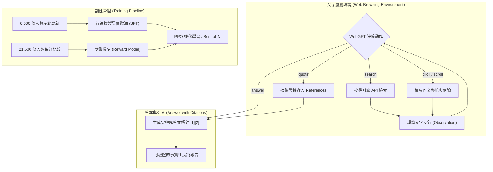

# WebGPT: Browser-assisted question-answering with human feedback

## 一話摘要 (TL;DR)
WebGPT 是首個透過純文字網頁瀏覽環境與人類回饋強化學習（RLHF）微調 LLM 進行主動網路檢索與引用引文（Citations）的系統，在 ELI5 長篇開放式問答基準上，其生成回答在人工盲測中以 56% 的勝率擊敗人類專家示範答案，以 69% 的勝率擊敗 Reddit 原生社群參考解答。

---

## 研究背景與問題定義 (Problem Statement)
在 2021 年大語言模型（如 GPT-3）崛起初期，學界面臨長篇開放問答（Long-Form QA）的三大核心痛點：
1. **事實幻覺與無法驗證性（Unverifiable Hallucinations）**：模型依靠內部參數記憶回答複雜問題，往往編造貌似合理卻錯誤的細節，且沒有任何外部可查驗的參考來源。
2. **長篇回答難以評估**：不同於單詞事實問答，開放式長文解釋難以用簡單的字串匹配（Exact Match）評估，人工審查人員驗證回答耗時耗力。
3. **被動靜態檢索的侷限**：傳統 RAG 僅由檢索器一次性抓取固定文本，缺乏如同人類研究人員「搜尋關鍵字 $\rightarrow$ 點擊網頁 $\rightarrow$ 滾動閱讀 $\rightarrow$ 摘錄引用」的主動資訊採集決策能力。

---

## 核心方法與技術架構 (Methodology & Architecture)

WebGPT 將長篇問答構建為一個**文字互動環境下的序貫決策問題（Sequential Decision Making）**：
1. **文字網頁瀏覽器環境（Text-based Browser Environment）**：
   - 模型可發出特定的指令動作（Actions）：`search(query)` 發起網路搜尋、`click(link)` 點擊搜尋結果、`scroll(direction)` 上下滾動瀏覽頁面、`quote()` 框選並保存當前頁面片段至參考列表（References）、`answer()` 終止瀏覽並依據收集之引文生成最終長篇解答。
2. **模仿學習（Imitation Learning / Behavior Cloning）**：
   - 收集約 6,000 條人類在瀏覽器環境中查詢、導航與引用的完整行為軌跡；
   - 透過監督式微調（SFT）訓練 GPT-3 模仿人類的網路研究行為。
3. **人類偏好強化學習（RLHF & Rejection Sampling）**：
   - 收集 21,500 條成對答案比較資料（標註事實準確度、連貫性與引文支持度），訓練獎勵模型（Reward Model）；
   - 採用 PPO 強化學習與 Best-of-$N$ 拒絕採樣優化搜索決策與長文生成。

### 圖中節點對照
- `ACT`：包含 search, click, scroll, quote, answer 的核心決策空間。
- `QUOTE`：將可追溯來源文字加入上下文引文池的動作。
- `RM`：基於人類偏好構建的事實與引用獎勵模型。
- `GEN`：強制錨定引用區塊的回答生成模組。

---

## 主要實驗結果與證據 (Empirical Results & Evidence)

論文在 Reddit ELI5（Explain Like I'm 5）長篇問答與 TruthfulQA 上進行了雙盲人工評測。

### 1. ELI5 人工偏好盲測 (Figure 2 & Section 4.1, Page 5–6)
- **對抗 Reddit 原生社群參考答案（vs. ELI5 Reference Answers）**：
  - 175B Best-of-64 模型生成的答案在 **69%** 的對比中被標註人員選為更佳答案（Preferred）。
- **對抗人類示範答案（vs. Human Demonstrations）**：
  - 175B Best-of-64 模型生成的答案在 **56%** 的對比中被選為優於人類研究員花費數分鐘瀏覽網頁後寫出的示範答案。
- **事實準確度與引用完整度**：模型答案的引文支持率（Factual accuracy judged with quotes）大幅降低了審查者的核驗難度。

### 2. TruthfulQA 評測 (Section 4.2, Page 7)
- WebGPT-175B 在 TruthfulQA 上的真實性與資訊量評分達到 **75%**，遠超原始 GPT-3 175B 的 28%，證明結合主動檢索與引用顯著抑制了常見常識偏見與虛假陳述。

---

## 優勢、限制及 Trade-offs (Strengths, Limitations & Trade-offs)

### 優勢
1. **奠定可驗證長篇問答的工業標準**：確立了「答案必須附帶網頁原文精確引用（Inline Quotes & Citations）」的架構，使生成結果具備可審查性。
2. **主動多步檢索範式**：擺脫了傳統單步檢索的視野受限，模型可根據搜尋結果自主發起二次細化查詢。

### 限制與 Trade-offs
1. **推論延遲與 API 成本極高**：單個問題需要調用十幾次 LLM 執行動作預測與網頁閱讀，回答一個問題耗時可達數十秒。
2. **缺乏全域結構化規劃**：WebGPT 沒有大綱生成與分節合成機制，回答長度通常限制在數百字，難以直接撰寫數千字甚至上萬字的多章節深度調研報告。

---

## 對本專案研究領域的實際意義 (Implications for Research Domains)
1. **對 Domain 08 (Long-form Report Generation) 的奠基意義**：WebGPT 是後續 STORM、EviReport 等長篇深度研究架構的鼻祖，首次在神經架構層面驗證了「引用引文（Citing Sources）」是保障長文真實性的唯一護城河。
2. **對 Domain 16 (Context Utilization & Faithfulness) 的啟示**：證明了強制模型輸出顯式引用錨點（Quote Spans）能大幅約束解碼空間，杜絕無來源支撐的事實性幻覺。

---

## 原始來源及相關筆記連結 (Sources & Related Notes)
- 原始論文 PDF：[[Papers/05 - Memory & Agents/(arXiv 2021-12) WebGPT - Browser-assisted question-answering with human feedback.pdf|開啟本地 PDF]]
- arXiv 永久連結：[arXiv:2112.09332](https://arxiv.org/abs/2112.09332)
- 關聯專題領域：[[02 - 研究領域專題 (Research Domains)/Domain 08 - 長篇生成與報告撰寫 (STORM, Evidence Store, Ledger)|Domain 08 - 長篇生成與報告撰寫]]、[[02 - 研究領域專題 (Research Domains)/Domain 09 - Agentic 工作流與自主研究 (Planning, Multi-Agent)|Domain 09 - Agentic 工作流]]
