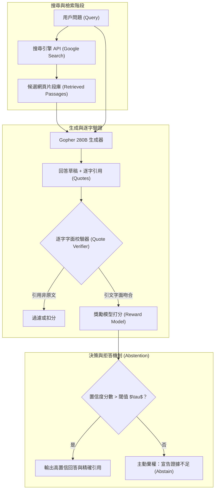

# Teaching language models to support answers with verified quotes (GopherCite)

## 一話摘要 (TL;DR)
DeepMind 提出的 GopherCite 利用 Google 搜尋引擎檢索外部網頁，並結合人類偏好強化學習（RLHP）訓練模型在生成長篇解答時精準提取字面逐字引用（Verbatim Quotes）；更關鍵的是引入了「拒絕回答（Abstention）」機制，當缺乏可驗證的充分證據時選擇棄權，使 ELI5 長篇問答的高品質答案比例大幅提升至 80%。

---

## 研究背景與問題定義 (Problem Statement)
現有大語言模型在生成長篇專業知識時面臨兩大核心可靠性挑戰：
1. **可疑的引用標註（Superficial Citations）**：許多系統僅給出粗略網址或論文標題，讀者無法驗證具體哪一句話支撐了模型的哪一項具體主張；甚至模型會捏造虛假引用。
2. **強行回答導致幻覺（Forced Generation）**：當檢索到的上下文資訊不足以完全回答問題時，標準模型受限於貪婪生成機制，往往「一本正經地胡說八道」。
3. **字面精確度的嚴苛要求**：工程與學術應用要求引文必須逐字精確匹配原始來源文檔（Verbatim Extraction），不容許引文本身出現二度失真。

---

## 核心方法與技術架構 (Methodology & Architecture)

GopherCite 構建了**搜尋增強（Search-augmented）**、**逐字引用抽取（Verbatim Quote Extraction）** 與 **基於置信度的拒答機制（Selective Abstention）**：
1. **搜尋與候選片段生成**：
   - 接收問題後向 Google 搜尋引擎發出檢索請求；
   - 提取檢索到的網頁段落，由 280B Gopher 模型生成包含特定格式標籤的回答草稿與對應的引用文本跨度（Quote Spans）。
2. **逐字引用驗證器（Verbatim Quote Verifier）**：
   - 強制執行字面核驗演算法，檢查模型產生的 Quote 是否 100% 存在於檢索到的來源文本中；
   - 若引文存在拼寫改動或非字面吻合，立即觸發懲罰或修正。
3. **人類偏好強化學習（RLHP）與拒絕機制（Abstention Mechanism）**：
   - 訓練專門的獎勵模型（Reward Model）判斷：(1) 回答是否具備高品質；(2) 引文是否強烈支持主張；
   - 設立動態閾值 $\tau$：若模型預測最佳答案的獎勵分數低於閾值，模型主動輸出「我無法根據現有檢索結果找到足夠證據回答此問題」（I don't know），實現自我審查與風險阻斷。

### 圖中節點對照
- `SEARCH`：外掛搜尋引擎介面。
- `VERIFY`：保證引文字符串與來源篇章完全一致的剛性過濾器。
- `RM`：評估事實支持度與回答全面性的人類偏好獎勵模型。
- `ABSTAIN`：證據不足時的防禦性安全機制。

---

## 主要實驗結果與證據 (Empirical Results & Evidence)

論文在 Natural Questions (NQ) 與 Reddit ELI5 資料集上進行了大規模人工雙盲審核。

### 1. 回答品質與引用支持率 (Section 1 & Section 3, Page 1–3)
- **Natural Questions 基準**：
  - 在無拒答設定下，高品質回答率達 **80%**；
  - 產生的引用有 **超過 90%** 能夠精準且充分支撐其前置語句。
- **ELI5 長篇問答基準**：
  - 在強制回答所有問題的情境下，高品質答案率為 **67%**；
  - **啟用選擇性拒答（Abstention）機制後**：模型在過濾掉不確定性高的長篇難題後，生成答案的高品質率激增至 **80%**（提升 **+13%**）。

### 2. 逐字引用的可驗證性
- 標註人員對 GopherCite 的核對速度提升了近 3 倍，因每項宣稱均附帶了直接對應的原文 Quote，極大消除了幻覺並簡化了人機協同審計流程。

---

## 優勢、限制及 Trade-offs (Strengths, Limitations & Trade-offs)

### 優勢
1. **首創拒絕回答（Abstention）的長篇可靠性邊界**：明確證明了「知道自己不知道」是提升 RAG 長篇生成可信度的最有效手段。
2. **逐字精確引用的剛性約束**：徹底根除了傳統 LLM「自創引文」與「張冠李戴」的嚴重視覺欺騙問題。

### 限制與 Trade-offs
1. **拒答率與回答覆蓋率的權衡（Coverage-Precision Trade-off）**：若將品質要求設為極高，模型拒答率可能上升至 20%–40%，在要求必須給出建設性提案的業務中需精心調優閾值。
2. **多文檔交叉推理能力有限**：模型偏向尋找單一高置信段落中的直截了當引用，對於需要跨 3–5 篇分散證據進行長鏈條綜合推導的複雜場景處理較弱。

---

## 對本專案研究領域的實際意義 (Implications for Research Domains)
1. **對 Domain 14 (Evidence Sufficiency) 的核心支撐**：GopherCite 提供了「證據充分性判定（Sufficiency Assessment）」的早期標竿實踐，為本專案設計 Evidence Gap Controller 與主動拒答門檻提供了直接的文獻背書。
2. **對 Domain 16 (Context Utilization & Faithfulness) 的啟示**：證明了「字面抽取約束（Extractive Quote Constraint）」能夠有效防止模型在長文本解碼過程中進行語意自由發揮。

---

## 原始來源及相關筆記連結 (Sources & Related Notes)
- 原始論文 PDF：[[Papers/05 - Memory & Agents/(arXiv 2022-03) Teaching language models to support answers with verified quotes.pdf|開啟本地 PDF]]
- arXiv 永久連結：[arXiv:2203.11147](https://arxiv.org/abs/2203.11147)
- 關聯專題領域：[[02 - 研究領域專題 (Research Domains)/Domain 08 - 長篇生成與報告撰寫 (STORM, Evidence Store, Ledger)|Domain 08 - 長篇生成與報告撰寫]]、[[02 - 研究領域專題 (Research Domains)/Domain 14 - Evidence Sufficiency & Adaptive Retrieval|Domain 14 - Evidence Sufficiency]]、[[02 - 研究領域專題 (Research Domains)/Domain 16 - Context Utilization & Faithfulness|Domain 16 - Context Utilization]]
