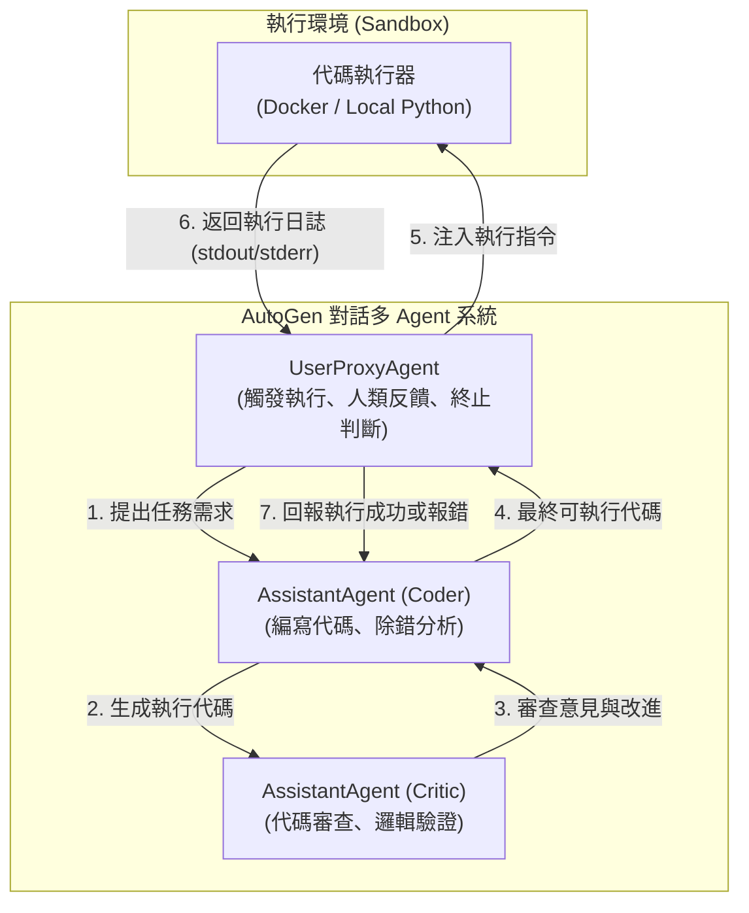

# AutoGen: Enabling Next-Gen LLM Applications via Multi-Agent Conversation

## 一話摘要 (TL;DR)
微軟提出的 **AutoGen** 是一個基於「可對話代理（Conversable Agents）」的多 Agent 協同開發框架，將複雜 LLM 應用解耦為多個具備特定角色、工具與人類介入機制的 Agent 之間的結構化對話，在數學推理、互動式檢索與實體環境決策（如 ALFWorld 達成率提升 15%）中顯著超越單 Agent 與靜態 Prompting。

---

## 研究背景與問題定義 (Problem Statement)

1. **現有 LLM 應用的單一性與脆弱性**：
   - 儘管單一 LLM 具備強大推論能力，但在處理需要多步編程、即時代碼執行、工具反饋與專業角色分工的複雜任務時，單一提示（Prompting）或單 Agent 迴圈（如純 ReAct）極易陷入死循環、語意漂移或產生邏輯錯誤。
2. **缺乏統一的多 Agent 互動程式化模型**：
   - 先前多 Agent 研究多針對特定任務（如 ChatEval 評測或 Camel 角色扮演）編寫客製化腳本，缺乏通用的代理抽象層，難以靈活整合 LLM、人類反饋（Human-in-the-loop）與外部執行環境（如 Python REPL）。
3. **研究核心假設**：
   - 只要定義好 Agent 的**可對話性（Conversability）**與**會話控制（Conversation Programming）**，即可透過純自然語言訊息交換統一規劃、工具調用、自我修正與人機協作。

---

## 核心方法與技術架構 (Methodology & Architecture)

AutoGen 的架構由兩大核心概念構成：**Conversable Agents** 與 **Conversation-Driven Execution**。

### 1. Conversable Agent 設計
每個 Agent 均為一個能發送、接收與處理訊息的有狀態實體，主要組件包括：
- **LLM-based Agent（如 AssistantAgent）**：配置特定 System Message，扮演特定專業角色（如 Programmer, Critic, Planner, Coder）。
- **User-proxy Agent（如 UserProxyAgent）**：代表人類使用者或環境執行器，負責代碼執行（Code Execution）、安全確認與人類反饋輸入。
- **自定義回復機制（Reply Functions）**：根據接收到的最後訊息觸發 LLM 生成、代碼執行或預設邏輯規則。

### 圖中節點對照
- `USER`：對應 AutoGen `UserProxyAgent` 類別，負責代碼執行與中斷控制。
- `CODER`：對應 AutoGen `AssistantAgent` 類別，扮演代碼編寫者。
- `CRITIC`：對應 AutoGen `AssistantAgent` 類別，扮演審查者。
- `EXEC`：本地或容器化執行沙箱環境。

### 2. 靈活的會話模式 (Conversation Patterns)
- **兩實體對話（Two-agent Chat）**：如 UserProxy 與 AssistantAgent 進行代碼編寫與除錯閉環。
- **順序對話（Sequential Chat）**：前一個 Agent 對話的總結作為下一個對話的輸入。
- **群組動態對話（GroupChat & GroupChatManager）**：透過管理者（Manager）利用 LLM 動態決定下一個發言的 Agent，或依狀態機（FSM）約束發言順序。

---

## 主要實驗結果與證據 (Empirical Results & Evidence)

論文在六大具代表性的應用場景中進行實證評估（第 6–10 頁）：

1. **數學問題求解（MATH Benchmark, Figure 4a, Page 7）**：
   - 採用 GPT-4 配合 AutoGen 雙 Agent（Assistant + UserProxy 代碼執行）：
   - 相較於純 GPT-4 Zero-shot / Few-shot，引入 AutoGen 代碼執行與錯誤重試機制後，成功率從 **53.9%** 躍升至 **85.0%** 以上。
2. **互動式問答與檢索（Natural Questions, Figure 4b, Page 7）**：
   - 採用具備檢索能力的可對話 Agent（Interactive Retrieval）：
   - 在 NQ 資料集上，AutoGen 互動式檢索顯著優於單一 DPR 檢索，證明多次往返對話能精確釐清不完整的檢索查詢。
3. **實體環境互動決策（ALFWorld, Figure 4c, Page 8）**：
   - 在 134 個未見過（unseen）的具身決策任務中：
   - 引入具備環境常識的 Grounding Agent 組成的三 Agent 系統，成功率較傳統 ReAct 基準顯著提升了 **15%**（達成率從 ~65% 提升至 >80%）。
4. **供應鏈多目標優化（Supply Chain Optimization, Figure 4d, Page 8）**：
   - 多 Agent 角色扮演（財務、物流、庫存）在動態發言選擇機制下，辨識關鍵約束條件的 F1 分數顯著提高，同時動態發言選擇大幅減少了 30% 以上的冗餘 LLM 調用。

---

## 優勢、限制及 Trade-offs (Strengths, Limitations & Trade-offs)

### 優勢
1. **極度簡約且強大的抽象**：將所有 Agent 操作統一為「發送/接收字串訊息」，降低系統複雜度。
2. **原生整合代碼執行與人機協同**：UserProxyAgent 能無縫調用沙箱執行 Python/Bash 代碼，解決 LLM 純語言推理無運算能力的缺陷。
3. **模組化與可擴充性**：支援隨意嵌套、自定義 Tool、自定義終止條件與狀態機路由。

### 限制與 Trade-offs
1. **Token 消耗與延遲高昂**：多 Agent 群聊（GroupChat）中，每輪訊息通常廣播至所有參與者，上下文長度呈超線性增長，API 成本與延遲劇增。
2. **對話死循環與發言漂移（Infinite Loops & Drift）**：若未妥善設計 `is_termination_msg`，Agent 之間容易產生互相客套或循環附和，需仰賴剛性狀態機或最大輪次硬性截斷。
3. **沙箱安全風險**：若未部署於嚴密隔離的 Docker 容器中，Agent 生成的任意代碼可能對宿主機檔案系統造成不可逆破壞。

---

## 對本專案研究領域的實際意義 (Implications for Research Domains)

1. **對 D12（Agentic RAG & Orchestration）的啟示**：
   - AutoGen 是現代 Multi-Agent 系統的骨幹參考實作；本專案在設計長篇報告的多角色撰寫（如 Outline Planner, Retrieval Specialist, Section Drafter, Fact Checker）時，應吸收其角色隔離與訊息傳遞模式。
2. **對 D11（Memory-Augmented RAG）的啟示**：
   - 可以在 Agent 內部客製化記憶模組（如專屬向量庫或 HippoRAG 圖譜），實現多 Agent 協同且異質的知識庫管理。

---

## 原始來源及相關筆記連結 (Sources & Related Notes)

- **本地 PDF**：`[[Papers/05 - Memory & Agents/(arXiv 2023-08) AutoGen - Enabling Next-Gen LLM Applications via Multi-Agent Conversation.pdf|開啟本地 PDF 檔案]]`
- **官方開源庫**：[Microsoft AutoGen GitHub](https://github.com/microsoft/autogen)
- **關聯領域筆記**：
  - [[02 - 研究領域專題 (Research Domains)/Domain 12 - Agentic RAG & Orchestration|D12 Agentic RAG & Orchestration]]
  - [[02 - 研究領域專題 (Research Domains)/Domain 11 - Memory-Augmented RAG|D11 Memory-Augmented RAG]]
- **同類/相關論文筆記**：
  - [[03 - 論文庫 (Literature Notes)/05 - Memory & Agents/(ICLR 2023-05) ReAct - Synergizing Reasoning and Acting in Language Models|(ICLR 2023-05) ReAct]]
  - [[03 - 論文庫 (Literature Notes)/05 - Memory & Agents/(NeurIPS 2023-12) Reflexion - Language Agents with Verbal Reinforcement Learning|(NeurIPS 2023-12) Reflexion]]
  - [[03 - 論文庫 (Literature Notes)/06 - Benchmarks & Evaluation/(ICLR 2024-05) AgentBench - Evaluating LLMs as Agents|(ICLR 2024-05) AgentBench]]
