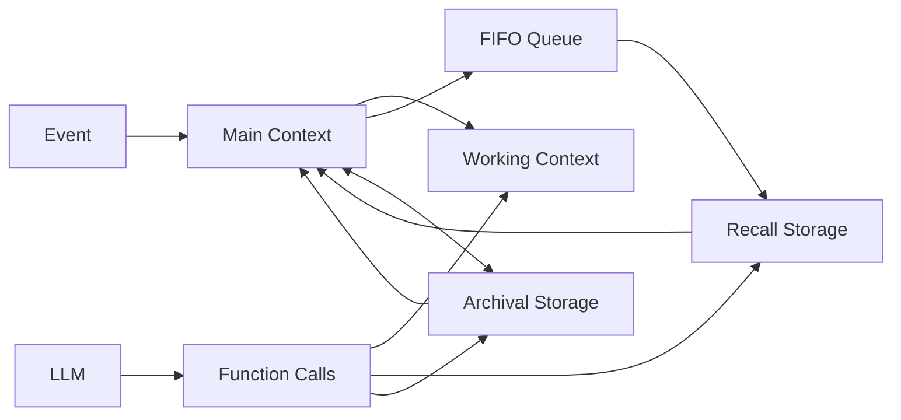

# MemGPT: Towards LLMs as Operating Systems

## 一話摘要

MemGPT 把有限 context window 類比為 RAM，讓 LLM 透過 function calls 在 main context、recall storage、archival storage 間自主搬移資訊，形成 OS-inspired virtual context management。

## 核心架構

### Main context
- System Instructions：read-only control instructions。
- Working Context：LLM 可主動修改的固定 read/write 區。
- FIFO Queue：近期 messages + recursive summary。

### External context
- Recall Storage：完整 interaction/message history。
- Archival Storage：任意長度的外部長期資料。

### Control
- Queue Manager：監控 context pressure、evict FIFO messages、更新 recursive summary。
- Memory Pressure Warning：接近 context limit 時提醒 agent 保存重要資訊。
- Function Executor：執行 memory/search calls。
- Function Chaining：允許多次 retrieval / memory actions 後再回答。

## 主要實驗結果與證據

### Deep Memory Retrieval — Table 2

| Base model | Baseline Accuracy | + MemGPT Accuracy | Baseline ROUGE-L(R) | + MemGPT ROUGE-L(R) |
|---|---:|---:|---:|---:|
| GPT-3.5 Turbo | 38.7% | 66.9% | 0.394 | 0.629 |
| GPT-4 | 32.1% | 92.5% | 0.296 | 0.814 |
| GPT-4 Turbo | 35.3% | 93.4% | 0.359 | 0.827 |

這是最直接的 long-term conversational-memory result。

### Conversation opener — Table 3

用 persona similarity / human-opener similarity 評估 engagement；MemGPT 可產生與 accumulated persona information 高度相關的 opener。這是 similarity-based evaluation，不是 system reliability test。

### Document analysis

另測：
- NaturalQuestions-Open-style multi-document QA；
- nested key-value retrieval。

archival search + pagination 讓固定-context LLM 能處理超過一次 prompt 容量的資料。

> [!CAUTION]
> 原論文沒有報告「記憶體管理錯誤率 <4%」或「維持數萬輪連續一致性」之類的 operational reliability 指標；先前筆記中的說法已刪除。

## Trade-offs

- 優勢：把 context management / persistent storage 變成 agent 可主動操作的 state machine。
- 成本：memory/search/function calls 增加 inference steps。
- 策略依賴：LLM 必須正確決定 save/search/edit 時機。
- 「virtual context」是 external-memory abstraction，不代表模型一次 attention 到無限 tokens。

## Taxonomy Boundary

- **D11 primary**：persistent memory lifecycle / read-write hierarchy。
- **D12 secondary**：LLM 自主選擇 memory actions。
- page 回 prompt 後的 packing / utilization 屬 D07。

## Sources

- arXiv: https://arxiv.org/abs/2310.08560
- [[Papers/05 - Memory & Agents/(arXiv 2023-10) MemGPT - Towards LLMs as Operating Systems.pdf|Local PDF]]
- [[02 - 研究領域專題 (Research Domains)/Domain 11 - Memory-Augmented RAG|D11 Memory-Augmented RAG]]
