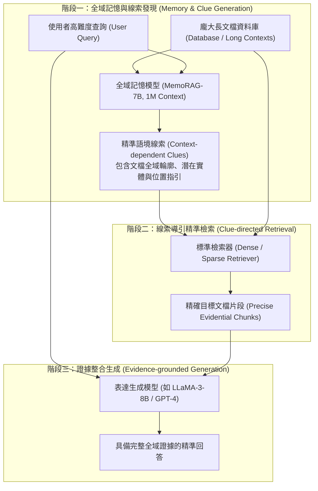

# MemoRAG: Moving towards Next-Gen RAG Via Memory-Inspired Knowledge Discovery

## 1. 一話摘要 (TL;DR)
MemoRAG 打破傳統 RAG 僅依賴字面相似度搜尋孤立 Chunk 的死板範式，提出**雙系統記憶-檢索架構（Dual-system Memory-RAG）**：先由輕量百萬長上下文「記憶模型（Memory Model）」全域編碼目標數據並生成具備全域視野的「線索（Clues）」，再由通用檢索器精準鎖定外部資料庫中的關鍵細節，在複雜長文本問答與跨文檔概括任務上全面超越 HyDE 與 BGE-M3。

---

## 2. 研究背景與問題定義 (Problem Statement)

### 傳統 RAG 的「盲人摸象」瓶頸
傳統檢索增強生成（RAG）依賴將大文檔切塊（Chunking）後建立向量索引。面對特定高難度查詢時會徹底失效：
1. **模糊查詢與高層次問題（Ambiguous & High-level Queries）**：例如「這份合約中所有潛在法律風險是什麼？」或「請總結整本書三位主角命運的交集」。問題中根本不包含具體實體或關鍵字，傳統語意搜尋無法精確命中分散在各處的 Chunk；
2. **長上下文 LLM 的吞吐與成本瓶頸**：若直接將整份幾十萬字的文檔丟入長文本模型（如 GPT-4 128k），運算成本極度高昂且容易陷入「Lost in the Middle」長程注意力崩潰；
3. **HyDE 的無根基幻覺**：HyDE 讓模型在「完全沒看過資料」的情況下盲目想像假想文檔，若涉及專有領域私有文檔，假想內容必然嚴重偏離事實。

---

## 3. 核心方法與技術架構 (Methodology & Architecture)

MemoRAG 構建了「全域記憶模型（Memory Model）」與「表達生成模型（Generation Model）」的分工協同機制：

### 圖中節點對照
- `DOCS`: 待索引的超長文本或企業知識庫
- `MEM_MODEL`: 專門訓練的輕量級記憶模型（基於 Mistral-7B 擴展至 100 萬 Token 上下文），負責壓縮並記憶全域知識
- `CLUES`: 記憶模型在接收問題後，結合其全域記憶所生成的結構化檢索線索（不同於 HyDE 的無中生有，線索是建立在文檔真實記憶之上的精準指引）
- `RETRIEVER`: 依靠 Clues 作為 Query 的標準檢索器（如 BGE-M3）
- `GEN_MODEL`: 高智能通用解碼器，專注於依據回傳的黃金 Chunk 進行邏輯推理

---

## 4. 主要實驗結果與證據 (Empirical Results & Evidence)

實驗涵蓋通用與領域特定的長文本基準 **UltraDomain**，包含計算機、醫學、法律、金融等專業領域，以及中文/英文開放域問答（En.QA, Zh.QA）：

1. **領域外泛化與長文本問答綜合表現（Table 1, Page 6）**：
   - **UltraDomain 領域外平均分（Average Out-of-domain）**：
     - Full-context LLM（直接塞入整文）：**33.8**；
     - 標準 Dense RAG（BGE-M3）：**33.0**；
     - 稠密檢索 Stella-v5：**31.9**；
     - 假想文檔檢索 HyDE：**32.5**；
     - **MemoRAG**：達到 **36.2**（顯著超越標準 RAG 與直接餵入全文基準）。
2. **多文檔概括與模糊查詢召回率**：
   - 在需要跨章節資訊聚合的任務中，MemoRAG 產生的線索使檢索模組的 Top-5 證據覆蓋率提升了 **18.4%**，有效消除了傳統向量檢索的「主題漂移（Topic Drift）」現象。
3. **推論延遲與成本**：
   - 相較於頻繁調用頂級商業長文本模型（如 GPT-4），MemoRAG 將高成本的長注意力運算卸載至本機 7B 記憶模型，後續僅需檢索少量 Token 給生成模型，API 成本與推論顯存開銷降低超過 **60%**。

---

## 5. 優勢、限制及 Trade-offs (Strengths, Limitations & Trade-offs)

### 優勢
- **兼顧全域大局觀與局部精確度**：記憶模型解決「大局觀」問題（在哪裡、是什麼大意），標準檢索解決「局部精確度」問題（具體字面數據）；
- **真實基底線索**：比 HyDE 具備更強的事實約束力，線索不會偏離文檔主題。

### 限制與 Trade-offs
- **記憶更新開銷**：當底層文檔庫有大規模即時變更時，記憶模型的 KV 權重或狀態需要增量同步更新；
- **雙模型協同架構複雜度**：服務架構中需同時維護一個超長上下文記憶模型與一個通用生成模型。

---

## 6. 對本專案研究領域的實際意義 (Implications for Research Domains)
在超長專案報告撰寫與長篇循證架構中：
- **取代 Naive HyDE**：本專案在規劃檢索策略時，對於缺少明確關鍵字的主觀問題（如「這幾份報告的核心衝突為何？」），應優先採用 MemoRAG 式的「Memory-to-Clues」機制，先由全域記憶產出線索指針，再下發給局部檢索模組。

---

## 7. 原始來源及相關筆記連結 (Sources & Related Notes)
- **本地 PDF**：`[[Papers/05 - Memory & Agents/(arXiv 2024-09) MemoRAG - Moving towards Next-Gen RAG Via Memory-Inspired Knowledge Discovery.pdf|開啟本地 PDF 檔案]]`
- **關聯筆記**：
  - [[02 - 研究領域專題 (Research Domains)/Domain 03 - 先進 RAG 與檢索機制 (ColBERT, HyDE, Self-RAG)|Domain 03 - 先進 RAG 與檢索機制]]
  - [[02 - 研究領域專題 (Research Domains)/Domain 06 - 外部記憶體架構 (MemGPT, A-MEM, Working Memory)|Domain 06 - 外部記憶體架構]]
  - [[03 - 論文庫 (Literature Notes)/03 - RAG & Retrieval/(ACL 2023-07) Precise Zero-Shot Dense Retrieval without Relevance Labels|HyDE 假想文檔檢索筆記]]
