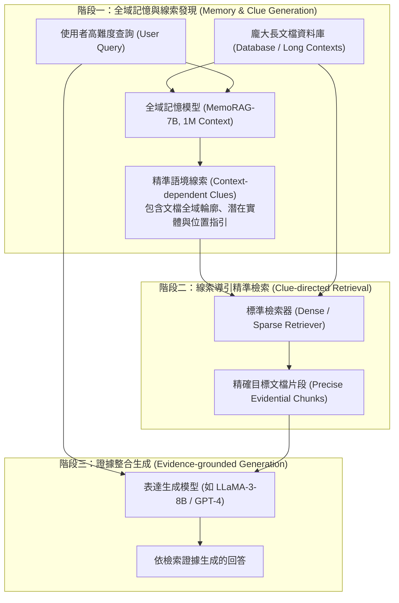

---
adjacent_interfaces:
  - "A01"
paradigm_tags:
  - "memory_augmented_rag"
secondary_domains:
  - "D05"
paper_id: "Qian2024_MemoRAG"
title: "MemoRAG: Boosting Long Context Processing with Global Memory-Enhanced Retrieval Augmentation"
authors:
  - "Hongjin Qian"
  - "Zheng Liu"
  - "Peitian Zhang"
  - "Kelong Mao"
  - "Defu Lian"
  - "Zhicheng Dou"
  - "Tiejun Huang"
year: 2024
publication_year: 2025
venue: "WWW 2025"
doi: "10.1145/3696410.3714805"
arxiv: "2409.05591"
url: "https://doi.org/10.1145/3696410.3714805"
pdf_file: "Papers/05 - Memory & Agents/(arXiv 2024-09) MemoRAG - Moving towards Next-Gen RAG Via Memory-Inspired Knowledge Discovery.pdf"
tags:
  - paper
  - memorag
  - memory-module
  - knowledge-discovery
  - long-context
  - www
verification_status: "verified"
last_verified: "2026-09-27"
artifact_type: "method_paper"
research_questions:
  - "memory_inspired_retrieval"
  - "ambiguous_query_handling"
  - "global_context_clues"
benchmark_ids:
  - "LongBench"
  - "InfiniteBench"
  - "UltraDomain"
dataset_ids:
  - "En.QA"
metrics:
  - "F1 Score"
  - "ROUGE"

taxonomy_version: "v2"
last_taxonomy_review: 2026-10-02
taxonomy_home: "D11"
primary_domain: "D11"

---

# MemoRAG: Boosting Long Context Processing with Global Memory-Enhanced Retrieval Augmentation

## 1. 一話摘要 (TL;DR)
MemoRAG 先形成長文件的 global memory，再生成檢索線索並取回來源段落供回答使用。[Qian et al. (2025/04), §2.2、Algorithm 1](https://arxiv.org/html/2409.05591v3#S2.SS2)

### 本 repo 分類決策 — 2026-10-02

- **D11 primary**：Algorithm 1 先形成 memory，再供多個 queries 共用；並明列可 offload 到 disk 供未來重用，符合 derived persistent state 的範圍。
- **D05 secondary**：以 memory 生成的 clues 作為搜尋輸入。
- **A01 interface**：§2.3 的長上下文與 memory-token／KV-space 壓縮機制。

以上為本 repo 的操作性歸類，依據 [§§2.2–2.3、Algorithm 1](https://arxiv.org/html/2409.05591v3)。這不表示論文已涵蓋完整的記憶遺忘、治理或來源變動同步；本次重核分類、方法定位與下方 Figure 3 的平均分；完整實驗版本對照仍未逐項重核。

---

## 2. 研究背景與問題定義 (Problem Statement)

### 長上下文與隱含搜尋意圖
傳統檢索增強生成（RAG）依賴將大文檔切塊（Chunking）後建立向量索引。作者討論的限制包括：
1. **模糊查詢與高層次問題（Ambiguous & High-level Queries）**：例如「這份合約中所有潛在法律風險是什麼？」或「請總結整本書三位主角命運的交集」。問題中根本不包含具體實體或關鍵字，傳統語意搜尋無法精確命中分散在各處的 Chunk；
2. **長上下文 LLM 的吞吐與成本瓶頸**：若直接將整份幾十萬字的文檔丟入長文本模型（如 GPT-4 128k），運算成本極度高昂且容易陷入「Lost in the Middle」長程注意力崩潰；
3. **HyDE 的無根基幻覺**：HyDE 讓模型在「完全沒看過資料」的情況下盲目想像假想文檔，若涉及專有領域私有文檔，假想內容必然嚴重偏離事實。

---

## 3. 核心方法與技術架構 (Methodology & Architecture)

MemoRAG 構建了「全域記憶模型（Memory Model）」與「表達生成模型（Generation Model）」的分工協同機制：

```mermaid
flowchart TD
    subgraph memory_phase["階段一：全域記憶與線索發現 (Memory & Clue Generation)"]
        DOCS["龐大長文檔資料庫 (Database / Long Contexts)"]
        MEM_MODEL["全域記憶模型 (MemoRAG-7B, 1M Context)"]
        QUERY["使用者高難度查詢 (User Query)"]
        CLUES["精準語境線索 (Context-dependent Clues)<br/>包含文檔全域輪廓、潛在實體與位置指引"]
        
        DOCS --> MEM_MODEL
        QUERY --> MEM_MODEL
        MEM_MODEL --> CLUES
    end

    subgraph retrieval_phase["階段二：線索導引精準檢索 (Clue-directed Retrieval)"]
        RETRIEVER["標準檢索器 (Dense / Sparse Retriever)"]
        CHUNKS["精確目標文檔片段 (Precise Evidential Chunks)"]
        
        CLUES --> RETRIEVER
        DOCS --> RETRIEVER
        RETRIEVER --> CHUNKS
    end

    subgraph generation_phase["階段三：證據整合生成 (Evidence-grounded Generation)"]
        GEN_MODEL["表達生成模型 (如 LLaMA-3-8B / GPT-4)"]
        ANSWER["依檢索證據生成的回答"]
        
        QUERY --> GEN_MODEL
        CHUNKS --> GEN_MODEL
        GEN_MODEL --> ANSWER
    end
```

### 圖中節點對照
- `DOCS`: 待索引的超長文本或企業知識庫
- `MEM_MODEL`: 專門訓練的輕量級記憶模型（基於 Mistral-7B 擴展至 100 萬 Token 上下文），負責壓縮並記憶全域知識
- `CLUES`: 記憶模型在接收問題後，結合其全域記憶所生成的結構化檢索線索（由文件記憶產生的搜尋代理，仍可能不準確，需回查來源段落）
- `RETRIEVER`: 依靠 Clues 作為 Query 的標準檢索器（如 BGE-M3）
- `GEN_MODEL`: 高智能通用解碼器，專注於依據回傳的來源 Chunk 進行邏輯推理

---

## 4. 主要實驗結果與證據 (Empirical Results & Evidence)

實驗涵蓋通用與領域特定的長文本基準 **UltraDomain**，包含計算機、醫學、法律、金融等專業領域，並包含 LongBench 與 InfiniteBench 的問答及摘要任務（v3 §3.1）；En.QA 是 InfiniteBench 任務，不另記為 benchmark：

1. **領域外泛化與長文本問答綜合表現（Table 1, Page 6）**：
   - **UltraDomain 領域外平均分（Average Out-of-domain）**：
     - Full-context LLM（直接塞入整文）：**33.8**；
     - 標準 Dense RAG（BGE-M3）：**33.0**；
     - 稠密檢索 Stella-v5：**31.9**；
     - 假想文檔檢索 HyDE：**32.5**；
     - **MemoRAG**：達到 **36.2**（此 Figure 3 的 Average (Out-of-domain) 行）。
上述五個平均分核自本地 v3 **Figure 3（PDF p. 6）**，不是 Table 1。主要設定：memory backbone 為 Mistral-7B-Instruct-v0.2-32K，主要 generator 為 Phi-3-mini-128K-instruct（SelfExtend 另用 4K 版本）；MemoRAG 使用 BGE-M3、top-3、最大 512-token chunks、compression ratio 4，訓練與評估硬體為 8 張 A800-80G。來源：v3 §3.2、Appendix A（PDF pp. 5、11）；[Qian et al. (2025/04), §3、Appendix A](https://arxiv.org/html/2409.05591v3)。

### 2. 效率與比較邊界

v3 §3.5、Figure 5（PDF p. 8）比較 indexing、retrieval latency 與 GPU memory；它不提供 API 成本降幅或 Top-5 evidence coverage 提升的百分比證據，本筆記不沿用先前無可追溯出處的宣稱。[Qian et al. (2025/04), §3.5](https://arxiv.org/html/2409.05591v3#S3.SS5)

比較限制須同時記錄：任務與 corpus、memory/generator 規模和輸入長度、硬體／成本、memory／latency／throughput、品質指標、索引與更新複雜度。主實驗、領域外 Figure 3 與效率 Figure 5 的取樣和條件不同，**不可直接比較**；Figure 3 的平均分也不是證據充分性、檢索 recall 或通用方法排名。API 費用、完整 token 成本及 production 更新負擔尚待另核。

---

## 5. 優勢、限制及 Trade-offs (Strengths, Limitations & Trade-offs)

### 優勢
- **兼顧全域大局觀與局部精確度**：記憶模型解決「大局觀」問題（在哪裡、是什麼大意），標準檢索解決「局部精確度」問題（具體字面數據）；
- **線索與證據的邊界**：作者說明 draft clues 仍可能有 inaccuracies 或缺少細節；應以取回的來源文本作為證據。[Qian et al. (2025/04), §1](https://arxiv.org/html/2409.05591v3#S1)

### 限制與 Trade-offs
- **記憶更新開銷**：當底層文檔庫有大規模即時變更時，derived memory／KV 狀態需要重建或更新；此更新代價應另外評估，不能把 KV cache 當成模型權重；
- **雙模型協同架構複雜度**：服務架構中需同時維護一個超長上下文記憶模型與一個通用生成模型。

---

## 6. 對本專案研究領域的實際意義 (Implications for Research Domains)
在超長專案報告撰寫與長篇循證架構中：
- **待驗證的選型問題**：本專案可比較 Memory-to-Clues 與 HyDE 在相同 corpus、retriever、generator、上下文長度及成本條件下的效果；在完成此比較前，不作普遍替代或優先採用的結論。

---

## 7. 原始來源及相關筆記連結 (Sources & Related Notes)
- **本地 PDF**：[[Papers/05 - Memory & Agents/(arXiv 2024-09) MemoRAG - Moving towards Next-Gen RAG Via Memory-Inspired Knowledge Discovery.pdf|開啟本地 PDF 檔案]]
- **關聯筆記**：
  - [[02 - 研究領域專題 (Research Domains)/Domain 05 - Query Understanding & Retrieval|D05 Query Understanding & Retrieval]]
  - [[02 - 研究領域專題 (Research Domains)/Domain 11 - Memory-Augmented RAG|D11 Memory-Augmented RAG]]
  - [[03 - 論文庫 (Literature Notes)/03 - RAG & Retrieval/(ACL 2023-07) Precise Zero-Shot Dense Retrieval without Relevance Labels|HyDE 假想文檔檢索筆記]]
