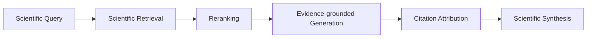

# OpenScholar: Synthesizing Scientific Literature with Retrieval-Augmented Language Models

## 一話摘要
OpenScholar 是面向科學文獻綜合的 retrieval-augmented system，重點在大規模科學文庫檢索、reranking、具引用的回答生成與 ScholarQABench 評估。

## 研究背景與問題
科學文獻綜合需要同時處理大規模檢索、跨論文證據整合、回答正確性與 citation attribution；因此不適合只用單次生成或單一 retrieval score 評估。

## 核心方法

## 主要實驗結果
原筆記依論文 Table 2 / Page 11 記錄：OpenScholar 系統在 ScholarQABench、PubMedQA、SciFact、QASA 等任務同時評估 correctness、citation 與 query cost。具體分數應以本地 PDF 對應表格為準。

## 優勢與限制
- 優勢：針對 scientific literature 的專用 retrieval / reranking；回答與 citation 同時評估；提供開放文庫與 benchmark。
- 限制：文庫覆蓋受可取得全文來源限制；跨文獻衝突與因果仲裁仍屬更高階問題。

## 對本 Taxonomy 的位置
- **Primary: D09** Grounded Generation, Attribution & Long-form Synthesis
- **Secondary: D05** Query Understanding & Retrieval
- **Secondary: D12** Agentic RAG & Orchestration
- Paradigm tags: `long_form_rag`, `agentic_rag`

## Sources
- arXiv: 2411.14199
- [[Papers/05 - Memory & Agents/(arXiv 2024-11) OpenScholar - Synthesizing Scientific Literature with Retrieval-Augmented Language Models.pdf|開啟本地 PDF]]
