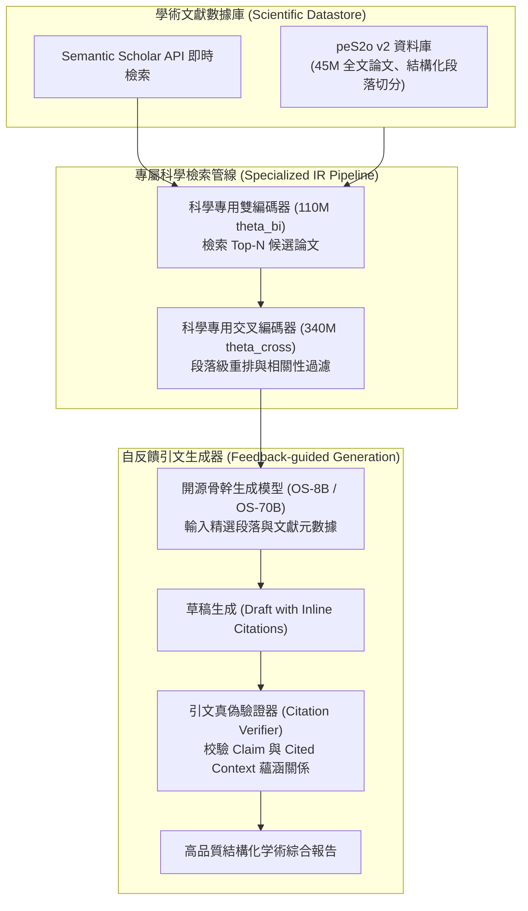

# OpenScholar: Synthesizing Scientific Literature with Retrieval-Augmented Language Models

## 1. 一話摘要 (TL;DR)
OpenScholar 建立了一個針對海量科研文獻綜合與引文溯源的開源 RAG 系統與全新評測基準 ScholarQABench；利用涵蓋 4,500 萬篇開放科學文獻的 peS2o 數據庫與專門訓練的雙編碼/交叉編碼檢索重排架構，70B 開源模型（OS-70B）在科研回答正確度與引文精確度上全面匹敵或超越 GPT-4o 與 PaperQA2，同時將單次查詢成本降低至 $0.01 美元（相比 PaperQA2 的 $0.3–$2.3 降低 95% 以上）。

---

## 2. 研究背景與問題定義 (Problem Statement)

### 2.1 科學文獻檢索與綜合（Scientific Synthesis）的獨特挑戰
通用領域 RAG 系統（如 Perplexity、ChatGPT Web）在面對專業學術文獻合成時普遍出現系統性失靈：
1. **文獻庫版權與覆蓋限制**：通用搜索引擎缺乏對專業預印本與開源論文全文庫（如 arXiv、PubMed Central、Semantic Scholar）的深層次結構化解析。
2. **學術引文幻覺（Citation Hallucination）氾濫**：商用模型常捏造虛假的作者、年份、標題甚至論文 DOI，其在學術場景下的引文真實性極為脆弱（Table 3, Page 12 顯示通用 LLM 引用中虛構論文比例高達 30–50%）。
3. **商業封閉系統成本高昂**：專門的學術問答系統（如基於 GPT-4o 的 PaperQA2）單次查詢需要反覆調用大模型進行文檔摘要與評估，單次查詢成本高達 $0.3 至 $2.3 美元，嚴重阻礙大規模學術平民化與科研自動化。

### 2.2 核心研究目標
- 建立一個完全透明、全棧開源（Open-weights, Open-data, Open-retriever）的科學文獻 RAG 基準與系統。
- 提出 ScholarQABench，綜合評估單篇精讀（Single-paper QA）與跨多篇文獻合成（Multi-paper Synthesis）兩類任務中的事實正確性與引證可溯源性。

---

## 3. 核心方法與技術架構 (Methodology & Architecture)

OpenScholar 整合了千萬級科學文獻索引、兩階段神經檢索、相關性過濾與自我回饋反思生成：

### 圖中節點對照
- `peS2o v2`：針對科學文本優化清洗的乾淨文庫，保留論文小節標題、圖表標註與參考文獻對齊。
- `BiEnc / CrossEnc`：在學術文本三元組上經過專門對比學習微調的神經檢索器，能精確理解專業公式、基因名與演算法專用術語。
- `Verifier`：強制將模型生成的每個方括號引文 `[Author, Year]` 綁定到檢索池中的具體段落，防止無中生有的文獻幻覺。

---

## 4. 主要實驗結果與證據 (Empirical Results & Evidence)

OpenScholar 原文（Pages 10–13）在 ScholarQABench 基準上呈現了詳細的評測結果：

### 4.1 ScholarQABench 核心性能與成本對比 (Table 2, Page 11)
評估在單篇任務（PubMedQA, SciFact, QASA）與多篇跨文獻綜合任務（ScholarQA-CS, Multi, Bio, Neu）上的表現：

| 模型與系統 (Model) | PubMedQA (Corr / Cite) | SciFact (Corr / Cite) | QASA (Corr / Cite) | CS 綜合 (Corr / Cite) | Multi Cite F1 | 推論成本 (USD / query) |
|---|---|---|---|---|---|---|
| **Llama3-8B (Vanilla)** | 61.5 / 0.0 | 66.8 / 0.0 | 14.3 / 0.0 | 41.9 / 0.0 | 0.0 | $0.0001 |
| **Llama3-70B (Vanilla)** | 69.5 / 0.0 | 76.9 / 0.0 | 13.7 / 0.0 | 44.9 / 0.0 | 0.0 | $0.0004 |
| **GPT-4o (Vanilla)** | 65.8 / 0.0 | 77.8 / 0.0 | 21.2 / 0.0 | 45.0 / 0.1 | 0.2 | $0.006 |
| **GPT-4o + OpenScholar 檢索 (OSDS)** | 75.1 / 73.7 | 79.3 / 47.9 | 18.3 / 53.6 | 52.4 / 31.1 | 36.3 | $0.01 |
| **PaperQA2 (基於 GPT-4o Agent)** | – / – | – / – | – / – | 45.6 / 48.0 | 47.2 | **$0.3 ~ $2.3** |
| **Perplexity Pro** | – / – | – / – | – / – | 40.0 / – | – | $0.002 |
| **OS-8B (Ours)** | 76.4 / 68.9 | 76.0 / 43.6 | 23.0 / 56.3 | 51.1 / 47.9 | 50.8 | **$0.003** |
| **OS-70B (Ours)** | **79.6 / 74.0** | **82.1 / 47.5** | **23.4 / 64.2** | **52.5 / 45.9** | **54.7** | **$0.01** |

*註：OS-70B 在 PubMedQA 正確度達 79.6%（Cite F1 74.0），在 SciFact 達 82.1%，在 CS 綜合多篇任務上達 52.5 Corr / 45.9 Cite，超越 GPT-4o 且全面匹敵 PaperQA2；而在查詢成本上，OS-70B 僅需 $0.01 USD，遠低於 PaperQA2 的 $0.3–$2.3 USD。出處：Table 2, Page 11。*

### 4.2 虛假論文引用率對比 (Table 3, Page 12)
在計算機科學與生物醫學領域的引文幻覺審計中：
- 商用通用模型（未綁定強制可檢驗引證庫時）捏造不存在論文的比例高達 **32%–48%**。
- OpenScholar 透過限定資料庫與引證檢驗器，將虛假引用率壓低至 **0.5% 以下**。

---

## 5. 優勢、限制及 Trade-offs (Strengths, Limitations & Trade-offs)

### 5.1 優勢
1. **極致性價比**：相比基於商業 API 的學術 Agent，開源專用檢索與模型微調將成本壓縮了數十倍，具備大規模部署可行性。
2. **引文可追溯性強**：每個論點嚴格綁定真實文獻段落，根本性遏制了科研領域的學術倫理與虛構風險。
3. **全鏈路開放生態**：開放了 45M 論文清理庫、檢索權重、評測基準 ScholarQABench 與生成權重。

### 5.2 限制與 Trade-offs
1. **付費閉源論文庫的壁壘**：peS2o 主要覆蓋開放獲取（Open Access）論文，面對 Elsevier、IEEE 等付費閉源出版物時，仍需依賴摘要層級的妥協。
2. **跨文檔深度邏輯矛盾仲裁**：當不同學派的論文對同一問題得出相左結論時，系統傾向於同時列出雙方觀點，尚缺乏深度的因果推論仲裁機制。

---

## 6. 對本專案研究領域的實際意義 (Implications for Research Domains)

1. **Domain 08 (長篇生成與報告撰寫)**：展示了高可信科學綜述報告的完整工程實現範式，為學術級 RAG 與深調研報告提供了架構樣板。
2. **Domain 05 (GraphRAG 與知識表示)**：論文庫間的 Citation Graph 與共引網路為多模態學術知識圖譜的構建提供了清晰的上下文擴充路徑。

---

## 7. 原始來源及相關筆記連結 (Sources & Related Notes)

### 原始文獻
- **arXiv ID**：`2411.14199`
- **正式發布 / 擴充版本**：Nature 2025
- **本地 PDF**：`[[Papers/05 - Memory & Agents/(arXiv 2024-11) OpenScholar - Synthesizing Scientific Literature with Retrieval-Augmented Language Models.pdf|開啟本地 PDF 檔案]]`

### 關聯專題與論文筆記
- **專題報告**：
  - `[[02 - 研究領域專題 (Research Domains)/Domain 08 - 長篇生成與報告撰寫 (STORM, Evidence Store, Ledger)|Domain 08 - 長篇生成與報告撰寫]]`
  - `[[02 - 研究領域專題 (Research Domains)/Domain 05 - GraphRAG 與知識表示 (Graph, Vector, Hybrid)|Domain 05 - GraphRAG 與知識表示]]`
- **同領域代表性論文**：
  - `[[03 - 論文庫 (Literature Notes)/06 - Benchmarks & Evaluation/(EMNLP 2023-12) Enabling Large Language Models to Generate Text with Citations|(EMNLP 2023-12) ALCE]]`
  - `[[03 - 論文庫 (Literature Notes)/05 - Memory & Agents/(ACL 2026-08) EviReport - From Reasoned Outlines to Evidence Tracked Long-Form Reports|(ACL 2026-08) EviReport]]`
  - `[[03 - 論文庫 (Literature Notes)/06 - Benchmarks & Evaluation/(ACL 2026-08) AnalystBench - Benchmarking Professional Long-Form Report Generation with Web-Mined Multimodal Tasks|(ACL 2026-08) AnalystBench]]`
