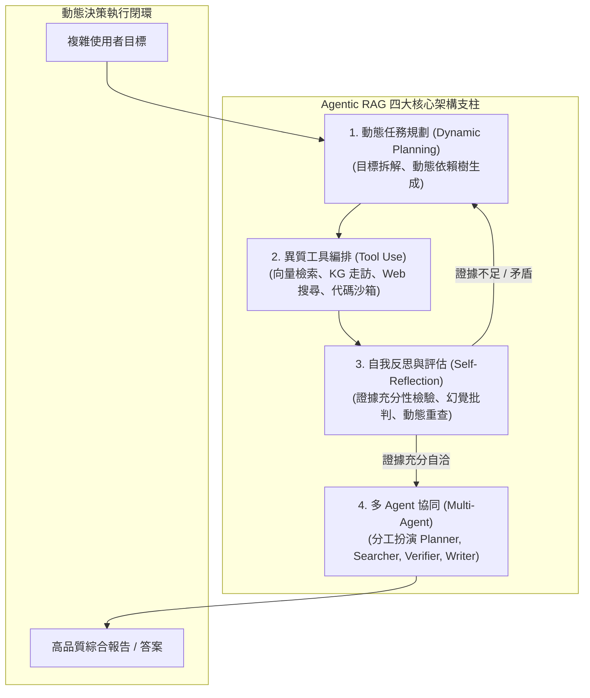

# Agentic Retrieval-Augmented Generation: A Survey on Agentic RAG

## 一話摘要 (TL;DR)
這篇前瞻性全景綜述系統化梳理了從靜態「檢索-閱讀」管線向具備主動性、自主決策與自我反思之 **Agentic RAG** 的演進範式，提出涵蓋 Agent 基數（單/多 Agent）、控制結構（集中/去中心/分層）、自主性層級與知識表示的嚴謹分類學，為新一代自主研究系統、長篇報告生成與動態工具編排建立了全面的技術全景。

---

## 研究背景與問題定義 (Problem Statement)

1. **傳統 RAG 範式的固有瓶頸（Naive & Advanced RAG Limitations）**：
   - 傳統 RAG 與進階 RAG（如重排序、HyDE、分塊優化）大多遵循**單向、前饋式（One-shot feed-forward）**的管線流程；當使用者的查詢高度模糊、涉及多階段目標或檢索到誤導性資訊時，固定管線無法主動調整檢索關鍵字、發起多步補充檢索或進行自我驗證。
2. **LLM 自主 Agent 技術的興起與交匯**：
   - 隨著 ReAct、Reflexion、Toolformer 等自主代理架構的發展，將「檢索器」從靜態組件轉化為 Agent 手中的「可動態調用工具（Dynamic Tool）」，賦予系統動態規劃（Planning）、反思審查（Self-reflection）與環境互動（Action）的能力成為必然趨勢。
3. **缺乏系統性架構藍圖與技術分類**：
   - 當前「Agentic RAG」概念被廣泛討論，但架構設計雜亂（單 Agent 迴圈 vs 多 Agent 協商 vs 分層樹狀檢索），亟需一份權威分類學以界定其能力邊界與落地代價。

---

## 核心方法與技術架構 (Methodology & Architecture)

綜述將 RAG 的歷史演進劃分為四個代際，並深度解析 Agentic RAG 的四大核心支柱：

### 1. RAG 四代演進對比 (Table 1, Page 8)
1. **Naive RAG**：Indexing $\to$ Retrieval $\to$ Generation（固定檢索單次切塊，極易受雜訊干擾）；
2. **Advanced RAG**：引入 Pre-retrieval（Query Rewrite）與 Post-retrieval（Reranking, Compression）；
3. **Modular RAG**：將檢索、重寫、路由、驗證解耦為可自由編排的獨立模組；
4. **Agentic RAG**：由一個或多個具備記憶、規劃與工具調用能力的 LLM Agent 主導，依據中間狀態反思動態決定「何時檢索、檢索何處、檢索是否充分、何時終止」。

### 圖中節點對照
- `PLAN`, `TOOL`, `REFL`, `MULTI`：Agentic RAG 的四大核心能力支柱。
- `execution_flow`：包含反思與重檢索的動態狀態機閉環。

### 2. 多 Agent 拓撲控制結構 (Multi-Agent Control Topologies)
- **集中式主從架構（Centralized / Supervisor-Worker）**：由單一 Controller Agent 指派子任務給專門檢索或寫作 Agent；
- **分層樹狀架構（Hierarchical Architecture）**：高層負責大綱與宏觀決策，中層負責章節檢索，底層執行具體工具調用；
- **去中心化協商架構（Decentralized / Peer-to-Peer）**：如 AutoGen 群聊，Agent 間透過自然語言協商與辯論推進。

---

## 主流代表作與技術矩陣 (Landscape & Representative Works)

綜述評析了多個推動 Agentic RAG 發展的關鍵突破（第 10–25 頁）：

1. **主動式與適應性檢索機制**：
   - **FLARE (Jiang et al., 2023)**：基於生成置信度主動預測並觸發檢索；
   - **Self-RAG (Asai et al., 2023)**：引入四類反思標籤（Retrieve, ISREL, ISSUP, ISUSE）實現訓練期自我反思；
   - **Adaptive-RAG (Jeong et al., 2024)**：依據問題複雜度動態選擇無檢索、單步檢索或多步檢索路徑。
2. **多 Agent 協同與長篇生成**：
   - **STORM (Shao et al., 2024)**：多專家視角提問與網路檢索協同，生成 Wikipedia 級長篇條目；
   - **AutoGen (Wu et al., 2023)**：靈活的可對話 Agent 框架，提供代碼沙箱與多角色對話機制；
   - **OpenScholar (Asai et al., 2024)**：多步回饋式檢索與科學文獻引文生成。
3. **記憶與結構化圖譜增強**：
   - **MemoRAG (Qian et al., 2024)**：記憶模組預先生成全域線索（Clues）引導細粒度檢索；
   - **GraphReader (Li et al., 2024)**：Agent 在知識圖譜節點上進行自主走訪與資訊搜集。

---

## 優勢、限制及 Trade-offs (Strengths, Limitations & Trade-offs)

### 優勢
1. **處理非結構化多跳複雜問題的能力極強**：打破單次檢索的視野限制，能自主進行跨文檔、跨工具的關聯推理。
2. **幻覺率顯著降低**：反思與批判循環能夠即時攔截不被檢索證據背書的無效生成。

### 限制與 Trade-offs
1. **延遲與推論成本呈指數級增長**：多輪反思、多 Agent 群聊與多步重檢索導致單次請求的 Token 消耗增加 5–20 倍，難以滿足亞秒級即時互動需求。
2. **Agent 級聯失效與漂移風險（Cascade Failures & Goal Drift）**：若前端 Planning 出現偏差，後續一系列檢索可能全數偏離主題，造成嚴重的資源浪費。

---

## 對本專案研究領域的實際意義 (Implications for Research Domains)

1. **對 Domain 09（Agentic 工作流）與 Domain 08（長篇生成）的指引**：
   - Agentic RAG 是本專案最終邁向「自主長篇專業研報撰寫」的核心理論支柱；本綜述確立的 Planning $\to$ Tool Use $\to$ Reflection 閉環可直接轉化為專案的生產管線。
2. **對 Domain 11（Research Roadmap）的價值**：
   - 明確指出了未來的核心研究瓶頸：如何在保持 Agent 自主決策靈活性的同時，施加剛性的證據控制與成本預算管理。

---

## 原始來源及相關筆記連結 (Sources & Related Notes)

- **本地 PDF**：`[[Papers/05 - Memory & Agents/(arXiv 2025-01) Agentic Retrieval-Augmented Generation - A Survey on Agentic RAG.pdf|開啟本地 PDF 檔案]]`
- **官方開源連結**：[arXiv:2501.09136](https://arxiv.org/abs/2501.09136) · [GitHub asinghcsu/AgenticRAG-Survey](https://github.com/asinghcsu/AgenticRAG-Survey)
- **關聯領域筆記**：
  - [[02 - 研究領域專題 (Research Domains)/Domain 09 - Agentic 工作流與自主研究 (Planning, Multi-Agent)|Domain 09 - Agentic 工作流與自主研究 (Planning, Multi-Agent)]]
  - [[02 - 研究領域專題 (Research Domains)/Domain 11 - 最具價值的研究方向與實驗設計 (Research Roadmap)|Domain 11 - 最具價值的研究方向與實驗設計 (Research Roadmap)]]
  - [[02 - 研究領域專題 (Research Domains)/Domain 03 - 先進 RAG 與檢索機制 (ColBERT, HyDE, Self-RAG)|Domain 03 - 先進 RAG 與檢索機制 (ColBERT, HyDE, Self-RAG)]]
- **同類/相關論文筆記**：
  - [[03 - 論文庫 (Literature Notes)/05 - Memory & Agents/(arXiv 2023-08) AutoGen - Enabling Next-Gen LLM Applications via Multi-Agent Conversation|(arXiv 2023-08) AutoGen]]
  - [[03 - 論文庫 (Literature Notes)/03 - RAG & Retrieval/(arXiv 2023-12) Retrieval-Augmented Generation for Large Language Models - A Survey|(arXiv 2023-12) RAG Survey]]
  - [[03 - 論文庫 (Literature Notes)/03 - RAG & Retrieval/(NAACL 2024-06) Adaptive-RAG - Learning to Adapt Retrieval-Augmented Large Language Models through Question Complexity|(NAACL 2024-06) Adaptive-RAG]]
