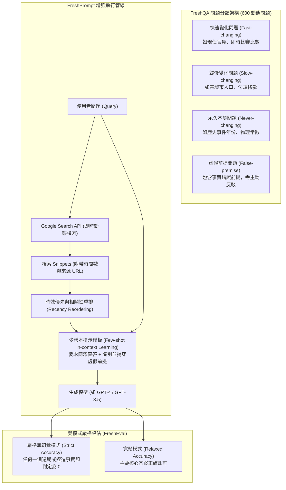

# FreshLLMs: Refreshing Large Language Models with Search Engine Augmentation

## 1. 一話摘要 (TL;DR)
FreshLLMs 系統性揭露了預訓練大模型在時間推移下「知識嚴重過期與時效幻覺」的根本弱點，提出動態評測基準 **FreshQA**（細分快速變化、緩慢變化、不變知識與錯誤前提問題），並設計能動態注入搜尋引擎即時證據的提示範式 **FreshPrompt**，將 GPT-4 在嚴格無幻覺評測下的準確率由 **28.6% 躍升至 75.6%**。

---

## 2. 研究背景與問題定義 (Problem Statement)

### 靜態權重與動態世界的根本矛盾
現代 LLM 通常只在特定時間點前截斷的語料上訓練一次（例如 GPT-4 的預訓練 Cutoff 為 2021 年底），此後便難以更新參數：
1. **時效敏感事實衰減（Temporal Knowledge Decay）**：世界真實事實（如某國總統、體育冠軍、匯率、企業執行長）隨時間動態更迭，模型往往信心滿滿地給出過期錯誤答案；
2. **錯誤前提提問脆弱性（False-Premise Questions）**：例如「誰贏得了 2023 年世界盃男子足球賽決賽的銅牌？」（男子世界盃沒有銅牌賽），未經檢索的模型極易順應錯誤前提產生無中生有的嚴重幻覺；
3. **傳統搜尋增強的局限**：商業搜尋引擎或 Naive RAG 僅簡單拼接檢索結果，缺乏對證據時效性順序（Recency Ordering）與簡潔直答的引導，導致模型被搜尋結果中的舊新聞干擾。

---

## 3. 核心方法與技術架構 (Methodology & Architecture)

FreshLLMs 提出動態基準 FreshQA、評估框架 FreshEval 與增強提示算法 FreshPrompt：

### 圖中節點對照
- `FAST`, `SLOW`, `NEVER`: 依事實半衰期劃分的三大客觀事實範疇
- `FALSE_P`: 考驗模型是否具備主動質疑與抗幻覺能力的特殊問題集
- `SNIPPETS`: 搜尋引擎返回的高信噪比標題與摘要（Snippets 比全網頁長文更緊湊抗噪）
- `ORDER`: 依文檔發布日期與點擊權威進行時效重排
- `STRICT`: 論文核心指標，杜絕「看似滔滔不絕但混雜過期細節」的偽高分

---

## 4. 主要實驗結果與證據 (Empirical Results & Evidence)

實驗於 2023 年 4 月 26 日基準日對多種模型進行了超過 50,000 組人工與自動嚴格評估（Strict Accuracy，Table 1, Page 7）：

1. **基礎模型在時效事實上的全面崩潰（Table 1, Page 7）**：
   - **GPT-3.5 Vanilla（2021 Cutoff）**：
     - 全域 Strict 準確率僅 **26.0%**；
     - 面對快速變化問題（Fast-changing），準確率低至 **4.0%**；
     - 面對 2022 年以後的新事實（$\ge 2022$），準確率僅 **5.1%**。
   - **GPT-4 Vanilla**：
     - 全域 Strict 準確率僅 **28.6%**；
     - 快速變化問題準確率僅 **12.0%**；$\ge 2022$ 新事實僅 **8.1%**；
     - 即使給予當前日期作為 Context（Cutoff 2021 + Date），模型依舊無法推論未知新事實。
2. **FreshPrompt 帶來的爆發性提升（Table 1, Page 7）**：
   - **GPT-3.5 + FreshPrompt**：全域準確率躍升至 **56.0%**（Fast 達 46.4%，$\ge 2022$ 達 57.0%）；
   - **GPT-4 + FreshPrompt**：全域準確率達到 **75.6%**（大幅超越 GPT-4 + Self-Ask 的 47.8% 與 Perplexity.ai 的 52.2%）：
     - 快速變化問題（Fast）：提升至 **59.2%**；
     - 緩慢變化問題（Slow）：達 **77.6%**；
     - 永久不變問題（Never）：達 **94.4%**；
     - 2022 年後事實（$\ge 2022$）：達 **70.2%**；
     - 虛假前提識別（False Premise）：達 **71.0%**。
3. **消融實驗關鍵發現（Table 1 下半部）**：
   - **證據數量敏感性**：當檢索 Snippets 由 1 篇增至 5 篇、15 篇時，GPT-4 準確率由 61.4% $\to$ 70.6% $\to$ **77.6%**；
   - **Snippet 排序**：依據時間排序（Time Order，74.8%）相較於隨機排序（Random Order，72.4%）有明確增益；
   - **直答原則**：要求模型輸出簡明答案（Concise Answer）大幅消除了長篇回答中自我引發的衍生幻覺。

---

## 5. 優勢、限制及 Trade-offs (Strengths, Limitations & Trade-offs)

### 優勢
- **首創時態分級評測體系**：首次將 QA 依「事實演化速率（Velocity）」與「虛假前提」細分，成為後續時序 RAG 評測的標準協議；
- **輕量免訓練**：僅憑精心設計的 Search-Augmented Prompting 即可大幅逆轉頂級商業模型的時序幻覺。

### 限制與 Trade-offs
- **對商業搜尋引擎的高度依賴**：完全依賴 Google Search 的檢索品質與 Answer Box，在內網隔離或小眾領域缺乏足夠公開 Snippets；
- **長程衝突未深入解決**：對於跨數年演進的多份內部文檔版本（如 Re³ 所探討的），單純的網頁 Snippet 無法取代深層結構化時序版本管理。

---

## 6. 對本專案研究領域的實際意義 (Implications for Research Domains)
在目前 taxonomy 中，本工作主要連到 **D08 Temporal Conflict & Provenance Resolution** 與 **D13 RAG Evaluation & Failure Attribution**：
- **引入時態分級測試機制**：本專案應將 FreshQA 的四分類（Fast / Slow / Never / False-premise）作為檢驗內部 RAG 抗時效幻覺的標準測試維度；
- **簡潔回答抑制幻覺**：在報告生成的細節填補中，應嚴格遵守 FreshLLMs 的「證據先驗直答」原則，杜絕自由發揮式廢話。

---

## 7. 原始來源及相關筆記連結 (Sources & Related Notes)
- **本地 PDF**：`[[Papers/06 - Benchmarks & Evaluation/(ACL 2024-08) FreshLLMs - Refreshing Large Language Models with Search Engine Augmentation.pdf|開啟本地 PDF 檔案]]`
- **關聯筆記**：
  - [[02 - 研究領域專題 (Research Domains)/Domain 08 - Temporal Conflict & Provenance Resolution|D08 Temporal Conflict & Provenance Resolution]]
  - [[02 - 研究領域專題 (Research Domains)/Domain 13 - RAG Evaluation & Failure Attribution|D13 RAG Evaluation & Failure Attribution]]
  - [[03 - 論文庫 (Literature Notes)/06 - Benchmarks & Evaluation/(ACL 2026-08) Re3 - Relevance and Recency Retrieval for Mitigating Temporal Hallucination|Re³ 時序檢索筆記]]
