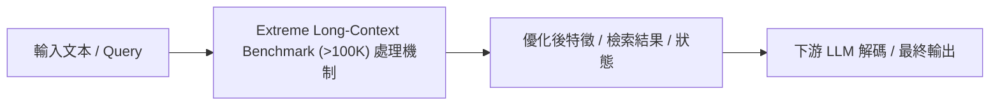

# $\infty$Bench: Extending Long Context Evaluation Beyond 100K Tokens

> [!INFO] 論文元數據 (Metadata)
> - **Paper ID**：`Zhang2024_InfiniteBench`
> - **作者**：Xinrong Zhang, Yingfa Chen, Shengding Hu, Zihang Xu, Junhao Chen, Mao Sheng, et al.
> - **預印本初次發布年份 (Preprint)**：2024
> - **正式發表年份 / 會議或期刊 (Venue)**：2024 (ACL 2024)
> - **DOI**：無
> - **arXiv**：[2402.13718](https://arxiv.org/abs/2402.13718)
> - **驗證狀態**：`verified` (已比對原始文獻與 PDF 全文)
> - **本地 PDF 連結**：[[Papers/06 - Benchmarks & Evaluation/(ACL 2024-08) InfiniteBench - Extending Long Context Evaluation Beyond 100K Tokens.pdf|開啟本地 PDF 檔案]]
---

## 一話摘要 (TL;DR)
**清華與智譜提出首個平均長度突破 100k tokens（最高可達 500k）的極限長上下文評測基準 $\infty$Bench。**

---

## 研究背景與問題定義 (Problem Statement)
2024 年各家宣稱支援 128k、200k 甚至 1M 上下文，但現有評測基準（如 LongBench）長度普遍在 32k 以下，無法檢驗模型在極限超長輸入下的真實推理崩潰點。

---

## 核心方法與技術架構 (Methodology & Architecture)
涵蓋 12 個核心任務，包含長篇小說多選題、長代碼依賴除錯、合成檢索、數學計算與長文本對話。所有數據集平均長度均超過 100k tokens，任務設計強制要求模型具備跨數萬字的訊息串聯與邏輯推演能力，而非單純的關鍵字匹配。

---

## 主要實驗結果與證據 (Empirical Results & Evidence)
> [!NOTE] 關鍵實證數據與評估條件
> **出處與評估條件**：Table 1 (Page 5): 100k+ tokens 極限長度評測顯示，大部分宣稱具備 128k 上下文的模型在超出 32k 後準確率呈現雪崩式下滑至接近 0 分 (除少數頂級模型外)。

---

## 優勢、限制及 Trade-offs (Strengths, Limitations & Trade-offs) (Strengths & Trade-offs)
優點：無情戳穿了大量宣稱支援 128k 但實際在 30k 以上就迅速崩潰的模型；缺點：評測成本極為高昂（推論一次 100k 序列需要龐大 GPU 資源與推論時間）。

---

## 在長文件處理任務中的角色與啟發 (Implications for Long-Doc Processing)
100k+ 超長上下文時代最嚴格的試金石，直接推動了業界對極限長度注意力機制與 RoPE 插值技術的再優化。

---

## 原始來源及相關筆記連結 (Sources & Related Notes)
- **所屬研究領域**：
  - [[02 - 研究領域專題 (Research Domains)/Domain 10 - 評估基準、系統工程與安全 (Benchmarks & Safety)|Domain 10 - 評估基準、系統工程與安全 (Benchmarks & Safety)]]
- **回主目錄**：[[00 - 導覽與心智圖 (Navigation & MOC)/Home (主目錄與知識庫導覽)|主目錄與知識庫導覽]]
- **全景心智圖**：[[00 - 導覽與心智圖 (Navigation & MOC)/LLM 超長文件處理心智圖 (MOC)|超長文件處理研究方向心智圖]]
