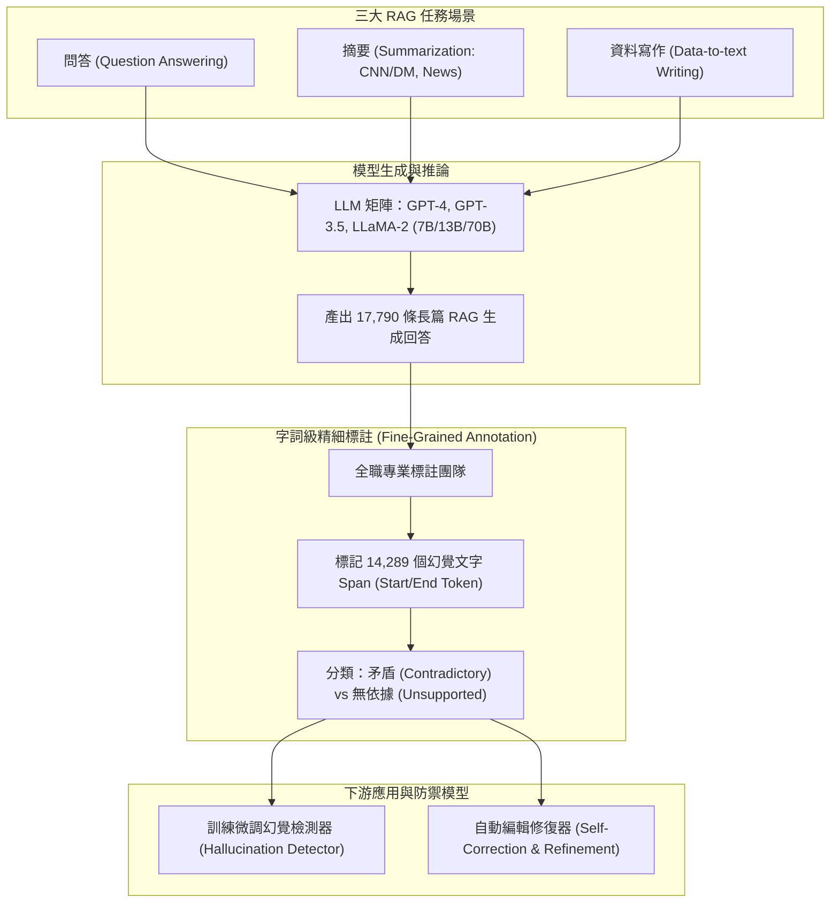

# RAGTruth: A Hallucination Corpus for Developing Trustworthy Retrieval-Augmented Language Models

## 一話摘要 (TL;DR)
RAGTruth 是首個針對 RAG 系統中生成幻覺進行大規模細粒度人工標註的權威語料庫，包含來自多種開源與閉源大模型（GPT-4、GPT-3.5、LLaMA-2 等）在問答、摘要與資料轉文本三大任務下的 **17,790 條生成回答**，人工逐字標註出 **14,289 個幻覺文字跨度（Word/Phrase-level Spans）**，揭示整體 RAG 生成回答的事實幻覺率高達 **43.1%**。

---

## 研究背景與問題定義 (Problem Statement)
檢索增強生成（RAG）被廣泛視為緩解大模型幻覺的靈丹妙藥，但在工業應用中，即便利落地提供了檢索上下文，模型依然頻繁出現事實錯誤：
1. **RAG 幻覺的隱蔽性**：模型生成的答案表面上流暢自信，甚至大量使用檢索文檔中的關鍵詞，但關鍵數值、實體關係或邏輯結論卻與檢索上下文相悖（Contradictory）或缺乏支撐（Unsupported）。
2. **粗粒度標註的不足**：現有數據集多為整句（Sentence-level）或整篇（Document-level）二元標註，無法精確定位到「具體哪幾個詞捏造了事實」，無法訓練高精度的幻覺定位與自動編輯修復模型。
3. **缺乏跨任務、跨模型架構的系統性基準**：缺乏覆蓋從短文本問答到複雜結構化資料寫作的統一檢測基準。

---

## 核心方法與技術架構 (Methodology & Architecture)

RAGTruth 構建了**多任務-多模型採樣管線**與**高品質細粒度多層次標註體系**：
1. **多樣化任務與模型矩陣（Task & Model Matrix）**：
   - 涵蓋三大核心 RAG 應用場景：
     - **開放領域問答（QA）**：基於檢索新聞與百科段落回答問題；
     - **篇章摘要（Summarization）**：CNN/DM 及最新即時新聞摘要；
     - **資料轉文本寫作（Data-to-Text Writing）**：根據結構化表格或屬性列表撰寫敘述性文字。
   - 測試多種主流模型：GPT-4-0613、GPT-3.5-turbo-0613、LLaMA-2 (7B, 13B, 70B-chat)。
2. **字詞級幻覺跨度標註協議（Fine-Grained Span Annotation）**：
   - 聘請專業訓練之全職數據審核員，遵循嚴格標註指南；
   - 標註出模型回答中所有與檢索上下文存在衝突或缺乏來源的精確字詞跨度（Start/End Token Offsets）；
   - 將幻覺劃分為：**衝突型幻覺（Contradictory）**、**外插無支撐幻覺（Unfounded / Fabricated）** 與 **主觀過度推論（Subjective Overclaim）**。
3. **雙重審核與一致性驗證**：
   - 採用獨立雙標註 + 第三方專家仲裁機制，標註者間 Cohen's Kappa 達到 0.72，保證跨度邊界的極高可信度。

### 圖中節點對照
- `LLMS`：跨尺寸開源與商業閉源模型評估矩陣。
- `SPANS`：精確到 Token 邊界的幻覺實體與子句定位標註。
- `DETECT`：利用 RAGTruth 訓練的 Token-level 幻覺鑑別器。

---

## 主要實驗結果與證據 (Empirical Results & Evidence)

論文提供了詳盡的統計分佈（Table 2, Page 6）與模型對照（Table 3, Page 6）。

### 1. 語料庫基本統計與整體幻覺率 (Table 2, Page 6)
- **總規模**：包含 **2,965 個實例**，**17,790 條回答**，平均上下文長度 381 tokens（最大 1,749），平均回答長度 131 tokens。
- **整體幻覺率**：在全部 17,790 條回答中，有 **7,664 條存在事實幻覺，佔比達 43.1%**，總計標註出 **14,289 個幻覺文字跨度**。
- **任務分佈差異**：
  - **資料轉文本（Data-to-text）**：幻覺率最高，達 **68.6%**（6,198 條回答中有 4,254 條出錯，包含 9,290 個跨度），主因是模型在轉述表格數值時頻繁捏造關係；
  - **問答（QA）**：幻覺率為 **29.1%**（1,724 條出錯，2,927 個跨度）；
  - **新聞摘要（Summarization）**：幻覺率約為 **27.6%–30.9%**。

### 2. 不同模型架構的幻覺密度對比 (Table 3, Page 6)
- **GPT-4-0613**：總計 406 條出錯回答（485 個跨度），在 QA 上僅 48 條出錯，展現極高忠實度。
- **GPT-3.5-turbo-0613**：401 條出錯回答（533 個跨度）。
- **開源模型（LLaMA-2）**：
  - LLaMA-2-70B-chat：1,395 條出錯（2,608 個跨度）；
  - LLaMA-2-13B-chat：1,677 條出錯（3,799 個跨度）；
  - LLaMA-2-7B-chat：**1,832 條出錯（3,302 個跨度）**；開源模型在遵循長上下文約束時嚴重遜於頂級閉源模型。

---

## 優勢、限制及 Trade-offs (Strengths, Limitations & Trade-offs)

### 優勢
1. **字詞級高精度金標**：超越以往粗糙的句級標註，可作為訓練 Token-level 幻覺分類器、檢索批判器（Critic）的最高品質基準。
2. **揭示 RAG 系統的真實脆弱性**：實證破除了「只要有 RAG 就不會幻覺」的盲目樂觀，證明即便提供上下文，43.1% 的生成依舊包含未受支持的事實。

### 限制與 Trade-offs
1. **人工標註規模擴充受限**：高成本的字詞級標註限制了其樣本總量在 1.8 萬條左右，對特定極小眾專業領域仍需持續擴充。
2. **模型版本固定性**：評估基於 2023–2024 年主流模型（GPT-4-0613, LLaMA-2），需對最新的 GPT-4o、Llama-3 等新架構進行增量測試。

---

## 對本專案研究領域的實際意義 (Implications for Research Domains)
1. **對 Domain 10 (Benchmarks & Safety) 的里程碑意義**：為本專案安全與防禦研究提供了最直接的實證測試靶場。
2. **對 Domain 16 (Context Utilization & Faithfulness) 的演算法指導**：可利用 RAGTruth 訓練本專案的「Evidence Gap Controller」與「幻覺自動過濾網關」，在回答呈現給用戶前執行 Token 級遮罩與重新解碼。

---

## 原始來源及相關筆記連結 (Sources & Related Notes)
- 原始論文 PDF：[[Papers/06 - Benchmarks & Evaluation/(ACL 2024-08) RAGTruth - A Hallucination Corpus for Developing Trustworthy Retrieval-Augmented Language Models.pdf|開啟本地 PDF]]
- arXiv 永久連結：[arXiv:2401.00396](https://arxiv.org/abs/2401.00396)
- 關聯專題領域：[[02 - 研究領域專題 (Research Domains)/Canonical RAG Domains/Domain 13 - RAG Evaluation & Failure Attribution|D13 RAG Evaluation & Failure Attribution]]、[[02 - 研究領域專題 (Research Domains)/Canonical RAG Domains/Domain 07 - Context Construction & Evidence Utilization|D07 Context Construction & Evidence Utilization]]
