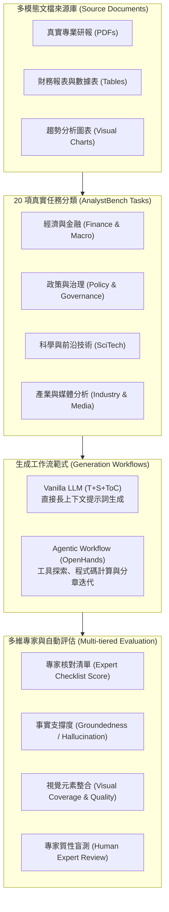

# AnalystBench: Benchmarking professional long-form report generation with web-mined multimodal tasks

## 1. 一話摘要 (TL;DR)
AnalystBench 提出了首個涵蓋 20 項真實專業長篇報告生成任務的多模態長文本基準，要求模型處理包含數百萬 Token 的多模態文檔庫；評測揭示現有最強模型（如 GPT-5.1）在簡單摘要任務上表現優異（Checklist > 90%），但在長程跨文檔綜合任務上斷崖式下跌至 25–40%，且 Agentic 工作流對頂級閉源模型有顯著增益（+20.24% Checklist），卻對開源推理模型（DeepSeek-R1）呈現無效甚至負向收益（-3.02%）。

---

## 2. 研究背景與問題定義 (Problem Statement)

### 2.1 現有長篇生成基準的局限性
現有的長文本或 RAG 基準（如 ASQA、ALCE、LongBench、QASPER 等）多聚焦於單篇論文摘要、短篇事實問答或片段式引用，無法反映真實專業工作流（Professional Analysis Workflow）：
1. **輸入規模懸殊**：專業分析師撰寫產業趨勢、總體經濟或政策評估報告時，需跨越數十份研報、財務報表與統計圖表（百萬級 Token），遠超傳統上下文窗口或檢索單元。
2. **多模態圖表深度依賴**：真實報告的核心論點通常由折線圖、柱狀圖與表格數據支撐，純文本 RAG 系統難以進行跨模態事實提取與推論。
3. **評估標準失真**：傳統 ROUGE、BLEU 或單純的 citation accuracy 無法捕捉報告級的結構完整性（ToC）、行動建議性（Actionability）與邏輯嚴密性。

### 2.2 核心研究問題
- 當輸入擴展至真實世界的數十萬至數百萬多模態 Token 時，前沿 LLM 生成長篇專業報告的能力極限為何？
- 基於 Agentic（如 OpenHands 工具調用與程式碼執行）的工作流程是否普遍優於端到端 Vanilla 提示詞生成？
- 人類專業分析師審核視角下，目前生成報告距離商業落地交付的最核心落差為何？

---

## 3. 核心方法與技術架構 (Methodology & Architecture)

AnalystBench 建立了包含任務構建、多模態輸入封裝、生成工作流比對與多維專家核查的完整評估體系。

### 圖中節點對照
- `D1` 至 `D3`：多模態文檔庫，涵蓋文字、跨頁表格與向量圖表。
- `T1` 至 `T4`：四大領域共 20 個典型報告任務（包含年度回顧型與專題分析型）。
- `W1`：Vanilla 單步端到端生成（輸入包含 Title + Sources + Table of Contents）。
- `W2`：基於 Agentic 架構的迭代式長篇寫作工作流（檢索、Python 數據計算、子章節起草與整合）。
- `E1` 至 `E4`：結合 LLM-as-a-judge（Prometheus / GPT-5.1）與人類資深分析師的多層次驗證協議。

---

## 4. 主要實驗結果與證據 (Empirical Results & Evidence)

AnalystBench 在 ACL 2026 原文（Pages 23894–23926）中提供了豐富的定量實驗與專家質性審計數據：

### 4.1 核心生成表現與消融分析 (Table 3, Page 7)
在 20 項長篇任務上，對比不同模型架構與工作流設定：

| 模型與設定 | 生成字數 (Words) | Checklist Score (%) | Groundedness (%) | Visual Quality | Visual Coverage (%) |
|---|---|---|---|---|---|
| **GPT-5.1 Vanilla (T+S+ToC)** | 4,061 | 58.24 | 70.93 | 27.53 | 7.74 |
| **Gemini-3-Pro Vanilla (T+S+ToC)** | 1,407 | 56.51 | 79.64 | 25.40 | 20.16 |
| **DeepSeek-R1 Vanilla (T+S+ToC)** | 1,262 | 60.24 | 73.68 | 15.87 | 7.15 |
| **GPT-5.1 (No Sources: -S)** | 1,337 | 44.27 | N/A (無來源) | 0.00 | 14.58 |
| **GPT-5.1 Agents (T+S)** | 6,106 | 73.11 | **84.81** | **72.95** | 10.44 |
| **GPT-5.1 Agents (T+S+R\*)** | 6,130 | **75.09** | 84.39 | 60.11 | 9.68 |

*註：T=Title, S=Sources, ToC=Table of Contents, R\*=Reference ground truth outline. 數據出處：Table 3, Page 7。*

### 4.2 任務難度分佈與能力斷崖 (Figure 2, Page 7)
- **執行摘要型任務 (Executive Summarization)**：GPT-5.1 在高結構化、範疇明確的摘要任務中，Checklist 分數可突破 **90%**。
- **長程跨文檔綜合任務 (Long-horizon Multi-doc Synthesis)**：當任務需要整合多份相互衝突或具時序演進的文檔時，Checklist 分數急遽滑落至 **25%–40%**。

### 4.3 Agentic 效益的二元分化 (Section 4.3, Page 6–7)
- **頂級閉源模型 (GPT-5.1 / Gemini-3-Pro)**：引入 OpenHands agentic 框架後，GPT-5.1 Checklist 分數由 58.24% 提升至 75.09%（最大增益達 **+20.24 percentage points**），且 Visual Inclusion 由 7.74% 暴增至 37.41%–72.95%。
- **開源推理模型 (DeepSeek-R1)**：Vanilla 下具備 60.24% 的最高初始 Checklist 分數，但在 Agentic 工具調用中常出現重複搜尋或上下文丟失，Checklist 分數反降 **-3.02 points**，證明 Agent 並非放之皆準的靈丹妙藥。

---

## 5. 優勢、限制及 Trade-offs (Strengths, Limitations & Trade-offs)

### 5.1 優勢
1. **任務真實度與規模空前**：擺脫了合成 QA 玩具數據，直接採用 20 個真實產業與智庫長篇任務，輸入規模達到真實的百萬 Token 級。
2. **專家驗證的評估指標**：結合特定領域專家逐條審定的 Checklist 與嚴格的 Groundedness 檢驗，高度對齊人類專家的審核維度。
3. **揭示 Agentic 機制邊界**：首度系統性指出 Agentic 工具流對不同模型容量與推論架構的異質性效應（Heterogeneous Returns）。

### 5.2 限制與 Trade-offs
1. **評估成本極高**：單次全基準評測涉及百萬 Token 上下文與多輪 Agent 工具調用，API 成本與推理時間顯著高於傳統 QA 基準。
2. **多模態圖表評估難以完全自動化**：圖表的版面編排美觀度、與文字論點的互補性仍需大量專家介入，自動化評分與專家評審仍存在邊際方差。
3. **開源模型長程執行脆弱**：在缺乏專門針對長程多步驟工具互動微調的情況下，開源權重模型難以承擔完整的 Agentic 報告撰寫任務。

---

## 6. 對本專案研究領域的實際意義 (Implications for Research Domains)

1. **D09 (Grounded Generation & Long-form Synthesis)**：證實長篇報告不能依賴一次性 prompt 輸出，必須建立「大綱規劃 $\to$ 證據收集與核查 $\to$ 子章節分段生成 $\to$ 全文一致性編排」的解耦架構。
2. **D12 (Agentic RAG & Orchestration)**：打破了「只要加 Agent 就必然提升效能」的學術迷思，指出 Agent 架構對底層 LLM 的指令遵循穩定性與上下文長程管理能力有極高門檻。
3. **D13 (RAG Evaluation & Failure Attribution)**：為深度研報評測提供了黃金標準（Gold Standard），展示如何透過「領域事實清單 (Checklist)」解決長文本中語義重複度量失真的根本難題。

---

## 7. 原始來源及相關筆記連結 (Sources & Related Notes)

### 原始文獻
- **ACL Anthology**：[https://aclanthology.org/2026.findings-acl.1197/](https://aclanthology.org/2026.findings-acl.1197/)
- **DOI**：`10.18653/v1/2026.findings-acl.1197`
- **本地 PDF**：`[[Papers/06 - Benchmarks & Evaluation/(ACL 2026-08) AnalystBench - Benchmarking Professional Long-Form Report Generation with Web-Mined Multimodal Tasks.pdf|開啟本地 PDF 檔案]]`

### 關聯專題與論文筆記
- **專題報告**：
  - `[[02 - 研究領域專題 (Research Domains)/Domain 09 - Grounded Generation Attribution & Long-form Synthesis|D09 Grounded Generation & Long-form Synthesis]]`
  - `[[02 - 研究領域專題 (Research Domains)/Domain 13 - RAG Evaluation & Failure Attribution|D13 RAG Evaluation & Failure Attribution]]`
- **同領域代表性論文**：
  - `[[03 - 論文庫 (Literature Notes)/05 - Memory & Agents/(ACL 2026-08) EviReport - From Reasoned Outlines to Evidence Tracked Long-Form Reports|(ACL 2026-08) EviReport]]`
  - `[[03 - 論文庫 (Literature Notes)/05 - Memory & Agents/(ACL 2026-08) EFSG - Evidence-First Structured Generation for Multilingual RAG Report Generation|(ACL 2026-08) EFSG]]`
  - `[[03 - 論文庫 (Literature Notes)/06 - Benchmarks & Evaluation/(EMNLP 2023-12) Enabling Large Language Models to Generate Text with Citations|(EMNLP 2023-12) ALCE]]`
