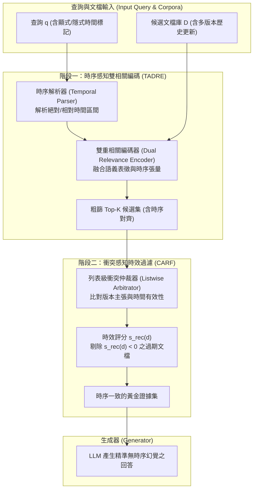

# Re3: Relevance & Recency Retrieval for Mitigating Temporal Hallucination

## 1. 一話摘要 (TL;DR)
Re³ 針對動態真實世界檢索中的「時序語義失配（Temporal-semantic Misalignment）」與「過期文檔干擾（Outdated-document Interference）」雙重難題，提出由「時序感知雙相關編碼器（TADRE）」與「衝突感知時效過濾器（CARF）」組成的兩階段框架，並建立包含 130 萬條實例的評測基準 Re² Bench；在動態任務上平均提升生成準確率達 9.7%，極端動態場景增益達 25.2%。

---

## 2. 研究背景與問題定義 (Problem Statement)

### 2.1 時效敏感 RAG 的核心瓶頸
在天氣、公共衛生、金融新聞等高度動態場景中，文檔庫中普遍共存同一主題的多個歷史版本（Obsolete vs Current Versions）：
1. **時序語義失配**：傳統雙編碼器（如 BM25、Contriever、BGE）主要基於語義相似度比對，難以解析查詢中隱含或顯式的時序約束（如「2024 年第三季前」與「截至目前」），導致檢索出語義高度相關但時間維度錯誤的文檔。
2. **過期資訊干擾與幻覺注入**：當檢索器將高相關性的過期文檔輸入 LLM 時，生成模型極易產生「時序混淆幻覺」，直接採信舊版本事實而忽略時效性。
3. **「越新越好」盲目假設的失效**：簡單按時間戳（Timestamp）排序會遭遇致命失敗，因為歷史事件查詢（如「2020 年紐約因應方案」）需要精準匹配歷史版本，而非最新的 2026 年修訂版。

### 2.2 核心研究假設
- 檢索階段必須將「時序標記（Temporal Signals）」與「語義語義（Semantic Signals）」進行聯合雙重嵌入，而非僅依賴後處理過濾。
- 時效性仲裁必須是「列表級（Listwise Arbitration）」衝突判定，檢測同一實體的多個版本並識別被廢棄的陳舊事實。

---

## 3. 核心方法與技術架構 (Methodology & Architecture)

Re³ 提出了端到端的雙階段檢索架構：

### 圖中節點對照
- `TADRE (Time-Aware Dual Relevance Encoder)`：在密集向量空間中聯合建模語義上下文與時序訊號，避免時間資訊在壓縮時丟失。
- `CARF (Conflict-Aware Recency Filter)`：執行列表級仲裁，計算時效可信評分 $s_{rec}(d)$，過濾陳舊或被後續文檔覆蓋的事實版本。
- `Re² Bench`：評測 Re³ 在 NYC 碰撞、COVID 防疫與 NOAA 氣象預報三大高動態環境下的魯棒性。

---

## 4. 主要實驗結果與證據 (Empirical Results & Evidence)

Re³ 在 ACL 2026 原文（Pages 25735–25760）中在公開基準與全新 Re² Bench 上進行了極為嚴格的對照實驗：

### 4.1 公開時序基準表現 (Table 1, Page 6)
在 TimeQA、Nobel-TSRAG 以及缺乏時間訊號的歷史基準 HoH (Hallucination-on-History) 上的表現：

| 模型方案 | TimeQA R@5 | TimeQA MRR | TimeQA Acc | Nobel R@5 | Nobel MRR | Nobel Acc | HoH Acc |
|---|---|---|---|---|---|---|---|
| **BM25** | 0.3843 | 0.2725 | 0.1996 | 0.5720 | 0.3987 | 0.4049 | 0.4887 |
| **BGE-M3** | 0.8290 | 0.5912 | 0.7272 | 0.8718 | 0.6618 | 0.7879 | 0.5900 |
| **BGE-reranker** | 0.8370 | 0.6224 | 0.7314 | 0.8764 | 0.6644 | 0.7932 | 0.6025 |
| **TempRALM** | 0.8403 | 0.6006 | 0.7106 | 0.8348 | 0.6023 | 0.7579 | 0.5900 |
| **TempRetrieval** | 0.8728 | 0.6117 | 0.7360 | 0.8741 | 0.6641 | 0.7811 | 0.5900 |
| **MRAG** | 0.8448 | 0.6014 | 0.7001 | 0.8415 | 0.6128 | 0.7684 | 0.5900 |
| **LoRA** | 0.6886 | 0.4618 | 0.6943 | 0.9000 | 0.7171 | 0.8299 | 0.5775 |
| **Re³ (Ours)** | **0.9280** | **0.6891** | **0.7743** | **0.9453** | **0.7243** | **0.9092** | **0.6339** |

*註：在 HoH 查詢中不包含顯式時序訊號，所有時序檢索器退化為基底檢索器，但 Re³ 的 CARF 組件依然能發揮列表時效過濾效果，生成 Accuracy 達到 0.6339。出處：Table 1, Page 6。*

### 4.2 Re² Bench 實測表現 (Table 2, Page 6)
Re² Bench 包含 130 萬條真實時序實例，涵蓋三大時效衝突領域：

| 評測模型 | NYC R@5 | NYC Acc | COVID R@5 | COVID Acc | NOAA R@5 | NOAA Acc |
|---|---|---|---|---|---|---|
| **BM25** | 0.2100 | 0.1925 | 0.4812 | 0.4138 | 0.3938 | 0.3387 |
| **BGE-M3** | 0.6087 | 0.5825 | 0.8775 | 0.8438 | 0.5625 | 0.4977 |
| **BGE-reranker** | 0.7850 | 0.7837 | 0.8588 | 0.8313 | 0.7550 | 0.6625 |
| **TempRALM** | 0.8712 | 0.8263 | 0.8812 | 0.8370 | 0.6262 | 0.3625 |
| **TempRetrieval** | 0.8650 | 0.8137 | 0.8762 | 0.8012 | 0.7300 | 0.4238 |
| **Re³ (Ours)** | **0.9248** | **0.8788** | **0.9525** | **0.9112** | **0.9625** | **0.8732** |

*註：在最嚴苛的動態氣象領域 NOAA 上，傳統重排器準確率僅 0.6625，而 Re³ 達到 0.8732（絕對提升 +21.07%）；相對 BM25 提升高達 25.2%。出處：Table 2, Page 6。*

---

## 5. 優勢、限制及 Trade-offs (Strengths, Limitations & Trade-offs)

### 5.1 優勢
1. **解耦時序檢索與衝突過濾**：TADRE 負責「找到該時段的候選」，CARF 負責「剔除被新版本覆蓋的過期候選」，邏輯分明。
2. **評測基準規模宏大**：Re² Bench 達 130 萬條數據，覆蓋不同時效衰減週期（天級、月級、年級），極大填補了學界動態評測空白。
3. **無時序信號時的平滑退化**：在無時序標註的普通查詢（如 HoH）中，Re³ 不會崩潰，仍能保有強大的語義檢索能力。

### 5.2 限制與 Trade-offs
1. **時序解析前處理依賴**：TADRE 的效果部分依賴時序解析器（Temporal Parser）對複雜相對時間表達（如「前天下午大雨後兩小時」）的抽取品質。
2. **列表仲裁計算開銷**：CARF 採用 listwise 比對，候選集過大（如 $K > 100$）時會增加重排階段的延遲與顯存佔用（Table 6, Page 9）。

---

## 6. 對本專案研究領域的實際意義 (Implications for Research Domains)

1. **D08 (Temporal Conflict & Provenance Resolution)**：提供了處理文檔版本迭代與時序衝突的標準設計範式，證明「時序解析」必須嵌入向量空間而非僅作為硬性 SQL filter。
2. **D13 (RAG Evaluation & Failure Attribution)**：Re² Bench 確立了時間敏感型 RAG 評測的標準協議，證明傳統以靜態維基百科為主的基準（如 SQuAD, NQ）會嚴重掩蓋真實世界的時序幻覺。

---

## 7. 原始來源及相關筆記連結 (Sources & Related Notes)

### 原始文獻
- **ACL Anthology**：[https://aclanthology.org/2026.acl-long.1180/](https://aclanthology.org/2026.acl-long.1180/)
- **DOI**：`10.18653/v1/2026.acl-long.1180`
- **本地 PDF**：`[[Papers/06 - Benchmarks & Evaluation/(ACL 2026-08) Re3 - Relevance and Recency Retrieval for Mitigating Temporal Hallucination.pdf|開啟本地 PDF 檔案]]`

### 關聯專題與論文筆記
- **專題報告**：
  - `[[02 - 研究領域專題 (Research Domains)/Domain 08 - Temporal Conflict & Provenance Resolution|D08 Temporal Conflict & Provenance Resolution]]`
  - `[[02 - 研究領域專題 (Research Domains)/Domain 13 - RAG Evaluation & Failure Attribution|D13 RAG Evaluation & Failure Attribution]]`
- **同領域代表性論文**：
  - `[[03 - 論文庫 (Literature Notes)/06 - Benchmarks & Evaluation/(NeurIPS 2024-12) CRAG - Comprehensive RAG Benchmark|(NeurIPS 2024-12) CRAG]]`
  - `[[03 - 論文庫 (Literature Notes)/03 - RAG & Retrieval/(EMNLP 2024-11) Chain-of-Note - Enhancing Robustness in Retrieval-Augmented Language Models|(EMNLP 2024-11) Chain-of-Note]]`
