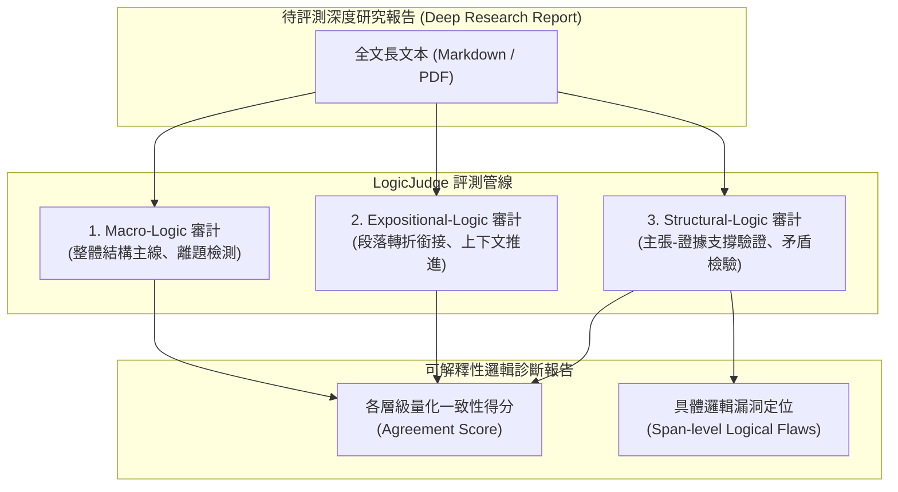

# ReportLogic: Evaluating Logical Quality in Deep Research Reports

## 一話摘要 (TL;DR)
萊頓大學、螞蟻集團與 CISPA 提出的 **ReportLogic** 是首個專門評估長篇「深度研究（Deep Research）」報告邏輯品質的基準與評測體系，將邏輯嚴密性解構為宏觀邏輯（Macro-Logic）、敘事推進（Expositional-Logic）與結構論證（Structural-Logic）三層體系，並訓練出開源輕量化裁判模型 **LogicJudge**，在專家一致性上達到 **74.5%–75.0%**，大幅超越通用閉源大模型（如 GPT-5、o3）及多模型投票集成。

---

## 研究背景與問題定義 (Problem Statement)

1. **現有長篇評測的「事實性偏置」與「字數冗餘偏置」**：
   - 傳統 RAG 評測基準（如 ALCE、FActScore、RAGTruth）大多聚焦於微觀層級的「引文字串對齊度」或「原子事實幻覺率」；現有 LLM-as-a-Judge 容易被冗長華麗的辭藻（Verbosity Bias）迷惑，無法識別長篇報告內部的論證跳躍、偷換概念與因果倒置。
2. **深度研究（Deep Research）報告的邏輯痛點**：
   - 專業研究報告（如產業調查、投資研報、技術盡調）的實質價值在於**論證的嚴密性與推導鏈的自洽性**；常見生成缺陷包括：段落間缺乏過渡邏輯、主張與支撐數據脫節、結論與前文假設互相矛盾。
3. **缺乏可重現的階層式邏輯評測量表**：
   - 先前評估多依賴人工主觀打分，缺乏將抽象「邏輯品質」細化為可量化、可審計的專家級標註體系與開源專用評判模型。

---

## 核心方法與技術架構 (Methodology & Architecture)

ReportLogic 建立了由三層 8 維度構成的邏輯評估分類法，並微調出專用評判模型 LogicJudge：

### 1. 三層邏輯品質分類法 (Three-Level Logical Taxonomy)
1. **宏觀邏輯 (Macro-Logic)**：
   - **On-Topic Coherence**：報告全篇是否始終聚焦於核心研究問題，無離題贅述；
   - **Unified Analytical Arc**：章節之間是否形成「背景 $\to$ 問題 $\to$ 分析 $\to$ 結論」的統一分析主線；
   - **Structural Completeness**：是否存在關鍵分析維度的嚴重缺失。
2. **敘事推進邏輯 (Expositional-Logic)**：
   - **Contextual Progression**：段落之間是否有平滑的語意銜接與邏輯過渡；
   - **Clarity of Motivation**：每個子論點的引出是否具備充分的前置說明。
3. **結構論證邏輯 (Structural-Logic)**：
   - **Claim-Support Verification**：每個核心技術或商業宣稱是否都有明確的事實數據背書；
   - **Inference Validity**：結論推導是否符合演繹/歸納邏輯，是否存在以偏概全；
   - **Non-Contradiction**：報告前後章節的數據與主張是否具備嚴格一致性。

### 圖中節點對照
- `DOC`：輸入之數千字長篇研報。
- `MACRO`, `EXPO`, `STRUCT`：三層邏輯特化評審模組。
- `SCORE`, `FLAWS`：產出評分與邏輯缺陷定位。

---

## 主要實驗結果與證據 (Empirical Results & Evidence)

論文在 DeepResearch、Zhihu、Quora 三大真實長篇問答與報告領域進行評估（第 6–8 頁）：

1. **裁判模型與人類專家協議度（Agreement Accuracy %, Table 1, Page 7）**：
   - **Qwen3-235B**：DeepResearch **43.14%**，Zhihu 49.20%，Quora 53.67%；
   - **DeepSeek-V3**：DeepResearch **62.75%**，Zhihu 66.41%，Quora 53.33%；
   - **多模型投票集成（Ensemble Vote）**：DeepResearch 66.67%，Zhihu 73.57%，Quora 71.31%；
   - **LogicJudge（本文開源專用評判模型）**：
     - 在 DeepResearch 領域達到 **74.50%**；
     - 在 Zhihu 領域達到 **75.00%**；
     - 在 Quora 領域達到 **73.00%**；
     - **在所有領域均奪得第一，顯著超越未經特化的頂級通用 LLM 與集成裁判**。
2. **思維鏈推理（Thinking Mode）在邏輯評判上的異常現象（Page 7）**：
   - 實驗發現，直接開啟通用推理模型（如 o3）的長思考（Test-time Compute），並未穩定提升對長篇報告的邏輯審判準確率，甚至在部分領域產生倒退；原因在於模型在缺乏清晰量表約束時容易「過度思考（Overthinking）」，陷入枝微末節而忽略宏觀邏輯主線。
3. **人類標註者間信度（Table 2 & 3, Page 7–8）**：
   - 人類專家在 Macro-Logic 的協議度最高，而在 Structural-Logic（主張證據充分性判定）上存在最高爭議，凸顯了結構論證形式化評估的極高難度。

---

## 優勢、限制及 Trade-offs (Strengths, Limitations & Trade-offs)

### 優勢
1. **填補長篇邏輯評測空白**：首創將「論文/報告邏輯」分層解構為具體可操作的 3 層維度。
2. **開源且輕量**：提供專用的 LogicJudge 權重與標註集，降低研報評估對專有昂貴 API 的依賴。
3. **抗長度偏置**：專門針對模型「字數多就打高分」的偏見進行了對抗微調（Adversarial Debiasing）。

### 限制與 Trade-offs
1. **跨領域專業門檻**：在高度專業化的硬核領域（如臨床醫學、量子物理），LogicJudge 若缺乏專屬領域背景知識，對深層事實推導因果的辨識力會有所下降。
2. **長上下文計算負擔**：完整評審一篇 10,000 字報告需對全文進行分層解構，單次評判計算成本高於簡單的句子級問答評估。

---

## 對本專案研究領域的實際意義 (Implications for Research Domains)

1. **對 Domain 08（長篇生成與報告撰寫）的關鍵支撐**：
   - 本專案開發的長篇研報工作流（如 Evidence Store + Claim-driven Generation），可直接將 LogicJudge 作為最終交付前的「審查員（Critic Agent）」，在生成後即時抓出邏輯斷層與無證據支撐之結論。
2. **對 Domain 17（評測基準與評估協議）的補充**：
   - 與評估微觀引文精確度的 ALCE / RAGChecker 形成完美的宏微觀互補。

---

## 原始來源及相關筆記連結 (Sources & Related Notes)

- **本地 PDF**：`[[Papers/06 - Benchmarks & Evaluation/(ACL 2026-08) ReportLogic - Evaluating Logical Quality in Deep Research Reports.pdf|開啟本地 PDF 檔案]]`
- **官方開源庫**：[GitHub Polaris-JZ/ReportLogic](https://github.com/Polaris-JZ/ReportLogic) · [arXiv:2602.18446](https://arxiv.org/abs/2602.18446)
- **關聯領域筆記**：
  - [[02 - 研究領域專題 (Research Domains)/Canonical RAG Domains/Domain 13 - RAG Evaluation & Failure Attribution|D13 RAG Evaluation & Failure Attribution]]
  - [[02 - 研究領域專題 (Research Domains)/Canonical RAG Domains/Domain 09 - Grounded Generation Attribution & Long-form Synthesis|D09 Grounded Generation & Long-form Synthesis]]
  - [[02 - 研究領域專題 (Research Domains)/Canonical RAG Domains/Domain 07 - Context Construction & Evidence Utilization|D07 Context Construction & Evidence Utilization]]
- **同類/相關論文筆記**：
  - [[03 - 論文庫 (Literature Notes)/06 - Benchmarks & Evaluation/(ACL 2026-08) AnalystBench - Benchmarking Professional Long-Form Report Generation with Web-Mined Multimodal Tasks|(ACL 2026-08) AnalystBench]]
  - [[03 - 論文庫 (Literature Notes)/05 - Memory & Agents/(ACL 2026-08) EviReport - From Reasoned Outlines to Evidence Tracked Long-Form Reports|(ACL 2026-08) EviReport]]
  - [[03 - 論文庫 (Literature Notes)/06 - Benchmarks & Evaluation/(EMNLP 2023-12) Enabling Large Language Models to Generate Text with Citations|(EMNLP 2023-12) ALCE]]
