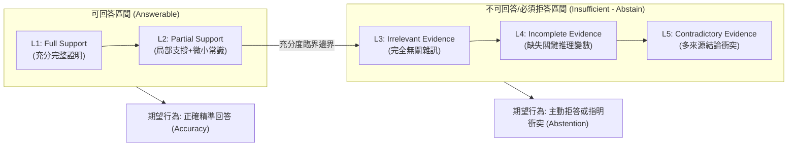

# Do LLMs Know When Evidence is Insufficient? An Evidence Sufficiency Benchmark for Answer-Abstention Calibration in Retrieval-Augmented Generation

## 1. 一話摘要 (TL;DR)
本論文針對 RAG 系統中普遍存在的「證據不足時盲目強答（Over-answering）」病態現象，建立了五級證據充分度基準（L1 充分支援至 L5 矛盾衝突），並提出行為期望校準誤差（B-ECE），揭示出即使最強的前沿模型在衝突證據下的拒答率亦低於 35%。

---

## 2. 研究背景與問題定義 (Problem Statement)

### 2.1 RAG 中的過度回答（Over-answering）病態
在實際生產環境的 RAG 系統中，檢索器回傳的內容往往是不完美、殘缺甚至是相互抵觸的。然而，現有大語言模型受到「遵從指令（Instruction Following）」微調的過度激勵，產生了嚴重的行為扭曲：
1. **強迫回答衝動**：即使檢索出的證據與問題完全無關、缺失關鍵實體或互相矛盾，模型依然會強行捏造一個看似合理的確定性答案；
2. **缺乏自知之明（Miscalibration）**：模型無法根據外部證據的充分度（Evidence Sufficiency）動態調節自身的回答信心；
3. **拒答邊界模糊**：現有拒答評測多基於單一的「可答/不可答」二元劃分，缺乏細粒度的證據退化階梯。

---

## 3. 核心方法與技術架構 (Methodology & Architecture)

### 3.1 五級證據充分度光譜 (Evidence Sufficiency Spectrum)
論文提出嚴格的五級證據階梯（Section 3, Page 4 & Table 1）：
- **可回答條件 (Answerable Conditions)**：
  - **L1 (Full Support)**：檢索上下文包含完整且無歧義的黃金證明鏈條；
  - **L2 (Partial Support)**：上下文包含核心事實，需要進行微小的常識連結，仍屬可答範圍；
- **需拒答條件 (Insufficient-Evidence Conditions Requiring Abstention)**：
  - **L3 (Irrelevant Evidence)**：檢索內容完全不包含問題所需實體或屬性；
  - **L4 (Incomplete / Missing Key Entity)**：檢索內容看似高度相關，但精確缺失了最終推理所需的決定性關鍵變數；
  - **L5 (Contradictory / Conflicting Evidence)**：檢索內容中存在兩個權威性相當但結論相互矛盾的斷言。

### 3.2 評估協議與行為期望校準誤差 (B-ECE)
- 論文評測了三種不同引導強度的提示策略（Table 2, Page 7）：
  - **P1 (Standard)**：標準無拒答提示；
  - **P2 (Permissive)**：明確允許「如果證據不足可以回答不知道」；
  - **P3 (Strict)**：嚴格要求每項結論必須有顯式證明，否則必須拒答。
- **B-ECE 指標 (Behavioral Expected Calibration Error, Page 5)**：
  衡量模型在不同充分度等級 $l$ 上的實際拒答率 $\bar{a}_l$ 與理論理想拒答目標 $a^*_l$ 之間的加權絕對偏差：
  $$\text{B-ECE} = \sum_{l=1}^5 \frac{n_l}{N} |\bar{a}_l - a^*_l|$$

---

## 4. 主要實驗結果與證據 (Empirical Results & Evidence)

論文針對 7 款主流頂尖前沿模型（GPT-5.5、Claude、Gemini、DeepSeek Chat 等）進行了深入評測（Table 3, Page 8）：

### 4.1 充分證據下的可靠性 (L1–L2)
- 在充分證據（L1–L2）下，所有模型均表現優異，準確率超過 **80%**，拒答率均低於 **10%**（Table 3, Page 8）。

### 4.2 衝突與殘缺下的全面崩潰 (L3–L5)
- **無關證據 (L3)**：模型拒答率上升至 27%–67%，多數模型能識別明顯無關內容；
- **衝突證據 (L5) 的嚴重過度回答 (Table 3 & Table 4, Page 8–9)**：
  - 面對相互矛盾的證據，受測模型的過度回答率（Over-answer Rate）爆發；
  - 只有 **Gemini** 的拒答率勉強超過 30%（達 **34.8%**，且包含衝突感知拒答 CA-Abst）；
  - **Claude** 在 L5 衝突下的拒答率僅有 **9.5%**，高達 90.5% 的情況下會隨機選取其中一方當作唯一真理強答；
  - **DeepSeek Chat** 在整體 B-ECE 上取得最佳平衡（81.9% 充分準確率，50.8% 衝突過度回答率）（Page 10）。

---

## 5. 優勢、限制及 Trade-offs (Strengths, Limitations & Trade-offs)

### 優勢
1. **精準切中 RAG 安全痛點**：首次將「證據充分度」形式化為可操作的 5 級階梯，擺脫了粗糙的二元評測；
2. **行為校準量化 (B-ECE)**：不依賴神經網絡內部 Logits 概率，直接在黑箱 LLM 輸出行為層面量化校準誤差。

### 限制與 Trade-offs
1. **提示策略敏感度高 (Prompt Sensitivity)**：如 Figure 5 (Page 10) 所示，Prompt 的措辭變化會導致拒答率出現劇烈波動；
2. **保守過度（Under-answering）風險**：在極度嚴格的 P3 提示下，部分模型會過於膽怯，在 L2 局部充分條件下也錯誤拒答。

---

## 6. 對本專案研究領域的實際意義 (Implications for Research Domains)
- **核心支撐 D06（Evidence Sufficiency & Adaptive Retrieval）**：本論文直接驗證了 D06 中關於「Evidence Sufficiency Controller」與「拒答校準」的理論必要性。
- **補全文獻庫最新 2026 年出版成果**：填補了知識庫中關於專門證據充分度評測基準（Benchmark Paper）的空白。

---

## 7. 原始來源及相關筆記連結 (Sources & Related Notes)
- **開啟本地 PDF**：[[Papers/06 - Benchmarks & Evaluation/(CMC 2026-08) Do LLMs Know When Evidence is Insufficient - An Evidence Sufficiency Benchmark.pdf|開啟原始論文 PDF]]
- **關聯文獻**：
  - [[03 - 論文庫 (Literature Notes)/03 - RAG & Retrieval/(EMNLP 2024-11) Chain-of-Note - Enhancing Robustness in Retrieval-Augmented Language Models|(EMNLP 2024-11) Chain-of-Note]]
  - [[03 - 論文庫 (Literature Notes)/05 - Memory & Agents/(arXiv 2022-03) Teaching language models to support answers with verified quotes|(arXiv 2022-03) GopherCite]]
  - [[03 - 論文庫 (Literature Notes)/06 - Benchmarks & Evaluation/(NeurIPS 2024-12) CRAG - Comprehensive RAG Benchmark|(NeurIPS 2024-12) Meta CRAG]]
