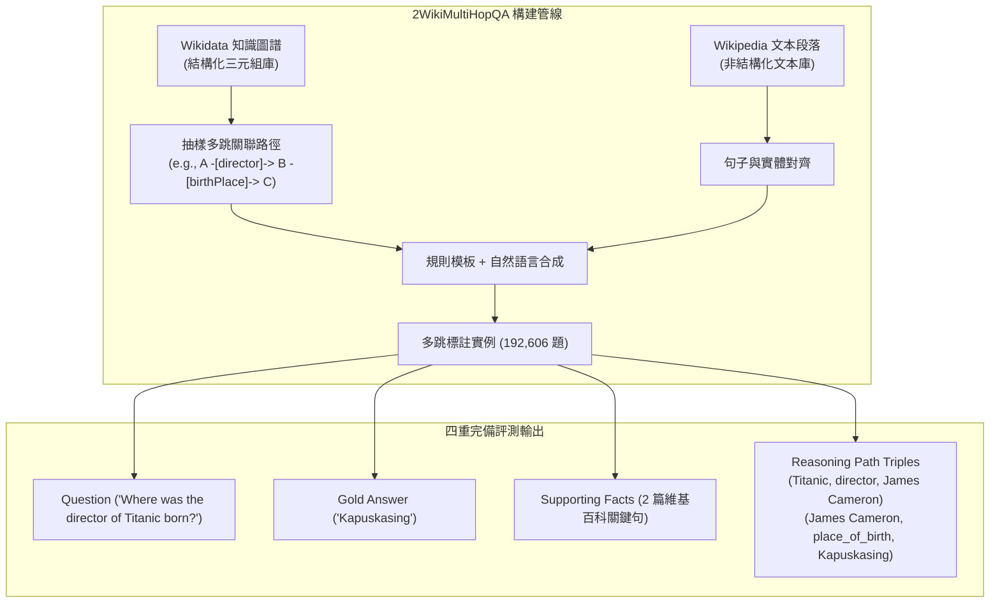

# Constructing A Multi-hop QA Dataset for Comprehensive Evaluation of Reasoning Steps (2WikiMultiHopQA)

## 1. 一話摘要 (TL;DR)
2WikiMultiHopQA 是首個同時提供「最終答案、支援事實句子（Supporting Facts）與顯式結構化推理路徑（三元組鏈條）」的大規模多跳問答資料集（19.2 萬題），使評估多跳 RAG 的每一步邏輯推導具備了精確客觀的真值標註。

---

## 2. 研究背景與問題定義 (Problem Statement)

### 2.1 現有多跳資料集的「黑箱解釋」缺陷
在 2WikiMultiHopQA 出現前，最廣泛使用的多跳問答資料集是 HotpotQA。然而 HotpotQA 在可解釋性評估上面臨根本限制：
1. **僅有粗粒度句子標註**：HotpotQA 只標註了哪些句子是 Supporting Facts，並未標明「這些句子之間是如何邏輯連接的」；
2. **無法區分推理類型**：缺乏對比較型（Comparison）、推斷型（Inference）、組合型（Compositional）等不同認知推理類型的系統解耦；
3. **路徑幻覺無從檢驗**：模型可能檢索出了正確的句子，但給出了一段邏輯完全顛倒或胡亂關聯的解釋，評測指標卻無法捕捉。

---

## 3. 核心方法與技術架構 (Methodology & Architecture)

### 3.1 結合 Wikipedia 與 Wikidata 的雙向圖譜合成
作者利用結構化的 Wikidata 知識圖譜三元組，結合非結構化的 Wikipedia 文本段落，進行自動化可控生成（Section 3, Page 2–5）：
- **四大問題類型體系 (Table 2, Page 6)**：
  1. *Comparison*（比較型）：比較兩個實體的共同屬性（如年齡、出生地、上映年份）；
  2. *Inference*（推斷型）：需要依賴知識庫中的先驗關係進行常識或邏輯演繹；
  3. *Compositional / Bridge*（組合橋接型）：$A \to \text{rel}_1 \to B \to \text{rel}_2 \to C$；
  4. *Bridge-Comparison*（混合型）：結合橋接與比較的複雜多步推理。
- **完整的四重真值元組標註**：
  $$\{ \text{Question}, \text{Answer}, \text{Supporting Sentences}, \text{Reasoning Path Triples} \}$$

---

## 4. 主要實驗結果與證據 (Empirical Results & Evidence)

論文在 192,606 題規模的資料集上全面測試了 BERT 與 RoBERTa 模型（Table 1 & Table 4, Page 6–7）：
- **答案與解釋的嚴重脫節 (Table 4, Page 7)**：
  - RoBERTa-large 在答案預測上達到了 **69.8 F1**；
  - 但在完整的結構化推理路徑預測（Reasoning Path F1）上，分數驟降至 **42.3 F1**；
  - 在關聯三元組的順序完全匹配率（Joint Exact Match）上，分數更是低於 **30%**；
- 這一鮮明對比直接證明：**主流神經模型雖然能從段落中「猜出」實體名詞，但對於背後的因果關係鏈條根本缺乏穩固的結構化理解**。

---

## 5. 優勢、限制及 Trade-offs (Strengths, Limitations & Trade-offs)

### 優勢
1. **首創結構化三元組解釋路徑**：使得檢驗 GraphRAG、知識圖譜檢索器（如 HippoRAG）的路徑遊走精確度擁有了天然的 Ground Truth；
2. **資料規模龐大且平衡**：近 20 萬的高質量題目，涵蓋 4 種明確的認知推理維度。

### 限制與 Trade-offs
1. **模板合成語言的多樣性**：相較於全人工撰寫的 HotpotQA，部分問題的語言句式略顯生硬或包含模板特徵；
2. **實體捷徑依然部分存在**：與後續的 MuSiQue 相比，部分組合題仍存在少量可被雙編碼器利用的實體共現線索。

---

## 6. 對本專案研究領域的實際意義 (Implications for Research Domains)
- **GraphRAG 的黃金評測基準**：2WikiMultiHopQA 是本專案評估 [[02 - 研究領域專題 (Research Domains)/Canonical RAG Domains/Domain 04 - Knowledge Representation & Indexing|D04 Knowledge Representation & Indexing]] 中路徑檢索與子圖推理的首選基準。
- **支撐長文推理透明化**：為長篇報告撰寫系統中「如何將檢索到的多段零散事實還原為結構化思維鏈」提供了資料支撐。

---

## 7. 原始來源及相關筆記連結 (Sources & Related Notes)
- **開啟本地 PDF**：[[Papers/06 - Benchmarks & Evaluation/(COLING 2020-12) 2WikiMultiHopQA - A Multi-hop QA Dataset with Explanation Paths.pdf|開啟原始論文 PDF]]
- **關聯文獻**：
  - [[03 - 論文庫 (Literature Notes)/06 - Benchmarks & Evaluation/(EMNLP 2018-10) HotpotQA - A Dataset for Diverse, Explainable Multi-hop Question Answering|(EMNLP 2018-10) HotpotQA]]
  - [[03 - 論文庫 (Literature Notes)/06 - Benchmarks & Evaluation/(TACL 2022-05) MuSiQue - Multihop Questions via Single-hop Question Composition|(TACL 2022-05) MuSiQue]]
  - [[03 - 論文庫 (Literature Notes)/04 - Knowledge & Graph RAG/(NeurIPS 2024-12) HippoRAG - Neurobiologically Inspired Long-Term Memory for Large Language Models|(NeurIPS 2024-12) HippoRAG]]
