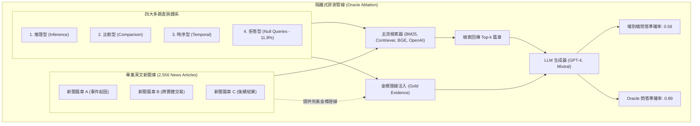

# MultiHop-RAG: Benchmarking Retrieval-Augmented Generation for Multi-Hop Queries

## 一話摘要 (TL;DR)
香港科技大學提出的 MultiHop-RAG 是專門針對現實多跳複雜查詢構建的 RAG 評測基準，基於 2,556 篇專業英文新聞報導，涵蓋推理、比較、時序與空查詢（Null Queries）四大難題類型；實驗證明即便利導最強的 GPT-4，在現有檢索器支持下多跳問答準確率僅為 **0.56**，而在提供金標證據下躍升至 **0.89**，以嚴謹 Oracle 對比實證揭示檢索環節是多跳 RAG 的最大效能瓶頸。

---

## 研究背景與問題定義 (Problem Statement)
現有多跳問答基準（如 HotpotQA、2WikiMultiHopQA）在評估現代 RAG 系統時存在顯著缺陷：
1. **合成範本與文字重疊偏誤**：傳統多跳數據集大多透過維基百科超連結與特定模板合成，檢索模型常依靠簡單的實體共現或字詞重疊（Lexical Overlap）投機命中，無法反映真實商業與新聞文本中複雜的跨段邏輯依賴。
2. **缺乏多跳查詢類型學細分**：現實中的多跳問題性質各異（有的是實體屬性比較，有的是事件時序因果，有的是無解的陷阱查詢），缺乏細粒度的能力診斷。
3. **檢索與生成能力割裂**：以往評測往往只單獨看檢索 Recall 或只看問答 EM，缺乏端到端管線中「檢索失敗如何傳導至生成失效」的嚴格隔離實驗（Oracle Ablation）。

---

## 核心方法與技術架構 (Methodology & Architecture)

MultiHop-RAG 構建了**高品質真實新聞知識庫**與**四大多跳推理查詢類型**：
1. **專業新聞語料庫（News Knowledge Base）**：
   - 收集 2,556 篇來自路透社（Reuters）、彭博社（Bloomberg）等權威媒體的最新財經與政治新聞；
   - 文本長度更長、結構更複雜，避免了維基百科條目過於均質化的問題。
2. **四大多跳查詢類型（4 Multi-Hop Query Categories）**：
   - **推理型查詢（Inference Queries）**：需沿著關係鏈進行邏輯推導（如 A 導致 B，B 收購 C，問 A 與 C 的關聯）；
   - **比較型查詢（Comparison Queries）**：需橫向對比不同實體在相同維度上的數值或特徵；
   - **時序型查詢（Temporal Queries）**：需比對不同時間節點發生的事件先後順序或狀態變更；
   - **空查詢（Null Queries，佔比 11.78%）**：語料庫中僅包含部分線索，不足以推導出完整答案，測試系統是否具備「拒絕回答 / 識別證據短缺」的防禦能力。
3. **精確證據跨度標註（Evidence Spans）**：
   - 每個多跳問題均人工對齊至 2–4 篇不同新聞中的具體段落，並標註推理路徑的邏輯先後關係。

### 圖中節點對照
- `queries`：涵蓋推理、比較、時序與拒答的四元測試集。
- `ACC_RAG`：常規 RAG 檢索器支持下的生成準確率。
- `ACC_ORACLE`：剔除檢索誤差後生成器純推理能力的上限。

---

## 主要實驗結果與證據 (Empirical Results & Evidence)

論文系統性評估了多種稠密/稀疏檢索器與前沿大語言模型（Table 5 & Table 6, Page 7）。

### 1. 檢索瓶頸的量化隔離 (Table 6, Page 7)
- **GPT-4 端到端準確率對比**：
  - 在標準 RAG 設定下（以主流檢索器召回上下文），**GPT-4 的問答準確率僅有 0.56**；
  - 開源強模型 Mixtral-8x7B-Instruct 僅取得 **0.36**；
  - **在 Oracle 金標證據輸入下**：GPT-4 準確率直接飆升至 **0.89**。
  - **核心結論**：0.56 與 0.89 之間 **33% 的巨大性能落差**，完全源於現有檢索器無法完整找齊多跳推理所需的分散碎片，證實檢索器召回不全（Retrieval Incompleteness）是多跳失敗的主因。

### 2. 檢索模型在多跳上的嚴重退化 (Table 5, Page 7)
- 評測 BM25、Contriever、BGE-large 以及 OpenAI text-embedding-ada-002：
  - 由於多跳問題通常只與第一跳段落表面相似，後續跳躍段落（Bridge Passages）在向量空間中與查詢的餘弦相似度極低；
  - 所有傳統向量檢索器在 Hits@4 指標上均低於 45%，暴露了扁平式向量檢索在多跳拓撲上的固有天花板。

---

## 優勢、限制及 Trade-offs (Strengths, Limitations & Trade-offs)

### 優勢
1. **首創現實新聞語料多跳評測**：徹底擺脫了 Wikipedia 合成條目的刻板痕跡，真實反映新聞情報、商業調研中的多文檔交叉分析需求。
2. **納入空查詢（Null Queries）防禦測試**：評估模型在面對資訊不足時能否保持審慎，為防止幻覺輸出提供了關鍵測試維度。

### 限制與 Trade-offs
1. **語料規模適中**：2,556 篇新聞在測試超大規模語料庫（如數千萬文檔）的海量干擾項檢索壓力時可能略有不足。
2. **多跳長度多在 2–3 跳**：針對 4 跳以上極限複雜鏈條的推理樣本相對較少。

---

## 對本專案研究領域的實際意義 (Implications for Research Domains)
1. **對 D04/D05 (Structured Representation & Retrieval) 的強力佐證**：MultiHop-RAG 實證揭示的 33% 檢索落差，直接為引進 HippoRAG、PropRAG 與圖拓撲導航提供了不可或缺的立論依據。
2. **對 D13 (RAG Evaluation & Failure Attribution) 的標竿價值**：確立了在多跳基準測試中必須強制報告「Oracle vs RAG 差距」的評測金律。

---

## 原始來源及相關筆記連結 (Sources & Related Notes)
- 原始論文 PDF：[[Papers/06 - Benchmarks & Evaluation/(COLM 2024-10) MultiHop-RAG - Benchmarking Retrieval-Augmented Generation for Multi-Hop Queries.pdf|開啟本地 PDF]]
- arXiv 永久連結：[arXiv:2401.15391](https://arxiv.org/abs/2401.15391)
- 關聯專題領域：[[02 - 研究領域專題 (Research Domains)/Canonical RAG Domains/Domain 13 - RAG Evaluation & Failure Attribution|D13 RAG Evaluation & Failure Attribution]]、[[02 - 研究領域專題 (Research Domains)/Canonical RAG Domains/Domain 04 - Knowledge Representation & Indexing|D04 Knowledge Representation & Indexing]]
