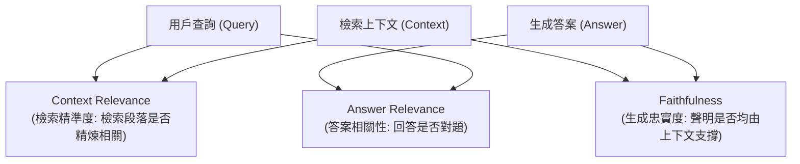

# Ragas: Automated Evaluation of Retrieval Augmented Generation

> [!ABSTRACT] 一話摘要 (TL;DR)
> 本文提出 **Ragas**，首個專門針對 RAG 系統的**無參考答案自動化評估框架（Reference-Free Evaluation Framework）**，將 RAG 系統拆解為檢索端與生成端，並定義忠實度（Faithfulness）、答案相關性（Answer Relevance）與上下文相關性（Context Relevance）三大可解釋核心指標。

---

## 一、研究背景與問題定義 (Problem Statement)
- **核心痛點**：評估 RAG 系統極為昂貴且困難，傳統 NLP 評估指標（如 BLEU, ROUGE）高度依賴人工標註的 Ground Truth 參考答案，且無法分辨「檢索模組失敗（未找到正確段落）」還是「生成模組失敗（有找到但模型胡說幻覺）」。
- **研究假設**：利用前沿 LLM 擔任無參考答案的自動評判者（LLM-as-a-Judge），透過將回答原子化拆解為語句聲明（Statements），並分別與檢索上下文及原始查詢對齊，能夠高度精確預測人類專家的品質評價。

---

## 二、核心方法與技術架構 (Methodology & Architecture)

1. **忠實度 (Faithfulness)**：
   - 將生成答案 $A$ 拆解為獨立事實命題集合 $S(A) = \{s_1, \ldots, s_m\}$；
   - 驗證每個命題 $s_i$ 是否能被檢索上下文 $C$ 嚴格推導（Entailed）：
     \[
     \text{Faithfulness} = \frac{|\{s \in S(A) \mid C \vdash s\}|}{|S(A)|}
     \]
2. **答案相關性 (Answer Relevance)**：
   - 根據生成答案 $A$ 反向生成 $n$ 個潛在問題 $q_i$，計算生成的 $q_i$ 與原始問題 $q$ 的嵌入相似度均值，懲罰離題與廢話。
3. **上下文相關性 (Context Relevance)**：
   - 提取檢索上下文 $C$ 中真正回答問題所必需的句子子集 $S_{\text{rel}}$，計算其佔總句子數之比例，懲罰過長、冗餘的檢索片段。

---

## 三、主要實驗結果與證據 (Empirical Results & Evidence)
- **出處**：Table 1, Page 5.
- **評估基準與數據**：
  - 在 **WikiEval** 基準資料集上，與人類評審進行兩兩對比一致性（Agreement with human annotators）分析：
  - **Faithfulness**：Ragas 與人類專家的一致性達到 **0.95**（超越 GPT-4 直接評分的 0.72）；
  - **Answer Relevance**：與人類一致性達到 **0.78**；
  - **Context Relevance**：與人類一致性達到 **0.71**。
  - 實驗證明原子化命題分解與分層判定顯著優於單一 Prompt 籠統打分。

---

## 四、優勢、限制及 Trade-offs (Strengths, Limitations & Trade-offs)
- **優勢**：
  - 無需昂貴的人工標註標準答案，適合快速 CI/CD 迴歸測試；
  - 成功將「檢索問題」與「生成幻覺」解耦診斷。
- **限制與工程代價**：
  - **依賴 LLM-as-a-Judge 的評分穩定度**：在評估中需多次呼叫裁判 LLM（產生額外 API 成本與評測延遲）；
  - **對複雜推論與多跳證據的捕捉力有限**：若單一命題需跨三個段落綜合推導，Faithfulness 判定容易漏判。

---

## 五、對本專案研究領域的實際意義 (Implications for Research Domains)
- **標準化評估尺規**：本專案在 `Domain 10` 與 `04 - 研究想法` 中進行消融實驗時，Ragas 提供了最被學術與工業界廣泛接受的自動化評測 Baseline。
- **銜接四層證據階梯**：Ragas 的 Faithfulness 驗證了本專案四層證據階梯中的「第二層：語意蘊涵（Entailment）」在自動化評測中的可行性。

---

## 六、原始來源及相關筆記連結 (Sources & Related Notes)
- **本地原始文獻**：[[Papers/06 - Benchmarks & Evaluation/(EACL 2024-03) RAGAS - Automated Evaluation of Retrieval Augmented Generation.pdf|開啟本地 PDF 檔案]]
- **關聯專題**：[[02 - 研究領域專題 (Research Domains)/Domain 13 - RAG Evaluation & Failure Attribution|D13 RAG Evaluation & Failure Attribution]]
- **對照文獻**：[[03 - 論文庫 (Literature Notes)/06 - Benchmarks & Evaluation/(arXiv 2024-04) RULER - What is the Real Context Size of Your Long-Context Language Models|RULER 長上下文真實測試]]
