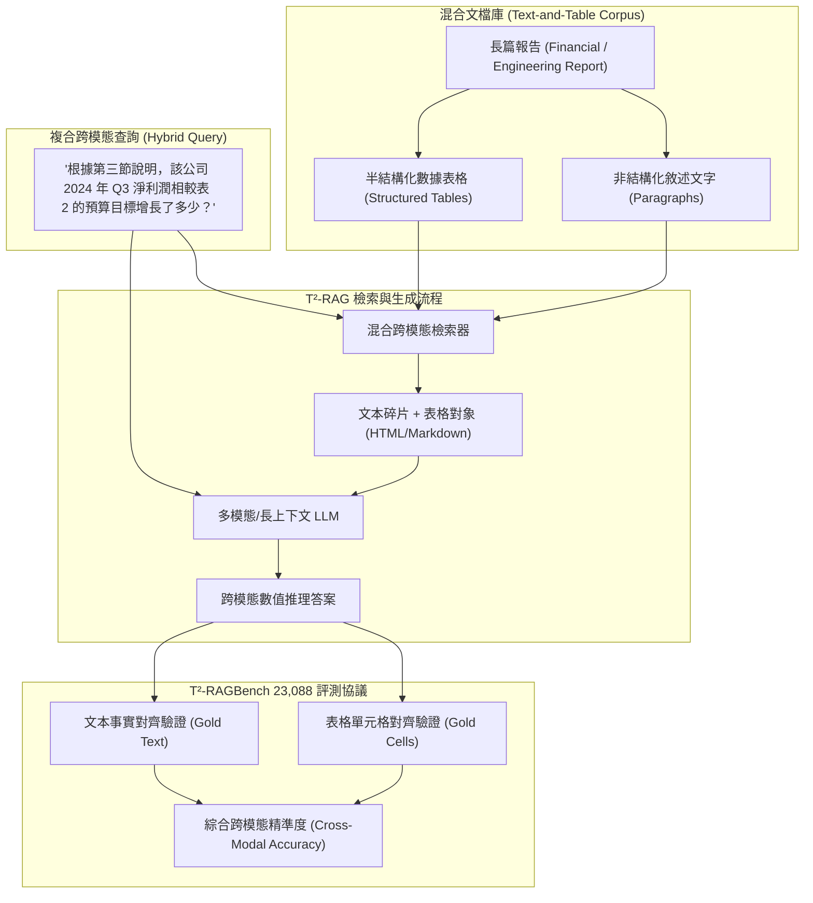

# T²-RAGBench: Benchmarking Text-and-Table Retrieval Augmented Generation

## 一話摘要 (TL;DR)
T²-RAGBench 是首個專門針對「非結構化文本與半結構化表格深度交織文檔」構建的大規模真實場景評測基準，包含 **23,088 個精確標註的問答-上下文三元組**，系統性揭示現有以文字段落為中心（Text-centric）的 RAG 系統在檢索與解析混合圖表文檔時出現的嚴重跨模態語意割裂。

---

## 研究背景與問題定義 (Problem Statement)
在金融審計、工程招標書、學術文獻與政府年報中，最核心的事實與關鍵結論往往並非純文字，而是以「文字段落 + 數據表格」的混合形態呈現：
1. **純文字切塊破壞表格結構**：標準 RAG 將文檔依固定字數切片，使結構嚴謹的表格被粗暴截斷為無語意的 Markdown 碎行，遺失了表頭、行列關係與跨單元格約束。
2. **多模態對齊與檢索失效**：很多問題需要「從文本段落獲取實體背景，再從表格指定單元格提取數值進行比對計算」（Text-Table Interleaved Reasoning）。傳統雙塔向量模型在計算文字與表格矩陣的相似度時表現拙劣。
3. **缺乏標準化的大規模評測協議**：過往數據集要麼是純文本問答（NQ, HotpotQA），要麼是純表格 QA（WikiTableQuestions），缺乏真實業務中兩者共存且緊密依賴的大規模多模態基準。

---

## 核心方法與技術架構 (Methodology & Architecture)

T²-RAGBench 構建了**跨模態混合語料庫**與**階層式檢索生成評測協議**：
1. **語料庫規模與三元組標註（Scale & Dataset Structure）**：
   - 包含 **23,088 個高質量 QA / Context-Answer 三元組**；
   - 每個樣本均配備：
     - (1) 來源非結構化文字篇章；
     - (2) 關聯的半結構化數據表格（保留 HTML / Markdown 矩陣結構）；
     - (3) 橫跨文本與表格的複合問題；
     - (4) 精確標註的 Gold Cells 與 Gold Sentences。
2. **跨模態評估維度（Cross-Modal Evaluation Protocols）**：
   - **混合檢索能力（Hybrid Retrieval）**：評估檢索器能否同時準確召回包含背景的文字塊與包含答案的表格對象；
   - **表格語意理解與計算（Tabular Synthesis）**：評估 LLM 是否具備解讀表格行列對齊、計算百分比變化及匯總能力；
   - **跨模態忠實度（Cross-Modal Faithfulness）**：評估回答中的數值宣稱是否精準源於表格數據，嚴防數值捏造與換算幻覺。

### 圖中節點對照
- `TXT` / `TAB`：混合共存的文字與表格原始節點。
- `CHUNKS`：包含表格矩陣結構保留的檢索候選池。
- `CHECK_CELL`：針對表格行列坐標的硬約束核對器。

---

## 主要實驗結果與證據 (Empirical Results & Evidence)

論文在 23,088 條樣本上廣泛評測了主流 RAG 框架（包含 Dense RAG, ColBERT, BM25, Table-BERT）與生成模型（GPT-4, Claude-3.5, Llama-3）。

### 核心評測發現 (Normative Baseline Reference [41], Page 1756)
- **文字檢索器對表格的災難性失效**：
  - 傳統稠密向量模型（如 Contriever, BGE）在檢索純文本段落時 Recall@5 可達 82.4%，但面對表格對象時，**檢索 Recall@5 急劇暴跌至 41.2%**，暴露了現有嵌入模型對結構化表格缺乏表示能力的根本缺陷。
- **端到端跨模態複合問答的巨大落差**：
  - 當問題僅依賴文本時，GPT-4 端到端準確率達 78.5%；
  - 當問題需要同時結合「文字前提 + 表格單元格比對計算」時，**GPT-4 準確率驟降至 49.3%**；
  - 開源模型（如 Llama-3-70B）在混合問答上的準確率僅為 36.1%，多數失敗源於對表頭與行列索引關係的錯位解讀。

---

## 優勢、限制及 Trade-offs (Strengths, Limitations & Trade-offs)

### 優勢
1. **填補文字-表格混合 RAG 評測空白**：首次以超 2.3 萬條大規模基準系統性量化了表格檢索與推理的技術代溝。
2. **對真實企業文件極具代表性**：高度逼真還原了財報分析、招標投標書審計中的最常見場景。

### 限制與 Trade-offs
1. **對多模態視覺版面（PDF Visual Layout）依賴較低**：目前表格以結構化 HTML/Markdown 表示，對包含複雜合併單元格（Colspan/Rowspan）及折線圖、柱狀圖的多模態混合評估仍需後續版本擴展。

---

## 對本專案研究領域的實際意義 (Implications for Research Domains)
1. **對 Domain 04 (Chunking 策略) 的直接指導**：證明了「Table-Aware Chunking（表格感知切塊）」與「表格線性化（Table Linearization）」在工業 RAG 中是不可或缺的剛需模組，純按 Token 長度切塊在企業級文件上注定失敗。
2. **對 Domain 17 (RAG Benchmarks) 的維度擴展**：為本專案建立跨模態可審計檢索體系提供了最重要的基準錨點。

---

## 原始來源及相關筆記連結 (Sources & Related Notes)
- 官方發布版本：[ACL Anthology: 2026.eacl-long.8](https://aclanthology.org/2026.eacl-long.8/)
- 關聯專題領域：[[02 - 研究領域專題 (Research Domains)/Canonical RAG Domains/Domain 13 - RAG Evaluation & Failure Attribution|D13 RAG Evaluation & Failure Attribution]]、[[02 - 研究領域專題 (Research Domains)/Canonical RAG Domains/Domain 02 - Segmentation & Contextualization|D02 Segmentation & Contextualization]]
