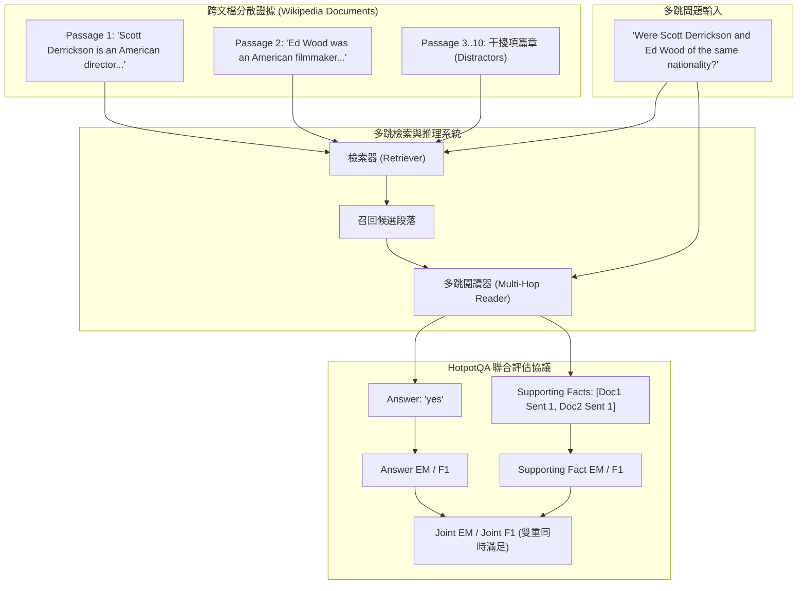

# HotpotQA: A Dataset for Diverse, Explainable Multi-hop Question Answering

## 一話摘要 (TL;DR)
HotpotQA 是自然語言處理與 RAG 領域最具里程碑意義的多跳問答基準，提供 **112,779 個基於維基百科的多文檔推理問答對**；其核心創舉在於強制要求模型在產出答案的同時標註「句子級支撐事實（Sentence-level Supporting Facts）」，並引入「聯合評估指標（Joint EM/F1）」，奠定了檢索增強系統兼顧回答正確性與推理可解釋性的經典協議。

---

## 研究背景與問題定義 (Problem Statement)
在 2018 年，既有機器閱讀理解（MRC）數據集（如 SQuAD）存在顯著瓶頸：
1. **單段落局部檢索的侷限（Single-Hop Bias）**：絕大多數問題的答案均集中在單個段落的局部上下文內，模型依靠簡單的關鍵詞模式匹配即可輕鬆破解，無法檢驗模型橫跨多個分散文檔進行深層邏輯聚合的能力。
2. **缺乏推理可解釋性（Black-box Answers）**：傳統評測只看最終產出的短字串是否命中，模型究竟是基於正確的邏輯推導得出答案，還是靠表面統計巧合（Spurious Correlations）猜中，完全無法驗證。
3. **無約束知識圖譜問答的局限**：知識庫問答（KBQA）受限於固定 Schema，無法處理以自然語言長篇論述形式存在的新聞與百科知識。

---

## 核心方法與技術架構 (Methodology & Architecture)

HotpotQA 構建了**跨篇章超連結眾包生成流程**與**雙評測設定（Distractor vs. Full-Wiki）**：
1. **資料集構建流程（Dataset Construction & Split, Table 1）**：
   - 提取維基百科中具有超連結跳轉關係的第一層與第二層頁面配對；
   - 眾包人員需同時閱讀兩個關聯頁面，構建必須結合雙方資訊方可作答的複雜問題；
   - 總量達 **112,779 條問答對**，分為訓練集（90,564 條：包含 train-easy 18k, train-medium 56.8k, train-hard 15.6k）、驗證集（dev 7,405 條）與兩組獨立測試集（各 7,405 條）。
2. **兩大經典評測設定（Two Benchmark Settings）**：
   - **干擾項設定（Distractor Setting）**：向模型提供 10 個候選段落（2 個金標段落 + 8 個由向量檢索召回的高難度干擾段落），重點測試模型在封閉候選集中的抗噪與多跳識別能力；
   - **全維基開放設定（Full-Wiki Setting）**：要求模型在包含 500 萬篇維基百科段落的超大海量庫中執行開放領域端到端檢索與推理。
3. **句子級可解釋性聯合指標（Joint Evaluation Metrics）**：
   - **Answer Metrics**：Answer Exact Match (EM) 與 Answer F1；
   - **Supporting Fact Metrics (SP)**：Supporting Fact EM 與 SP F1，評估預測的支撐句是否精準命中金標句子集合；
   - **Joint Metrics（聯合指標）**：
     - 僅當答案與支撐句同時被精準預測時才給分：
       $$\text{Joint EM} = \text{Ans EM} \times \text{SP EM}$$
       $$\text{Joint F1} = \frac{2 \cdot \text{Joint Precision} \cdot \text{Joint Recall}}{\text{Joint Precision} + \text{Joint Recall}}$$

### 圖中節點對照
- `DOC1` / `DOC2`：回答問題所必需的兩大分散證據來源。
- `SP`：模型明確輸出的句子級依據清單。
- `JOINT`：防止模型靠僥倖猜中答案的硬性約束指標。

---

## 主要實驗結果與證據 (Empirical Results & Evidence)

論文發布時評測了經典模型（BiDAF, RNN-based QA），後續成為此後所有檢索與 RAG 系統（如 REALM, IRCoT, Self-RAG, HippoRAG, PropRAG）的基準戰場。

### 1. 基準模型發布表現 (Table 4 & Section 5, Page 6–7)
- 在 Distractor 設定下：
  - 基礎模型僅取得 Answer F1 59.0%，Supporting Fact F1 64.5%，Joint F1 僅為 **44.4%**；
- 在 Full-Wiki 開放域設定下：
  - 由於傳統 IR 檢索器（TF-IDF）只能召回單一主題段落，Joint F1 崩塌至 **10.8%**；
  - 實證暴露了單步檢索在面對分散多跳事實時的徹底失效。

### 2. 人類專家表現對比
- 人類在 HotpotQA 上達到 Answer F1 **96.8%**，SP F1 **91.4%**，Joint F1 **89.0%**，確立了強大的評測天花板與區分度。

---

## 優勢、限制及 Trade-offs (Strengths, Limitations & Trade-offs)

### 優勢
1. **強制句子級證據落地**：徹底奠定了「給出答案必須附帶精確支撐句」的 RAG 可解釋性範式。
2. **區分度極高的雙軌設定**：Distractor 隔離了純推理難度，Full-Wiki 檢驗了開放端到端檢索實力。

### 限制與 Trade-offs
1. **多跳依賴的捷徑隱患**：後續研究（如 Min et al., 2019）指出，部分樣本可利用語言漏洞僅靠單跳段落猜出答案（Single-hop shortcut）。
2. **語料風格均質**：全部基於維基百科編寫風格，缺乏表格、多模態圖表及企業專業合約的異質結構。

---

## 對本專案研究領域的實際意義 (Implications for Research Domains)
1. **對 Domain 05 (Graph RAG) 與 Domain 03 (先進 RAG) 的基準地位**：HotpotQA 是驗證 GraphRAG、PPR 圖擴散、IRCoT 交錯推理以及 PropRAG 束搜尋的核心試金石。
2. **對 Domain 17 (RAG Benchmarks) 的規範性指導**：證明評估多跳系統必須引入「Joint 指標」，不能單純看 Answer 準確率而放任模型胡亂掛載支撐事實。

---

## 原始來源及相關筆記連結 (Sources & Related Notes)
- 原始論文 PDF：[[Papers/06 - Benchmarks & Evaluation/(EMNLP 2018-10) HotpotQA - A Dataset for Diverse, Explainable Multi-hop Question Answering.pdf|開啟本地 PDF]]
- ACL Anthology 永久連結：[ACL Anthology: D18-1259](https://aclanthology.org/D18-1259/)
- arXiv 永久連結：[arXiv:1809.09600](https://arxiv.org/abs/1809.09600)
- 關聯專題領域：[[02 - 研究領域專題 (Research Domains)/Domain 17 - RAG Benchmarks & Evaluation Protocols|Domain 17 - RAG Benchmarks]]、[[02 - 研究領域專題 (Research Domains)/Domain 05 - Graph RAG 與結構化知識 (Microsoft GraphRAG, HippoRAG)|Domain 05 - Graph RAG]]
