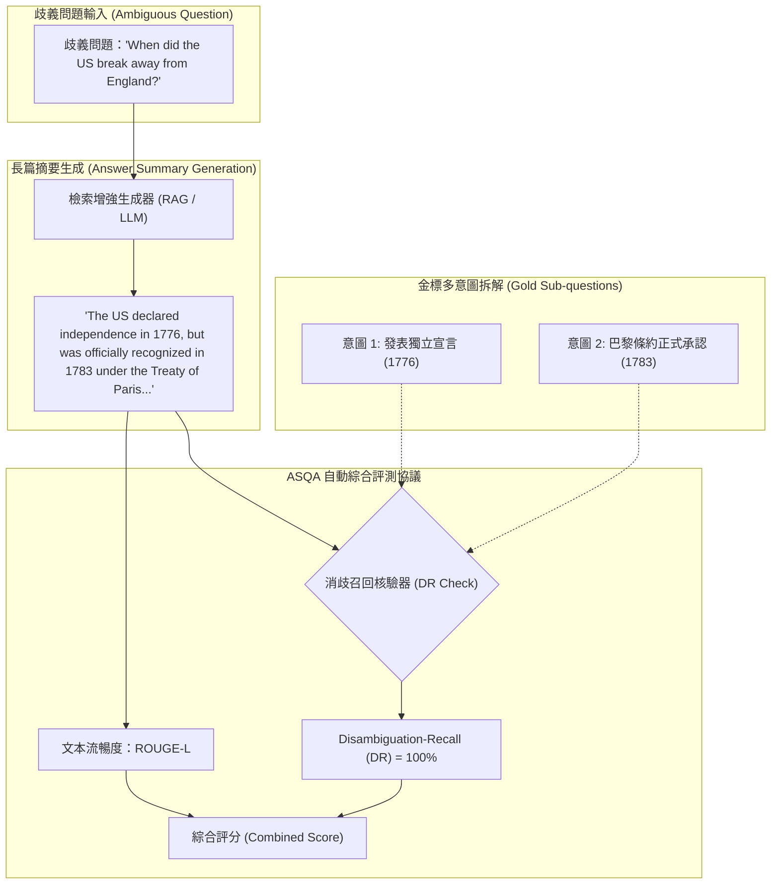

# ASQA: Factoid Questions Meet Long-Form Answers

## 一話摘要 (TL;DR)
ASQA 是首個專門針對「歧義事實問題（Ambiguous Factoid Questions）」構建的長篇問答基準與評測協議，要求模型不僅給出單一實體答案，而是撰寫一篇結構完整的答案摘要（Answer Summary），全面覆蓋問題背後的所有不同語意解讀與情境條件，並提出了自動評估消歧覆蓋率的 Disambiguation-Recall (DR) 指標。

---

## 研究背景與問題定義 (Problem Statement)
現有問答評測基準存在嚴重的兩極分化：
1. **短事實問答（Factoid QA）的過度簡化**：傳統開放領域問答（如 NQ、TriviaQA）假設每個問題都有唯一且明確的短字串答案。然而，真實世界中大量問題本質上具有歧義（例如：「美國何時脫離英國？」——是指 1776 年發表《獨立宣言》，還是 1783 年簽署《巴黎條約》？）。單一字串匹配無法反映真實知識全貌。
2. **長篇問答（Long-Form QA，如 ELI5）的評估困境**：以往長篇問答缺乏客觀、可量化且具高一致性的金標（Gold Standards），依賴人工主觀打分，模型間橫向對比缺乏可重現性。
3. **缺乏情境覆蓋率評估**：缺乏衡量模型「是否辨析出所有潛在約束與例外情況」的量化評測體系。

---

## 核心方法與技術架構 (Methodology & Architecture)

ASQA 提出了全新的任務定義與自動評測協議：
1. **資料集構建流程（Dataset Construction）**：
   - 挑選 AmbigQA 中標註出多個不同意圖與答案的事實問題；
   - 聘請專業英語母語寫作者，撰寫綜合性的長篇摘要答案（Answer Summaries），每個摘要流暢整合各個子問題的情境差異（如時間、地點、版本、定義）；
   - 最終包含 6,316 個高品質歧義事實問答樣本（訓練集 4,353、驗證集 948、測試集 1,015）。
2. **消歧召回評估指標（Disambiguation-Recall, DR）**：
   - 將問題對應的所有獨立事實解析（Interpretations）視為候選集 $\{I_1, I_2, \dots, I_m\}$；
   - 利用預訓練抽取模型或字串匹配，檢驗生成的長篇摘要是否涵蓋了第 $j$ 個事實解析的標準實體答案；
   - 計算所有事實意圖的召回率：
     $$\text{DR} = \frac{1}{|Q|} \sum_{q \in Q} \frac{\sum_{j=1}^{m_q} \mathbb{I}(\text{Answer } j \text{ is covered})}{m_q}$$
3. **綜合評分（STR-EM & Combined Score）**：
   - 結合 ROUGE-L（評估語言流暢與摘要結構）與 DR（評估事實完整性），形成客觀穩定的長篇質量打分。

### 圖中節點對照
- `Q`：存在多種合理解讀的事實問題。
- `I1`, `I2`：該問題所映射的具體事實分解金標。
- `DR_EVAL`：自動檢測長文中是否涵蓋所有子事實意圖的評分器。
- `FINAL_METRIC`：兼顧文本品質與事實完備性的評測指標。

---

## 主要實驗結果與證據 (Empirical Results & Evidence)

論文在 ASQA 上對比了 Closed-book、Dense Retrieval + Reader（DPR, REALM）以及大型語言模型（T5, GPT-3）。

### 1. 基準模型表現 (Table 4 & Section 5, Page 5–7)
- **Closed-Book 模型**：
  - T5-11B 在無檢索設定下，DR 僅為 **32.4%**，ROUGE-L 為 28.5%，顯示純參數記憶嚴重遺漏多分支事實。
- **檢索增強模型（Retrieval-Augmented Models）**：
  - 引入 DPR 檢索 Top-5 篇章後，T5-11B 的 DR 提升至 **49.8%**（提升 **+17.4%**），ROUGE-L 達 36.2%。
- **Few-shot Prompting (GPT-3 175B)**：
  - 結合外部檢索上下文，GPT-3 取得 **DR = 56.8%**，Combined Score 達 45.2。
- **人類天花板（Human Performance）**：
  - 人類專家的 DR 達到 **89.4%**，ROUGE-L 達 48.0%，表明當時最強的模型距離人類專家完備的長篇事實綜合能力仍有近 33% 的巨大差距。

---

## 優勢、限制及 Trade-offs (Strengths, Limitations & Trade-offs)

### 優勢
1. **解決長篇評測缺乏客觀金標的痛點**：將原本模糊的主觀長文評判轉化為多個短事實覆蓋率的客觀量化（DR 指標）。
2. **高度逼真模擬真實資訊檢索需求**：現實中的用戶問題大多包含隱性前提或多重意圖，ASQA 迫使模型學會全面性論述。

### 限制與 Trade-offs
1. **依賴底層 AmbigQA 標註**：其消歧意圖集合受限於維基百科的語義邊界，無法窮盡開放世界中隨時間演變的所有最新衍生意圖。
2. **對長篇報告的深度有限**：ASQA 答案長度平均約為 60–100 字，屬於「摘要級長度（Summary-level）」，對數千字的多層次大綱報告仍需進一步擴展。

---

## 對本專案研究領域的實際意義 (Implications for Research Domains)
1. **對 D09 (Grounded Generation & Long-form Synthesis) 的評測奠基**：ASQA 是評估長篇報告「觀點全面性（Perspective Comprehensiveness）」與「爭議分歧展示」的核心標準資料集。
2. **對 D13 (RAG Evaluation & Failure Attribution) 的架構指引**：證明了評測長文生成不可僅看 ROUGE 或 BLEU，必須結合實體級「事實覆蓋（Fact Recall）」與「消歧完整性（DR）」的複合協議。

---

## 原始來源及相關筆記連結 (Sources & Related Notes)
- 原始論文 PDF：[[Papers/06 - Benchmarks & Evaluation/(EMNLP 2022-12) ASQA - Factoid Questions Meet Long-Form Answers.pdf|開啟本地 PDF]]
- arXiv 永久連結：[arXiv:2204.06092](https://arxiv.org/abs/2204.06092)
- 關聯專題領域：[[02 - 研究領域專題 (Research Domains)/Domain 09 - Grounded Generation Attribution & Long-form Synthesis|D09 Grounded Generation & Long-form Synthesis]]、[[02 - 研究領域專題 (Research Domains)/Domain 13 - RAG Evaluation & Failure Attribution|D13 RAG Evaluation & Failure Attribution]]
